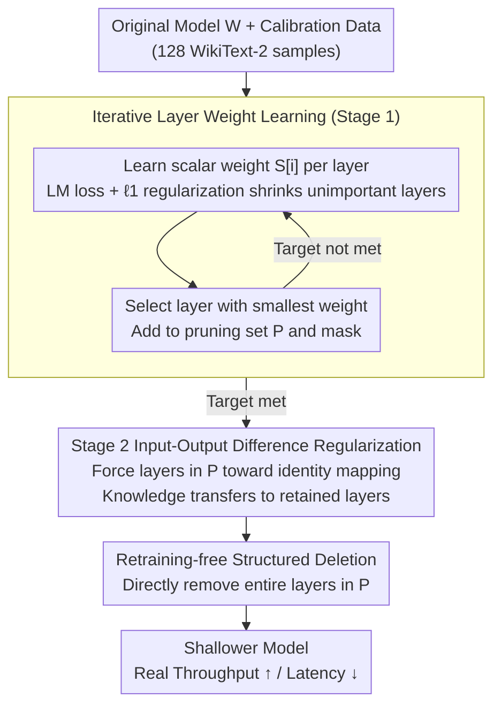

# Two-Stage Regularization-Based Structured Pruning for LLMs

**Conference**: ACL2026  
**arXiv**: [2505.18232](https://arxiv.org/abs/2505.18232)  
**Code**: https://github.com/fmk345/TRSP  
**Area**: Model Compression / Structured Pruning / LLM Efficiency  
**Keywords**: Structured Pruning, Layer Pruning, Two-Stage Regularization, LLM Acceleration, Retraining-free Compression

## TL;DR
TRSP utilizes a first-stage regularization to learn the importance of each Transformer layer and a second-stage regularization to align the inputs and outputs of layers to be deleted. This proximity forces knowledge transfer into the retained layers, achieving layer-wise structured pruning and actual inference acceleration for LLMs without the need for retraining.

## Background & Motivation
**Background**: The deployment bottlenecks of LLMs primarily stem from parameter scale, memory consumption, and inference latency. Structured pruning is more suitable for real-world acceleration than unstructured sparsity because it directly removes layers, heads, or channels, making it easier to achieve throughput gains on hardware.

**Limitations of Prior Work**: Most existing layer-wise pruning methods first identify "unimportant" layers using specific importance metrics and then delete them directly. The issue is that deleted layers may still preserve local knowledge, and direct removal causes significant performance loss. To compensate, many methods require additional LoRA or full retraining, significantly increasing compression costs.

**Key Challenge**: Layer pruning aims for "neat deletion" to gain speed, but knowledge distribution in LLMs is not neatly organized. A layer appearing to have low importance does not mean its information can be discarded without loss. If the model is not first adapted to the fact that "these layers will disappear," the deletion operation acts like a sudden break in the computation chain.

**Goal**: Maintain the hardware-friendliness of layer-wise structured pruning while reducing post-pruning knowledge loss and avoiding expensive retraining.

**Key Insight**: The authors decouple "selecting which layers to delete" and "making those layers deletable" into two regularization stages. The first stage identifies target layers via learnable layer weights, while the second stage regularizes these layers to approximate identity mappings, minimizing their unique contribution to the final output.

**Core Idea**: Instead of directly deleting low-importance layers, first use regularization to reduce the knowledge they carry, and then execute the deletion.

## Method
TRSP is a layer-wise structured pruning method. It requires only a small amount of calibration data, such as 128 sequences of length 2048 randomly sampled from the WikiText-2 training set. The process involves four steps: data preparation, learning layer weights, second-stage regularization of target layers, and layer removal. The paper emphasizes that TRSP is retraining-free: while baseline methods require LoRA retraining with 1,000 additional WikiText-2 samples after pruning, TRSP does not.

### Overall Architecture
Given a source model $\mathbf{W}$, pruning ratio $p$, and layer count $l$, TRSP assigns a learnable scalar weight $S[i]$ to each Transformer layer, scaling the layer output during forward passes. The first stage optimizes the language modeling loss plus $\ell_1$ layer weight regularization to shrink weights of less important layers. In each iteration, the layer with the smallest current weight is added to the pruning set $P$ and masked until the target pruning count is reached. In the second stage, with the pruning set fixed, the difference between input and output $\mathbf{X}_{out}^i-\mathbf{X}_{in}^i$ for these layers is regularized to force them toward identity transformations. Finally, layers in set $P$ are removed.

### Key Designs

**1. Iterative Layer Weight Learning: Selecting the best layers to delete via learnable weights**

To delete layers, one must first identify them. However, selecting all low-importance layers at once risks picking contiguous segments, which can sever deep computation paths. TRSP assigns a learnable scalar weight $S[i]$ to each layer to scale its output during forward propagation and optimizes:

$$\mathcal{L}_{learn}=\mathcal{L}(\mathbf{W},\mathbf{X})+\lambda_1\sum_i\|S[i]\|_1$$

Weights of unimportant layers are suppressed by $\ell_1$ regularization. Crucially, a greedy iterative approach is used: in each round, only the layer with the smallest weight is added to the pruning set $P$ and masked. Weights for remaining layers are then recalculated. This re-evaluation ensures the pruning set is more distributed, avoiding the "bottleneck" effect caused by one-shot removal of continuous blocks.

**2. Second-Stage Input-Output Difference Regularization: Forcing candidate layers toward identity mapping before deletion**

Direct deletion causes performance drops because even "low importance" layers actively modify representations. TRSP addresses this by applying regularization to the set $P$ before removal, pushing their outputs toward their inputs:

$$\mathcal{L}_{sum}=\mathcal{L}(\mathbf{W},\mathbf{X})+\lambda_2\sum_{i\in P}\|\mathbf{X}_{out}^i-\mathbf{X}_{in}^i\|$$

Using $\ell_1$ or $\ell_2$ norms, this optimization makes the target layers approximate identity transformations. Consequently, the knowledge they originally carried is forced to transfer into the non-regularized retained layers. By the time of ultimate deletion, the structural perturbation is minimized, which is the primary reason TRSP outperforms "metric-only" pruning.

**3. Retraining-free Structured Deletion: Converting compression directly into throughput and latency gains**

Many sparsity methods reduce parameter counts on paper but fail to achieve speedup on standard hardware because they only zero out weights without changing the structure. TRSP removes entire Transformer layers, physically thinning the model. This accelerates both prompt processing and token generation. Although layer pruning is coarse-grained, it provides direct deployment benefits; combined with prior knowledge transfer, this allows performance retention without expensive LoRA or full retraining.

### Loss & Training
The first stage uses language modeling loss plus $\ell_1$ regularization on layer weights. Since $\ell_1$ is non-differentiable, the authors use an equivalent constrained form to transform $\|x\|_1$ into a back-propagation compatible problem with auxiliary variables. The second stage uses language modeling loss plus regularization of the input-output difference of target layers. $\lambda_1$ and $\lambda_2$ were determined via grid search; for LLaMA2-7B, the optimal combination was $\lambda_1=5\times10^{-3}$ and $\lambda_2=10^{-3}$. Experiments used a default pruning ratio of 25% with $\ell_2$ regularization for the second stage.

## Key Experimental Results

### Main Results
The main experiments compared TRSP against SLEB, ShortGPT, LaCo, and Shortened LLaMA on models including Phi-2, OPT, LLaMA2, and LLaMA3. Metrics include WikiText-2 perplexity and the average accuracy of five zero-shot benchmarks (PIQA, WinoGrande, HellaSwag, ARC-e, ARC-c).

| Model | Method | Pruning Rate | PPL↓ | Avg_Acc↑ | Gain vs. Strongest Baseline |
|------|------|-------:|-----:|---------:|------------------------|
| Phi-2 | ShortGPT | 25% | 7.15 | 54.49 | Strongest baseline |
| Phi-2 | TRSP-$\ell_2$ | 25% | 6.53 | 56.56 | Lower PPL, Avg_Acc +2.07 |
| OPT-2.7B | ShortGPT | 25% | 14.96 | 49.56 | Strongest baseline |
| OPT-2.7B | TRSP-$\ell_1$ | 25% | 13.12 | 51.27 | Best PPL and Avg_Acc |
| LLaMA2-7B | ShortGPT | 25% | 8.89 | 57.10 | Strongest baseline |
| LLaMA2-7B | TRSP-$\ell_2$ | 25% | 7.08 | 60.57 | PPL ~20% lower, Avg_Acc +3.47 |
| LLaMA3-8B | ShortGPT | 25% | 9.26 | 66.17 | Strongest baseline |
| LLaMA3-8B | TRSP-$\ell_2$ | 25% | 7.84 | 68.44 | Lower PPL, higher Avg_Acc |
| LLaMA2-13B | ShortGPT | 25% | 6.79 | 62.96 | Strongest baseline |
| LLaMA2-13B | TRSP-$\ell_1$ | 25% | 5.89 | 65.18 | Best PPL and Avg_Acc |

### Ablation Study
Ablation experiments addressed whether the method achieves real acceleration, the necessity of the two stages, and the advantage of iterative selection over one-shot.

| Exp | Config | PPL↓ | Avg_Acc↑ / Speedup | Conclusion |
|------|------|-----:|----------------:|------|
| Speed | OPT-13B Dense | 10.12 | 1029 tokens/s, 386.5 ms | Original model |
| Speed | OPT-13B TRSP 25% | 10.45 | 1348 tokens/s, 286.3 ms | Throughput 1.31×, Latency 1.35× |
| Speed | LLaMA2-13B TRSP 25% | 5.82 | 1386 tokens/s, 298.4 ms | Throughput 1.30×, Latency 1.33× |
| Ablation | LLaMA2-7B TRSP | 7.08 | 60.57 | Full method |
| Ablation | LLaMA2-7B w/o W | 9.26 | 56.19 | One-shot layer selection, PPL +2.18 |
| Ablation | LLaMA2-7B w/o R | 10.15 | 54.36 | Missing stage 2 reg, largest drop |
| Ablation | LLaMA2-13B TRSP | 5.82 | 65.11 | Full method |
| Ablation | LLaMA2-13B w/o R | 9.47 | 56.25 | Avg_Acc -8.86 without Stage 2 reg |

### Key Findings
- **The second stage of regularization is the most significant contributor.** Removing it for LLaMA2-13B caused PPL to rise from 5.82 to 9.47 and Avg_Acc to drop from 65.11 to 56.25, proving that "making layers deletable" is more critical than just finding low-importance layers.
- **Iterative selection is more stable than one-shot.** One-shot selection often picks contiguous layers, leading to structural collapse. Iterative selection re-evaluates importance after each mask, resulting in a more dispersed pruning set.
- **The choice between $\ell_1$ and $\ell_2$ for stage 2 regularization is marginal**, indicating that the mechanism of input-output difference regularization itself is the key.
- **Speedup is a real end-to-end gain**: A 25% layer reduction in 13B models results in approximately 1.30× throughput improvement and 1.33-1.35× latency reduction.

## Highlights & Insights
- The core insight is straightforward: Instead of asking "which layer is unimportant," transform the model to make specific layers unimportant. This shifts pruning from passive measurement to active knowledge redistribution.
- The two-stage design effectively decouples selection and adaptation. The first stage solves "who to delete," while the second solves "how to minimize damage," providing more interpretability than just modifying importance metrics.
- The method is highly deployment-friendly. Removing entire layers means reducing model depth, with benefits reflected in tokens/s and latency rather than just theoretical parameter sparsity.
- The "low-cost" claim is well-supported. While baselines require LoRA retraining with 1,000 samples, TRSP uses only 128 calibration samples for regularization and pruning, yet achieves superior results.

## Limitations & Future Work
- Currently validated primarily on autoregressive LLMs; the authors acknowledge it hasn't been tested on CNNs, encoder-only models, or multimodal models.
- Layer-wise pruning is coarse. While acceleration is direct, it offers limited flexibility; scenarios requiring fine-grained compression ratios might need to combine this with head or MLP channel pruning.
- Second-stage regularization requires accessing intermediate layer activations for optimization, which, while cheaper than full retraining, still involves engineering costs for very large models.
- Evaluations focused on WikiText-2 PPL and common zero-shot benchmarks; systematic evaluations on long-context, code, mathematics, and instruction-following tasks are still needed.

## Related Work & Insights
- **vs SLEB**: SLEB also uses layer pruning but relies more on direct removal based on importance; TRSP adds knowledge transfer before removal, leading to better performance retention.
- **vs ShortGPT**: ShortGPT uses "block influence" to find redundant layers; TRSP uses learnable weights with iterative selection to avoid the issues of one-shot contiguous deletion.
- **vs LaCo**: Methods like LaCo rely on post-pruning recovery or calibration; TRSP emphasizes a retraining-free approach, making it ideal for quickly obtaining deployable shallower models.
- **Transferable Insight**: The concept of "regularizing a target module toward an identity mapping before removal" can be applied to MoE expert pruning, Vision Transformer block pruning, or adapter merging.

## Rating
- Novelty: ⭐⭐⭐⭐☆ The two-stage regularization perspective is clear and effective, though it remains within the layer pruning framework.
- Experimental Thoroughness: ⭐⭐⭐⭐⭐ Covers multiple models, baselines, speedup, pruning ratios, data dependency, ablations, and hyperparameter analysis.
- Writing Quality: ⭐⭐⭐⭐☆ Flow is easy to follow; minor inconsistencies in table numbering require careful cross-referencing.
- Value: ⭐⭐⭐⭐☆ Highly valuable for real-world LLM deployment, especially where structural acceleration is preferred over theoretical sparsity.

<!-- RELATED:START -->

## Related Papers

- [\[ACL 2025\] CFSP: An Efficient Structured Pruning Framework for LLMs with Coarse-to-Fine Activation Information](../../ACL2025/model_compression/cfsp_an_efficient_structured_pruning_framework_for_llms_with_coarse-to-fine_acti.md)
- [\[ACL 2026\] GRASPrune: Global Gating for Budgeted Structured Pruning of Large Language Models](grasprune_global_gating_for_budgeted_structured_pruning_of_large_language_models.md)
- [\[ACL 2025\] STUN: Structured-Then-Unstructured Pruning for Scalable MoE Pruning](../../ACL2025/model_compression/stun_moe_pruning.md)
- [\[ICML 2025\] RocketKV: Accelerating Long-Context LLM Inference via Two-Stage KV Cache Compression](../../ICML2025/model_compression/rocketkv_accelerating_long-context_llm_inference_via_two-stage_kv_cache_compress.md)
- [\[ICML 2025\] SlimLLM: Accurate Structured Pruning for Large Language Models](../../ICML2025/model_compression/slimllm_accurate_structured_pruning_for_large_language_models.md)

<!-- RELATED:END -->
