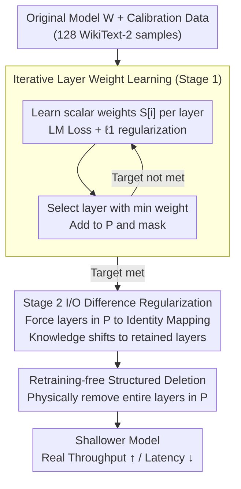

# Two-Stage Regularization-Based Structured Pruning for LLMs

**Conference**: ACL2026  
**arXiv**: [2505.18232](https://arxiv.org/abs/2505.18232)  
**Code**: https://github.com/fmk345/TRSP  
**Area**: Model Compression / Structured Pruning / LLM Efficiency  
**Keywords**: Structured Pruning, Layer Pruning, Two-Stage Regularization, LLM Acceleration, Retraining-Free Compression

## TL;DR
TRSP employs a first-stage regularization to learn the importance of each Transformer layer and a second-stage regularization to minimize the distance between the input and output of candidate layers. This facilitates the transfer of knowledge to retained layers, enabling layer-wise structured pruning and actual inference acceleration for LLMs without requiring retraining.

## Background & Motivation
**Background**: The deployment bottlenecks of LLMs primarily stem from parameter scale, memory footprint, and inference latency. Structured pruning is more suitable for real-world acceleration than unstructured sparsity because it directly removes layers, heads, or channels, making it easier to achieve throughput gains on hardware.

**Limitations of Prior Work**: Existing layer pruning methods mostly identify "unimportant" layers using specific importance metrics and then delete them directly. The issues are twofold: deleted layers may still contain local knowledge, leading to significant performance loss; to compensate for this loss, many methods require additional LoRA or full retraining, which increases compression costs.

**Key Challenge**: Layer pruning aims for "neat deletion" to gain speed, but knowledge distribution in LLMs is not neat. Low importance does not imply that the information can be discarded without loss. If the model is not adapted to the "disappearance of these layers" beforehand, the deletion acts as a sudden break in the computational chain.

**Goal**: To maintain the hardware-friendly nature of layer-wise structured pruning while reducing post-pruning knowledge loss and avoiding expensive retraining.

**Key Insight**: The authors decouple "selecting layers to prune" and "making layers prunable" into two regularization stages. The first stage identifies candidate layers using learnable weights, and the second stage regularizes these layers toward an identity mapping, minimizing their unique contribution to the final output.

**Core Idea**: Instead of directly deleting low-importance layers, use regularization first to strip them of knowledge, then execute the deletion.

## Method
TRSP is a layer-wise structured pruning method requiring only a small amount of calibration data (e.g., 128 sequences of length 2048 from the WikiText-2 training set). The process involves four steps: data preparation, learning layer weights, performing second-stage regularization on candidate layers, and deleting those layers. The paper emphasizes that TRSP is retraining-free: baseline methods typically use 1,000 additional WikiText-2 samples for LoRA retraining post-pruning, whereas TRSP skips this step.

### Overall Architecture
Given a pre-trained model $\mathbf{W}$, pruning ratio $p$, and number of layers $l$, TRSP assigns a learnable scalar weight $S[i]$ to each Transformer layer, scaling the layer's output during forward passes. The first stage uses language modeling loss plus $\ell_1$ regularization on layer weights to suppress the weights of less important layers. In each iteration, the layer with the smallest current weight is added to the pruning set $P$ and masked until the target count is reached. In the second stage, with $P$ fixed, the difference between input and output $\mathbf{X}_{out}^i-\mathbf{X}_{in}^i$ for these layers is regularized to push them toward identity transforms. Finally, layers in set $P$ are physically removed.

### Key Designs

**1. Iterative Layer Weight Learning: Identifying Layers via Learnable Weights**

To prune layers, one must identify them. However, selecting all low-importance layers at once risks picking continuous blocks, which can sever deep computational paths. TRSP assigns a learnable scalar $S[i]$ to scale each layer's output and optimizes:

$$\mathcal{L}_{learn}=\mathcal{L}(\mathbf{W},\mathbf{X})+\lambda_1\sum_i\|S[i]\|_1$$

The weights of unimportant layers are suppressed by $\ell_1$ regularization. Critically, a greedy iterative approach is used: one layer with the minimum weight is selected, added to $P$, and masked per round. Re-evaluating remaining layers after each removal ensures the pruning set is more dispersed, avoiding the "waist-cutting" effect of one-shot selection.

**2. Second-Stage I/O Difference Regularization: Prior Adaptation to Identity Mapping**

Direct removal causes performance drops because even "low importance" layers actively modify representations. TRSP applies a regularization term to layers in $P$ before deletion to push their outputs toward their inputs:

$$\mathcal{L}_{sum}=\mathcal{L}(\mathbf{W},\mathbf{X})+\lambda_2\sum_{i\in P}\|\mathbf{X}_{out}^i-\mathbf{X}_{in}^i\|$$

Using $\ell_1$ or $\ell_2$ norms, this optimization forces target layers to become near-identity transforms. Consequently, the knowledge they originally carried is forced into the retained layers. When finally deleted, the perturbation to the model is minimized—this is the primary reason TRSP outperforms simple "importance-based deletion."

**3. Retraining-Free Structured Deletion: Realizing Deployment Gains**

Many sparsity methods reduce parameters but fail to accelerate on standard hardware because they only zero-out weights without changing the architecture. TRSP deletes complete Transformer layers, physically narrowing the model depth. This accelerates both prompt processing and token generation. While layer pruning is coarse-grained, it yields direct deployment benefits; combined with the prior knowledge transfer, performance is maintained without expensive LoRA or full retraining.

### Loss & Training
The first stage employs LM loss plus $\ell_1$ regularization on layer weights. Since $\ell_1$ is non-differentiable, the authors use an equivalent constrained form with auxiliary variables for backpropagation. The second stage uses LM loss plus I/O difference regularization for candidate layers. $\lambda_1$ and $\lambda_2$ are determined via grid search; for LLaMA2-7B, the optimal combination is $\lambda_1=5\times10^{-3}$ and $\lambda_2=10^{-3}$. Experiments use a default 25% pruning ratio with $\ell_2$ norm for the second stage.

## Key Experimental Results

### Main Results
TRSP was compared against SLEB, ShortGPT, LaCo, and Shortened LLaMA on Phi-2, OPT, LLaMA2, and LLaMA3. Metrics include WikiText-2 perplexity and average accuracy across five zero-shot benchmarks (PIQA, WinoGrande, HellaSwag, ARC-e, ARC-c).

| Model | Method | Pruning Rate | PPL↓ | Avg_Acc↑ | Advantage over strongest baseline |
|------|------|-------:|-----:|---------:|------------------------|
| Phi-2 | ShortGPT | 25% | 7.15 | 54.49 | Strong baseline |
| Phi-2 | TRSP-$\ell_2$ | 25% | 6.53 | 56.56 | Lower PPL, Avg_Acc +2.07 |
| OPT-2.7B | ShortGPT | 25% | 14.96 | 49.56 | Strong baseline |
| OPT-2.7B | TRSP-$\ell_1$ | 25% | 13.12 | 51.27 | Best PPL and Avg_Acc |
| LLaMA2-7B | ShortGPT | 25% | 8.89 | 57.10 | Strongest baseline |
| LLaMA2-7B | TRSP-$\ell_2$ | 25% | 7.08 | 60.57 | PPL ~20% lower, Avg_Acc +3.47 |
| LLaMA3-8B | ShortGPT | 25% | 9.26 | 66.17 | Strongest baseline |
| LLaMA3-8B | TRSP-$\ell_2$ | 25% | 7.84 | 68.44 | Lower PPL, higher Avg_Acc |
| LLaMA2-13B | ShortGPT | 25% | 6.79 | 62.96 | Strongest baseline |
| LLaMA2-13B | TRSP-$\ell_1$ | 25% | 5.89 | 65.18 | Best PPL and Avg_Acc |

### Ablation Study
Analytical experiments address acceleration, necessity of stages, and iterative vs. one-shot selection.

| Exp | Config | PPL↓ | Avg_Acc↑ / Speedup | Conclusion |
|------|------|-----:|----------------:|------|
| Speed | OPT-13B Dense | 10.12 | 1029 tokens/s, 386.5 ms | Original model |
| Speed | OPT-13B TRSP 25% | 10.45 | 1348 tokens/s, 286.3 ms | Throughput 1.31×, Latency 1.35× |
| Speed | LLaMA2-13B TRSP 25% | 5.82 | 1386 tokens/s, 298.4 ms | Throughput 1.30×, Latency 1.33× |
| Ablation | LLaMA2-7B TRSP | 7.08 | 60.57 | Full method |
| Ablation | LLaMA2-7B w/o W | 9.26 | 56.19 | One-shot weight learning (PPL +2.18) |
| Ablation | LLaMA2-7B w/o R | 10.15 | 54.36 | Removing Stage 2 causes largest drop |
| Ablation | LLaMA2-13B TRSP | 5.82 | 65.11 | Full method |
| Ablation | LLaMA2-13B w/o R | 9.47 | 56.25 | Without Stage 2, Avg_Acc -8.86 |

### Key Findings
- **Stage 2 regularization is critical**: Removing it from LLaMA2-13B caused PPL to jump from 5.82 to 9.47 and Avg_Acc to drop from 65.11 to 56.25. Preparing layers for deletion is more vital than just finding them.
- **Iterative selection is more stable**: One-shot selection often picks continuous layers, causing structural collapse, while iterative selection disperses the pruned layers.
- **Norm selection ($\ell_1$ vs $\ell_2$) in Stage 2 has minimal impact**, suggesting the mechanism of I/O difference regularization is what matters.
- **Acceleration is real**: 25% layer pruning on 13B models delivers ~1.30× throughput increase and ~1.33-1.35× latency reduction.

## Highlights & Insights
- The core insight is intuitive: instead of asking "which layer is unimportant," train the model to make specific layers unimportant. This shifts pruning from passive measurement to active knowledge redistribution.
- The two-stage design effectively decouples selection and adaptation. Stage 1 solves "what to prune," and Stage 2 solves "how to minimize damage," offering more explainability than modified importance metrics.
- Deployment-friendly: Removing entire layers reduces model depth, translating results into actual tokens/s and latency gains rather than just theoretical sparsity.
- Strong support for "low cost": While baselines use 1,000 samples for retraining, TRSP achieves superior results using only 128 calibration sequences for regularization and pruning.

## Limitations & Future Work
- Primarily validated on autoregressive LLMs; generalization to CNNs, encoder-only models, or multimodal models remains unproven.
- Layer pruning is coarse-grained; while speedup is direct, flexibility in compression ratios is limited compared to head or MLP channel pruning combinations.
- Stage 2 requires access to intermediate activations for optimization, which, while cheaper than retraining, still involves engineering overhead for very large models.
- Evaluation lacks systematic testing on long-context, code, math, and instruction-following tasks.

## Related Work & Insights
- **vs SLEB**: SLEB also performs layer pruning based on importance; TRSP adds the knowledge transfer step, leading to better performance retention.
- **vs ShortGPT**: ShortGPT uses block influence for redundancy; TRSP uses learnable weights and iterative selection to avoid one-shot continuous removal.
- **vs LaCo**: Methods like LaCo rely on post-pruning recovery; TRSP emphasizes a retraining-free approach for rapid deployment of shallow models.
- **Transferable Insight**: The strategy of "regularizing a module toward identity before removal" can be applied to MoE expert pruning, ViT block pruning, or adapter merging.

## Rating
- Novelty: ⭐⭐⭐⭐☆ Clear and effective two-stage perspective, though within the layer pruning framework.
- Experimental Thoroughness: ⭐⭐⭐⭐⭐ Covers multiple models, baselines, acceleration, data dependency, and ablations.
- Writing Quality: ⭐⭐⭐⭐☆ Well-structured; minor inconsistencies in some table cross-references require careful reading.
- Value: ⭐⭐⭐⭐☆ Highly relevant for real-world LLM deployment where structural acceleration is prioritized over sparsity ratios.

<!-- RELATED:START -->

## Related Papers

- [\[ACL 2025\] CFSP: An Efficient Structured Pruning Framework for LLMs with Coarse-to-Fine Activation Information](../../ACL2025/model_compression/cfsp_an_efficient_structured_pruning_framework_for_llms_with_coarse-to-fine_acti.md)
- [\[ACL 2026\] GRASPrune: Global Gating for Budgeted Structured Pruning of Large Language Models](grasprune_global_gating_for_budgeted_structured_pruning_of_large_language_models.md)
- [\[CVPR 2026\] F²HDR: Two-Stage HDR Video Reconstruction via Flow Adapter and Physical Motion Modeling](../../CVPR2026/model_compression/f2hdr_two-stage_hdr_video_reconstruction_via_flow_adapter_and_physical_motion_mo.md)
- [\[ACL 2025\] STUN: Structured-Then-Unstructured Pruning for Scalable MoE Pruning](../../ACL2025/model_compression/stun_moe_pruning.md)
- [\[ICML 2025\] RocketKV: Accelerating Long-Context LLM Inference via Two-Stage KV Cache Compression](../../ICML2025/model_compression/rocketkv_accelerating_long-context_llm_inference_via_two-stage_kv_cache_compress.md)

<!-- RELATED:END -->
