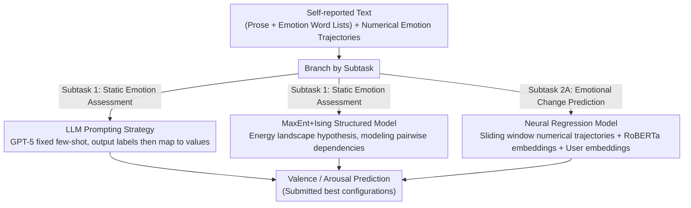

# UKP_Psycontrol at SemEval-2026 Task 2: Modeling Valence and Arousal Dynamics from Text

**Conference**: ACL 2026  
**arXiv**: [2604.21534](https://arxiv.org/abs/2604.21534)  
**Code**: [GitHub](https://github.com/)  
**Area**: Affective Computing / Longitudinal Emotion Modeling  
**Keywords**: Emotion Assessment, Longitudinal Analysis, Valence-Arousal, LLM Prompting, MaxEnt Models

## TL;DR

UKP_Psycontrol achieved first place in both categories of SemEval-2026 Task 2 by combining LLM prompting, a MaxEnt model with Ising interactions, and neural regression models. The study found that LLMs excel at capturing static emotional signals, whereas short-term emotional changes are explained more by recent numerical trajectories than by textual semantics.

## Background & Motivation

**Background**: In computational sentiment analysis, emotions are typically represented by two continuous dimensions: valence (positive vs. negative) and arousal (degree of activation). Most NLP research utilizes social media or review data, which are either annotated by external evaluators or approximated through sentiment proxies, only indirectly accessing internal emotional states.

**Limitations of Prior Work**: SemEval-2026 Task 2 introduces a new challenge: longitudinal emotional assessment and prediction from time-series self-reported text. The data originates from years of logs by US service workers, including free prose and lists of emotion words, paired with self-rated valence and arousal scores. This requires models to not only understand the sentiment of individual texts but also to capture the dynamic evolution of emotions over time.

**Key Challenge**: The relative contribution of textual semantics versus numerical emotional trajectories to sentiment prediction may vary. While LLMs are proficient at understanding textual meaning, short-term emotional fluctuations may reflect an individual's emotional inertia rather than new information conveyed in the text.

**Goal**: (1) Evaluate static emotional recognition (Subtask 1); (2) Predict future emotional changes (Subtask 2A); (3) Understand the relative importance of text semantics versus numerical trajectories across different tasks.

**Key Insight**: A combination of three complementary approaches: LLM prompting (leveraging linguistic understanding), MaxEnt+Ising (leveraging structured dependency modeling via probabilistic graphical models), and neural regression (leveraging numerical trajectories and user embeddings).

**Core Idea**: Static emotion assessment relies on LLM-based textual understanding, while dynamic emotion prediction depends on the short-term inertia of numerical trajectories; each approach has distinct advantages.

## Method

### Overall Architecture

The system consists of three modules distributed by subtask: static emotion assessment (Subtask 1) utilizes both LLM prompting and MaxEnt+Ising, while dynamic emotion change prediction (Subtask 2A) employs neural regression. (1) LLM Prompting Module—Uses GPT-5 to predict valence and arousal under person-aware and person-agnostic settings. (2) MaxEnt+Ising Module—Models structured dependencies of emotional states using maximum entropy models and Ising interactions. (3) Neural Regression Module—Predicts the next emotional change using a sliding window of recent emotional trajectories, RoBERTa text embeddings, and trainable user embeddings.

### Key Designs

**1. LLM Prompting Strategy: Capturing static emotions through language understanding while avoiding error accumulation from dynamic updates**

The core of static emotion recognition (Subtask 1) is mapping self-reported text to valence and arousal, a task where LLMs correlate highly with human ratings. The authors prompted GPT-5 in two settings: a person-aware setting using historical samples from the same user as few-shot examples, and a person-agnostic setting using label-balanced random samples. Prose and emotion word lists were processed separately to prevent heterogeneous inputs from interfering. Regarding output format, requiring the model to generate textual emotion labels before mapping them to numerical values proved more stable than direct numerical prediction, as natural language descriptors align better with the LLM’s pre-training distribution. An anti-intuitive finding was that dynamic few-shot replacement via a sliding window (using the most recent $N=15$ entries) caused prediction errors to propagate and accumulate, making a fixed set of examples more effective.

**2. MaxEnt+Ising Structured Model: Integrating the "Energy Landscape" hypothesis into probabilistic graphs to model dependencies between emotional states**

Standard regression fails to characterize the coupling between emotional dimensions. Psychological theory suggests that mental states evolve on a latent energy landscape following a Boltzmann distribution, providing a theoretical basis for a Maximum Entropy (MaxEnt) model with Ising interactions. The model defines an energy function:

$$E(\mathbf{x}) = -\mathbf{x}^\top \mathbf{h} - \frac{1}{2}\mathbf{x}^\top \mathbf{J}\mathbf{x},$$

where $\mathbf{h}$ represents linear effects and $\mathbf{J}$ captures pairwise interactions between variables. Emotional variables are one-hot encoded, and textual semantics are compressed into binary vectors via an autoencoder before input. Since the state space is bounded, the partition function $Z$ can be calculated exactly, allowing for direct maximum likelihood training without approximate sampling. During inference, continuous values are decoded via conditional expectation, aligning with the correlation coefficient metrics of the task.

**3. Neural Regression Model: Prioritizing numerical trajectories and user identity under the assumption that "short-term emotional fluctuations rely on inertia"**

For Subtask 2A's prediction of next-step emotional changes, the authors hypothesized that short-term fluctuations are driven more by individual emotional inertia than by new information in the current text. Consequently, the model takes a sliding window (1–4 steps) of recent text embeddings (RoBERTa mean-pooling), current valence/arousal, previous state changes, and a trainable user embedding to explicitly capture individual differences. To validate this hypothesis, they conducted a controlled comparison: (a) a text-free baseline using only numerical features and user embeddings; (b) text-augmented versions; and (c) semantic clustering representations. The finding that (a) nearly matched (b) confirmed that emotional inertia is the dominant factor.

### Loss & Training

The MaxEnt model was trained using maximum likelihood estimation, while the neural regression model utilized standard regression loss. LLM prompting required no training. The final submission combined the optimal configurations of each module.

## Key Experimental Results

### Main Results

**Subtask 1 (Longitudinal Emotion Assessment) — Test Set**

| Method | Valence r_composite | Arousal r_composite |
|------|-------------------|-------------------|
| Baseline linear(BERT) | 0.557 | 0.299 |
| MaxEnt Ising | 0.589 | 0.327 |
| **LLM-based (Ours)** | **0.667** | **0.554** |

**Subtask 2A (Emotion Change Prediction) — Test Set**

| Method | Valence r | Arousal r |
|------|-----------|-----------|
| Baseline linear(prev) | 0.520 | 0.609 |
| MaxEnt Ising | — | — |
| **Neural Regression (Ours)** | **0.675** | **0.683** |

### Key Findings

- Person-aware prompting was only marginally better than person-agnostic prompting, suggesting that label-balanced random examples already approximate most user-specific information.
- Increasing the number of shots improved valence correlation (10→20 shots: 0.617→0.661), but no similar effect was observed for arousal.
- Predicting textual emotion labels outperformed direct numerical prediction, indicating that natural language descriptors better match LLM pre-training distributions.
- **Key Finding**: In Subtask 2A, the text-free baseline (numerical trajectory + user embedding) performed comparably to the text-enhanced model, demonstrating that short-term emotional changes are explained more by recent numerical states than by text semantics.
- Dynamic update strategies (sliding window replacement) were inferior to fixed shots because of the cumulative propagation of prediction errors.

## Highlights & Insights

- The discovery that "short-term emotional changes are driven by numerical trajectories rather than textual semantics" is a significant insight for affective computing. It suggests that emotion may have its own time-series inertia, with text serving as a snapshot rather than a driver.
- The MaxEnt+Ising model incorporates psychological theory (the energy landscape hypothesis) into NLP tasks, providing an interpretable probabilistic framework.
- The complementary combination strategy—using LLMs for semantic understanding, probabilistic models for structured dependency, and neural networks for numerical sequences—is a valuable methodology.

## Limitations & Future Work

- The limited data scale (2,764 entries, 137 users) restricts the potential of deep learning approaches.
- Data quality issues are prominent: 92% of users participated in only one time block, and some users reported invariant valence/arousal scores throughout.
- The binarized semantic representation in the MaxEnt model may lose emotional nuances.
- The findings are validated only on a population of English-speaking service workers; cultural differences might influence emotional expression patterns.

## Related Work & Insights

- **vs. Pure LLM methods**: LLMs are powerful for static assessment but insufficient for dynamic prediction, requiring supplementation from numerical trajectory modeling.
- **vs. Traditional BERT baselines**: A hybridized system (LLM + MaxEnt + Neural Regression) outperformed baselines to rank first in both subtasks.

## Rating

- Novelty: ⭐⭐⭐⭐ The combination strategy and the application of MaxEnt+Ising are innovative, though individual components are established.
- Experimental Thoroughness: ⭐⭐⭐⭐ Detailed ablation and comparative studies were conducted, though limited by the shared task's data scale.
- Writing Quality: ⭐⭐⭐⭐ The structure is clear, and the methodology is well-detailed.
- Value: ⭐⭐⭐⭐ The insights regarding "text vs. numerical trajectories" provide important implications for future affective computing research.

<!-- RELATED:START -->

## Related Papers

- [\[ACL 2026\] TELL-TALE: Task Efficient LLMs with Task Aware Layer Elimination](tell-tale_task_efficient_llms_with_task_aware_layer_elimination.md)
- [\[ACL 2026\] Why Steering Works: Toward a Unified View of Language Model Parameter Dynamics](why_steering_works_toward_a_unified_view_of_language_model_parameter_dynamics.md)
- [\[AAAI 2026\] Distillation Dynamics: Towards Understanding Feature-Based Distillation in Vision Transformers](../../AAAI2026/model_compression/distillation_dynamics_towards_understanding_feature-based_di.md)
- [\[ACL 2026\] Latent-Condensed Transformer for Efficient Long Context Modeling](latent-condensed_transformer_for_efficient_long_context_modeling.md)
- [\[ICLR 2026\] NerVE: Nonlinear Eigenspectrum Dynamics in LLM Feed-Forward Networks](../../ICLR2026/model_compression/nerve_nonlinear_eigenspectrum_dynamics_in_llm_feed-forward_networks.md)

<!-- RELATED:END -->
