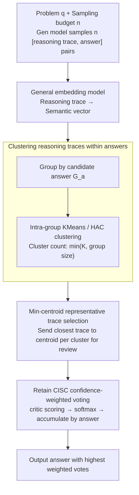

# VecCISC: Improving Confidence-Informed Self-Consistency with Reasoning Trace Clustering and Candidate Answer Selection

**Conference**: ACL2026 Findings  
**arXiv**: [2605.08070](https://arxiv.org/abs/2605.08070)  
**Code**: None  
**Area**: Model Compression  
**Keywords**: Inference-time Computation, Self-Consistency, Confidence-weighted Voting, Trace Clustering, Cost Compression  

## TL;DR
VecCISC introduces "reasoning trace embedding clustering grouped by answer" prior to the confidence-weighted self-consistency of CISC. By submitting only the representative traces of each semantic cluster to the critic for scoring, it significantly reduces critic calls and token costs while maintaining or slightly improving accuracy.

## Background & Motivation
**Background**: A common practice in inference-time scaling is to sample multiple reasoning traces for the same problem and select the most frequent answer using Self-Consistency. Subsequent Confidence-Informed Self-Consistency (CISC) further employs a critic LLM to assign confidence scores to each "reasoning trace + answer" pair for weighted majority voting, which is generally more robust than standard voting.

**Limitations of Prior Work**: The performance gains of CISC stem from the additional "think twice" process, but this comes at a high cost. For every sampled trace, the full problem, reasoning process, and answer must be sent back to the critic, and critic prompts are often lengthy. If the sampling budget is 20, CISC effectively doubles the LLM calls during the reasoning phase. Worse, CISC does not distinguish between high-quality traces, redundant traces, and degenerate hallucinated traces; all samples enter the critic equally.

**Key Challenge**: Self-Consistency seeks to cover the solution space with more samples, while confidence weighting seeks to evaluate each sample finely via a critic. However, many samples are semantically redundant or minor variants of the same incorrect answer. That is, the generation side requires "multi-sampling," while the evaluation side does not necessarily require "total evaluation."

**Goal**: The authors aim to shrink the most expensive part of CISC: retaining the answer coverage provided by diverse reasoning samples while reducing the number of reasoning traces required for critic scoring. This must be achieved without causing the weighted voting to degrade into random sampling due to trace removal.

**Key Insight**: Semantic embeddings of reasoning traces can reflect whether a trace follows the same solution logic. If multiple traces under the same candidate answer are semantically similar, the critic only needs to examine the most representative ones. Traces deviating from the cluster center are more likely to contain anomalous reasoning or redundant expressions.

**Core Idea**: Use reasoning trace embedding clustering to filter out redundant or anomalous samples within the same answer group, transforming the critic evaluation in CISC from "score every trace" to "score representative traces from each semantic cluster."

## Method
VecCISC is not a replacement for the full Self-Consistency or CISC inference framework but a compression layer inserted between "generating multiple reasoning traces" and "critic confidence scoring." It preserves the original sampling budget, allowing the generation model to explore multiple answers; it then groups reasoning traces by answer, performs clustering within each answer group, and selects representative traces from each cluster. Finally, the critic only evaluates these representative traces, and the resulting confidence scores are used for weighted majority voting.

### Overall Architecture
The input consists of a question $q$, a generation model $LLM_{gen}$, a sampling budget $n$, a critic model $LLM_{critic}$, and a maximum cluster count $K$. First, the system samples $n$ tuples $(r_i, a_i)$ from $LLM_{gen}$, where $r_i$ is the reasoning trace and $a_i$ is the final answer. Second, a general text embedding model generates a vector $Emb(r_i)$ for each $r_i$. Third, samples are divided into groups $G_a$ according to candidate answer $a$, ensuring different answers do not merge within the same clustering space. Fourth, KMeans or HAC clustering is performed within each $G_a$, with the number of clusters set to $min(K, |G_a|)$. Fifth, a representative reasoning trace closest to the cluster center is selected for each cluster and sent to the critic for confidence scoring. Finally, the system applies softmax normalization to the confidence scores and accumulates them by candidate answer, outputting the answer with the highest weighted vote count.

The key to this process is "grouping by answer first, then clustering traces." If clustering were performed across answers, traces with similar semantics but different answers might be collapsed together, damaging the candidate answer set; grouping by answer limits the role of VecCISC to compressing evidence within each answer rather than rewriting the answer space.

### Key Designs
**1. Reasoning trace clustering within answers: Group by answer first, then perform semantic clustering to reduce traces sent to the critic without altering the answer space.**

The most expensive part of CISC is the critic, which repeatedly scores many semantically redundant traces, leading to low marginal returns. VecCISC generates embedding vectors for each reasoning trace, but clustering is not done globally. Instead, samples are partitioned into groups $G_a$ by candidate answer, and then KMeans or Hierarchical Agglomerative Clustering (HAC) is run within each $G_a$, with cluster count $\min(K, |G_a|)$. This "group then cluster" order is critical: if clustering were done across answers, traces with similar semantics but different answers would be collapsed, potentially swallowing minority correct answers. By restricting clustering to within answers, VecCISC only compresses "similar explanations for the same answer" without rewriting the answer set. The paper specifically avoids DBSCAN, as it relies on distance thresholds that can cause cluster structures to fluctuate wildly in high-dimensional embedding spaces.

**2. Min-centroid representative trace selection: Select only one trace closest to the semantic center per cluster to save tokens and stabilize evidence.**

After clustering, it must be decided which trace from each cluster to feed to the critic. While random selection reduces volume, it may pick long, anomalous, or hallucinated samples, providing noise to the critic. VecCISC instead calculates the cluster center:

$$u_i = \frac{1}{|C_i|}\sum_{e \in C_i} e,$$

and selects the trace closest to the center using cosine distance as the representative. Cosine distance is used over Euclidean distance because it focuses on vector direction rather than magnitude, which is more suitable for similarity judgments in high-dimensional semantic spaces. Traces near the center represent the "majority reasoning mode" within the cluster, tending to be shorter (saving tokens) and more likely to provide stable and typical evidence to the critic.

**3. Retain CISC confidence-weighted voting interface: Positioning VecCISC as a lightweight plugin rather than a new decision rule.**

To ensure direct integration with existing think-twice pipelines, VecCISC does not alter the final voting logic. The critic outputs a confidence score from $0$ to $1$ for each representative trace, which is normalized via softmax temperature $T$ to obtain $\hat{c}_j$, then accumulated by candidate answer to find the maximum:

$$A_{final}=\arg\max_a \sum_j \mathbb{1}[a_j=a]\,\hat{c}_j.$$

By focusing on "which samples are worth evaluating" while keeping the voting logic identical to CISC, the method allows for fair comparison with SC and CISC and requires near-zero modification to existing LLM-as-judge workflows.

## Key Experimental Results

### Main Results
The paper evaluates on five datasets: AQuA-RAT, CommonsenseQA, ARC-Challenging, MMLU-Pro, and GPQA, covering math, common sense, science, and graduate-level questions. Models include GPT-4o mini, Llama 3.1 8B, Llama 3.3 70B, Qwen2.5 7B, and Mistral 7B. All methods use the same sampled problem sets, with non-deterministic methods (like KMeans) run 10 times.

| Metric | VecCISC + KMeans | VecCISC + HAC | Description |
|------|------------------|---------------|------|
| Critic Call Reduction | 34.68% | 30.2% | Only counts the CISC critic evaluation phase |
| Full Pipeline LLM Call Reduction | 17.34% | 15.1% | Includes original SC sampling and critic phases |
| Critic Token Reduction | 36.2% | 31.69% | Average results from Tables 3/4 |
| Full Pipeline Token Reduction | ~47% | ~47% | Critic calls account for ~77% of total tokens |
| Accuracy Trend | Maintains or exceeds CISC on most tasks | Most stable average performance | HAC achieves best average accuracy on most `(dataset, model)` pairs |

### Ablation Study

| Configuration | Key Metric | Description |
|------|---------|------|
| CISC | AQuA-RAT/GPT-4o mini 84.0, GPQA/Llama3.3 70B 61.7 | Full critic scoring; accurate but highest cost |
| VecCISC (random) | Significantly lower than CISC on most pairs | Shows "reduced evaluation" alone is insufficient without semantic selection |
| VecCISC + KMeans | ARC-Challenging/GPT-4o mini 96.1, MMLU-Pro/Qwen2.5 7B 60.7 | Greater reduction in critic calls while maintaining accuracy |
| VecCISC + HAC | MMLU-Pro/Llama3.1 8B 57.8, GPQA/Llama3.1 8B 35.7 | Most consistent clustering version for average accuracy |

| Representative Selection Strategy | Performance on KMeans | Performance on HAC | Meaning |
|----------------|----------------|--------------|------|
| rand-trace | Lower tokens in 10/25 pairs | Lower tokens in 8/25 pairs | Random selection is sometimes shorter but unstable |
| min-centroid | Lower tokens in 15/25 pairs | Lower tokens in 17/25 pairs | Traces near the centroid are typically more compact and stable |
| Overall Conclusion | Avg critic token reduction 36.2% | Avg critic token reduction 31.69% | Strategy selection determines cost-quality balance |

### Key Findings
- The effectiveness of VecCISC lies in the combination of "grouping by answer + semantic clustering + min-centroid selection"; random sampling drops significantly, indicating CISC is sensitive to sample quality.
- KMeans offers stronger call compression, while HAC provides more stable average accuracy, representing a trade-off between cost and robustness.
- The critic is the most token-heavy stage of the pipeline (77% of total tokens), so reducing critic input translates to nearly halving the total cost.
- The method maintains CISC performance levels on difficult tasks like GPQA and MMLU-Pro, proving it finds representative patterns even in complex reasoning traces.

## Highlights & Insights
- The paper pragmatically decouples "more sampling is better for generation" from "less evaluation is better for cost." Keeping coverage at the generation end while deduplicating at the evaluation end is less likely to sacrifice search space than early stopping.
- Grouping by answer is a small but critical design choice. Without it, clustering would confuse "similar reasoning" with "same answer." This restriction avoids suppressing minority correct answers.
- The min-centroid selection provides a transferable trick: when multiple LLM outputs require secondary review, one can use semantic cluster centers to find "typical samples" first. This can be transferred to multi-turn agent trace reviews, code candidate filtering, and RAG answer consistency.

## Limitations & Future Work
- The paper uses general text embedding models; while effective across tasks, specialized embeddings might better distinguish fine-grained reasoning differences in domains like medicine or mathematical proofs.
- $K$ and $T$ rely on holdout grid searches. In real deployment without validation sets, adaptive selection of cluster counts and temperatures remains an open question.
- The method assumes traces "near the semantic center" are more reliable, but correct solutions might be minority patterns or expressed anomalously; a strong central bias could down-weight these rare correct traces.
- Code is promised to be public, but no repository link was provided in the paper, requiring implementation from scratch for replication.

## Related Work & Insights
- **vs Self-Consistency**: SC only considers answer frequency; it is cheap but cannot distinguish "majority errors" from "minority high-quality reasoning." VecCISC retains diverse sampling but uses critic confidence for weighted voting.
- **vs CISC**: CISC scores every trace, which is accurate but expensive; VecCISC's core advantage is providing semantic compression before the critic stage.
- **vs Semantic Self-Consistency**: Semantic SC uses embeddings directly to calculate sample weights, which relies heavily on the embedding model; VecCISC only uses embeddings for candidate filtering, leaving final confidence to the critic.
- **vs Early Stopping/Dynamic Sampling**: Early stopping reduces generated samples, which might lose answer coverage; VecCISC retains the generation budget and compresses the evaluation budget.

## Rating
- Novelty: ⭐⭐⭐⭐☆ Directly addresses the real cost bottleneck by inserting clustering before CISC.
- Experimental Thoroughness: ⭐⭐⭐⭐☆ Covers 5 datasets and 5 models with various clustering methods, though lacks real-world API cost/latency analysis.
- Writing Quality: ⭐⭐⭐⭐☆ Clear process and adequate information, though some tables are dense.
- Value: ⭐⭐⭐⭐☆ Highly practical for inference-time computation compression, especially for existing LLM-as-judge pipelines.

<!-- RELATED:START -->

## Related Papers

- [\[ACL 2026\] Calibrated Speculative Decoding: Frequency-Guided Candidate Selection for Efficient Inference](calibrated_speculative_decoding_frequency-guided_candidate_selection_for_efficie.md)
- [\[ACL 2026\] CadLLM: Improving the Throughput of Diffusion-based LLMs via Training-Free Confidence-Aware Calibration](improving_the_throughput_of_diffusion-based_large_language_models_via_a_training.md)
- [\[ACL 2026\] DeepPrune: Parallel Scaling without Inter-Trace Redundancy](deepprune_parallel_scaling_without_inter-trace_redundancy.md)
- [\[NeurIPS 2025\] How to Build a Consistency Model: Learning Flow Maps via Self-Distillation](../../NeurIPS2025/model_compression/how_to_build_a_consistency_model_learning_flow_maps_via_self-distillation.md)
- [\[ACL 2026\] BaseCal: Unsupervised Confidence Calibration via Base Model Signals](basecal_unsupervised_confidence_calibration_via_base_model_signals.md)

<!-- RELATED:END -->
