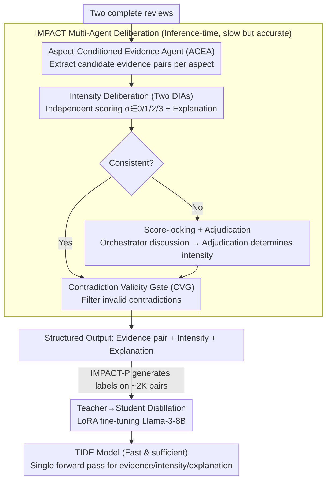

# When Reviews Disagree: Fine-Grained Contradiction Analysis in Scientific Peer Reviews

**Conference**: ACL2026  
**arXiv**: [2605.10171](https://arxiv.org/abs/2605.10171)  
**Code**: https://github.com/sandeep82945/Contradiction-Intensity.git  
**Area**: Model Compression  
**Keywords**: Peer Review, Contradiction Detection, Intensity Scoring, Multi-Agent Deliberation, Knowledge Distillation

## TL;DR
This paper advances reviewer disagreement analysis from sentence-pair binary classification to evidence extraction and intensity scoring on full reviews, utilizing the IMPACT multi-agent teacher to distill a TIDE student model deployable via a single forward pass.

## Background & Motivation
**Background**: Resolving disagreements in scientific peer reviews is the most time-consuming part for Area Chairs (ACs) and editors. Existing computational methods mostly treat reviewer disagreement as natural language inference (NLI) or binary contradiction detection, such as determining contradiction/non-contradiction between two sentences.

**Limitations of Prior Work**: Review contradictions are not always explicit sentence-pair conflicts. Two reviewers may give different judgments on novelty, soundness, clarity, or meaningful comparison, and these judgments are often scattered across multiple paragraphs of full reviews. Binary sentence-pair models lose review-level discourse and fail to inform the AC whether the conflict is minor, moderate, or severe.

**Key Challenge**: Review assistant systems must be fine-grained enough to provide evidence, aspects, and intensity, while being efficient enough to avoid expensive multi-agent deliberation for every call. There is a clear trade-off between high-quality reasoning and low-latency deployment.

**Goal**: The paper proposes a new fine-grained task: given two complete peer reviews, output contradiction evidence pairs, corresponding evaluation aspects, intensity levels, and explanations. Simultaneously, it constructs the RevCI expert-labeled dataset, designs the high-quality IMPACT multi-agent framework, and distills it into the more affordable TIDE small model.

**Key Insight**: Instead of focusing on "whether sentences contradict," the authors start from the actual workflow of an AC: first identifying potentially conflicting evidence by aspect, then having multiple agents independently judge and debate the intensity, and finally outputting a unified result via an adjudicator. This aligns model output with the "evidence + severity + rationale" actually needed by editors.

**Core Idea**: Utilize a task-customized multi-agent deliberation framework to generate high-quality, interpretable contradiction intensity judgments, then use teacher-student distillation to let a small model learn this evidence-grounded intensity reasoning, achieving a balance between quality and deployment cost.

## Method

### Overall Architecture
The paper first constructs the RevCI dataset. Based on the ASAP-Review source used in ContraSciView, it covers 8,582 paper reviews from ICLR 2017-2020 and NeurIPS 2016-2019. The authors pair multiple reviews of the same paper, resulting in approximately 28K pairs. Since explicit contradictions are rare, GPT-4o mini is used for initial filtering before expert re-labeling. The final RevCI contains 800 review pairs, with 352 containing at least one contradiction and 448 as negative samples.

The methodology consists of two layers. The first is IMPACT, a multi-agent framework run at inference time. It takes two complete reviews as input, extracts candidate evidence by aspect, and two intensity agents score and explain independently. If they disagree, a Disagreement Orchestrator organizes a structured discussion, an Adjudication Agent decides based on the discussion trajectory, and finally, a Contradiction Validity Gate filters invalid contradictions.

The second is TIDE. While IMPACT is high-quality, it is slow; thus, the authors use IMPACT-P to generate synthetic contradiction annotations on an additional ~2,000 ICLR 2021-2023 review pairs. This maps full review pairs to structured outputs, followed by LoRA fine-tuning of Meta-Llama-3-8B-Instruct. At test time, TIDE requires only a single forward pass to output evidence, intensity, and explanations.

### Key Designs
**1. Aspect-Conditioned Evidence Agent (ACEA): Breaking "finding contradictions" into "finding by aspect" to improve recall of implicit conflicts in long reviews.**

Review contradictions are often not explicit sentence-pair conflicts but differing judgments scattered across multiple paragraphs. If the model looks for conflicts broadly in long text, it either misses implicit, scattered disagreements or generates excessive false positives. ACEA addresses this by using a set of evaluation aspects—Motivation, Clarity, Soundness, Substance, Originality, Meaningful Comparison—forcing it to focus on one aspect at a time to extract candidate evidence span pairs from two reviews:

$$\mathcal{E}_{a_m}^{(i,j)}=f_{ACEA}(r_i,r_j,a_m),$$

The candidates for all review pairs are then aggregated into aspect-specific evidence pools. Prompting the model to "specifically look for novelty conflicts" or "clarity conflicts" significantly boosts recall and constrains subsequent intensity scoring within a clearer semantic framework. The trade-off is an increase in false positives, which is mitigated by the subsequent validity gate.

**2. Deliberative Intensity Agents + Disagreement Orchestrator: Using "score-locking deliberation" to force agents to expose the rationale for disagreement rather than converging for the sake of harmony.**

Intensity judgment is not a binary classification of presence but a multi-level grading. Two DIAs independently predict an intensity $\alpha\in\{0,1,2,3\}$ (0 = invalid, 1–3 = low/medium/high) and provide an explanation; if they agree, the score is adopted. When they disagree, ordinary multi-agent debates often result in "bandwagoning"—changing votes lazily to reach consensus. The key design of the Disagreement Orchestrator is score-locking: agents are required to keep their original scores unchanged during discussion and may only provide additional evidence, clarify scoring rubrics, or respond to the other's reasoning. This shifts the goal of deliberation from "negotiating a consensus score" to "exposing the evidence behind both judgments for the adjudicator," which better suits a task where reasonable disagreement is expected.

**3. Teacher-Student Distillation from IMPACT to TIDE: Compressing slow multi-agent deliberation into a single-model, single-forward deployment form.**

While high-quality, IMPACT is too slow and costly for routine batch pre-screening due to multiple agents and discussion rounds. IMPACT is thus used as a teacher to generate structured annotations $c_j=(e_j,\alpha_j^*,\rho_j)$—each containing evidence pairs, adjudicated intensity, and explanations—on roughly 2,000 additional ICLR 2021–2023 review pairs. The student model, TIDE, uses SFT to learn the mapping $p_\theta(\{c_j\}|r_i,r_j)$ from full review pairs to these structured outputs, updating only the adapters via LoRA while freezing the base. Consequently, TIDE outputs evidence, intensity, and explanations in one forward pass: high-value reviews or offline labeling are handled by the "slow but accurate" IMPACT, while large-scale pre-screening is handled by the "fast and sufficient" TIDE.

### A Walkthrough Example: How IMPACT handles a pair of conflicting reviews

Given two complete reviews $r_i, r_j$ for the same paper. ACEA first scans by aspect: for Originality, it extracts "the method is a direct combination of existing work, limited novelty" from $r_i$ and "as far as I know, this is the first work to jointly model X and Y" from $r_j$, pairing them in the Originality evidence pool. Two DIAs then score this pair independently: DIA-1 predicts $\alpha=3$ (severe contradiction, one says no novelty, the other says totally new), while DIA-2 predicts $\alpha=2$ (viewing it as a difference in emphasis). They disagree, triggering the Disagreement Orchestrator—but score-locking prevents them from changing votes: DIA-1 defends the 3-point score by proving both refer to the same contribution, whereas DIA-2 defends the 2-point score by explaining the perceived hedging. The Adjudication Agent reads the discussion to decide the final intensity, and finally, the Contradiction Validity Gate ensures it is a valid contradiction (rather than unrelated comments). If passed, $(Evidence Pair,\ \alpha^*,\ Explanation)$ is outputted. The AC receives an aspect-filed list of conflicts with intensity and rationale.

### Loss & Training
IMPACT does not train models but fixes temperature to 0 at inference, disabling nucleus and top-k sampling, and uses a fixed seed for reproducibility; duplicate contradictions are removed via a ROUGE-L threshold of 0.9. TIDE uses Meta-Llama-3-8B-Instruct with LoRA injected into attention and FFN projection layers, trained for 5 epochs using AdamW, a learning rate of $5\times10^{-5}$, a cosine schedule, and a 0.03 warmup ratio. Only LoRA adapters are updated.

## Key Experimental Results

### Main Results
Evaluation metrics include review-pair level FNR/FPR, as well as Cohen's $\kappa$, Spearman $\rho$, and Kendall $\tau$ for matched evidence pairs. Lower FNR/FPR and higher intensity consistency are preferred. Evidence matching utilizes ROUGE-L and Hungarian matching.

| Category / Method | FNR ↓ | FPR ↓ | $\kappa$ ↑ | $\rho$ ↑ | $\tau$ ↑ | Description |
|-----------|-------|-------|------------|----------|----------|-------------|
| GPT-5.2 CoT | 0.2935 | 0.3012 | 0.2612 | 0.3679 | 0.3043 | Strong single-model baseline; limited consistency |
| CourtEval | 0.2520 | 0.2590 | 0.2860 | 0.4100 | 0.3490 | Strongest generic multi-agent baseline |
| IMPACT-OA | 0.2390 | 0.2287 | 0.3270 | 0.4783 | 0.4421 | Open-source version; outperforms CourtEval |
| IMPACT-P | 0.1901 | 0.1613 | 0.3862 | 0.6193 | 0.5826 | Best performance; proves task-specific utility |
| TIDE | 0.3771 | 0.3048 | 0.2202 | 0.3793 | 0.3549 | Single forward pass; efficient; outperforms some LLMs |

### Ablation Study
The authors ablate IMPACT and TIDE separately to verify the effects of aspect conditioning, intensity examples, intensity scoring, the validity gate, multi-agent discussion, fine-tuning, and intensity reasoning supervision.

| Configuration | Key Metrics | Description |
|---------------|-------------|-------------|
| w/o ACEA / w/o Deliberation | FNR 0.2969, FPR 0.3661 | Base setup has high misses and false alarms |
| ACEA only | FNR 0.1092, FPR 0.5120 | Aspect conditioning reduces misses but increases false positives |
| IS + IEx | FNR 0.3293, FPR 0.3346, $\rho$ 0.5134 | Intensity examples help clarify the 1-3 rubric |
| ACEA + IEx + IS + CVG | FNR 0.1953, FPR 0.2614 | Validity gate suppresses false positives from ACEA |
| Full IMPACT | FNR 0.1901, FPR 0.1613, $\rho$ 0.6193 | DO, DIA, and Adjudicator significantly reduce FPR and boost consistency |
| TIDE full | FNR 0.3771, FPR 0.3048, $\rho$ 0.3793 | Finetuning + Intensity + Explanation joint training is best |

### Key Findings
- Compared to CourtEval, IMPACT-P reduces average detection error by 31.2% and improves average consistency by 52.0%; IMPACT-OA also shows gains, indicating improvements are from task structure, not just closed-source power.
- Discussion rounds follow a law of diminishing returns. Performance boosts significantly from 1 round (0.3608) to 3 rounds (0.4068) and further at 4 rounds, but saturates after 5 rounds. $D=4$ is the optimal operating point.
- TIDE does not fully surpass IMPACT but successfully compresses evidence-grounded intensity reasoning into an 8B model, making it suitable for large-scale pre-screening.

## Highlights & Insights
- Task definition is closely aligned with the real AC workflow. It outputs evidence, aspects, intensity, and explanations rather than a binary label, enabling humans to quickly judge which disagreements warrant further discussion.
- The score-locking multi-agent deliberation is clever. It prevents agent "acquiescence" in dialogue, shifting the goal from consensus to exposing rationales for divergence—a valuable paradigm for evaluation tasks.
- TIDE follows a natural model compression route: using a high-quality, multi-step, interpretable teacher to produce training signals for an efficient student. This can be transferred to review quality checks, rebuttal handling, or fact-conflict detection.

## Limitations & Future Work
- RevCI contains only 800 review pairs; while expert labeling is costly, the scale limits generalization. Subtler contradictions might be underestimated due to LLM pre-filtering.
- The experiment focuses on CS reviews (ICLR/NeurIPS) and six aspects. Review styles and conflict expressions may differ in other disciplines; cross-domain validation is required.
- While IMPACT can be updated via ACEA prompts for new aspects, TIDE requires retraining. Future work could consider aspect-description conditional training for open evaluation aspects.

## Related Work & Insights
- **vs ContraSciView**: ContraSciView models disagreement as isolated sentence-pair binary detection; this work handles full reviews and outputs evidence sets and intensity levels, better serving AC decision-making.
- **vs General NLI**: NLI models excel at standard premise-hypothesis judgments, but peer reviews contain hedging, technical assumptions, and scale differences; IMPACT handles this pragmatic information via aspect conditioning and full-context reasoning.
- **vs Generic Multi-Agent Frameworks**: Unlike Self-Refine or CourtEval's general flows, IMPACT’s gains come from task-specific structures like ACEA, score-locking, and intensity adjudication rather than just agent count.

## Rating
- Novelty: ⭐⭐⭐⭐☆ The task definition and score-locking deliberation are highly innovative; the TIDE distillation is natural yet practical.
- Experimental Thoroughness: ⭐⭐⭐⭐☆ Main experiments, ablations, and error analyses are comprehensive, though dataset scale and domain coverage are limited.
- Writing Quality: ⭐⭐⭐⭐☆ Methodology is clear and metrics are well-defined; tables are dense but supportive of conclusions.
- Value: ⭐⭐⭐⭐☆ Highly applicable to peer review assistance and long-form contradiction detection; provides a paradigm for compressing multi-agent teachers.

<!-- RELATED:START -->

## Related Papers

- [\[ACL 2026\] A Layer-wise Analysis of Supervised Fine-Tuning](a_layer-wise_analysis_of_supervised_fine-tuning.md)
- [\[CVPR 2026\] DAGE: Dual-Stream Architecture for Efficient and Fine-Grained Geometry Estimation](../../CVPR2026/model_compression/dage_dual-stream_architecture_for_efficient_and_fine-grained_geometry_estimation.md)
- [\[CVPR 2026\] DiT-Distill: Open-Set Fine-Grained Retrieval via Generative Curriculum Knowledge](../../CVPR2026/model_compression/dit-distill_open-set_fine-grained_retrieval_via_generative_curriculum_knowledge.md)
- [\[ICLR 2026\] Paper Copilot: Tracking the Evolution of Peer Review in AI Conferences](../../ICLR2026/model_compression/paper_copilot_tracking_the_evolution_of_peer_review_in_ai_conferences.md)
- [\[ACL 2025\] BlockPruner: Fine-grained Pruning for Large Language Models](../../ACL2025/model_compression/blockpruner_fine-grained_pruning_for_large_language_models.md)

<!-- RELATED:END -->
