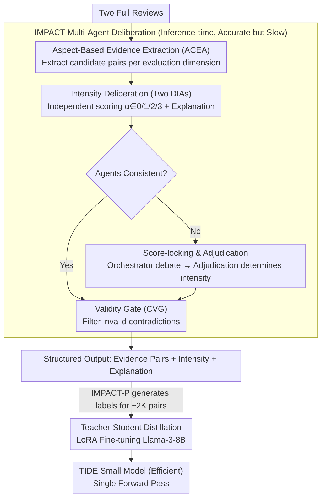

# When Reviews Disagree: Fine-Grained Contradiction Analysis in Scientific Peer Reviews

**Conference**: ACL2026  
**arXiv**: [2605.10171](https://arxiv.org/abs/2605.10171)  
**Code**: https://github.com/sandeep82945/Contradiction-Intensity.git  
**Area**: Model Compression  
**Keywords**: Peer review, contradiction detection, intensity scoring, multi-agent deliberation, knowledge distillation

## TL;DR
This paper advances the analysis of scientific review disagreements from sentence-pair binary classification to evidence extraction and intensity scoring on full reviews. It employs the IMPACT multi-agent teacher framework to distill a small TIDE model capable of single-forward pass deployment.

## Background & Motivation
**Background**: Resolving disagreements in scientific peer reviews is the most time-consuming task for Area Chairs (ACs) and editors. Existing computational approaches primarily frame reviewer disagreement as Natural Language Inference (NLI) or binary contradiction detection, such as determining "contradiction/non-contradiction" between two isolated sentences.

**Limitations of Prior Work**: Contradictions in reviews are not always explicit sentence-pair conflicts. Reviewers may hold differing judgments on aspects such as novelty, soundness, clarity, or meaningful comparisons, which are often dispersed across multiple paragraphs. Binary sentence-pair models lose review-level discourse context and fail to inform ACs whether a conflict is minor, moderate, or severe.

**Key Challenge**: A review assistance system must be fine-grained enough to provide contradictory evidence, aspects, and intensities, yet efficient enough to avoid expensive multi-agent deliberations for every instance. There is a clear trade-off between high-quality reasoning and low-latency deployment.

**Goal**: This paper proposes a new fine-grained task: given two complete peer reviews, the system outputs contradictory evidence pairs, their corresponding evaluation aspects, intensity levels, and explanations. To achieve this, the authors construct the RevCI expert-annotated dataset, design the high-quality IMPACT multi-agent framework, and distill it into a more efficient TIDE small model.

**Key Insight**: Instead of focusing on whether individual sentences contradict, the authors align with the actual editorial workflow of ACs: first extracting potential contradictory evidence by aspect, then employing multiple agents for independent judgment and debate on intensity, and finally producing a unified output via an adjudicator. This aligns model outputs with the "evidence + severity + rationale" required by editors.

**Core Idea**: Use a task-specific multi-agent deliberation framework to generate high-quality, interpretable contradiction intensity judgments, then apply teacher-student distillation to enable a smaller model to learn this evidence-grounded intensity reasoning, achieving a balance between quality and deployment cost.

## Method

### Overall Architecture
The paper first constructs the RevCI dataset. Based on the ASAP-Review source used in ContraSciView, it covers 8,582 reviews from ICLR 2017-2020 and NeurIPS 2016-2019. Multiple reviews for the same paper are paired, resulting in approximately 28K pairs. Since explicit contradictions are rare, GPT-4o mini is used for preliminary screening before expert re-annotation. The final RevCI set contains 800 review pairs, with 352 containing at least one contradiction and 448 serving as negative examples.

The method consists of two layers. The first layer is IMPACT, an inference-time multi-agent framework. It takes two full reviews as input, extracts candidate evidence by aspect, and utilizes two intensity agents for independent scoring and explanation. If they disagree, a Disagreement Orchestrator organizes a structured discussion, an Adjudication Agent decides based on the discussion trajectory, and a Contradiction Validity Gate filters invalid contradictions.

The second layer is TIDE. Since IMPACT is high-quality but slow, the authors use IMPACT-P to generate synthetic contradiction annotations on' approximately 2,000 additional ICLR 2021-2023 review pairs. These map full review pairs to structured outputs, which are used to fine-tune Meta-Llama-3-8B-Instruct via LoRA. During testing, TIDE produces evidence, intensity, and explanations in a single forward pass.

### Key Designs
**1. Aspect-Conditioned Evidence Agent (ACEA): Decomposing "finding contradictions" into aspect-specific searches to improve recall of implicit conflicts in long reviews.**

Contradictions in reviews are often not explicit sentence-level clashes but differing judgments scattered across multiple paragraphs. If a model searches broadly for conflicts in long texts, it may miss subtle disagreements or generate excessive false positives. ACEA addresses this by focusing on specific evaluation dimensions—Motivation, Clarity, Soundness, Substance, Originality, and Meaningful Comparison—forcing the model to examine one dimension at a time to extract candidate evidence span pairs from two reviews:

$$\mathcal{E}_{a_m}^{(i,j)}=f_{ACEA}(r_i,r_j,a_m),$$

Candidate evidence is then aggregated into aspect-specific pools. Prompting the model to specifically look for "Clarity conflicts" significantly improves recall and constrains intensity scoring within a clearer semantic framework. While this increases the number of candidates (including false positives), the subsequent validity gate filters these out.

**2. Deliberative Intensity Agents + Disagreement Orchestrator: "Score-locked" deliberation to force agents to expose underlying reasons rather than converging for the sake of consensus.**

Intensity judgment is not a binary task but requires a graded scale from minor to severe. Two DIAs independently predict an intensity level $\alpha\in\{0,1,2,3\}$ (0 = invalid, 1-3 = low/mid/high) for the same evidence pair, accompanied by an explanation. If they agree, the score is adopted. When they disagree, conventional multi-agent debates often result in "bandwagoning" or lazy consensus. The Disagreement Orchestrator introduces "score-locking": during discussion, agents must maintain their original scores and are only allowed to provide additional evidence, clarify rubrics, or respond to the other agent's rationale. This shifts the goal from "reaching a common score" to "surfacing the evidence behind both judgments for the adjudicator," which better suits intensity scoring where reasonable disagreement is possible.

**3. IMPACT to TIDE Teacher-Student Distillation: Compressing slow, multi-agent deliberation into a single-model, single-forward-pass deployment format.**

While IMPACT is accurate, its multi-agent, multi-round discussion process is too latent and costly for daily large-scale screening. IMPACT is therefore used as a teacher to generate structured annotations $c_j=(e_j,\alpha_j^*,\rho_j)$—including evidence pairs, adjudicated intensity, and explanations—for ~2,000 ICLR 2021-2023 review pairs. The student model, TIDE, uses SFT to learn the mapping from full review pairs to these structured outputs $p_\theta(\{c_j\}|r_i,r_j)$. Through LoRA, only the adapters are updated while the base model is frozen. Consequently, TIDE can output evidence, intensity, and explanations in a single pass at test time. High-value reviews or offline labeling are handled by the "accurate" IMPACT, while massive pre-screening uses the "efficient" TIDE.

### Key Experimental Results

### Main Results
Evaluation metrics include FNR/FPR at the review-pair level, and Cohen's $\kappa$, Spearman $\rho$, and Kendall $\tau$ for matched evidence pairs. Lower FNR/FPR and higher intensity consistency are preferred. Evidence matching utilizes ROUGE-L and Hungarian matching to ensure fair evaluation of variable-length evidence sets.

| Category / Method | FNR ↓ | FPR ↓ | $\kappa$ ↑ | $\rho$ ↑ | $\tau$ ↑ | Note |
|:---|:---:|:---:|:---:|:---:|:---:|:---|
| GPT-5.2 CoT | 0.2935 | 0.3012 | 0.2612 | 0.3679 | 0.3043 | Strong single-model baseline; limited consistency |
| CourtEval | 0.2520 | 0.2590 | 0.2860 | 0.4100 | 0.3490 | State-of-the-art general multi-agent baseline |
| IMPACT-OA | 0.2390 | 0.2287 | 0.3270 | 0.4783 | 0.4421 | Open-source version; outperforms CourtEval |
| IMPACT-P | 0.1901 | 0.1613 | 0.3862 | 0.6193 | 0.5826 | Best performance; demonstrates utility of task-specific deliberation |
| TIDE | 0.3771 | 0.3048 | 0.2202 | 0.3793 | 0.3549 | Single-forward pass; high efficiency; superior consistency compared to some large models |

### Ablation Study
The authors conducted ablations on IMPACT and TIDE to verify the contributions of aspect conditioning, intensity exemplars, intensity scoring, the validity gate, multi-agent discussion, fine-tuning, and intensity reasoning supervision.

| Configuration | Key Metrics | Note |
|:---|:---|:---|
| w/o ACEA / w/o Deliberation | FNR 0.2969, FPR 0.3661 | Base setup misses many conflicts and has high false positives |
| ACEA Only | FNR 0.1092, FPR 0.5120 | Aspect conditioning drastically improves recall but introduces false positives |
| IS + IEx | FNR 0.3293, FPR 0.3346, $\rho$ 0.5134 | Intensity exemplars help the model understand the 1-3 rubric |
| ACEA + IEx + IS + CVG | FNR 0.1953, FPR 0.2614 | Validity gate suppresses false positives introduced by ACEA |
| Full IMPACT | FNR 0.1901, FPR 0.1613, $\rho$ 0.6193 | DO, DIA, and Adjudicator significantly reduce FPR and improve consistency |
| TIDE Full | FNR 0.3771, FPR 0.3048, $\rho$ 0.3793 | Joint training of fine-tuning + intensity scoring + explanation yields best results |

### Key Findings
- Compared to CourtEval, IMPACT-P reduces average detection error by 31.2% and improves average consistency by 52.0%. IMPACT-OA also shows significant gains (8.5% and 19.4%), proving benefits stem from task-specific design rather than just stronger proprietary models.
- Increasing discussion rounds beyond a certain point has diminishing returns. Performance improves from round 1 (0.3608) to round 3 (0.4068), peaks near round 4 ($D=4$), and saturates or slightly declines thereafter.
- While TIDE does not outperform IMPACT, it successfully compresses evidence-grounded intensity reasoning into an 8B model and a single forward pass, making it suitable for large-scale pre-screening.

## Highlights & Insights
- The task definition accurately mirrors the real-world AC workflow. Instead of a binary label, it provides evidence, aspects, intensity, and explanations, allowing humans to quickly identify which disagreements require attention.
- The "score-locking" design for multi-agent deliberation is clever. It prevents agents from caving in to reach consensus, focusing instead on exposing the reasoning behind divergent views—a valuable paradigm for evaluation-type tasks.
- TIDE represents a natural model compression path: using high-quality, multi-step, interpretable signals from a teacher to distill capabilities into a small model. This paradigm is transferable to other domains like review quality checks, rebuttal handling, and fact-checking.

## Limitations & Future Work
- The RevCI dataset consists of only 800 pairs. While expert annotation is costly, the scale limits model generalization. Subtle contradictions might be underrepresented due to the initial LLM screening.
- The experiment focuses on CS reviews (ICLR/NeurIPS) and six high-frequency aspects. Review styles, evaluation dimensions, and conflict expressions in other disciplines may differ, requiring further cross-domain validation.
- IMPACT can be updated via ACEA prompts for new aspects, but TIDE requires retraining. Future work could explore aspect-description-conditioned training for open-ended dimensions in small models.

## Related Work & Insights
- **vs ContraSciView**: ContraSciView models disagreement as isolated sentence-pair binary detection. Ours processes full reviews and outputs evidence sets with intensity levels, better serving editorial decision-making.
- **vs General NLI Models**: NLI models excel at standard premise-hypothesis pairs but struggle with the hedging, technical assumptions, and varying evaluation scales in peer reviews. IMPACT handles these pragmatic nuances through aspect conditioning and context-aware reasoning.
- **vs General Multi-agent Frameworks**: While frameworks like Self-Refine, Debate, and CourtEval use generic flows, IMPACT's advantage lies in task-specific components like ACEA, score-locking, and CVG, showing that gains come from task structure rather than sheer agent count.

## Rating
- Novelty: ⭐⭐⭐⭐☆
- Experimental Thoroughness: ⭐⭐⭐⭐☆
- Writing Quality: ⭐⭐⭐⭐☆
- Value: ⭐⭐⭐⭐☆

<!-- RELATED:START -->

## Related Papers

- [\[ACL 2026\] A Layer-wise Analysis of Supervised Fine-Tuning](a_layer-wise_analysis_of_supervised_fine-tuning.md)
- [\[CVPR 2026\] How to Choose Your Teacher for Fine Grained Image Recognition](../../CVPR2026/model_compression/how_to_choose_your_teacher_for_fine_grained_image_recognition.md)
- [\[CVPR 2026\] DAGE: Dual-Stream Architecture for Efficient and Fine-Grained Geometry Estimation](../../CVPR2026/model_compression/dage_dual-stream_architecture_for_efficient_and_fine-grained_geometry_estimation.md)
- [\[CVPR 2026\] DiT-Distill: Open-Set Fine-Grained Retrieval via Generative Curriculum Knowledge](../../CVPR2026/model_compression/dit-distill_open-set_fine-grained_retrieval_via_generative_curriculum_knowledge.md)
- [\[ICLR 2026\] Paper Copilot: Tracking the Evolution of Peer Review in AI Conferences](../../ICLR2026/model_compression/paper_copilot_tracking_the_evolution_of_peer_review_in_ai_conferences.md)

<!-- RELATED:END -->
