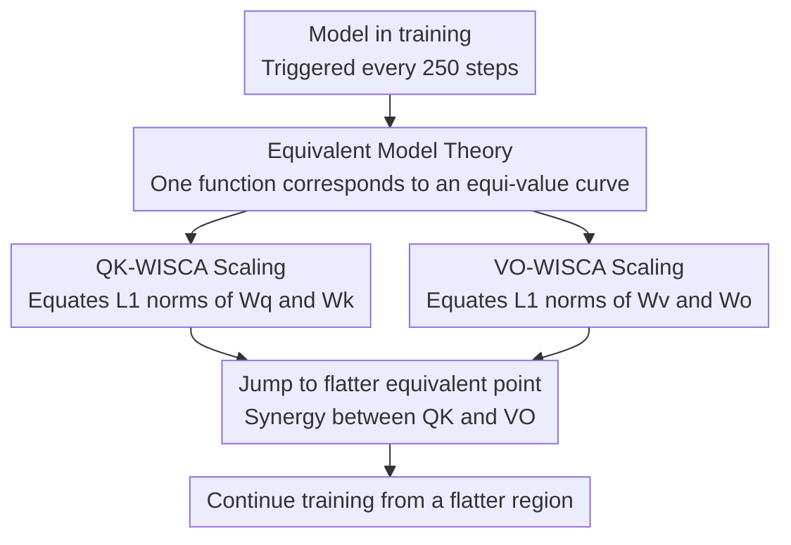

# WISCA: A Lightweight Model Transition Method to Improve LLM Training via Weight Scaling

**Conference**: ACL 2026 Findings  
**arXiv**: [2508.16676](https://arxiv.org/abs/2508.16676)  
**Code**: None  
**Area**: Model Compression / Training Optimization  
**Keywords**: Weight Scaling, Equivalent Model, Loss Landscape, GQA Optimization, LoRA

## TL;DR

This paper proposes the Equivalent Model Theory and the WISCA weight scaling strategy. By dynamically adjusting the $W_q/W_k$ and $W_v/W_o$ weights of Transformer attention layers during training to equalize their L1 norms (while maintaining the model output), it guides optimization toward flatter loss minima. This achieves an average 5.6% improvement in zero-shot evaluation and 2.12% reduction in training perplexity on GQA architectures.

## Background & Motivation

**Background**: Transformer architectures dominate the LLM field. Training optimization primarily focuses on architectural modifications (e.g., GQA, MoE) and optimizer tuning (e.g., AdamW, learning rate scheduling).

**Limitations of Prior Work**: (1) Existing methods lack systematic optimization of weight patterns during training—the distribution and relative magnitude of weights affect the geometry of the loss landscape; (2) Sharp minima lead to poor generalization, making models more sensitive to data outliers; (3) Explicit flattening methods like SAM incur nearly 2x computational overhead, and SWA requires significant extra training.

**Key Challenge**: Starting from the same loss value, the gap in generalization between sharp and flat minima is significant, but first-order optimizers (SGD, Adam) lack mechanisms to favor flat regions inherently.

**Goal**: Design a zero-overhead weight pattern optimization strategy that guides optimization to flatter regions of the loss landscape without altering model output.

**Key Insight**: The authors observe that for the loss function $\mathcal{L}=(QK-1)^2$, the contour spacing is maximized (i.e., flattest) when $Q=K$. Therefore, approximating this optimal point by scaling $W_q$ and $W_k$ to equate their norms is effective.

**Core Idea**: By constructing "equivalent models" (models with identical outputs but different weights), the training can periodically jump to flatter equivalent points on the loss landscape, thereby indirectly optimizing the training trajectory.

## Method

### Overall Architecture

WISCA is built upon "Equivalent Model Theory": under the same architecture, if two sets of parameters produce identical outputs for all inputs but have different parameter values, they are equivalent. These equivalent points form an equi-value curve in the parameter space, and different positions on this curve correspond to different degrees of flatness in the loss landscape. WISCA "jumps" to flatter equivalent points on this curve by scaling attention weights—keeping the values of $QK^T$ and $(attention\_score \cdot V) \cdot W_o$ unchanged while adjusting weight norms to allow the optimizer to proceed from a flatter starting point. This can be applied once at initialization or periodically every N steps during training.

### Key Designs

**1. Equivalent Model Theory: Finding a valid "translation track" for weight adjustment without changing outputs**

To modify weights without breaking model functionality, WISCA must define "equivalence." The authors define parameters $\theta_1, \theta_2$ as equivalent if they share the same architecture, satisfy $F(x;\theta_1)=F(x;\theta_2)$ for all inputs, and $\theta_1 \neq \theta_2$. This is constructed using the positive homogeneity of ReLU: $\text{ReLU}(\alpha z)=\alpha \text{ReLU}(z)$ for $\alpha>0$. By multiplying adjacent layer weights by reciprocal scaling factors, the output remains unchanged. Thus, the set of equivalent models forms an equi-value curve in the parameter space where points have identical functions but different loss geometries. This makes "selecting a flatter point to restart" an actionable operation that improves subsequent training trajectories.

**2. QK-WISCA Scaling: Equating $W_q$ and $W_k$ norms to flatten the attention score loss landscape**

The loss $\mathcal{L}=(QK-C)^2$ associated with attention scores has the widest contour spacing (flattest) when $|Q|=|K|$. However, during training, the norms of $W_q$ and $W_k$ often become unbalanced, pushing the optimization path into sharper regions. WISCA directly sets $W_q' = W_q \cdot \sqrt{\|W_k\|_1 / \|W_q\|_1}$ and $W_k' = W_k \cdot \sqrt{\|W_q\|_1 / \|W_k\|_1}$, ensuring $\|W_q'\|_1 = \|W_k'\|_1$ while $Q'K'^T = QK^T$ remains invariant. Gradient direction consistency analysis confirms that gradient direction changes are minimized and convergence is most stable when $|Q|=|K|$. This is particularly beneficial for GQA architectures: since $g$ query heads share one key/value set, $W_q$ parameters are $g$ times those of $W_k$, leading to a scaling ratio $\sqrt{1/g}$ that deviates significantly from 1, making the flattening effect more pronounced.

**3. VO-WISCA Scaling: Applying the same treatment to $W_v$ and $W_o$ to create synergy with QK scaling**

$W_v$ and $W_o$ are another pair of consecutive linear layers subject to norm imbalance and sharp loss landscapes. WISCA applies the same logic: $W_v' = W_v \cdot \sqrt{\|W_o\|_1 / \|W_v\|_1}$ and $W_o' = W_o \cdot \sqrt{\|W_v\|_1 / \|W_o\|_1}$, keeping the final output $(attention\_score \cdot V) \cdot W_o$ unchanged. While VO scaling alone yields limited gains, it creates a synergy when combined with QK scaling—experimental results show that the combined improvement far exceeds the sum of individual applications.

### Loss & Training

WISCA does not modify the loss function and is compatible with standard training pipelines. In experiments, the WISCA transformation is applied every 250 steps. It supports both tensor-wise (full matrix scaling) and channel-wise (granularity at the channel level) modes.

## Key Experimental Results

### Main Results

**Pre-training Convergence (TinyStories Dataset)**

| Model | Strategy | Train Loss | Test PPL |
|------|------|-----------|----------|
| TinyLlama | origin | 1.3193 | 3.78 |
| TinyLlama | QK+VO WISCA | **1.2749** | **3.62** |
| Qwen2-1.5B | origin | 1.355 | 3.96 |
| Qwen2-1.5B | QK+VO WISCA | **1.3336** | **3.88** |
| Qwen1.5-MoE | origin | 1.5497 | 4.76 |
| Qwen1.5-MoE | QK+VO WISCA | **1.5141** | **4.60** |

**Zero-shot Evaluation (Llama-1.1B, Wikipedia 1.4B tokens)**

| Strategy | BoolQ | ARC-c | PIQA | WinoG | Average |
|------|-------|-------|------|-------|------|
| origin | 0.384 | 0.174 | 0.529 | 0.500 | 0.397 |
| QK_TEN+VO_TEN | **0.521** | **0.187** | **0.541** | **0.498** | **0.437** |

### Ablation Study

| Strategy | Mean Zero-shot Score | Gain |
|------|--------------|------|
| origin | 0.397 | — |
| QK_TEN Only | 0.395 | -0.5% |
| VO_TEN Only | 0.403 | +1.6% |
| QK_TEN+VO_TEN | 0.437 | **+10.1%** |
| QK_ROW+VO_TEN | 0.422 | +6.2% |
| QK_TEN+VO_TEN(init only) | 0.421 | +6.0% |

### Key Findings

- Combined QK and VO scaling produces significant synergy: individual use is limited (+1-2%), yet the combination yields a 10.1% gain.
- Effects are larger on GQA architectures (e.g., Llama-MoE) because the parameter asymmetry between query and key makes the scaling ratio deviate significantly from 1.
- Using WISCA only at initialization retains approximately 97% of performance gains, suitable for resource-constrained scenarios.
- WISCA is also effective in LoRA fine-tuning (Alpaca loss: 0.8602→0.8532; MetaMath: 0.0779→0.0770).
- In EAGLE speculative decoding, WISCA improves the token acceptance rate of draft models.

## Highlights & Insights

- The concept of "Equivalent Models" is elegant—improving training without changing outputs is a "free lunch" style optimization.
- The computational overhead of WISCA is nearly zero (requiring only norm calculation and scaling), yet it brings substantial training benefits, making it highly practical.
- The theoretical analysis is concise and powerful: derivation of the $|Q|=|K|$ optimal condition through gradient direction consistency provides clear intuition.

## Limitations & Future Work

- Theoretical analysis is based on a simplified binary loss $\mathcal{L}=(QK-C)^2$; the loss landscape of real Transformers is much more complex.
- Verification is limited to Transformer attention; applicability to CNN or RNN architectures remains unexplored.
- Experimental scale is mainly at the 1-5B parameter level; efficacy for larger models (70B+) is unknown.
- The choice of granularity for channel-wise WISCA (per head vs. per channel) lacks systematic comparison.

## Related Work & Insights

- **vs SAM**: SAM explicitly seeks flat minima by maximizing loss under perturbation, requiring ~2x computation; WISCA flattens implicitly via equivalent transformations with near-zero overhead.
- **vs Weight Normalization**: Weight normalization changes the model's functional mapping and requires retraining; WISCA maintains functional equivalence and is plug-and-play.
- **vs QK Normalization**: QKN changes the dot product to cosine similarity, altering the attention computation semantics; WISCA preserves the original $QK^T$.

## Rating

- Novelty: ⭐⭐⭐⭐ The Equivalent Model Theory perspective is novel and formalizes weight pattern optimization.
- Experimental Thoroughness: ⭐⭐⭐⭐ Covers pre-training, fine-tuning (LoRA), and speculative decoding (EAGLE).
- Writing Quality: ⭐⭐⭐ Theoretical sections are clear, though experimental table formatting is slightly cluttered.
- Value: ⭐⭐⭐⭐ Zero-overhead optimization strategy with high practical value for broad application.

<!-- RELATED:START -->

## Related Papers

- [\[ICML 2026\] Decouple Searching from Training: Scaling Data Mixing via Model Merging for Large Language Model Pre-training](../../ICML2026/model_compression/decouple_searching_from_training_scaling_data_mixing_via_model_merging_for_large.md)
- [\[ACL 2026\] Task-Stratified Knowledge Scaling Laws for Post-Training Quantized LLMs](task-stratified_knowledge_scaling_laws_for_post-training_quantized_large_languag.md)
- [\[ACL 2026\] ArcLight: A Lightweight LLM Inference Architecture for Many-Core CPUs](arclight_a_lightweight_llm_inference_architecture_for_many-core_cpus.md)
- [\[ACL 2026\] DeepPrune: Parallel Scaling without Inter-Trace Redundancy](deepprune_parallel_scaling_without_inter-trace_redundancy.md)
- [\[ECCV 2024\] SpaceJAM: a Lightweight and Regularization-free Method for Fast Joint Alignment of Images](../../ECCV2024/model_compression/spacejam_a_lightweight_and_regularization-free_method_for_fast_joint_alignment_o.md)

<!-- RELATED:END -->
