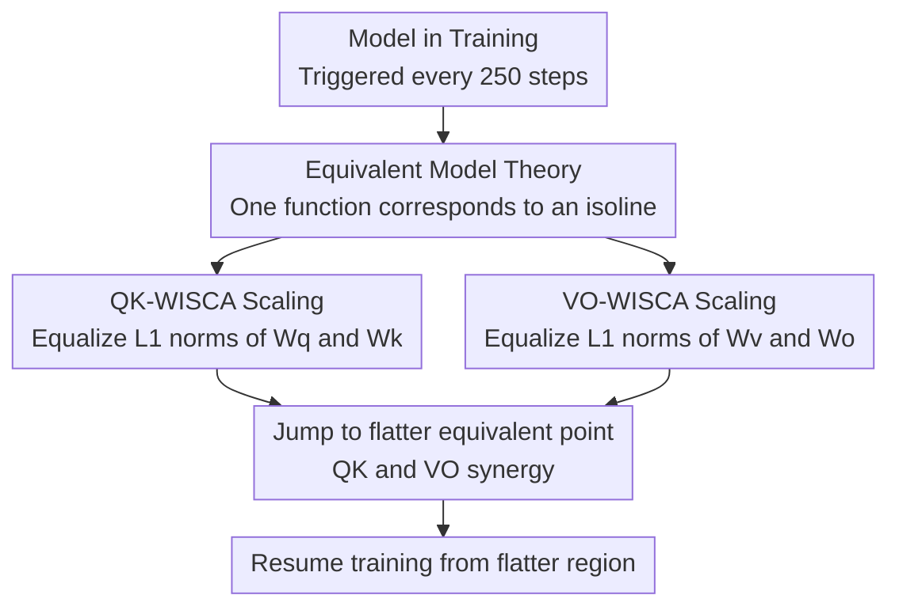

# WISCA: A Lightweight Model Transition Method to Improve LLM Training via Weight Scaling

**Conference**: ACL 2026 Findings  
**arXiv**: [2508.16676](https://arxiv.org/abs/2508.16676)  
**Code**: None  
**Area**: Model Compression / Training Optimization  
**Keywords**: Weight Scaling, Equivalent Models, Loss Landscape, GQA Optimization, LoRA

## TL;DR

This paper proposes the Equivalent Model Theory and the WISCA weight scaling strategy. By dynamically adjusting the $W_q/W_k$ and $W_v/W_o$ weights of Transformer attention layers during training to equalize their L1 norms (while maintaining model output), the optimization is guided toward flatter local minima. This achieves an average 5.6% zero-shot evaluation improvement and a 2.12% reduction in training perplexity on GQA architectures.

## Background & Motivation

**Background**: Transformer architectures dominate the LLM field, with training optimization primarily focused on architectural modifications (e.g., GQA, MoE) and optimizer adjustments (e.g., AdamW, learning rate scheduling).

**Limitations of Prior Work**: (1) Existing methods lack systematic optimization of weight patterns during training—the distribution and relative magnitude of weights affect the geometry of the loss landscape; (2) Sharp minima lead to poor generalization, making models more sensitive to data outliers; (3) Explicit flattening methods like SAM involve approximately 2x computational overhead, while SWA requires significant additional training.

**Key Challenge**: Starting from the same loss value, there is a significant discrepancy in generalization between sharp and flat minima, yet first-order optimizers (SGD, Adam) lack inherent mechanisms to favor flat regions.

**Goal**: To design a zero-computation-overhead weight pattern optimization strategy that guides optimization toward flatter regions of the loss landscape without altering model output.

**Key Insight**: The authors observe that for the loss function $\mathcal{L}=(QK-1)^2$, the contour spacing is maximized (i.e., flattest) when $Q=K$. Thus, parity is approached by scaling $W_q$ and $W_k$ to equalize their norms.

**Core Idea**: By constructing "Equivalent Models" (models with identical outputs but different weights), the training process periodically jumps to equivalent points in flatter regions of the loss landscape, thereby indirectly optimizing the training trajectory.

## Method

### Overall Architecture

WISCA is built upon "Equivalent Model Theory": under the same architecture, if two sets of parameters produce the same output for all inputs but have different parameter values, they are equivalent. These equivalent points form an isoline in the parameter space, but different positions on this curve correspond to different degrees of flatness in the loss landscape. WISCA "jumps" to flatter equivalent points on this curve by scaling attention weights—keeping $QK^T$ and $(attention\_score \cdot V) \cdot W_o$ constant while adjusting weight norms so the optimizer continues from a flatter starting point. This can be applied once at initialization or periodically every N steps during training.

### Key Designs

**1. Equivalent Model Theory: Finding a valid "translation orbit" for weight adjustment without changing any output.**

To modify weights without compromising model functionality, WISCA must define equivalence. The authors define parameters $\theta_1, \theta_2$ as mutual equivalent models if they share the same architecture, satisfy $F(x;\theta_1)=F(x;\theta_2)$ for all inputs, and $\theta_1 \neq \theta_2$. This is constructed using the positive homogeneity of ReLU, $\text{ReLU}(\alpha z)=\alpha \text{ReLU}(z)$ for $\alpha>0$: weights of adjacent layers are multiplied by reciprocal scaling factors, leaving output unchanged. Consequently, the set of equivalent models forms an isoline in parameter space where points represent the same function but different loss geometries. This allows "restarting from a flatter point" to improve subsequent training trajectories.

**2. QK-WISCA Scaling: Equalizing $W_q$ and $W_k$ norms to flatten the attention score loss landscape.**

The loss corresponding to attention scores $\mathcal{L}=(QK-C)^2$ attains maximum contour spacing (flattest) when $|Q|=|K|$. However, $W_q$ and $W_k$ norms often diverge during training, causing the optimization path to fall into sharper regions. WISCA directly sets $W_q' = W_q \cdot \sqrt{\|W_k\|_1 / \|W_q\|_1}$ and $W_k' = W_k \cdot \sqrt{\|W_q\|_1 / \|W_k\|_1}$. After scaling, $\|W_q'\|_1 = \|W_k'\|_1$ while $Q'K'^T = QK^T$ remains invariant. Gradient direction consistency analysis confirms that gradient variation is minimized and convergence paths are steadiest when $|Q|=|K|$. This is particularly beneficial for GQA architectures: since $g$ query heads share one set of key/value pairs, the parameter count of $W_q$ is $g$ times that of $W_k$, leading to a scaling ratio significantly deviating from 1 and thus more pronounced flattening effects.

**3. VO-WISCA Scaling: Applying the same treatment to $W_v$ and $W_o$ to create synergy with QK scaling.**

$W_v$ and $W_o$ represent another pair of consecutive linear layers suffering from norm imbalance and sharp loss landscapes. WISCA applies the same logic: $W_v' = W_v \cdot \sqrt{\|W_o\|_1 / \|W_v\|_1}$ and $W_o' = W_o \cdot \sqrt{\|W_v\|_1 / \|W_o\|_1}$, keeping the final output $(attention\_score \cdot V) \cdot W_o$ unchanged. While VO scaling offers limited gains in isolation, it synergizes with QK scaling—the combined improvement in experiments significantly exceeds the sum of individual gains.

### Loss & Training

Ours does not modify the loss function and is compatible with standard training pipelines. In experiments, the WISCA transformation is applied every 250 steps. It supports both tensor-wise (full matrix scaling) and channel-wise (channel-level scaling) granularities.

## Key Experimental Results

### Main Results

**Pre-training Convergence Effects (TinyStories Dataset)**

| Model | Strategy | Train Loss | Test PPL |
|------|------|-----------|----------|
| TinyLlama | origin | 1.3193 | 3.78 |
| TinyLlama | QK+VO WISCA | **1.2749** | **3.62** |
| Qwen2-1.5B | origin | 1.355 | 3.96 |
| Qwen2-1.5B | QK+VO WISCA | **1.3336** | **3.88** |
| Qwen1.5-MoE | origin | 1.5497 | 4.76 |
| Qwen1.5-MoE | QK+VO WISCA | **1.5141** | **4.60** |

**Zero-shot Evaluation (Llama-1.1B, Wikipedia 1.4B tokens)**

| Strategy | BoolQ | ARC-c | PIQA | WinoG | Average |
|------|-------|-------|------|-------|------|
| origin | 0.384 | 0.174 | 0.529 | 0.500 | 0.397 |
| QK_TEN+VO_TEN | **0.521** | **0.187** | **0.541** | **0.498** | **0.437** |

### Ablation Study

| Strategy | Average Zero-shot Score | Gain |
|------|--------------|------|
| origin | 0.397 | — |
| QK_TEN Only | 0.395 | -0.5% |
| VO_TEN Only | 0.403 | +1.6% |
| QK_TEN+VO_TEN | 0.437 | **+10.1%** |
| QK_ROW+VO_TEN | 0.422 | +6.2% |
| QK_TEN+VO_TEN(init only) | 0.421 | +6.0% |

### Key Findings

- Combined QK and VO scaling produces significant synergistic effects: individual use shows limited effect (+1-2%), while combined use results in a 10.1% gain.
- Effects are more pronounced on GQA architectures (e.g., Llama-MoE) because the parameter asymmetry between query and key moves the scaling ratio significantly away from 1.
- Using WISCA only at initialization retains approximately 97% of the performance gains, making it suitable for resource-constrained scenarios.
- WISCA proved effective in LoRA fine-tuning (Alpaca loss: 0.8602→0.8532; MetaMath: 0.0779→0.0770).
- In EAGLE speculative decoding, WISCA improved the token acceptance rate of the draft model.

## Highlights & Insights

- The concept of "Equivalent Models" is elegant—improving training without alternating any output is a "free lunch" optimization.
- The computational overhead of WISCA is nearly zero (requiring only norm calculation and scaling), yet it yields substantial training improvements, offering high practicality.
- The theoretical analysis is concise and powerful: the optimal $|Q|=|K|$ condition is derived through gradient direction consistency, providing clear intuition.

## Limitations & Future Work

- Theoretical analysis is based on a simplified binary loss $\mathcal{L}=(QK-C)^2$, whereas real Transformer loss landscapes are far more complex.
- Validation is limited to the Transformer attention mechanism; applicability to CNN, RNN, and other architectures remains unexplored.
- Experimental scale is mostly at the 1-5B parameter level; effectiveness on larger models (70B+) is unknown.
- Granularity selection for channel-wise WISCA (per-head vs. per-channel) lacks systematic comparison.

## Related Work & Insights

- **vs SAM**: SAM explicitly pursues flat minima by maximizing loss under perturbation with ~2x overhead; WISCA performs implicit flattening via equivalent model transitions with near-zero overhead.
- **vs Weight Normalization**: Weight normalization changes the model’s functional mapping and requires re-training; WISCA maintains functional equivalence and is plug-and-play.
- **vs QK Normalization**: QKN changes dot products to cosine similarity, altering attention semantics; WISCA keeps the original $QK^T$ invariant.

## Rating

- Novelty: ⭐⭐⭐⭐ The Equivalent Model Theory perspective is novel, formalizing weight pattern optimization.
- Experimental Thoroughness: ⭐⭐⭐⭐ Covers pre-training, fine-tuning (LoRA), and speculative decoding (EAGLE).
- Writing Quality: ⭐⭐⭐ Theoretical sections are clear, though experimental table layouts are slightly cluttered.
- Value: ⭐⭐⭐⭐ Zero-overhead optimization strategy with high practical value and broad applicability.

<!-- RELATED:START -->

## Related Papers

- [\[ICML 2026\] Decouple Searching from Training: Scaling Data Mixing via Model Merging for Large Language Model Pre-training](../../ICML2026/model_compression/decouple_searching_from_training_scaling_data_mixing_via_model_merging_for_large.md)
- [\[ICLR 2026\] MOSS: Efficient and Accurate FP8 LLM Training with Microscaling and Automatic Scaling](../../ICLR2026/model_compression/moss_efficient_and_accurate_fp8_llm_training_with_microscaling_and_automatic_sca.md)
- [\[ACL 2026\] Task-Stratified Knowledge Scaling Laws for Post-Training Quantized LLMs](task-stratified_knowledge_scaling_laws_for_post-training_quantized_large_languag.md)
- [\[ACL 2026\] ArcLight: A Lightweight LLM Inference Architecture for Many-Core CPUs](arclight_a_lightweight_llm_inference_architecture_for_many-core_cpus.md)
- [\[ECCV 2024\] SpaceJAM: a Lightweight and Regularization-free Method for Fast Joint Alignment of Images](../../ECCV2024/model_compression/spacejam_a_lightweight_and_regularization-free_method_for_fast_joint_alignment_o.md)

<!-- RELATED:END -->
