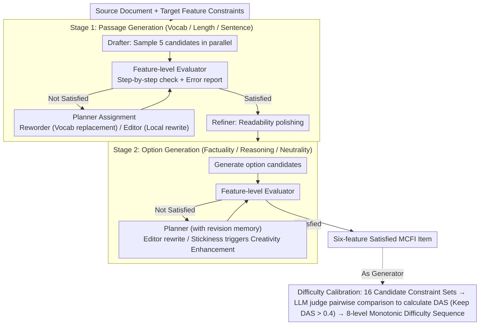

# A Multi-Agent Framework for Feature-Constrained Difficulty Control in Reading Comprehension Item Generation

**Conference**: ACL2026  
**arXiv**: [2605.19316](https://arxiv.org/abs/2605.19316)  
**Code**: https://github.com/SeonjeongHwang/mafig  
**Area**: LLM Agent / Educational Assessment / Controllable Generation  
**Keywords**: Multi-agent generation, Reading comprehension item generation, Difficulty control, Constraint satisfaction, LLM evaluator

## TL;DR
This paper proposes MAFIG, a framework that leverages multi-agent collaboration, feature-level evaluators, and iterative revision to generate multiple-choice reading comprehension questions. Compared to single-turn prompting, it significantly improves the satisfaction rate of constraints such as vocabulary, passage length, sentence length, reasoning complexity, factuality, and option neutrality, while providing a more stable monotonic increase in difficulty.

## Background & Motivation
**Background**: Reading comprehension items are core to language instruction, proficiency assessment, and computer-based testing systems. LLMs have demonstrated the ability to generate linguistically fluent and structurally complete items in a zero-shot manner. Existing controllable item generation follows two main paradigms: one relies on psychometric models like IRT, training generation models with calibrated difficulty based on learner response data; the other directly uses prompts to control Bloom's cognitive levels, vocabulary difficulty, length, or other interpretable features.

**Limitations of Prior Work**: IRT-based methods require large volumes of student response data, incurring high scaling costs across question types, languages, and exam scenarios. Prompting methods are lightweight, but a single LLM typically struggles to satisfy multiple constraints simultaneously in a single generation. For instance, an item might meet length requirements but use vocabulary exceeding the specified CEFR level; options might be factually correct but exhibit entailment or contradiction relationships, leading to unstable quality and difficulty control.

**Key Challenge**: Fine-grained difficulty control is fundamentally more complex than simply "telling the model to generate a Level 5 item." It requires the item to fall into target intervals across multiple interpretable features simultaneously. Abstract difficulty levels rely on internal model heuristics and lack verifiable constraints. Multidimensional feature constraints require the participation of external word lists, rules, and semantic judgment, which is difficult to achieve reliably in a single turn.

**Goal**: The authors aim to solve two sub-problems. First, how to generate multiple-choice reading comprehension items that strictly satisfy multidimensional feature constraints. Second, how to organize these feature constraints into a sequence with incrementally increasing difficulty, ensuring perceptible difficulty gaps between adjacent levels.

**Key Insight**: This paper frames item generation as a constraint satisfaction problem rather than a one-shot text generation task. The core observation is that by decomposing "generation, measurement, diagnosis, and revision" into separate roles and allowing them to iterate around explicit feature feedback, the LLM does not need to hit all conditions at once. Instead, it can revise items iteratively, much like a human item-writing expert.

**Core Idea**: Replace single-turn prompting with a multi-agent closed-loop revision framework and substitute abstract difficulty labels with difficulty-calibrated sequences of feature constraints. This grounds reading comprehension difficulty control in specific, inspectable, and iteratively optimizable features.

## Method
MAFIG targets Multi-Choice Fact Information (MCFI) reading comprehension questions: given a source document and feature constraints corresponding to a target difficulty, the system generates a reading passage, a question stem, and several options. The stem typically follows formats like "According to the passage, which statement is true?". Generation is split into two stages: first, generating a passage that satisfies passage-level constraints; then, generating options based on the passage that satisfy option-level constraints. Each stage is not a one-shot process but executes a closed loop of "candidate generation → constraint evaluation → revision planning → local rewriting → re-evaluation" until all constraints are met or the maximum number of rounds is reached.

The paper uses six categories of feature variables. Four primarily control cognitive load: vocabulary level, passage length, average sentence length, and reasoning complexity. Two ensure item validity: factuality and option neutrality. Continuous features are discretized into categories (e.g., passage length: short/medium/long; average sentence length: short/medium/long; vocabulary: CEFR levels A, B, C). Reasoning complexity is subdivided into single-sentence literal match, single-sentence paraphrase, single-sentence inference, multi-sentence inference, and insufficient information. This approach ensures difficulty is no longer a black-box label but a set of target states checkable by evaluators.

### Overall Architecture
Input includes a source document and a set of feature constraints. Stage 1 (Passage Generation) generates the reading passage based on the source document, handling passage-level constraints like vocabulary, length, and sentence length. Stage 2 (Option Generation) constructs options based on the passage, handling option-level constraints like factuality, vocabulary, reasoning complexity, and option neutrality. Both stages use the same closed-loop mechanism: an Evaluator checks for constraint violations; a Planner determines the next revision step based on error reports and revision memory; a Reworder or Editor performs local revisions; finally, a Refiner applies readability polishing.

In implementation, all MAFIG agents use Qwen3-32B in non-reasoning mode with top-p=0.8, top-k=20, and temperature=0.7. The initial draft samples 5 candidates in parallel. Passage generation allows up to 20 revision rounds, and option generation allows up to 100 rounds. If no candidate fully satisfies constraints within the limit, a random candidate from the final pool is returned.

### Key Designs
**1. Feature-level Evaluator and Error Reporting: Decomposing difficulty into measurable features with actionable diagnostic signals**

Difficulty control failure often stems from the model not knowing which constraint it failed to meet, rather than an inability to write. MAFIG decouples "evaluation" from the generation model: surface features use rules or tools (e.g., NLTK for length, CEFR word lists for vocabulary, where the highest word level determines the passage level); semantic features like reasoning complexity, factuality, and neutrality use an LLM judge with CoT and self-consistency (Macro F1 for reasoning sub-dimensions like Evidence Scope and Transformation Level reached 69.0 and 70.8 respectively). The Evaluator outputs feature-specific error reports rather than a single score, enabling "targeted editing" instead of blind rewriting.

**2. Planner + Reworder/Editor Task Decomposition: Assigning heterogeneous constraints to different roles**

Vocabulary constraints rely on external standards, while reasoning and neutrality require semantic editing. MAFIG divides labor by constraint type: the Planner formulates strategies based on the current state, error reports, and revision memory to avoid repetitive ineffective changes; the Reworder handles vocabulary using a RAG-like process—proposing context-appropriate alternatives and checking them against word lists; the Editor handles non-vocabulary constraints. To avoid noise, the Editor does not report a self-evaluation back to the Planner. If a constraint stays stuck for several rounds, "Creativity Enhancement Prompting" pushes the Planner from minor edits to aggressive strategies, such as deleting and regenerating segments.

**3. Difficulty-Calibrated Feature Constraint Sequence: Filtering candidates for true monotonicity**

Satisfying features like "higher CEFR level" or "longer sentences" does not automatically guarantee higher perceived difficulty. The authors utilize a two-step process: first, construct 16 candidate constraint sets based on educational theory and generate items for each; then, use an LLM judge for pairwise difficulty comparisons of adjacent levels to calculate the Difficulty Alignment Score:

$$DAS(Q_i,Q_j)=\frac{\sum_{n=1}^{N}x_f^{(n)}+\sum_{n=1}^{N}(-x_r^{(n)})}{2N}$$

where $N=4$ samples are taken for both forward and reverse orders to mitigate position bias. Only adjacent pairs with $DAS > \rho = 0.4$ are retained, resulting in an 8-level monotonic sequence. This empirical validation avoids systems that are theoretically increasing but practically indistinguishable.

### Loss & Training
This work proposes an inference-time multi-agent framework rather than training a new model; thus, it lacks a traditional supervised loss function. The optimization goal is embedded in the constraint satisfaction loop: the system maximizes the probability of simultaneously meeting all target features per round, measured by Success Ratio (SR) and Achievement Ratio (AR). The difficulty sequence construction employs LLM judge pairwise comparisons with a threshold of $\rho=0.4$ to identify stable difficulty distinctions.

Three key strategies are used: First, the initial Drafter generates 5 candidates in parallel to explore different revision paths. Second, phase-separated generation prevents search space explosion. Third, the Planner maintains revision memory and triggers creative rewriting for persistent failures to avoid circular superficial edits.

## Key Experimental Results

### Main Results
The experiment used 40 source documents from the NLTK Brown Corpus across 10 categories (news, fiction, sci-fi, etc.), resulting in 320 items (40 docs × 8 difficulty levels). Baselines included Level-based control (Direct/Incremental Prompting) and Feature-based Direct Prompting using Qwen3-32B and GPT-5.

| Control Granularity | Method | SR(%) | AR(%) | DAS | Validity | Coherence | Fluency |
|--------------|------|-------|-------|-----|----------|-----------|---------|
| Level-based | Direct Qwen3-32B | - | - | 0.1037 | 2.6371 | 0.9355 | 0.9280 |
| Level-based | Direct GPT-5 | - | - | 0.2949 | 2.9816 | 0.9332 | 0.9408 |
| Level-based | Incremental Qwen3-32B | - | - | 0.1804 | 2.5605 | 0.9332 | 0.9408 |
| Level-based | Incremental GPT-5 | - | - | 0.2750 | 2.9637 | 0.9348 | 0.9309 |
| Feature-based | Direct Qwen3-32B | 0.00 | 59.10 | 0.2759 | 2.6094 | 0.9368 | 0.9393 |
| Feature-based | Direct GPT-5 | 2.50 | 77.81 | 0.4952 | 2.9105 | 0.9094 | 0.9241 |
| Feature-based | MAFIG Qwen3-32B | 92.29 | 99.32 | 0.5226 | 2.9242 | 0.9518 | 0.9429 |

Key conclusion: Single-turn feature prompting is not entirely ineffective but fails to satisfy all constraints simultaneously. Direct Qwen3-32B achieved an AR of 59.10% but an SR of 0.00% (zero items fully satisfied). MAFIG reached an SR of 92.29% and AR of 99.32%, proving that iterative revision converts "partial instruction following" into "complete constraint satisfaction."

For difficulty calibration, Level-based methods showed low DAS (0.1037–0.2949). Feature-based Direct Qwen3-32B reached a DAS of 0.2759 despite a low AR, suggesting explicit features are more helpful for difficulty stability than abstract labels. MAFIG achieved the highest DAS (0.5226).

### Ablation Study
Ablations show that Planner Instructions, Reworder Messages, and Creativity Enhancement Prompting are critical. While passage generation (surface-level features) is less affected, option generation relies heavily on these mechanisms; removing them significantly slows convergence or leads to failure in reasoning complexity and neutrality constraints.

| Analysis Item | Key Observation | Insight |
|--------|----------|------|
| Single-turn Sampling | Increasing samples from 1 to 5/10 improves SR/AR, but gains diminish | Random sampling helps but cannot replace explicit revision mechanisms |
| Parallel Revision n=5 | All backbone models eventually reached 100% satisfaction; Passages usually converge in 5 rounds | Path diversity is more effective than repeated single-draft revision |
| Option Bottleneck | At n=1, SR for option generation rarely exceeds 60% within 100 rounds | Reasoning complexity and neutrality are much harder to control |
| Computation Cost | Passage stage: ~10 rounds, 20K tokens for 90% SR; Option stage: ~100 rounds, >130K tokens for 90% SR | High-reliability control comes at the cost of latency and token usage |

### Key Findings
- **Constraint Satisfaction**: MAFIG (SR 92.29%) drastically outperforms Direct GPT-5 (SR 2.50%), proving that even powerful models need iterative loops for multidimensional constraints.
- **Features over Labels**: Explicit feature constraints are more reliable than abstract difficulty levels. Feature-based GPT-5 Direct (DAS 0.4952) far exceeds Level-based GPT-5 (DAS 0.2949).
- **Human Eval**: MAFIG achieved a Human DAS of 0.6190 and Correct Alignment Rate (CAR) of 76.19%, significantly higher than GPT-5 baselines, confirming human-perceptible difficulty gradations.
- **Bottlenecks**: The primary bottleneck is the option stage, especially neutrality and reasoning complexity. Highly coherent passages sometimes make it difficult to construct neutral yet plausible distractors.
- **Cost**: Reliability requires resources; option generation is significantly more expensive than passage generation in terms of rounds and tokens.

## Highlights & Insights
- Grounding difficulty control in "evaluable features" rather than "difficulty levels" makes target states explicit and failures diagnostic.
- Multi-agent decomposition is functionally driven: external word lists (Reworder), semantic judgment (Editor/Evaluator), and strategy (Planner) each address distinct constraint types.
- The difficulty calibration process avoids the assumption that "theoretically harder = practically harder" by using empirical pairwise filtering.
- Strong reasoning in LLMs does not equate to strong constraint satisfaction. GPT-5 has high AR but very low SR in single-turn mode.
- Parallel drafting (n=5) is a powerful pattern; providing multiple starting points for revision paths is more robust than a single, deep search.

## Limitations & Future Work
- **Item Types**: Currently limited to MCFI (Fact Information). Different types like Main Idea or Inference require redefining features and perhaps passage-option structures.
- **Learner Validation**: Difficulty is validated by experts and LLM judges, but lacks absolute calibration via student error rates or IRT parameters.
- **Cost**: The high token cost of the option generation stage may limit real-time applications, favoring offline or high-stakes scenarios.
- **Evaluator Bias**: The system optimizes for the Evaluator’s signal; if the LLM judge is biased about "neutrality," the system will follow that bias.
- **Topic Control**: Certain topics are inherently more difficult; future work could integrate topic abstractness as an explicit constraint.

## Related Work & Insights
- **vs. IRT Methods**: IRT is psychometrically rigorous but data-hungry. MAFIG is lightweight and interpretable, though it lacks the absolute response-based calibration of IRT.
- **vs. Bloom's Taxonomy**: Bloom-level prompting is often too coarse for high-stakes exams. MAFIG's fine-grained load factors (sentence length, vocab) allow for more precise tuning.
- **vs. Direct Prompting**: Direct prompting lacks the "diagnosis-revision" loop. MAFIG's advantage is turning "mostly following instructions" into "guaranteed satisfaction" through iterative improvement.

## Rating
- Novelty: ⭐⭐⭐⭐☆
- Experimental Thoroughness: ⭐⭐⭐⭐☆
- Writing Quality: ⭐⭐⭐⭐☆
- Value: ⭐⭐⭐⭐☆

<!-- RELATED:START -->

## Related Papers

- [\[ACL 2026\] Memory-Augmented LLM-based Multi-Agent System for Automated Feature Generation on Tabular Data](memory-augmented_llm-based_multi-agent_system_for_automated_feature_generation_o.md)
- [\[ACL 2026\] PosterForest: Hierarchical Multi-Agent Collaboration for Scientific Poster Generation](posterforest_hierarchical_multi-agent_collaboration_for_scientific_poster_genera.md)
- [\[ICLR 2026\] Breaking and Fixing Defenses Against Control Flow Hijacking in Multi-Agent Systems](../../ICLR2026/multi_agent/breaking_and_fixing_defenses_against_control_flow_hijacking_in_multi-agent_syste.md)
- [\[ICML 2026\] Voting Protocols as Coordination Mechanisms for Role-Constrained Multi-Agent Tutoring Systems](../../ICML2026/multi_agent/voting_protocols_as_coordination_mechanisms_for_role-constrained_multi-agent_tut.md)
- [\[AAAI 2026\] FinRpt: Dataset, Evaluation System and LLM-based Multi-agent Framework for Equity Research Report Generation](../../AAAI2026/multi_agent/finrpt_dataset_evaluation_system_and_llm-based_multi-agent_framework_for_equity_.md)

<!-- RELATED:END -->
