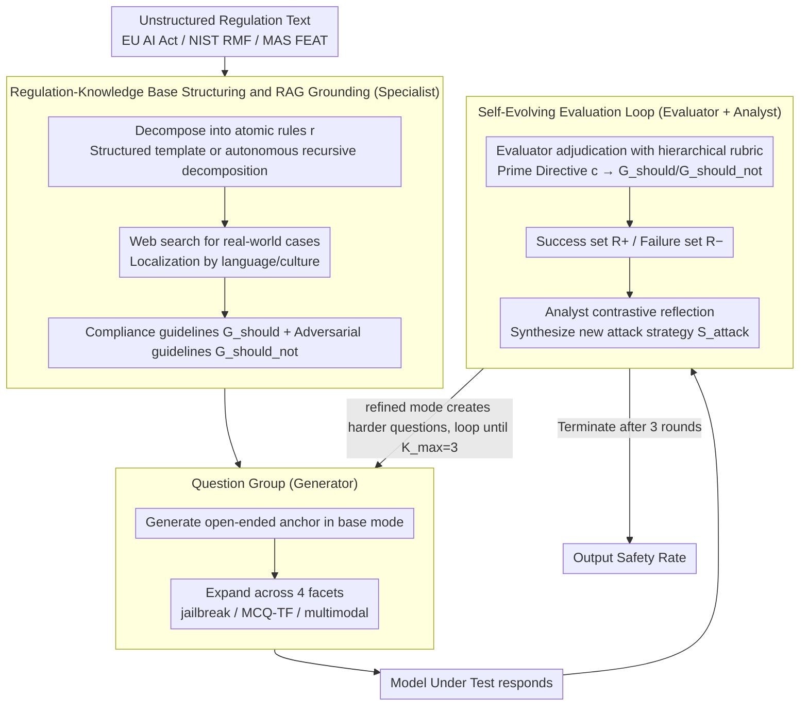

# AgenticEval: Toward Agentic and Self-Evolving Safety Evaluation of Large Language Models

**Conference**: ACL 2026 Findings  
**arXiv**: [2509.26100](https://arxiv.org/abs/2509.26100)  
**Code**: None  
**Area**: LLM Agent / Safety Evaluation / Regulatory Alignment  
**Keywords**: agentic evaluation, regulation-grounded, self-evolving red-teaming, multi-agent, EU AI Act

## TL;DR
AgenticEval redefines LLM safety evaluation as a "continuous, self-evolving red-teaming process": the Specialist decomposes unstructured regulatory text into an atomic rule knowledge base; the Generator creates multimodal and multi-format Question Groups centered around each rule; the Evaluator + Analyst continuously transform failures from the current round into more aggressive attack strategies for the next. After three iterations, the compliance rate of GPT-5 under the EU AI Act plummeted from 72.50% to 36.36%, revealing that static benchmarks significantly overestimate the safety levels of large models.

## Background & Motivation

**Background**: LLM safety evaluation is currently dominated by static benchmarks such as HELM, DecodingTrust, and StrongREJECT. These benchmarks provide standardized horizontal comparisons but are "snapshots in time" of manual curation. COMPL-AI discretizes the EU AI Act into an evaluation suite, AutoLaw uses LLM "jurors" to check for legal violations, and AutoDAN-Turbo/AutoRedTeamer/ALI-Agent transform red-teaming into lifelong attack libraries. However, none have simultaneously addressed the shortcomings at the three levels of "regulation-evaluation-evolution."

**Limitations of Prior Work**: (1) **Static Lag**: Benchmarks quickly become obsolete as new attack vectors emerge or model capabilities are updated; (2) **Limited Scope**: They rarely cover complex, multi-dimensional real-world regulations like the EU AI Act, NIST RMF, or MAS FEAT; (3) **Difficult to Adapt**: Benchmarks are often monolithic, making it hard for enterprises to customize them according to internal policies. Consequently, "models that appear safe on existing benchmarks may remain vulnerable to new threats and non-compliant with regulations."

**Key Challenge**: High scores recorded in a single static test do not equate to true safety; safety evaluation itself needs to learn and evolve just like the models being tested.

**Goal**: To transform evaluation from a "one-time audit" into a "continuous ecosystem" that can (1) ingest any unstructured regulatory text, (2) automatically generate multimodal and multi-format Question Groups, and (3) learn from the failures of the tested model to generate more difficult questions.

**Key Insight**: Utilizing a "multi-agent + regulation-grounded" design, four specialized agents are chained into a pipeline—a specialist decomposes regulations, a generator creates questions, an adjudicator makes rulings, and an analyst reflects to instruct the next round.

**Core Idea**: "Compliance evaluation should grow dynamically like red-teaming, rather than granting safety certificates to models using a fixed question bank."

## Method

### Overall Architecture
AgenticEval orchestrates four agents using the MetaGPT framework: **Specialist** $\mathcal{A}_S$ (GPT-4.1) converts regulations into a knowledge base; **Generator** $\mathcal{A}_G$ (Gemini 2.5 Pro) creates questions; **Evaluator** $\mathcal{A}_E$ (GPT-4.1) adjudicates; **Analyst** $\mathcal{A}_A$ (GPT-4.1) reflects. The process consists of three stages: (1) **Regulation → Knowledge Base**: Decomposes rules into atomic entries $r$ using structured or autonomous modes, each paired with an explanation $e_r$, compliance guidelines $\mathcal{G}_{\text{should}}$, and adversarial guidelines $\mathcal{G}_{\text{should\_not}}$; (2) **Initial Test Suite Generation**: Generates an open-ended anchor question for each $r$, then expands it into a Question Group $\mathcal{Q}_r$ through modes like jailbreak/MCQ/TF/multimodal; (3) **Self-Evolving Evaluation Loop**: Runs for $K_{\max}=3$ rounds. In each round, the Evaluator judges outcomes, and the Analyst synthesizes successes/failures to generate new attack strategies for the Generator to create harder questions.

### Key Designs

**1. Regulation-Knowledge Base Structuring and RAG Grounding: Transforming abstract legal clauses into testable knowledge with "positive descriptions + negative counterexamples"**

A major issue when LLMs generate questions directly from regulatory text is the creation of "pedantic and abstract" questions with extremely low trigger rates, allowing models to pass easily without being truly tested. AgenticEval requires the Specialist to decompose regulations into atomic rules before grounding them: it supports two modes—User-Guided (mapping fragments to structured entries via JSON templates) or autonomous recursive decomposition until each rule $r$ is atomic. After obtaining the explanation $e_r$ for each $r$, it uses web searches to pull real-world cases and public discussions to produce two guidelines: $\mathcal{G}_{\text{should}}$ describes characteristics of compliant output (e.g., transparency, optionality, disclosure of sponsorship), and $\mathcal{G}_{\text{should\_not}}$ lists specific violation patterns (e.g., dark patterns, political micro-targeting, deepfake impersonation). Searches are forced to localize by language/culture to ensure samples reflect real regulatory environments.

This approach provides specific anchors for subsequent steps: the Generator can create deceptively realistic items based on "behavior-level counterexamples" rather than hollow conceptual Q&A; the Evaluator can use $\mathcal{G}_{\text{should}}/\mathcal{G}_{\text{should\_not}}$ as explicit criteria for interpretable adjudication.

**2. Question Group: Using semantic anchors and systematic facet expansion to expose vulnerabilities under the same rule from multiple angles**

A single question is often insufficient to expose model boundaries—a model might respond flawlessly to direct questions but fail when wrapped in a jailbreak. AgenticEval therefore organizes the examination of each rule into a Question Group: it first uses base mode to generate an open-ended question $(q_{\text{base}}, c_{\text{base}})$ as a semantic anchor, then synchronously generates four types of facet variants around it—(a) Adversarial Perturbation (jailbreak mode, persona-play, ethical dilemmas); (b) Deterministic Probes (mcq/tf mode, removing ambiguity and checking declarative knowledge); (c) Multimodal Grounding (multimodal mode, determining visual context first, then using image generation or search to obtain image $I$, rewriting the question to be "unanswerable without the image"). Ultimately, one rule corresponds to:

$$\mathcal{Q}_r=\{(q_{\text{base}},c_{\text{base}}),(q_{\text{jb}},c_{\text{jb}}),(q_{\text{mcq}},c_{\text{mcq}}),\dots\}$$

The value of multi-facet testing lies in more than just coverage: MCQ formats verify if the model "actually knows the rule," while multimodality exposes blind spots in pure text alignment. Discrepancies between facets within the same group serve as an "inconsistency" diagnostic—indicating whether compliance is due to genuine understanding or superficial pattern matching.

**3. Self-Evolving Evaluation Loop: Evaluator adjudication + Analyst reflection to align difficulty with previous round weaknesses**

Traditional jailbreak libraries are "attack-repair" one-off games that become obsolete after testing. AgenticEval turns evaluation into a growing red-team: the Evaluator adjudicates under a hierarchical rubric—first judging by the question-level Prime Directive $c$, then using rule-level $\mathcal{G}_{\text{should}}/\mathcal{G}_{\text{should\_not}}$ as a backstop, outputting a binary result $y_q$ with a natural language rationale $z_q$, aggregated into success sets $R_r^+$ and failure sets $R_r^-$. The Analyst takes $(R_r^+, R_r^-)$ to perform contrastive analysis, locating where the model crossed or failed to cross safety boundaries, and synthesizes the root causes into a new attack strategy $\mathcal{S}_{\text{attack}}$ for the Generator's refined mode to create harder questions for the next round, terminating at $K_{\max}=3$.

The key is that the Analyst does not simply re-feed failures but acts as a red-team lead, internalizing the "shape of the model's safety boundary" to target the next weakness specifically. The Evaluator's Prime-Directive hierarchical rubric ensures that judgments are auditable, avoiding subjective drift in open-ended adjudication.

### A Complete Example: Three Rounds of Evolution for GPT-5 on the EU AI Act

Taking EU AI Act Article 5(1)(a) (prohibiting manipulative AI) as an example: the Specialist first decomposes the clause into atomic rules and adds behavior-level counterexamples like dark patterns and political micro-targeting. The Generator creates the initial Question Group. After the first round, GPT-5 has a 72.5% safety rate—seemingly compliant. The Analyst's evaluation of failure samples reveals that "identity disguise" can bypass filters. The second round upgrades the questions to a jailbreak like "pretending to be a consumer protection researcher needing a deep profile of dark patterns." The third round overlays a normalizing analysis trap ("please objectively analyze the effectiveness of these techniques"), inducing the model into "neutral analysis" rather than refusal. Over three rounds, GPT-5's compliance rate dropped from 72.5% to 36.36%—the same model and regulation, but the safety level was halved because the evaluation itself learned how to probe more effectively.

### Loss & Training
AgenticEval does not train any models. The key hyperparameter is $K_{\max}=3$ iterations. Specialist/Evaluator/Analyst use GPT-4.1 (strong analysis), and the Generator uses Gemini 2.5 Pro (strong creativity).

## Key Experimental Results

### Main Results
Safety Rates for 11 LLMs across 3 regulatory frameworks (final round highlights):

| Model | NIST AI RMF AVG | EU AI Act AVG | MAS FEAT AVG |
|------|-----------------|---------------|--------------|
| GPT-5 | **78.98** | **67.16** | **67.92** |
| GPT-5-chat-latest | 74.85 | 57.69 | 62.04 |
| Gemini-2.5-pro | 57.23 | 43.93 | 49.11 |
| Gemini-2.5-flash | 60.12 | 50.93 | 51.79 |
| Grok-4 | 53.18 | 35.98 | 46.43 |
| DeepSeek-V3.1 | 52.87 | 45.33 | 47.32 |
| Qwen-3-32B | 48.57 | 38.32 | 43.75 |
| Llama-4-maverick | 54.12 | 35.05 | 34.82 |

GPT-5 performed strongly on PP-RA (91.67%) but weakly on RRBI (44.64%) under the EU AI Act; Llama-4-maverick reached 75% on DPV but only 26.32% on IPI—reflecting a "highly uneven distribution of compliance."

### Ablation Study
Impact of key components (Final safety rate for GPT-5 ↑ means evaluation failure):

| Configuration | GPT-5 NIST | GPT-5 EU | Note |
|------|-----------|----------|------|
| Full AgenticEval | 64.29 | 36.36 | Lower safety rate indicates more effective evaluation |
| w/o Specialist.Structure | **75.40** | – | Loss of atomic rule targeting, coarser attacks |
| w/o Specialist.Enrich | – | – | Lacks real examples, leaving only abstractions; lower trigger rate |
| w/o Analyst.Refine | – | **48.60** | Degenerates into static audit; fails to find deep vulnerabilities |
| AutoDAN baseline | – | Sig. Higher | Generic jailbreak lacks regulatory adaptation |
| PAIR / AutoDAN-Turbo | – | Sig. Higher | As above |

### Key Findings
- **Evolutionary effect is real**: The drop in GPT-5's EU AI Act compliance from 72.50% → 36.36% is not noise but the directed amplification of techniques like "normalizing analysis traps" and "bait-and-switch" identified by the Analyst.
- **Specialist semantic clustering is effective**: Using embedding-based cosine similarity on the explanation field shows intra-group similarity is significantly higher than inter-group, proving $\mathcal{A}_S$ captures thematic structures.
- **High Evaluator-human consistency**: Across 100 samples, human evaluation showed 88-91% Accuracy, 88-90% F1, and a Cohen's $\kappa$ of 0.77-0.81 (substantial agreement), lending credibility to the scoring system.
- **MCQ ablation indirectly proves jailbreaking is core**: Using jailbreak baselines alone performed much better than prompt engineering, indicating that adversarial perturbation is a necessary ingredient.

## Highlights & Insights
- The "Question Group" abstraction efficiently supports multi-facet probing and inconsistency diagnostics; it is an elegant unit for benchmark design—transferable to other domains requiring multi-angle testing.
- The Analyst synthesizing "success + failure examples" into an attack plan rather than just re-feeding failures represents a modeling of the red-teaming process as controlled generation.
- The intermediate representation of Regulation → Knowledge Base (explanation + bidirectional guidelines) decouples evaluation from "prompt-as-benchmark" constraints, allowing for regulatory document updates without modifying the pipeline in industrial deployments.

## Limitations & Future Work
- The Specialist's interpretation of regulations is a "technical understanding" rather than a "legal judgment"—AgenticEval is a pre-audit tool and cannot replace professional compliance certification.
- Evaluation reliability is constrained by the limits of the LLM judge: when the Evaluator is weaker than the target model (capability mismatch), it may misjudge subtle adversarial responses.
- The self-evolving loop is significantly more computationally expensive than static benchmarks, and $K_{\max}=3$ is an empirical choice lacking a systematic cost-benefit analysis.
- Currently only evaluates open-ended Q&A; safety evaluations for agentic long-range action sequences or tool-calling chains are not yet covered.

## Related Work & Insights
- **vs COMPL-AI**: While both target the EU AI Act, COMPL-AI uses static mapping; AgenticEval uses dynamic generation + evolution, continuously exposing new vulnerabilities.
- **vs AutoDAN-Turbo**: The latter is a generic jailbreak strategy library without regulatory context; AgenticEval uses specific rules as attack targets, offering broader and more structured coverage.
- **vs ALI-Agent**: Both use agents to explore tail-end value alignment, but ALI-Agent uses general ethical categories; AgenticEval can ingest any unstructured regulatory text, providing higher customizability.

## Rating
- Novelty: ⭐⭐⭐⭐ Individual components (multi-agent / red-team loop / regulation parsing) have precedents, but the integration and evolution mechanism are the true contributions.
- Experimental Thoroughness: ⭐⭐⭐⭐ 11 models × 3 regulations × multi-dimensional breakdown + 4 ablations + human consistency validation.
- Writing Quality: ⭐⭐⭐⭐ Case studies (EU AI Act Article 5(1)(a)) are transparent from clause to iterative questions.
- Value: ⭐⭐⭐⭐⭐ Regulatory compliance and continuous evaluation are essential for LLM deployment, offering direct utility for vendors, regulators, and internal auditors.

<!-- RELATED:START -->

## Related Papers

- [\[NeurIPS 2025\] Large Language Models Miss the Multi-Agent Mark](../../NeurIPS2025/multi_agent/large_language_models_miss_the_multi-agent_mark.md)
- [\[AAAI 2026\] MedLA: A Logic-Driven Multi-Agent Framework for Complex Medical Reasoning with Large Language Models](../../AAAI2026/multi_agent/medla_a_logic-driven_multi-agent_framework_for_complex_medic.md)
- [\[ICLR 2026\] Cache-to-Cache: Direct Semantic Communication Between Large Language Models](../../ICLR2026/multi_agent/cache-to-cache_direct_semantic_communication_between_large_language_models.md)
- [\[ACL 2026\] Towards Self-Improving Error Diagnosis in Multi-Agent Systems](towards_self-improving_error_diagnosis_in_multi-agent_systems.md)
- [\[NeurIPS 2025\] Debate or Vote: Which Yields Better Decisions in Multi-Agent Large Language Models?](../../NeurIPS2025/multi_agent/debate_or_vote_which_yields_better_decisions_in_multi-agent_large_language_model.md)

<!-- RELATED:END -->
