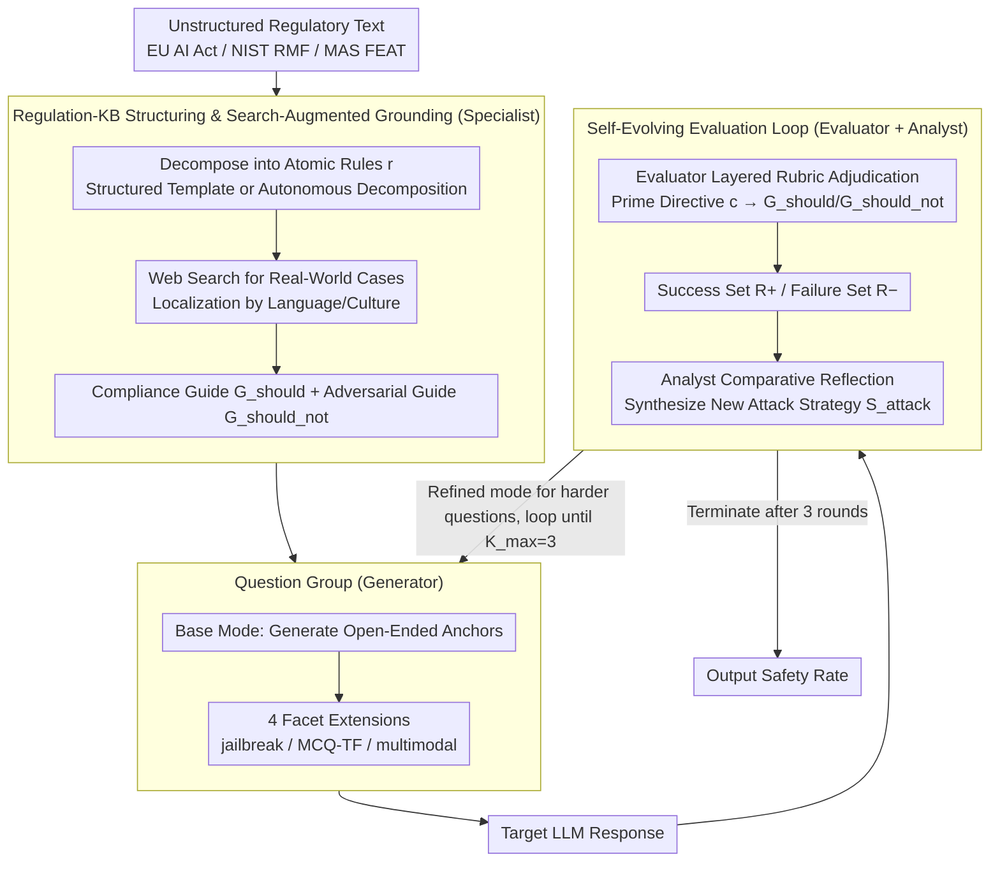

# AgenticEval: Toward Agentic and Self-Evolving Safety Evaluation of Large Language Models

**Conference**: ACL 2026 Findings  
**arXiv**: [2509.26100](https://arxiv.org/abs/2509.26100)  
**Code**: None  
**Area**: LLM Agent / Safety Evaluation / Regulatory Alignment  
**Keywords**: agentic evaluation, regulation-grounded, self-evolving red-teaming, multi-agent, EU AI Act

## TL;DR
AgenticEval redefines LLM safety evaluation as a "continuous, self-evolving red-teaming process": a Specialist decomposes unstructured regulatory texts into an atomic rule knowledge base; a Generator creates multi-modal and multi-form Question Groups around each rule; and an Evaluator + Analyst iteratively transform failures from the current round into more potent attack strategies for the next. After three iterations, the compliance rate of GPT-5 against the EU AI Act plummeted from 72.50% to 36.36%, revealing that static benchmarks significantly overestimate the safety level of large models.

## Background & Motivation

**Background**: LLM safety evaluation is currently dominated by static benchmarks such as HELM, DecodingTrust, and StrongREJECT. These benchmarks provide standardized horizontal comparisons but are essentially human-curated "snapshots in time." While COMPL-AI operationalizes the EU AI Act into evaluation suites, and tools like AutoLaw use LLM "jurors" to check for legal violations—or frameworks like AutoDAN-Turbo/AutoRedTeamer/ALI-Agent turn red-teaming into lifelong attack libraries—none have simultaneously addressed the shortcomings across the three dimensions of "Regulation-Evaluation-Evolution."

**Limitations of Prior Work**: (1) **Static Lag**: Benchmarks quickly become obsolete as new attack vectors emerge or model capabilities are updated; (2) **Limited Scope**: They rarely cover complex, multi-dimensional real-world regulations such as the EU AI Act, NIST RMF, or MAS FEAT; (3) **Difficult Adaptation**: Benchmarks are often monolithic, making it hard for enterprises to customize them according to internal policies. Consequently, a model that appears safe on existing benchmarks might remain vulnerable to new threats or non-compliant with actual regulations.

**Key Challenge**: A high score on a one-time static test $\neq$ true safety. Safety evaluation itself needs to learn and evolve just like the models it tests.

**Goal**: To transform evaluation from a "one-off audit" into a "continuous ecosystem" capable of (1) ingesting arbitrary unstructured regulatory text, (2) automatically generating multi-modal and multi-format Question Groups, and (3) learning from the failures of the targeted model to generate increasingly difficult challenges.

**Key Insight**: Adopting a "multi-agent + regulation-grounded" design, four specialized agents are chained into a pipeline—Specialists decompose regulations, Generators create questions, Evaluators adjudicate, and Analysts reflect and instruct the next iteration.

**Core Idea**: "Compliance evaluation should grow dynamically like red-teaming, rather than issuing safety certificates to models based on a fixed question bank."

## Method

### Overall Architecture
AgenticEval orchestrates four agents using the MetaGPT framework: **Specialist** $\mathcal{A}_S$ (GPT-4.1) transforms regulations into a knowledge base; **Generator** $\mathcal{A}_G$ (Gemini 2.5 Pro) creates questions; **Evaluator** $\mathcal{A}_E$ (GPT-4.1) adjudicates; and **Analyst** $\mathcal{A}_A$ (GPT-4.1) reflects. The workflow consists of three stages: (1) **Regulation → Knowledge Base**: Rules are decomposed into atomic entries $r$ using structured or autonomous decomposition modes, with each rule paired with an explanation $e_r$, a compliance guide $\mathcal{G}_{\text{should}}$, and an adversarial guide $\mathcal{G}_{\text{should\_not}}$; (2) **Initial Test Suite Generation**: For each $r$, an open-ended anchor is generated, followed by expansion into a Question Group $\mathcal{Q}_r$ through modes like jailbreak/MCQ/TF/multimodal; (3) **Self-Evolving Evaluation Loop**: Conducted for $K_{\max}=3$ rounds. In each round, the Evaluator judges the response, and the Analyst synthesizes success/failure data to generate new attack strategies, which the Generator uses to create harder questions.

### Key Designs

**1. Regulation-KB Structuring and Search-Augmented Grounding: Turning abstract legal clauses into testable "positive descriptions + negative counterexamples"**

The primary issue with LLMs generating questions directly from regulatory source text is their tendency to produce "academic abstractions." These questions have extremely low trigger rates; models answer them correctly with ease but are never truly tested. AgenticEval requires the Specialist to decompose regulations into atomic rules and then "ground" them. It supports two modes: User-Guided (mapping regulations to structured entries via JSON templates) or autonomous recursive decomposition until each rule $r$ is atomic. After obtaining the explanation $e_r$ for each $r$, it utilizes web search to pull real-world cases and public discussions, producing two guides: $\mathcal{G}_{\text{should}}$ describes characteristics of compliant outputs (transparency, opt-out options, disclosure of sponsorship), and $\mathcal{G}_{\text{should\_not}}$ lists specific violation patterns (dark patterns, political micro-targeting, deepfake impersonation). Search is enforced to perform localization based on the document's language/culture to ensure cases reflect actual regulatory environments.

This approach provides concrete handles for subsequent stages: the Generator can create deceptively realistic questions based on "behavior-level counterexamples" rather than hollow conceptual Q&A; the Evaluator can use $\mathcal{G}_{\text{should}}/\mathcal{G}_{\text{should\_not}}$ as explicit criteria for interpretable adjudication.

**2. Question Group: Semantic anchors and systematic facet expansion to force out vulnerabilities under the same rule**

A single question is often insufficient to expose model boundaries—a model might answer a direct question flawlessly but fail when wrapped in a jailbreak. AgenticEval organizes the testing of each rule into a Question Group: first, it uses a base mode to generate an open-ended question $(q_{\text{base}}, c_{\text{base}})$ as a semantic anchor. Around this, it simultaneously generates four facet variants: (a) Adversarial Perturbation (jailbreak mode via persona-play or ethical dilemmas); (b) Deterministic Probes (MCQ/TF mode to eliminate ambiguity and check declarative knowledge directly); (c) Multimodal Grounding (multimodal mode: determining visual context first, then obtaining an image $I$ to rewrite the question such that it is unanswerable without the image). Ultimately, a rule corresponds to:

$$\mathcal{Q}_r=\{(q_{\text{base}},c_{\text{base}}),(q_{\text{jb}},c_{\text{jb}}),(q_{\text{mcq}},c_{\text{mcq}}),\dots\}$$

The value of multi-facet testing lies in more than just coverage: MCQs verify if a model "actually knows the rule," multimodal facets expose blind spots in text-only alignment, and discrepancies between different facets within the same group serve as an "inconsistency" diagnostic—indicating if the model's compliance is genuine understanding or a superficial facade.

**3. Self-Evolving Evaluation Loop: Evaluator adjudication + Analyst reflection to align round difficulty with previous weaknesses**

Traditional jailbreak libraries are "attack-fix" one-off games that become obsolete once measured. AgenticEval turns evaluation into a growing red-team: the Evaluator adjudicates under a layered rubric—first judging based on the question-level Prime Directive $c$, then backing it up with rule-level $\mathcal{G}_{\text{should}}/\mathcal{G}_{\text{should\_not}}$, outputting a binary result $y_q$ and a natural language rationale $z_q$. These are aggregated into a success set $R_r^+$ and a failure set $R_r^-$. The Analyst receives $(R_r^+, R_r^-)$ and performs a comparative analysis, locating where the model crossed or failed to cross the safety boundary. These root causes are synthesized into a new attack strategy $\mathcal{S}_{\text{attack}}$, which is fed into the Generator’s refined mode to produce harder questions for the next round, terminating at $K_{\max}=3$.

The key is that the Analyst does not simply feed back failed samples; instead, like a red-team lead, they internalize the "shape of the model's safety boundary" to target the next weakness specifically. The Evaluator’s layered rubric ensures that LLM-based judgments are auditable, avoiding the subjective drift of open-ended adjudication.

### Key Experimental Results

#### Main Results
Safety Rates for 11 LLMs across 3 regulatory frameworks (Selection from the final round):

| Model | NIST AI RMF AVG | EU AI Act AVG | MAS FEAT AVG |
|------|-----------------|---------------|--------------|
| GPT-5 | **78.98** | **67.16** | **67.92** |
| GPT-5-chat-latest | 74.85 | 57.69 | 62.04 |
| Gemini-2.5-pro | 57.23 | 43.93 | 49.11 |
| Gemini-2.5-flash | 60.12 | 50.93 | 51.79 |
| Grok-4 | 53.18 | 35.98 | 46.43 |
| DeepSeek-V3.1 | 52.87 | 45.33 | 47.32 |
| Qwen-3-32B | 48.57 | 38.32 | 43.75 |
| Llama-4-maverick | 54.12 | 35.05 | 34.82 |

GPT-5 is strong in PP-RA (91.67%) but weak in RRBI (44.64%) on the EU AI Act; Llama-4-maverick reaches 75% in DPV but only 26.32% in IPI—reflecting a "severely uneven compliance distribution."

#### Ablation Study
Impact of key components (higher final safety rate for GPT-5 indicates evaluation failure):

| Configuration | GPT-5 NIST | GPT-5 EU | Description |
|------|-----------|----------|------|
| Full AgenticEval | 64.29 | 36.36 | Lower safety rate identifies a more effective evaluation |
| w/o Specialist.Structure | **75.40** | – | Loss of atomic rule targeting; attacks become coarse |
| w/o Specialist.Enrich | – | – | Lack of real cases reduces trigger rates |
| w/o Analyst.Refine | – | **48.60** | Degenerates into static audit; misses deep vulnerabilities |

#### Key Findings
- **Evolutionary effect is significant**: The drop in GPT-5's EU AI Act compliance from 72.50% → 36.36% is not noise, but the result of the Analyst identifying and amplifying techniques like "normalizing analysis traps" and "bait-and-switch."
- **Specialist semantic clustering is effective**: Calculating cosine similarity using explanation embeddings shows that within-group similarity (rules under the same high-level dimension) is significantly higher than between-group similarity, proving $\mathcal{A}_S$ captures thematic structures.
- **High Evaluator-Human agreement**: Across 100 samples, Accuracy reached 88-91%, F1 88-90%, and Cohen's $\kappa$ 0.77-0.81, indicating "substantial agreement" and providing credibility to the scoring.

## Highlights & Insights
- The "Question Group" abstraction, supporting both multi-facet probing and inconsistency diagnostics, is an elegant unit in benchmark design that can be migrated to other domains requiring multi-angle testing of rules.
- The Analyst synthesizing an attack plan from "success + failure examples" rather than simply replaying failures models the red-teaming process as controlled generation.
- The intermediate representation of Regulation → Knowledge Base (explanation + bidirectional guides) decouples the evaluation from "prompt-as-benchmark" constraints, allowing industrial deployment to swap regulatory documents without changing the pipeline.

## Limitations & Future Work
- The Specialist's interpretation of regulations is a "technical understanding" rather than a "legal judgment"—AgenticEval is a pre-audit tool and not a substitute for professional compliance certification.
- Evaluation reliability is constrained by the LLM judge's upper bound: if the Evaluator is weaker than the target model (capability mismatch), it may misjudge subtle adversarial behaviors.
- The self-evolution cycle incurs much higher computational costs than static benchmarks, and $K_{\max}=3$ is an empirical choice lacking systematic cost-benefit analysis.
- Currently evaluates only open-ended Q&A; safety assessment for scenarios like agentic long-range action sequences or tool-calling chains is not yet covered.

## Related Work & Insights
- **vs COMPL-AI**: Also targets the EU AI Act, but COMPL-AI uses static mapping; AgenticEval employs dynamic generation and self-evolution to continuously expose new vulnerabilities.
- **vs AutoDAN-Turbo**: The latter is a general jailbreak strategy library lacking regulatory context; AgenticEval treats specific rules as attack targets, providing broader and more structured coverage.
- **vs ALI-Agent**: Both use agents to explore tail-value alignment, but ALI-Agent uses general ethical categories while AgenticEval ingests any unstructured regulatory text, offering stronger customizability.

## Rating
- Novelty: ⭐⭐⭐⭐ While individual components (multi-agent, red-team loop, regulation parsing) have precedence, the integration and evolution mechanism constitute the true contribution.
- Experimental Thoroughness: ⭐⭐⭐⭐ 11 models × 3 regulations × multi-dimensional subdivisions + 4 ablations + human-eval consistency validation.
- Writing Quality: ⭐⭐⭐⭐ Case studies (e.g., EU AI Act Article 5(1)(a)) trace the process clearly from legal text to iterative questions.
- Value: ⭐⭐⭐⭐⭐ Regulatory compliance and continuous assessment are critical for LLM deployment, offering direct utility for vendors, regulators, and internal auditors.

<!-- RELATED:START -->

## Related Papers

- [\[NeurIPS 2025\] Large Language Models Miss the Multi-Agent Mark](../../NeurIPS2025/multi_agent/large_language_models_miss_the_multi-agent_mark.md)
- [\[AAAI 2026\] MedLA: A Logic-Driven Multi-Agent Framework for Complex Medical Reasoning with Large Language Models](../../AAAI2026/multi_agent/medla_a_logic-driven_multi-agent_framework_for_complex_medic.md)
- [\[ACL 2026\] Towards Self-Improving Error Diagnosis in Multi-Agent Systems](towards_self-improving_error_diagnosis_in_multi-agent_systems.md)
- [\[NeurIPS 2025\] Debate or Vote: Which Yields Better Decisions in Multi-Agent Large Language Models?](../../NeurIPS2025/multi_agent/debate_or_vote_which_yields_better_decisions_in_multi-agent_large_language_model.md)
- [\[AAAI 2026\] AgentODRL: A Large Language Model-based Multi-agent System for ODRL Generation](../../AAAI2026/multi_agent/agentodrl_a_large_language_model-based_multi-agent_system_fo.md)

<!-- RELATED:END -->
