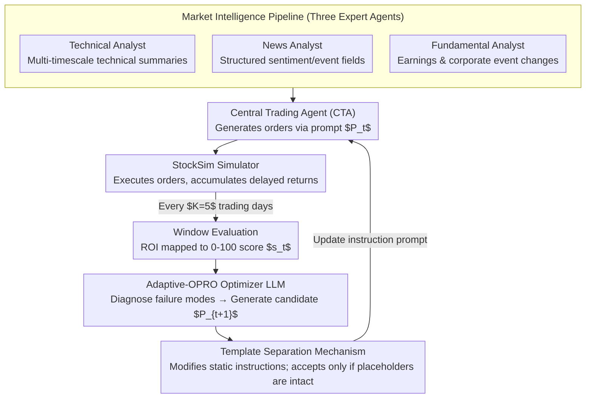

# ATLAS: Adaptive Trading with LLM AgentS Through Dynamic Prompt Optimization and Multi-Agent Coordination

**Conference**: ACL 2026  
**arXiv**: [2510.15949](https://arxiv.org/abs/2510.15949)  
**Code**: To be released  
**Area**: LLM Agent / Finance  
**Keywords**: LLM Trading Agent, Prompt Optimization, Multi-Agent Collaboration, Financial Decision Making, Adaptive Strategy

## TL;DR

This paper proposes the ATLAS multi-agent financial trading framework and the Adaptive-OPRO prompt optimization method. By utilizing specialized analyst agents to prepare heterogeneous market information and dynamically optimizing the instruction prompts of the central trading agent based on delayed noisy feedback, the system significantly outperforms baselines across diverse volatile market environments.

## Background & Motivation

**Background**: LLMs have demonstrated potential in financial decision-making for processing multi-source data and reasoning through complex scenarios, but translating this capability into reliable trading systems faces significant challenges.

**Limitations of Prior Work**: (1) Systematic integration of heterogeneous information sources (technical indicators, news, fundamentals) lacks a unified framework; (2) Static decision strategies are insufficient for handling dynamic market changes under delayed and noisy reward signals; (3) Existing methods often rely on handcrafted prompts that cannot adapt to different market environments.

**Key Challenge**: Financial trading is inherently a sequential decision-making problem with temporal coupling between decisions and delayed reward signals, whereas existing prompt optimization methods (e.g., OPRO) assume instantaneous feedback and independent instances.

**Goal**: Construct a unified LLM trading agent framework to address the dual challenges of information integration and behavioral adaptation.

**Key Insight**: Extend prompt optimization from single-turn instantaneous feedback to sequential decision-making scenarios with delayed noisy feedback.

**Core Idea**: Adaptive-OPRO—adapting the meta-optimization concept of OPRO to trading scenarios through rolling evaluation windows and template separation to achieve stable iterative prompt optimization.

## Method

### Overall Architecture

ATLAS consists of three core components: (1) Market Intelligence Pipeline—three specialized analyst agents processing technical, news, and fundamental information respectively; (2) Decision and Execution Layer—a Central Trading Agent (CTA) that generates orders and executes them in the StockSim simulator; (3) Feedback Mechanism—Adaptive-OPRO dynamically optimizes CTA instruction prompts based on execution feedback. These form a closed loop: Three experts organize inputs $\rightarrow$ CTA executes decisions $\rightarrow$ Returns are evaluated every 5 trading days $\rightarrow$ The optimizer rewrites instruction prompts based on findings and feeds them back to the CTA.

### Key Designs

**1. Market Intelligence Pipeline: Using three expert agents to organize heterogeneous information sources into structured decision inputs**

Technical indicators, news, and fundamentals come from vastly different modalities. Forcing a single agent to process them all causes distraction between "reading data" and "making decisions." ATLAS decouples information preparation from decision-making by letting three analysts manage specific domains: the Market Analyst generates multi-timescale technical summaries (2-year / 6-month / 3-month), the News Analyst aggregates news into structured fields (sentiment, key events, market relevance), and the Fundamental Analyst extracts substantive changes from earnings reports and corporate events. Each analyst focuses on one modality and outputs a standardized summary, providing the CTA with consistent, organized input rather than raw noise.

**2. Adaptive-OPRO: Moving prompt optimization from instantaneous feedback to delayed noisy feedback in trading**

The original OPRO assumes instantaneous feedback and independent instances, but trading is a sequential decision process—profits and losses are settled days later and are mixed with market noise, making per-step scoring impossible. Adaptive-OPRO maintains an instruction prompt $P_t$ and optimization history $\mathcal{H}=\{(P_i,s_i)\}$, evaluating every $K=5$ trading days. An optimizer LLM generates new instructions via:

$$P_{t+1}=U(M,\mathcal{H},s_t,\text{summary})$$

where the score is mapped from the window's ROI: $s=\text{clip}_{[0,100]}(50+250\cdot\text{ROI})$. The optimizer first diagnoses failure modes within the window, proposes revisions, summarizes changes, and predicts behavioral impacts before producing candidate prompts. Aggregating multi-day feedback via a rolling window bypasses the credit assignment problem in trading—instead of judging individual trades, it evaluates the overall strategy performance over a period.

**3. Template Separation Stability Mechanism: Enforcing static instruction updates to prevent breaking runtime interfaces**

Repeatedly modifying prompts in sequential systems carries a risk: the optimizer might accidentally alter placeholders or output formats, causing downstream parsing to fail. ATLAS splits the prompt into two parts: (a) editable static instructions (strategies, priorities, constraints) and (b) non-editable dynamic runtime content (states, observations, tool outputs). The optimizer is only permitted to touch the static part. Candidate prompts are accepted only if the template remains intact and placeholders are preserved. This imposes a locality constraint on automatic prompt editing, allowing strategy evolution while ensuring system interface stability.

### Loss & Training

This framework uses online prompt optimization rather than traditional training. After each evaluation window (5 trading days), the ROI is calculated and mapped to a [0, 100] score. An optimizer LLM diagnoses failure modes, proposes revisions, summarizes changes, and predicts behavioral impacts. Candidate prompts are accepted only if they maintain template integrity.

## Key Experimental Results

### Main Results

| Model | Method | ROI(%) ↑ | Sharpe ↑ | Max DD(%) ↓ | Win Rate(%) |
|------|------|---------|---------|------------|-------------|
| LLaMA-3.3-70B | Baseline | -9.19±1.54 | -0.091 | 16.90 | 30.28 |
| LLaMA-3.3-70B | Adaptive-OPRO | **-6.16±2.08** | **-0.066** | **14.05** | **54.36** |
| GPT-o4-mini | Baseline | -1.30±1.71 | -0.017 | 9.68 | 29.17 |
| GPT-o4-mini | Adaptive-OPRO | **9.06±0.73** | **0.094** | 11.48 | **65.28** |
| GPT-o3 | Baseline | -6.11 | -0.080 | 11.58 | 42.59 |
| Claude Sonnet 4 | Adaptive-OPRO | **0.35±1.78** | **0.008** | 14.76 | 43.45 |
| Buy & Hold | - | -8.59 | -0.071 | 20.45 | 0.00 |

### Ablation Study

| Comparison | Finding |
|------|------|
| Baseline vs Reflection | Reflection methods are unstable and perform worse on certain models. |
| Baseline vs Adaptive-OPRO | Adaptive-OPRO consistently outperforms the Baseline across all models. |
| Different Information Modalities | Increasing information sources is not always beneficial; it depends on the market environment. |
| High vs Low Volatility | Adaptive-OPRO shows a more significant advantage in high-volatility markets. |

### Key Findings

- Adaptive-OPRO consistently outperforms Baseline and Reflection methods across all LLM families.
- GPT-o4-mini + Adaptive-OPRO is the only configuration to achieve a positive ROI (9.06%).
- Additional information modalities (news, fundamentals) are not always beneficial—they may degrade performance in noisy markets.
- Reporting results over multiple runs (mean±std) is crucial for evaluating stochasticity.

## Highlights & Insights

- Adaptive-OPRO represents the first systematic expansion of OPRO into sequential decision-making with delayed feedback.
- The template separation design elegantly solves interface stability issues in prompt optimization.
- The "more information is not always better" finding provides significant practical guidance for financial AI.
- Order-level decisions (type, size, timing, price) reflect real-world trading more accurately than simple directional sentiment scores.

## Limitations & Future Work

- Evaluation was limited to single-stock trading scenarios and did not consider portfolio management.
- Sensitivity analysis for the evaluation window size $K=5$ was not fully explored.
- The StockSim simulator may not perfectly reflect real-market microstructures.
- Future work could extend to multi-asset, multi-market, and longer investment cycles.

## Related Work & Insights

- OPRO (Yang et al., 2024): The original prompt optimization method, assuming instantaneous feedback.
- CryptoTrade (Li et al., 2024): Reflective trading integrating on-chain and off-chain signals.
- TradingAgents (Xiao et al., 2025): Multi-agent trading via structured debates.
- FINCON (Yu et al., 2024): Multi-agent collaboration reinforced by conceptual language.
- The Adaptive-OPRO in this paper can be generalized to other sequential decision scenarios with delayed feedback.

## Rating

- Novelty: ⭐⭐⭐⭐ Adaptive-OPRO extends prompt optimization to delayed feedback in sequential decision-making.
- Experimental Thoroughness: ⭐⭐⭐⭐ Covers 7 LLM families across multiple market environments with repeated trials.
- Writing Quality: ⭐⭐⭐⭐ Clear framework description and logical formulation.
- Value: ⭐⭐⭐⭐ Highly relevant for both LLM financial applications and general prompt optimization research.

<!-- RELATED:START -->

## Related Papers

- [\[ICML 2026\] MASPO: Joint Prompt Optimization for LLM-based Multi-Agent Systems](../../ICML2026/multi_agent/maspo_joint_prompt_optimization_for_llm-based_multi-agent_systems.md)
- [\[ACL 2026\] Conjunctive Prompt Attacks in Multi-Agent LLM Systems](conjunctive_prompt_attacks_in_multi-agent_llm_systems.md)
- [\[AAAI 2026\] Adaptive Theory of Mind for LLM-based Multi-Agent Coordination](../../AAAI2026/multi_agent/adaptive_theory_of_mind_for_llm-based_multi-agent_coordination.md)
- [\[ACL 2026\] SILO-BENCH: A Scalable Environment for Evaluating Distributed Coordination in Multi-Agent LLM Systems](silo-bench_a_scalable_environment_for_evaluating_distributed_coordination_in_mul.md)
- [\[ACL 2026\] Explicit Trait Inference for Multi-Agent Coordination](explicit_trait_inference_for_multi-agent_coordination.md)

<!-- RELATED:END -->
