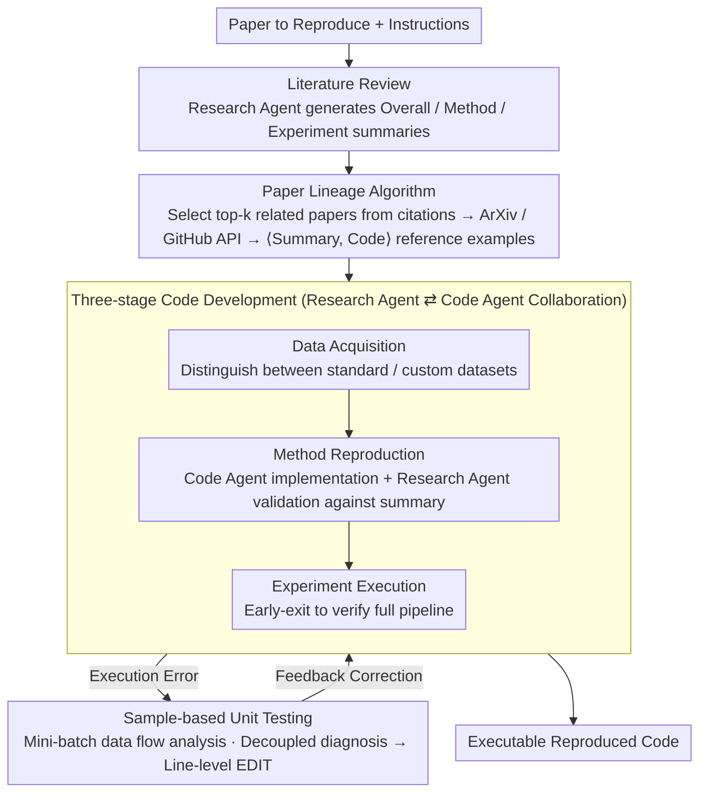

# AutoReproduce: Automatic AI Experiment Reproduction with Paper Lineage

**Conference**: ACL 2026  
**arXiv**: [2505.20662](https://arxiv.org/abs/2505.20662)  
**Code**: [https://github.com/AI9Stars/AutoReproduce](https://github.com/AI9Stars/AutoReproduce)  
**Area**: LLM Evaluation  
**Keywords**: Paper Reproduction, Paper Lineage, Multi-agent, Code Generation, Scientific Automation

## TL;DR

AutoReproduce proposes a multi-agent framework that utilizes a "Paper Lineage" algorithm to mine implicit domain knowledge from referenced literature. This enables end-to-end automatic reproduction of paper experiments, achieving a code execution rate of 94.87% and a performance gap of only 19.72% on the self-constructed ReproduceBench.

## Background & Motivation

**Background**: Reproducing paper experiments is crucial for accelerating scientific progress. However, as methods become increasingly complex, reproduction requires deep domain expertise and significant manual labor. While LLMs have been applied to discrete tasks such as paper analysis, idea generation, and environment configuration, an end-to-end automatic reproduction framework has yet to emerge.

**Limitations of Prior Work**: (1) Papers often lack key experimental details—different research areas rely on vast amounts of implicit knowledge (e.g., specific module architectures, data processing pipelines); (2) Concurrent works like Paper2Code only generate code without considering executability, making it impossible to verify the correctness of the reproduction; (3) Existing methods do not systematically utilize the domain conventions and implementation practices contained within cited literature.

**Key Challenge**: Successful reproduction requires not only an understanding of the method description in the paper itself but also mastery of the conventional practices not explicitly stated—this "tacit knowledge" is scattered throughout cited papers and related code repositories.

**Goal**: (1) Systematically mine implicit knowledge from cited literature; (2) Construct an end-to-end executable code reproduction framework; (3) Establish a reproduction evaluation benchmark that includes execution verification.

**Key Insight**: A "Paper Lineage" algorithm is proposed to trace cited literature and associated code repositories, using implementation conventions accumulated in historical research as knowledge sources for reproduction.

**Core Idea**: Paper Reproduction = Paper Understanding + Domain Knowledge Mining + Code Generation + Execution Verification. The lineage algorithm compensates for deficiencies in the paper's own description through implicit knowledge passed along the citation chain.

## Method

### Overall Architecture

AutoReproduce is driven by the collaboration of two specialized agents: the research agent handles text-based tasks such as reading papers, summarizing, and selecting related work, while the code agent is responsible for implementation and debugging. The entire pipeline runs sequentially through three stages: (1) Literature Review—the research agent summarizes the paper at three levels (overall / method / experiment), compressing the lengthy original text into core information required for reproduction; (2) Paper Lineage—the top-k relevant papers are identified from citations, their code repositories are pulled, and key files are extracted to supplement domain conventions not explicitly stated in the paper; (3) Code Development—two agents collaborate to generate executable code through data acquisition, method reproduction, and experiment execution. During this stage, sample-based unit tests are used for continuous verification, and line-level EDIT commands are used to fix errors.

### Key Designs

**1. Paper Lineage Algorithm: Mining Domain Conventions Along the Citation Chain**

Reproduction failure often stems not from a lack of understanding but because the paper omits implementation details that are "commonly known"—such as how a specific module is built or how data is pre-processed. These forms of tacit knowledge are scattered in cited papers and their code repositories. The Paper Lineage algorithm traces this line: the research agent identifies the top-k (default 3) most relevant papers from the source paper's citations, prioritizing baselines from the main experiments. It then fetches papers via the ArXiv API and clones repositories via the GitHub API. The code agent selectively extracts key source files based on paper summaries and task instructions, forming ⟨summary, code⟩ tuples as reference examples. If a cited paper has no public code, only its summary is used as a knowledge source. This reflects the cumulative nature of research, where new methods stand on the shoulders of old ones; code from the citation chain fills the gaps in the paper's own description.

**2. Three-stage Code Development: Data Acquisition → Method Reproduction → Experiment Execution**

Obtaining reference examples from the lineage is insufficient; the code must be written and executed. This stage is the core of AutoReproduce, breaking reproduction into three sequential steps performed by two agents in a Docker container: (a) Data Acquisition—identifying whether the paper uses standard benchmarks or custom datasets. The former uses libraries like `torchvision` for loading, while the latter generates a preprocessing pipeline; (b) Method Reproduction—the code agent synthesizes the implementation based on the summary, data attributes, and lineage knowledge. The research agent verifies this against the method summary, providing feedback and dynamically updating the summary until the code aligns perfectly with the paper; (c) Experiment Execution—verifying that the full experimental pipeline can run end-to-end. This "one-to-write, one-to-verify" division of labor allocates "implementation" and "alignment" to their respective specialized agents, which is key to stable convergence.

**3. Sample-based Unit Testing + Line-level EDIT: Ensuring Executability at Low Cost**

Whether generated code can execute is the watershed for reproduction value. Unlike concurrent works that do not verify executability, AutoReproduce uses two strategies. The first is sample-based unit testing: instead of waiting for the full experiment to fail, mini-batch sampling is used during data acquisition to generate and run analysis code, proactively detecting critical attributes like tensor `shape` and `dtype` to prevent runtime crashes caused by attribute mismatches. The second is line-level EDIT: when an execution error occurs, the code agent diagnoses the traceback and uses an `EDIT N M` command to replace only lines $N$ through $M$, rather than regenerating the entire file. Decoupling "error diagnosis" from "code editing" improves debugging success rates, saves tokens, and avoids breaking correct sections during full-file rewrites.

### A Complete Example: Reproducing a Paper with Baselines

Given a paper to reproduce, AutoReproduce first has the research agent produce a three-level summary (Overall / Method / Experiment) to identify main experiments and baselines. The lineage algorithm then selects the 3 most relevant papers from the citations, clones their GitHub repositories, and the code agent extracts key modules as templates. During development, input tensor shapes and types are detected via mini-batch sampling. The code agent then writes the implementation using lineage examples, while the research agent provides feedback based on the paper summary. Finally, an early-exit pipeline is run to verify execution. If an error occurs, it is diagnosed and corrected via line-level EDIT until the code runs. This achieved a 94.87% execution rate on ReproduceBench, compared to only 23.08% for the strongest baseline.

### Loss & Training

No model training involved. LLMs such as GPT-4o, Claude-3.5-Sonnet, o3-mini, and Gemini-2.5-Pro are used as the backbone for the agents.

## Key Experimental Results

### Main Results

**ReproduceBench Evaluation**

| Method | LLM | Align-Score | Exec Rate | Perf Gap (↓) |
|------|-----|-------------|-----------|-------------|
| ChatDev | GPT-4o | 43.33 | 2.56% | 99.62% |
| Agent Lab | GPT-4o | 48.64 | 23.08% | 82.31% |
| PaperCoder | o3-mini | 60.26 | 17.94% | 89.23% |
| AutoReproduce | GPT-4o | 56.24 | **76.92%** | 41.77% |
| AutoReproduce | o3-mini | 75.21 | **92.31%** | 24.31% |
| AutoReproduce | Gemini-2.5-Pro | **77.56** | **94.87%** | **19.72%** |

### Ablation Study

| Configuration | Key Metric | Description |
|------|---------|------|
| Full AutoReproduce | Optimal | Lineage + Three-stage development |
| Without Paper Lineage | Decrease | Implementation bias due to lack of domain knowledge |
| Without Unit Testing | Exec Rate Decrease | Lack of executability verification |

### Key Findings

- The code execution rate of AutoReproduce (94.87%) far exceeds all baselines (max 23.08%), indicating that end-to-end executability verification is critical.
- The Paper Lineage algorithm is a key contribution—Align-Score and Perf Gap both degrade significantly without it.
- Gemini-2.5-Pro performs best as the backbone LLM, but even with GPT-4o, AutoReproduce significantly outperforms PaperCoder.
- A performance gap of 19.72% remains, suggesting that fully automated high-fidelity reproduction still faces challenges.

## Highlights & Insights

- The concept of "Paper Lineage" is highly insightful—it transforms the cumulative nature of scientific research into an operational knowledge mining algorithm.
- The emphasis on end-to-end executability fills a critical gap in existing work (e.g., Paper2Code)—code that cannot run has no reproduction value.
- The strategy of decoupling error diagnosis from code modification is a significant engineering insight.

## Limitations & Future Work

- ReproduceBench consists of only 13 papers, which is a relatively small scale.
- It relies on cited papers having public code repositories; otherwise, the lineage algorithm reverts to using only textual knowledge.
- A performance gap of roughly 20% remains, indicating that high-precision reproduction likely still requires human intervention.
- The scope is currently limited to the AI domain; expansion to other disciplines would require additional adaptation.

## Related Work & Insights

- **vs Paper2Code/PaperCoder**: These methods do not consider code executability, whereas AutoReproduce emphasizes end-to-end execution.
- **vs Agent Laboratory**: Agent Lab achieves an execution rate of only 23%, while AutoReproduce reaches 95%.

## Rating

- Novelty: ⭐⭐⭐⭐⭐ The Paper Lineage algorithm and end-to-end reproduction framework are significant innovations.
- Experimental Thoroughness: ⭐⭐⭐⭐ Extensive multi-LLM comparisons and baseline coverage, though the benchmark scale is small.
- Writing Quality: ⭐⭐⭐⭐ Clear framework descriptions and intuitive flowcharts.
- Value: ⭐⭐⭐⭐⭐ Significant impact on the advancement of scientific automation.

<!-- RELATED:START -->

## Related Papers

- [\[ACL 2026\] PaperMentor: A Human-Centered Multi-Agent Writing Tutor for AI Research Papers on Overleaf](papermentor_a_human-centered_multi-agent_writing_tutor_for_ai_research_papers_on.md)
- [\[AAAI 2026\] Assemble Your Crew: Automatic Multi-agent Communication Topology Design via Autoregressive Graph Generation](../../AAAI2026/multi_agent/assemble_your_crew_automatic_multi-agent_communication_topol.md)
- [\[ICML 2026\] Searching for Synergy in Shared Workspace Human-AI Collaboration](../../ICML2026/multi_agent/searching_for_synergy_in_shared_workspace_human-ai_collaboration.md)
- [\[AAAI 2026\] Hierarchical Pedagogical Oversight: A Multi-Agent Adversarial Framework for Reliable AI Tutoring](../../AAAI2026/multi_agent/hierarchical_pedagogical_oversight_a_multi-agent_adversarial_framework_for_relia.md)
- [\[ICLR 2026\] AI-for-Science Low-code Platform with Bayesian Adversarial Multi-Agent Framework](../../ICLR2026/multi_agent/ai-for-science_low-code_platform_with_bayesian_adversarial_multi-agent_framework.md)

<!-- RELATED:END -->
