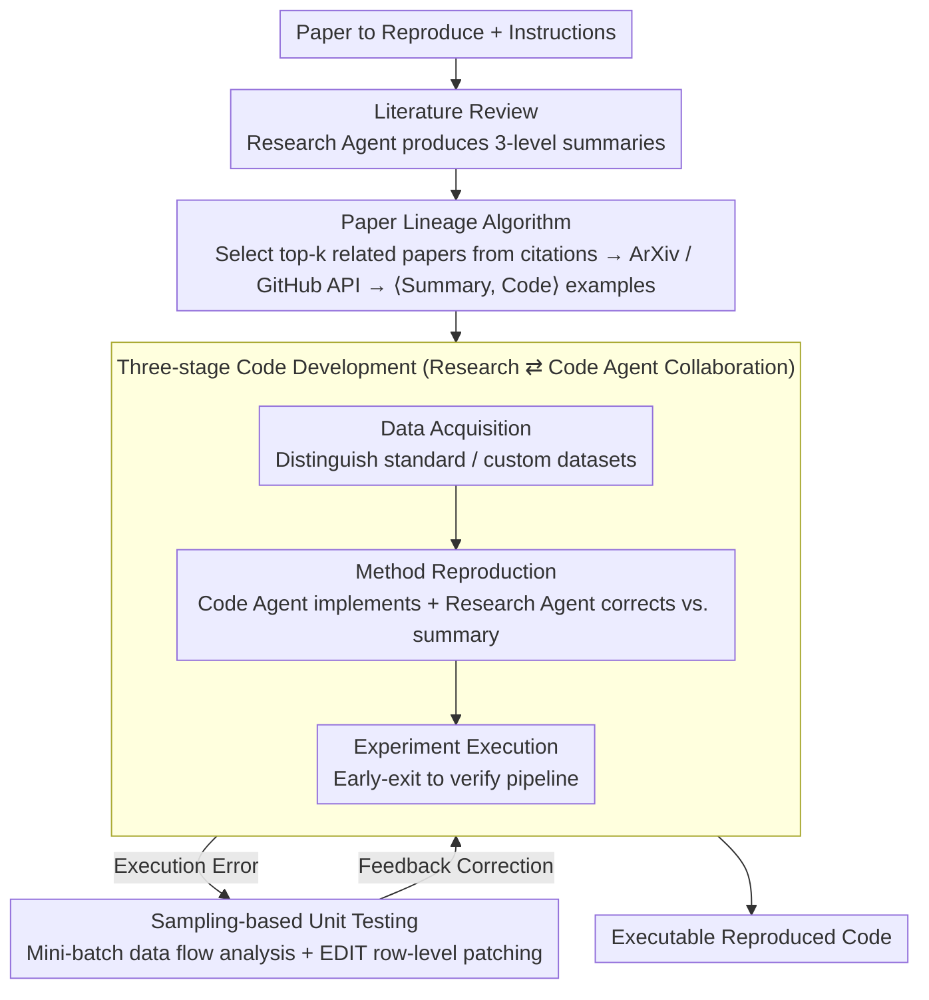

# AutoReproduce: Automatic AI Experiment Reproduction with Paper Lineage

**Conference**: ACL 2026  
**arXiv**: [2505.20662](https://arxiv.org/abs/2505.20662)  
**Code**: [https://github.com/AI9Stars/AutoReproduce](https://github.com/AI9Stars/AutoReproduce)  
**Area**: LLM Evaluation  
**Keywords**: Paper reproduction, paper lineage, multi-agent, code generation, scientific automation

## TL;DR

AutoReproduce proposes a multi-agent framework that mines implicit domain knowledge from cited literature through a "paper lineage" algorithm, achieving end-to-end automatic reproduction of paper experiments. It reaches an execution rate of 94.87% on the self-built ReproduceBench with a performance gap of only 19.72%.

## Background & Motivation

**Background**: Reproducing paper experiments is crucial for accelerating scientific progress. However, as methods become increasingly complex, reproduction requires deep domain expertise and significant human labor. LLMs have been utilized for discrete tasks such as paper analysis, idea generation, and environmental configuration, but an end-to-end automatic reproduction framework has yet to emerge.

**Limitations of Prior Work**: (1) Papers often lack critical experimental details—different research areas rely on vast amounts of implicit knowledge (e.g., specific module architectures, data processing pipelines); (2) Parallel works like Paper2Code only generate code without considering executability, failing to verify the correctness of the reproduction; (3) Existing methods do not systematically utilize domain conventions and implementation practices contained in cited literature.

**Key Challenge**: Successful reproduction requires not only understanding the method description of the paper itself but also mastering the regular domain practices not explicitly stated—this "tacit knowledge" is scattered throughout cited literature and related codebases.

**Goal**: (1) Systematically mine implicit knowledge from cited literature; (2) Build an end-to-end executable code reproduction framework; (3) Establish a reproduction evaluation benchmark that includes execution verification.

**Key Insight**: Propose a "Paper Lineage" algorithm to trace cited literature and associated codebases, using the implementation conventions accumulated in historical research as a knowledge source for reproduction.

**Core Idea**: Paper Reproduction = Paper Understanding + Domain Knowledge Mining + Code Generation + Execution Verification. The lineage algorithm compensates for the deficiencies in the paper's own description through implicit knowledge passed along the citation chain.

## Method

### Overall Architecture

AutoReproduce is driven by the collaboration of two specialized agents—the research agent handles text-based tasks like reading papers, summarizing, and selecting related work, while the code agent handles code tasks like implementation and debugging. The pipeline runs sequentially through three stages: (1) Literature Review—the research agent performs a three-level summary (Overall / Method / Experiment), compressing the lengthy original text into core information needed for reproduction; (2) Paper Lineage—identifying top-k related papers from citations, fetching their codebases, and extracting key files to supplement domain conventions omitted in the paper; (3) Code Development—two agents collaborate through data acquisition, method reproduction, and experiment execution to generate executable code, during which sampling-based unit testing and EDIT row-level patching are used for continuous verification and error correction.

### Key Designs

**1. Paper Lineage Algorithm: Mining domain conventions omitted in the paper along the citation chain**

Reproduction failure often occurs not because the paper is misunderstood, but because implementation details that "everyone is assumed to know"—such as module setup or data preprocessing—are not written down. These pieces of tacit knowledge are scattered in cited literature and their codebases. The Paper Lineage algorithm traces this: a research agent identifies top-$k$ (default 3) most relevant papers from the source paper's citations, prioritizing baselines in the main experiments. It then pulls papers via ArXiv API for summarization and clones repositories via GitHub API. The code agent selectively extracts key source files to form $\langle \text{summary}, \text{code} \rangle$ tuples as reference examples. If a cited paper has no public code, it defaults to using its summary as a knowledge source. 

**2. Three-stage Code Development: Data Acquisition → Method Reproduction → Experiment Execution**

AutoReproduce sequentializes reproduction into three steps within Docker containers: (a) Data Acquisition—identifying whether standard benchmarks (e.g., using torchvision) or custom datasets are used; (b) Method Reproduction—the code agent synthesizes the implementation based on the paper summary, data attributes, and lineage knowledge, while the research agent verifies each part against the method summary, providing feedback until alignment is achieved; (c) Experiment Execution—verifying the full experimental pipeline can run end-to-end. This division between "implementation" and "alignment with original text" is key to stable convergence.

**3. Sampling-based Unit Testing + Row-level EDIT: Ensuring executability at low cost**

AutoReproduce ensures executability through two main techniques. First, sampling-based unit tests: rather than waiting for long experiments to fail, it uses mini-batch sampling during data acquisition to generate analysis code that proactively detects critical attributes like tensor shape and dtype. Second, row-level EDIT: upon execution errors, the code agent diagnoses the traceback and uses an `EDIT N M` command to replace only lines N to M, rather than regenerating the entire file. Decoupling "error diagnosis" from "code editing" significantly improves debugging success rates and saves tokens.

### Main Results

**ReproduceBench Evaluation**

| Method | LLM | Align-Score | Exec Rate | Perf Gap (↓) |
|------|-----|-------------|-----------|-------------|
| ChatDev | GPT-4o | 43.33 | 2.56% | 99.62% |
| Agent Lab | GPT-4o | 48.64 | 23.08% | 82.31% |
| PaperCoder | o3-mini | 60.26 | 17.94% | 89.23% |
| AutoReproduce | GPT-4o | 56.24 | **76.92%** | 41.77% |
| AutoReproduce | o3-mini | 75.21 | **92.31%** | 24.31% |
| AutoReproduce | Gemini-2.5-Pro | **77.56** | **94.87%** | **19.72%** |

### Ablation Study

| Configuration | Key Metrics | Description |
|------|---------|------|
| Full AutoReproduce | Optimal | Lineage + Three-stage development |
| W/O Paper Lineage | Decrease | Implementation bias due to lack of domain knowledge |
| W/O Unit Test | Exec Rate Decrease | Missing executability verification |

### Key Findings

- AutoReproduce's code execution rate (94.87%) far exceeds all baselines (max 23.08%), indicating that end-to-end executability verification is essential.
- The Paper Lineage algorithm is a critical contribution—removing it significantly drops Align-Score and increases Perf Gap.
- Gemini-2.5-Pro performs best as the backbone LLM, but even with GPT-4o, AutoReproduce substantially outperforms PaperCoder.
- A performance gap of 19.72% remains, suggesting that fully automated, high-fidelity reproduction is still challenging.

## Highlights & Insights

- The concept of "Paper Lineage" is insightful—turning the cumulative nature of research into an actionable knowledge-mining algorithm.
- The emphasis on end-to-end executability fills a critical gap in existing works (e.g., Paper2Code)—code that cannot execute has no reproduction value.
- The strategy of decoupling error diagnosis from code modification is a significant engineering insight.

## Limitations & Future Work

- ReproduceBench contains only 13 papers, which is a small scale.
- Dependence on cited papers having public repositories; otherwise, the lineage algorithm reverts to text-only knowledge.
- The ~20% performance gap suggests high-precision reproduction still requires human intervention.
- Currently limited to the AI domain; expansion to other disciplines requires additional adaptation.

## Related Work & Insights

- **vs Paper2Code/PaperCoder**: These methods do not consider code executability; AutoReproduce emphasizes end-to-end execution.
- **vs Agent Laboratory**: Agent Lab's execution rate is only 23%, whereas AutoReproduce reaches 95%.

## Rating

- Novelty: ⭐⭐⭐⭐⭐ The paper lineage algorithm and end-to-end reproduction framework are significant innovations.
- Experimental Thoroughness: ⭐⭐⭐⭐ Comparison across multiple LLMs and baselines, though the benchmark scale is small.
- Writing Quality: ⭐⭐⭐⭐ Clear framework description and intuitive flowcharts.
- Value: ⭐⭐⭐⭐⭐ Significant contribution to scientific automation.

<!-- RELATED:START -->

## Related Papers

- [\[CVPR 2026\] Paper2Figure: A Multi-Agent Collaborative System for Figure Generation Towards Academic Research Paper](../../CVPR2026/multi_agent/paper2figure_a_multi-agent_collaborative_system_for_figure_generation_towards_ac.md)
- [\[AAAI 2026\] Hierarchical Pedagogical Oversight: A Multi-Agent Adversarial Framework for Reliable AI Tutoring](../../AAAI2026/multi_agent/hierarchical_pedagogical_oversight_a_multi-agent_adversarial_framework_for_relia.md)
- [\[AAAI 2026\] Assemble Your Crew: Automatic Multi-agent Communication Topology Design via Autoregressive Graph Generation](../../AAAI2026/multi_agent/assemble_your_crew_automatic_multi-agent_communication_topol.md)
- [\[CVPR 2025\] ComfyBench: Benchmarking LLM-based Agents in ComfyUI for Autonomously Designing Collaborative AI Systems](../../CVPR2025/multi_agent/comfybench_benchmarking_llm-based_agents_in_comfyui_for_autonomously_designing_c.md)
- [\[ACL 2026\] From Query to Counsel: Structured Reasoning with a Multi-Agent Framework and Dataset for Legal Consultation](from_query_to_counsel_structured_reasoning_with_a_multi-agent_framework_and_data.md)

<!-- RELATED:END -->
