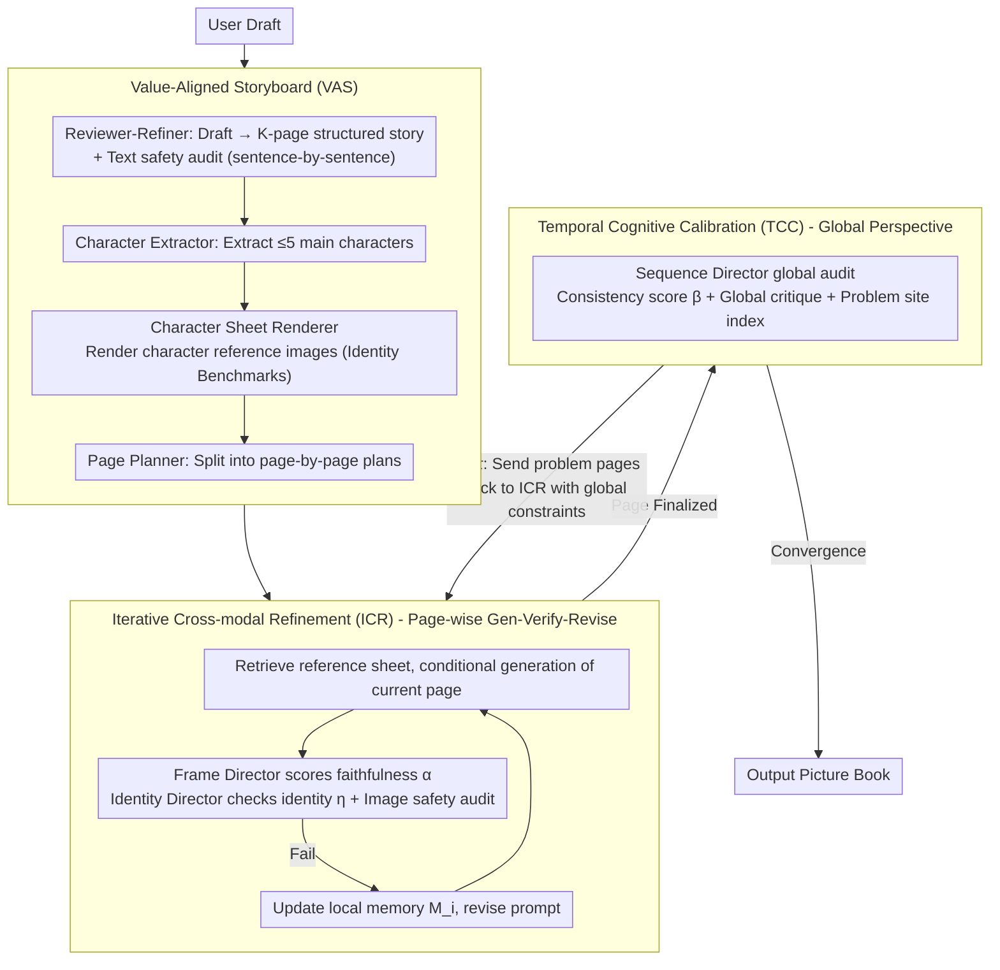

# BookAgent: Orchestrating Safety-Aware Visual Narratives via Multi-Agent Cognitive Calibration

**Conference**: ACL 2026  
**arXiv**: [2604.16541](https://arxiv.org/abs/2604.16541)  
**Code**: [https://github.com/bogao-code/BookAgent](https://github.com/bogao-code/BookAgent)  
**Area**: Image Generation  
**Keywords**: Picture book generation, multi-agent collaboration, safety alignment, cross-frame consistency, visual storytelling

## TL;DR
BookAgent is a safety-aware multi-agent framework that employs a three-stage closed-loop architecture—**Value-Aligned Storyboard (VAS) + Iterative Cross-modal Refinement (ICR) + Temporal Cognitive Calibration (TCC)**—to generate high-quality, character-consistent, and content-safe picture book stories end-to-end from user drafts.

## Background & Motivation

**Background**: Large generative models have made significant progress in text and image generation, but automated picture book generation remains an open challenge. Existing methods decouple story visualization into independent stages (fixing the storyline first, then generating images page by page), which lacks holistic multi-modal alignment.

**Limitations of Prior Work**: (1) Weak cross-modal alignment—visual content rarely provides structured feedback to revise scripts, leading to insufficient bidirectional alignment; (2) Poor global consistency—character appearance drift, missing props, and broken causal relationships in long-sequence generation; (3) Child safety not integrated—existing safety methods are mostly post-hoc filters and are not embedded into narrative planning or global consistency checks.

**Key Challenge**: There is a need for a unified system to simultaneously address cross-modal alignment, long-range consistency, and domain safety, whereas existing methods can only handle one aspect at a time.

**Goal**: Construct an end-to-end picture book synthesis system that starts from user drafts to generate scripts and illustrations simultaneously, ensuring page-level alignment, global character consistency, and child safety compliance.

**Key Insight**: Treat picture book generation as a **collaborative cognitive process** rather than a pipeline—where multiple specialized agents (Reviewer, Director, Safety Auditor, etc.) collaborate through closed-loop feedback.

**Core Idea**: A three-stage hierarchical workflow—VAS ensures a safe narrative blueprint, ICR ensures single-page quality, and TCC ensures global consistency across pages.

## Method

### Overall Architecture
BookAgent aims to generate an end-to-end picture book that is aesthetically pleasing, character-consistent, and safe for children from a single user draft. The authors formalize this as a constrained optimization problem: maximize text-image faithfulness $\alpha$, character identity consistency $\eta$, and global sequential coherence $\beta$ under the hard constraint that all text and images must pass safety audits ($\mathcal{S}_T=1, \mathcal{S}_I=1$). In practice, the system consists of 10 specialized agents (Reviewer, Director, Safety Auditor, etc., see Table 1), structured into three progressively tightening stages: VAS establishes a safe narrative blueprint and character anchors; ICR refines each page individually; TCC identifies global inconsistencies from a holistic perspective and performs targeted repairs.

### Key Designs

**1. Value-Aligned Storyboard (VAS): Securing safety and character anchors before drawing**

The most difficult aspect of picture books is not single-page aesthetics, but preventing character drift and content loss over dozens of pages—issues that are extremely costly to fix after image generation. VAS shifts constraints to the planning stage: the Reviewer-Refiner rewrites the draft into a $K$-page structured story $\hat{x}$ verified sentence-by-sentence by the safety auditor. The Character Extractor identifies ≤5 main characters and their visual descriptors. Finally, the Character Sheet Renderer generates a reference image for each character against a neutral background as the ground truth for subsequent identity verification.

The value of this step lies in two "proactive measures": safety auditing transforms from "passive post-filtering" into "active planning constraints," preventing non-compliant content from entering generation; the character reference sheet provides a fixed visual baseline for every page, ensuring consistency is grounded rather than relying on model memory—eliminating the root cause of autoregressive drift.

**2. Iterative Cross-modal Refinement (ICR): Self-correction via "Generation-Verification-Revision" loop**

Diffusion models struggle with complex constraints in a single sampling—e.g., asking for "three buttons on a coat" might result in two or four. ICR turns each page into a budgeted loop: it retrieves the relevant reference sheet $\mathcal{R}_i$ for conditional generation $y_i^{(r)}$; the Frame Director scores text-image faithfulness $\alpha_i^{(r)}$ and the Identity Director verifies character consistency $\eta_i^{(r)}$. If safety audits fail, negative constraints are added; otherwise, semantic and identity feedback are integrated to produce a revised prompt $p_i^{(r+1)}$ for the next round. The key is local memory $\mathcal{M}_i$, which accumulates constraints to prevent the $r+1$ round from undoing fixes from round $r$.

Effectively, ICR transforms generation from "one-shot static sampling" into "dynamic self-correction with feedback"—ablation studies show graph-text consistency improves from 2.8 to 4.6, indicating this loop overcomes the limitations of single-pass generation.

**3. Temporal Cognitive Calibration (TCC): Global auditing and targeted repair at the book level**

While ICR fixes individual pages, pages may still drift relative to each other—a red hat on page three might subtly turn blue by page ten. Page-wise local conditioning fails to detect such long-range shifts. TCC tasks the Sequence Director with a global audit of the full sequence $\mathcal{B}^{(m)}$, producing a consistency score $\beta^{(m)}$, global critique $\Gamma^{(m)}$, and problem page indices $\mathcal{I}^{(m)}$. If $\beta^{(m)} < \tau_\beta$, the system does not regenerate the entire book but sends only the problem pages back to ICR with global context constraints until convergence.

This step upgrades the paradigm from "linear autoregressive stacking" to "holistic temporal reasoning": viewing the whole before performing surgery. Selective repair (fixing only problem pages) is a smart compromise between efficiency and quality—ablation shows cross-frame consistency improved from 3.0 to 4.7 primarily due to this mechanism.

### A Complete Example: Generating a page "Bear counting buttons"

Assume a user draft requires page 5 to show a "bear looking down, counting the three buttons on its coat." In the VAS stage, a reference image for the "bear" (brown coat, three yellow buttons) is already rendered. Entering ICR: the first generated image shows a blue coat with two buttons—the Frame Director gives a low faithfulness score (wrong button count), and the Identity Director reports an identity mismatch (color drift). The system writes "brown coat + three yellow buttons" as a revision constraint into $\mathcal{M}_5$. After round 2, the button count and color match, safety audits pass, and the page is finalized. During TCC global auditing, if the bear's shoe color on page 5 is found inconsistent with page 2, only page 5 is sent back to ICR with the constraint "shoes should be red" for a single-page fix.

### Loss & Training
The entire process is training-free, relying on multi-agent collaboration during inference. Google Gemini 3.0 is used for reasoning and Nano-Banana for generation. All baseline methods are evaluated under the same prompt protocols and generation settings.

## Key Experimental Results

### Main Results

| Method | Text-Img Consistency (1-5) | Cross-frame ID Consistency (1-5) | Safety (1-5) |
|--------|----------------------------|-----------------------------------|--------------|
| **Ours (BookAgent)** | **4.6** | **4.7** | **4.8** |
| StoryGPT-V | 3.1 | 2.4 | 4.5 |
| MovieAgent | 2.8 | 2.1 | 3.6 |
| StoryGen | 2.5 | 1.9 | 4.4 |

### Ablation Study

| Configuration | Text-Img Consistency | Cross-frame Consistency | Safety | Note |
|---------------|----------------------|-------------------------|--------|------|
| Baseline (No VAS/ICR/TCC) | 2.7 | 2.0 | 4.2 | |
| + VAS | 2.8 | 2.1 | **4.8** | Significant safety gain |
| + VAS + ICR | 4.6 | 3.0 | 4.8 | Significant text-img consistency gain |
| + VAS + ICR + TCC | **4.6** | **4.7** | **4.8** | Significant cross-frame consistency gain |

### Key Findings
- ICR is critical for text-image consistency (2.8→4.6), proving single-pass generation cannot satisfy complex constraints.
- TCC is critical for cross-frame consistency (3.0→4.7), proving local conditioning is insufficient for long-range maintenance.
- VAS improves safety from 4.2 to 4.8; pre-planning safety audits are more effective than post-filtering.
- Parents in user studies gave BookAgent the highest preference scores, noting that improved consistency made stories easier for children to follow.

## Highlights & Insights
- **"Anchor then Refine" Paradigm**: Using character reference sheets as consistency anchors for all subsequent generation and verification effectively eliminates autoregressive drift.
- **Selective Repair**: Repairing only problem pages instead of the whole sequence provides a high-quality, high-efficiency compromise.
- **Tiered Safety Design**: Deeply embedding safety audits into all stages (VAS text, ICR image, TCC global) serves as a robust paradigm for safety-aware systems.

## Limitations & Future Work
- Dependency on commercial models like Gemini 3.0 and Nano-Banana limits open-source reproducibility.
- Significant inference costs due to iterative refinement loops (multiple Gen-Verify cycles per page).
- Evaluation relies heavily on LLM-as-a-judge; human evaluation scale is relatively small.
- Tested up to 20 pages; consistency maintenance for longer works (e.g., 50+ pages) remains unverified.

## Related Work & Insights
- **vs MovieAgent (Wu et al., 2025)**: Shares a hierarchical multi-agent paradigm, but BookAgent adds safety auditing and global temporal calibration, significantly outperforming it across all metrics.
- **vs StoryGPT-V**: The latter aligns character descriptions with diffusion models via LLMs but remains a unidirectional pipeline. BookAgent achieves bidirectional alignment through closed-loop feedback.

## Rating
- **Novelty**: ⭐⭐⭐⭐ The combination of end-to-end synthesis, tiered safety, and temporal calibration is a novel system architecture.
- **Experimental Thoroughness**: ⭐⭐⭐ Evaluation is primarily qualitative and LLM-centric, lacking large-scale automated metrics.
- **Writing Quality**: ⭐⭐⭐⭐ The system design is clear and formalization is rigorous, though dense formulas may affect readability.

<!-- RELATED:START -->

## Related Papers

- [\[ACL 2026\] MASFactory: A Graph-centric Framework for Orchestrating LLM-Based Multi-Agent Systems with Vibe Graphing](masfactory_a_graph-centric_framework_for_orchestrating_llm-based_multi-agent_sys.md)
- [\[ACL 2026\] AgenticEval: Toward Agentic and Self-Evolving Safety Evaluation of Large Language Models](agenticeval_toward_agentic_and_self-evolving_safety_evaluation_of_large_language.md)
- [\[ICML 2026\] RADAR: Redundancy-Aware Diffusion for Multi-Agent Communication Structure Generation](../../ICML2026/multi_agent/radar_redundancy-aware_diffusion_for_multi-agent_communication_structure_generat.md)
- [\[AAAI 2026\] BAMAS: Structuring Budget-Aware Multi-Agent Systems](../../AAAI2026/multi_agent/bamas_structuring_budget-aware_multi-agent_systems.md)
- [\[CVPR 2026\] Visual Document Understanding and Reasoning: A Multi-Agent Collaboration Framework with Agent-Wise Adaptive Test-Time Scaling](../../CVPR2026/multi_agent/visual_document_understanding_and_reasoning_a_multi-agent_collaboration_framewor.md)

<!-- RELATED:END -->
