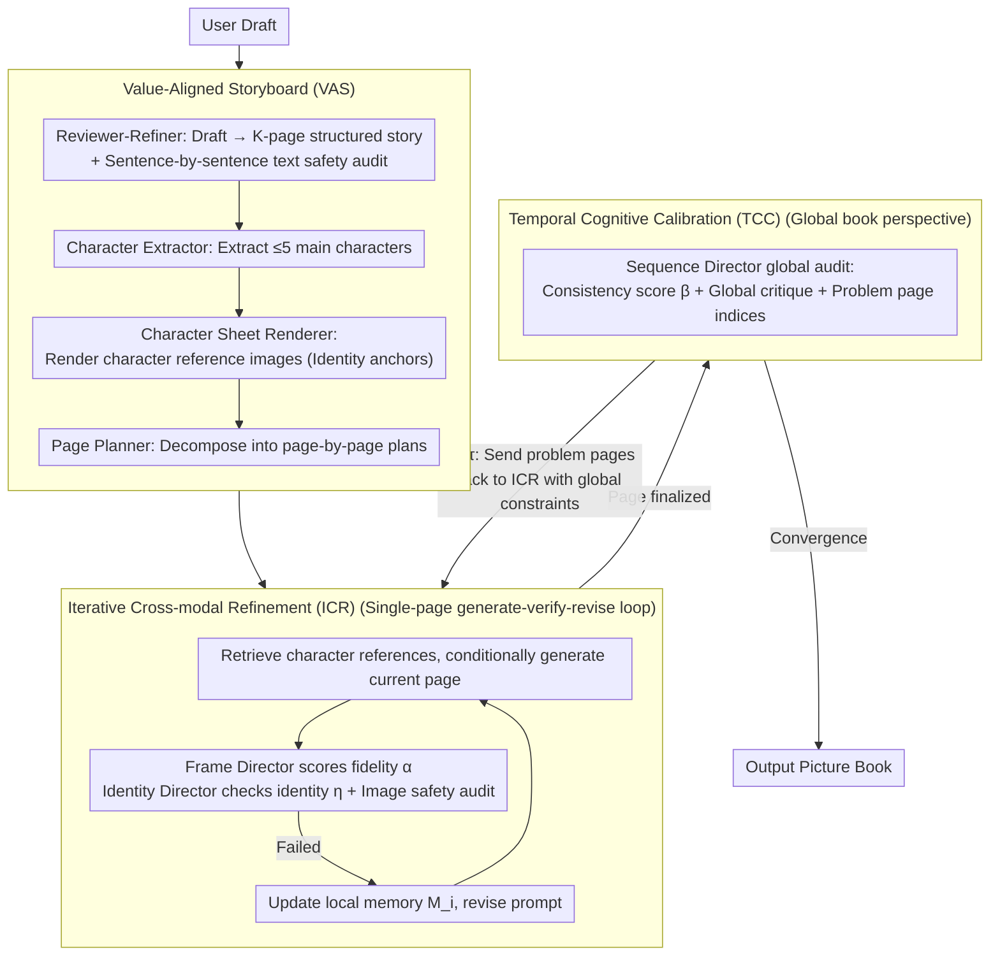

# BookAgent: Orchestrating Safety-Aware Visual Narratives via Multi-Agent Cognitive Calibration

**Conference**: ACL 2026  
**arXiv**: [2604.16541](https://arxiv.org/abs/2604.16541)  
**Code**: [https://github.com/bogao-code/BookAgent](https://github.com/bogao-code/BookAgent)  
**Area**: Image Generation  
**Keywords**: Picture book generation, multi-agent collaboration, safety alignment, cross-frame consistency, visual storytelling

## TL;DR
BookAgent is a safety-aware multi-agent framework that utilizes a three-stage closed-loop architecture consisting of a **Value-Aligned Storyboard (VAS) + Iterative Cross-modal Refinement (ICR) + Temporal Cognitive Calibration (TCC)** to generate high-quality, character-consistent, and safety-compliant picture book stories end-to-end from user drafts.

## Background & Motivation

**Background**: Large generative models have achieved significant progress in text and image generation. However, automatic picture book generation remains an open challenge. Existing methods decompose story visualization into independent stages (first fixing the storyline, then generating images page-by-page), lacking holistic multi-modal alignment.

**Limitations of Prior Work**: (1) Weak cross-modal alignment—visual content rarely provides structured feedback to correct scripts, resulting in insufficient bidirectional alignment; (2) Poor global consistency—long-sequence generation suffers from character appearance drift, missing props, and broken causal relationships; (3) Child safety is not integrated—existing safety methods are mostly post-hoc filters and are not embedded into narrative planning or global consistency checks.

**Key Challenge**: There is a need for a unified system to simultaneously address cross-modal alignment, long-range consistency, and domain-specific safety, whereas existing methods addresses only one aspects individually.

**Goal**: To build an end-to-end picture book synthesis system that simultaneously generates scripts and illustrations from user drafts, ensuring page-level alignment, global character consistency, and compliance with child safety standards.

**Key Insight**: Treat picture book generation as a **collaborative cognitive process** rather than a pipeline, where multiple specialized agents (Reviewer, Director, Safety Auditor, etc.) collaborate via closed-loop feedback.

**Core Idea**: A three-stage hierarchical workflow—VAS ensures a safe narrative blueprint, ICR ensures single-page quality, and TCC ensures global consistency across pages.

## Method

### Overall Architecture
BookAgent aims to generate a picture book from a single user draft that is aesthetically pleasing, character-consistent, and safe for children. The authors formalize this as a constrained optimization problem: maximize text-image fidelity $\alpha$, character identity consistency $\eta$, and global sequence coherence $\beta$ under hard constraints where all text and images must pass safety audits ($\mathcal{S}_T=1, \mathcal{S}_I=1$). In implementation, the system consists of 10 specialized agents (Table 1) operating across three progressively tighter stages: establishing a safe blueprint with VAS, refining each page with ICR, and finally identifying and fixing global gaps with TCC.

### Key Designs

**1. Value-Aligned Storyboard (VAS): Anchoring safety and characters before drawing.**

The hardest part of a picture book is not single-page aesthetics, but preventing character drift and content loss over dozens of pages—issues that are extremely costly to fix post-generation. VAS shifts constraints to the planning stage: The Reviewer-Refiner rewrites the draft into a $K$-page structured story $\hat{x}$, verified by a text safety auditor. The Character Extractor extracts characters and visual descriptors, and the Character Sheet Renderer creates reference images for each character in a neutral setting to serve as the ground truth for identity verification. Finally, the Page Planner decomposes the story into page plans.

The value of this step lies in two "preventative" measures: safety auditing becomes an "active planning constraint" rather than "passive post-filtering," and character reference sheets provide a fixed visual baseline, eliminating the root cause of autoregressive drift.

**2. Iterative Cross-modal Refinement (ICR): Self-correction via a "generate-verify-revise" loop.**

Diffusion models struggle with complex constraints in a single sampling step (e.g., "three buttons on a coat"). ICR turns each page into a budgeted cycle: it retrieves character reference images $\mathcal{R}_i$ to generate image $y_i^{(r)}$; then the Frame Director and Identity Director score fidelity $\alpha_i^{(r)}$ and consistency $\eta_i^{(r)}$. If safety audits fail, negative constraints are added; otherwise, semantic and identity feedback are merged into a revised prompt $p_i^{(r+1)}$ for the next round. Local memory $\mathcal{M}_i$ accumulates constraints to prevent regressions.

ICR transforms generation from "one-shot static sampling" to "feedback-driven dynamic self-correction," improving text-image consistency from 2.8 to 4.6 in ablation studies.

**3. Temporal Cognitive Calibration (TCC): Global auditing and targeted repair.**

Even if every page is refined individually, long-range drift can occur (e.g., a hat changing color by page 10). TCC enables the Sequence Director to perform a global audit on the full sequence $\mathcal{B}^{(m)}$, outputting a consistency score $\beta^{(m)}$, global critique $\Gamma^{(m)}$, and problem page indices $\mathcal{I}^{(m)}$. If $\beta^{(m)} < \tau_\beta$, only the problematic pages $\mathcal{I}^{(m)}$ are resubmitted to ICR with global context constraints.

This shifts the paradigm from "linear autoregressive stacking" to "holistic temporal reasoning." Selective repair (modifying only target pages) provides a clever trade-off between efficiency and quality, raising cross-frame consistency from 3.0 to 4.7.

### Loss & Training
The framework is training-free, utilizing multi-agent collaboration during inference. Inference uses Google Gemini 3.0, and generation uses Nano-Banana. All baseline methods are evaluated under identical prompt protocols and generation settings.

## Key Experimental Results

### Main Results

| Method | Text-Image Consistency (1-5) | Cross-Frame Identity Consistency (1-5) | Safety (1-5) |
|--------|------|------|------|
| **BookAgent** | **4.6** | **4.7** | **4.8** |
| StoryGPT-V | 3.1 | 2.4 | 4.5 |
| MovieAgent | 2.8 | 2.1 | 3.6 |
| StoryGen | 2.5 | 1.9 | 4.4 |

### Ablation Study

| Configuration | Text-Image Consistency | Cross-Frame Consistency | Safety | Description |
|------|---------|------|------|------|
| Baseline (No VAS/ICR/TCC) | 2.7 | 2.0 | 4.2 | |
| + VAS | 2.8 | 2.1 | **4.8** | Significant safety gain |
| + VAS + ICR | 4.6 | 3.0 | 4.8 | Significant text-image consistency gain |
| + VAS + ICR + TCC | **4.6** | **4.7** | **4.8** | Significant cross-frame consistency gain |

### Key Findings
- ICR is critical for text-image consistency (2.8→4.6), proving single-shot generation cannot handle complex constraints.
- TCC is critical for cross-frame consistency (3.0→4.7), proving local conditioning is insufficient for long-range maintenance.
- VAS improves safety from 4.2 to 4.8, showing pre-planning audits are more effective than post-filtering.
- In parent user studies, BookAgent received the highest preference ratings; improved long-range consistency makes stories easier for children to comprehend.

## Highlights & Insights
- **The "anchor then iteratively refine" design paradigm** is a key takeaway: character reference images serve as consistency anchors, avoiding autoregressive drift.
- **Selective repair** (fixing only problematic pages rather than regenerating the entire sequence) is an effective compromise between efficiency and quality.
- The layered safety design, with audits embedded in various stages (VAS text audit, ICR image audit, TCC global audit), serves as a paradigm for safety-aware systems.

## Limitations & Future Work
- Dependency on commercial models like Gemini 3.0 and Nano-Banana limits open-source reproducibility.
- Iterative refinement and global calibration introduce significant inference costs.
- Evaluation is primarily based on LLM-as-a-judge; the scale of human evaluation is relatively small.
- Consistency maintenance for very long books (e.g., 50+ pages) remains unverified, as testing capped at 20 pages.

## Related Work & Insights
- **vs MovieAgent (Wu et al., 2025)**: Shares the hierarchical multi-agent paradigm, but BookAgent adds safety auditing and global temporal calibration, significantly outperforming it across all metrics.
- **vs StoryGPT-V**: The latter aligns character descriptions with diffusion models via LLMs but remains a unidirectional pipeline; BookAgent achieves bidirectional alignment through closed-loop feedback.

## Rating
- Novelty: ⭐⭐⭐⭐ The system combination of end-to-end synthesis, layered safety, and temporal calibration is novel.
- Experimental Thoroughness: ⭐⭐⭐ Evaluation relies heavily on qualitative results and LLM judges, lacking large-scale automated metrics.
- Writing Quality: ⭐⭐⭐⭐ System design is clear and formalization is rigorous, though dense formulas slightly impact readability.

<!-- RELATED:START -->

## Related Papers

- [\[ACL 2026\] MASFactory: A Graph-centric Framework for Orchestrating LLM-Based Multi-Agent Systems with Vibe Graphing](masfactory_a_graph-centric_framework_for_orchestrating_llm-based_multi-agent_sys.md)
- [\[ACL 2026\] AgenticEval: Toward Agentic and Self-Evolving Safety Evaluation of Large Language Models](agenticeval_toward_agentic_and_self-evolving_safety_evaluation_of_large_language.md)
- [\[ICML 2026\] RADAR: Redundancy-Aware Diffusion for Multi-Agent Communication Structure Generation](../../ICML2026/multi_agent/radar_redundancy-aware_diffusion_for_multi-agent_communication_structure_generat.md)
- [\[CVPR 2026\] Visual Document Understanding and Reasoning: A Multi-Agent Collaboration Framework with Agent-Wise Adaptive Test-Time Scaling](../../CVPR2026/multi_agent/visual_document_understanding_and_reasoning_a_multi-agent_collaboration_framewor.md)
- [\[AAAI 2026\] BAMAS: Structuring Budget-Aware Multi-Agent Systems](../../AAAI2026/multi_agent/bamas_structuring_budget-aware_multi-agent_systems.md)

<!-- RELATED:END -->
