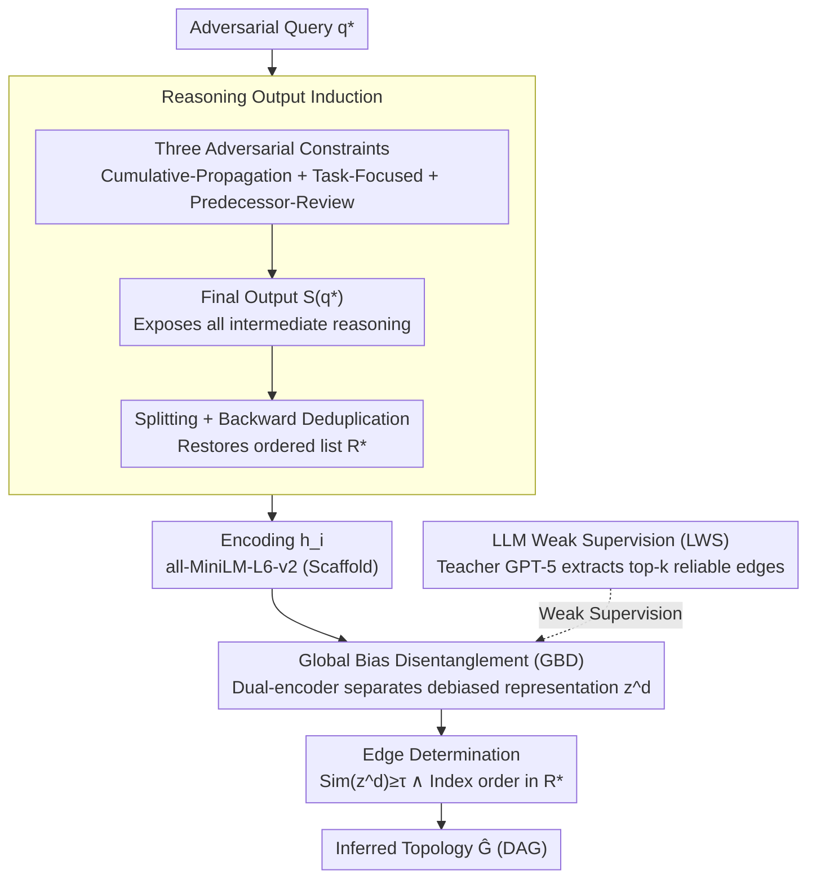

# CIA: Inferring the Communication Topology from LLM-based Multi-Agent Systems

**Conference**: ACL 2026  
**arXiv**: [2604.12461](https://arxiv.org/abs/2604.12461)  
**Code**: https://github.com/aabbbcd/CIA  
**Area**: LLM Security / Multi-Agent Systems  
**Keywords**: Communication Topology Inference, Black-box Attack, Global Bias Disentanglement, LLM Weak Supervision, Privacy Risk

## TL;DR
This paper proposes CIA (Communication Inference Attack), which, under a strict black-box setting where only the final output is observable, induces multi-agent systems to expose intermediate agent reasoning through adversarial queries. By combining global bias disentanglement with LLM weak supervision to model semantic correlations, it successfully reconstructs the MAS communication topology, achieving an average AUC of 0.87 and a peak of 0.99.

## Background & Motivation

**Background**: LLM Multi-Agent Systems (MAS) utilize carefully designed communication topologies $\mathcal{G}=(\mathcal{A},\mathcal{E})$ to enable collaboration on complex tasks. Current mainstream topology design methods have evolved from manual/heuristic approaches (MetaGPT, CAMEL, ChatDev) to generative optimization (G-Designer, AGP, ARG-Designer), with the latter being SOTA for automatically searching optimal DAGs for different tasks.

**Limitations of Prior Work**: Existing MAS security research focuses almost exclusively on "inducing toxic outputs / spreading misinformation" (e.g., prompt injection, communication tampering), yet ignores a more subtle and fundamental privacy risk—whether the communication topology itself can be inferred.

**Key Challenge**: The communication topology is both the core of MAS performance (determining how information is exchanged) and high-value IP developed through significant computational resources and expert knowledge. If it can be inferred in a black-box manner, attackers can perform: (1) Vulnerability Exposure—precisely targeting key agents for jailbreaks; (2) IP Threat—stealing topology designs directly.

**Goal**: To reconstruct the entire communication graph $\mathcal{G}$ under the strictest black-box setting (where one can only query the MAS and see the final output $\mathcal{S}(q)$ without access to reasoning traces or agent profiles).

**Key Insight**: The authors observe that since each agent's output depends on its predecessors' outputs ($r_i = \mathrm{LLM}(p_i, q, \mathcal{O}_i)$), the semantic dependency between agent pairs with direct topology edges will be significantly stronger than those without. By "prying open" the final output to expose intermediate reasoning and analyzing their pairwise semantic correlations, the topology can be inferred.

**Core Idea**: Use adversarial queries to force the MAS to output internal reasoning as the final output (Reasoning Output Induction), then use disentanglement and LLM weak supervision to model semantic correlations (Semantic Correlations Modeling) to remove spurious correlations caused by "shared base LLMs / representation anisotropy," thereby precisely identifying real communication edges.

## Method

### Overall Architecture
The objective of CIA is to reconstruct the communication topology $\hat{\mathcal{G}}$ (a DAG) under a strict black-box setting where the attacker only observes the final output $\mathcal{S}(q)$. It consists of two stages: Stage 1, Reasoning Output Induction, uses a carefully designed adversarial query $q^*$ to force the MAS to embed all intermediate reasoning into the final output, which is then post-processed into an ordered list $\mathcal{R}^*=[r_1^*,\ldots,r_n^*]$. Stage 2, Semantic Correlations Modeling, learns a debiased representation of these reasoning texts and, with weak supervision from a teacher LLM, identifies edges based on pairwise semantic similarity and their relative order in $\mathcal{R}^*$. This attack requires no modifications to MAS configurations and does not compromise task accuracy.

### Key Designs

**1. Reasoning Output Induction: Forcing internal reasoning out of the decision agent**

Under black-box conditions, only the decision agent's final conclusion is visible. CIA solves this by overlaying three hard constraints onto the original task prompt that apply to every agent: ❶ **Cumulative-Propagation** requires each agent to copy the predecessor's reasoning history into its own output before appending its own, allowing reasoning to propagate along $\mathcal{G}$ to the final agent; ❷ **Task-Focused** requires agents to focus only on explicitly marked task-relevant fields to avoid interference from adversarial prompt text; ❸ **Predecessor-Review** requires agents to review predecessor content before generating, strengthening semantic coupling between adjacent agents. The final $\mathcal{S}(q^*)$ is split using `|||` delimiters and restored via backward deduplication into $\mathcal{R}^*$.

This design successfully leaks information (Recall 0.87–0.96, ROUGE-L 0.87–0.95) while remaining stealthy—the task accuracy remains nearly identical to standard queries, making it undetectable by performance-drop-based monitors.

**2. Global Bias Disentanglement (GBD): Stripping non-communication-induced spurious correlations**

Calculating similarity directly on reasoning fails because agents often produce similar text due to sharing the same base LLM or task—a signal termed **Global Bias**. GBD encodes $r_i^*$ into $\mathbf{h}_i$ and uses dual trainable encoders $E^d, E^b$ to project them into a debiased subspace $\mathbf{z}_i^d$ and a bias subspace $\mathbf{z}_i^b$. The core is an information-theoretic objective:

$$\mathcal{L}_{\mathrm{bias}} = -\mathcal{I}(\mathbf{z}_1^b;\ldots;\mathbf{z}_n^b) + \sum_i \mathcal{I}(\mathbf{z}_i^d; \mathbf{z}_i^b)$$

The first term **maximizes the multivariate mutual information between all agents' bias representations** (forcing $E^b$ to capture global spurious info), while the second **minimizes the mutual information between an agent's own debiased and bias representations**. Multivariate MI is estimated via Total Correlation decomposition $\mathcal{TC}(\mathbf{Z}^b)=\sum_{i=1}^{n-1}\mathcal{I}(\mathbf{Z}^b_{1:i};\mathbf{z}^b_{i+1})$ with InfoNCE, alongside a reconstruction loss $\mathcal{L}_{\mathrm{rec}}$.

Without GBD, AUC drops from 0.83 to 0.53, proving global bias is the primary noise source in black-box inference.

**3. LLM-guided Weak Supervision (LWS) + Edge Determination**

To incorporate structural information, a teacher LLM (GPT-5) provides weak supervision by identifying the top-$k$ most confident edges as positive samples $\mathcal{E}_{\mathrm{pos}}$. The insight is that while teacher LLMs are poor at inferring the whole graph (AUC 0.5–0.7), they are accurate regarding the "most obvious" edges. The loss uses label-smoothed BCE:

$$\mathcal{L}_{\mathrm{pos}}(a_i,a_j) = (1-\alpha)\log\big(\mathrm{Sim}(\mathbf{z}_i^d,\mathbf{z}_j^d)\big) + \alpha\log\big(1-\mathrm{Sim}(\cdot)\big),\quad \alpha=0.1$$

Edges are determined if $\mathbb{I}\big[\mathrm{Sim}(\mathbf{z}_i^d,\mathbf{z}_j^d)\ge\tau \ \land\ \pi(a_i)<\pi(a_j)\big]$ with $\tau=0.5$.

### Loss & Training
The final joint objective is $\mathcal{L}_{\mathrm{CIA}}=\mathcal{L}_{\mathrm{rec}}+\mathcal{L}_{\mathrm{bias}}+\mathcal{L}_{\mathrm{LWS}}$. Only $E^d$ and $E^b$ are trained. Hyperparameters: learning rate $1\mathrm{e}{-3}$, $k=3$, $\alpha=0.1$, dimension 768.

## Key Experimental Results

### Main Results
Evaluated on 3 topology optimization frameworks × 4 datasets (MMLU, GSM8K, SVAMP, HumanEval).

| MAS Framework | Dataset | Strongest LLM baseline AUC | CIA AUC | Gain |
|----------|--------|------------------------|---------|------|
| G-Designer | MMLU | 0.6869 (Gemini) | **0.8324** | +14.6 |
| G-Designer | GSM8K | 0.6274 (GPT-5) | **0.8585** | +23.1 |
| AGP | SVAMP | 0.6199 (GPT-5) | **0.8979** | +27.8 |
| ARG-Designer | GSM8K | 0.7475 (Gemini) | **0.9873** | +24.0 |
| ARG-Designer | SVAMP | 0.6240 (GPT-5) | **0.9761** | +35.2 |
| ARG-Designer | HumanEval | 0.6092 (GPT-5) | **0.8699** | +26.1 |

Average AUC is 0.87, with a peak of 0.99.

### Ablation Study

| Configuration | G-Designer MMLU | GSM8K | SVAMP | HumanEval |
|------|-----------------|-------|-------|-----------|
| **CIA (full)** | **0.8324** | **0.8585** | **0.8561** | **0.7594** |
| w/o GBD | 0.5264 | 0.5391 | 0.5308 | 0.5115 |
| w/o LWS | 0.7856 | 0.8042 | 0.7852 | 0.7348 |
| CIA-Sub | 0.7432 | 0.7689 | 0.7455 | 0.6509 |

Detailed recovery metrics: Recall 0.87–0.96, ROUGE-L 0.87–0.95.

### Key Findings
- **GBD is critical**: Removing it collapses AUC to near-random (0.53), confirming global bias as the dominant noise.
- **Simpler topologies are more vulnerable**: ARG-Designer (small node/edge count) had AUCs near 1.0, suggesting resource-efficient topologies amplify privacy risks.
- **High Stealth**: Task performance remains unchanged under adversarial queries.
- **Teacher LLM utility**: While full graph inference is weak, top-$k$ supervision provides a 3–10 point boost.

## Highlights & Insights
- **First Formalization**: Models communication topology inference as a privacy attack in MAS, moving beyond simple prompt injection.
- **Sophisticated ROI**: Achieves information leakage with zero training cost and no performance degradation.
- **Portable GBD**: The dual-encoder framework for removing shared nuisance factors is applicable to other fields like cross-modal retrieval and code clone detection.
- **"Weak Expert" Paradigm**: Successfully utilizes noisy weak supervision by focusing on high-confidence subsets ($k=3$) with label smoothing.

## Limitations & Future Work
- **Limitations**: (1) Recursive Total Correlation estimation remains challenging in high dimensions; (2) LWS currently only uses pairwise info; (3) Scaling to multi-round interactive MAS or 100+ node topologies is untested; (4) Assumes agents follow the cumulative-propagation constraint.
- **Future Directions**: Prompt-level defense via reasoning masking; diversifying agent profiles to reduce global bias; and incorporating "anti-inference regularization" during topology generation.

## Related Work & Insights
- **vs Topology Design**: CIA highlights vulnerabilities in frameworks like G-Designer and motivates robust topology design.
- **vs Adversarial Attacks**: While prior work focused on "Availability" (wrong outputs), CIA focuses on "Confidentiality" (IP theft).
- **vs Link Inference**: CIA operates in a stricter text-only black-box environment compared to traditional graph privacy attacks.

## Rating
- Novelty: ⭐⭐⭐⭐⭐ 
- Experimental Thoroughness: ⭐⭐⭐⭐ 
- Writing Quality: ⭐⭐⭐⭐⭐ 
- Value: ⭐⭐⭐⭐⭐ 

<!-- RELATED:START -->

## Related Papers

- [\[AAAI 2026\] Assemble Your Crew: Automatic Multi-agent Communication Topology Design via Autoregressive Graph Generation](../../AAAI2026/multi_agent/assemble_your_crew_automatic_multi-agent_communication_topol.md)
- [\[ACL 2026\] Conjunctive Prompt Attacks in Multi-Agent LLM Systems](conjunctive_prompt_attacks_in_multi-agent_llm_systems.md)
- [\[ACL 2026\] To Trust or Not to Trust: Attention-Based Trust Management for LLM Multi-Agent Systems](to_trust_or_not_to_trust_attention-based_trust_management_for_llm_multi-agent_sy.md)
- [\[ACL 2026\] SILO-BENCH: A Scalable Environment for Evaluating Distributed Coordination in Multi-Agent LLM Systems](silo-bench_a_scalable_environment_for_evaluating_distributed_coordination_in_mul.md)
- [\[ACL 2026\] MASFactory: A Graph-centric Framework for Orchestrating LLM-Based Multi-Agent Systems with Vibe Graphing](masfactory_a_graph-centric_framework_for_orchestrating_llm-based_multi-agent_sys.md)

<!-- RELATED:END -->
