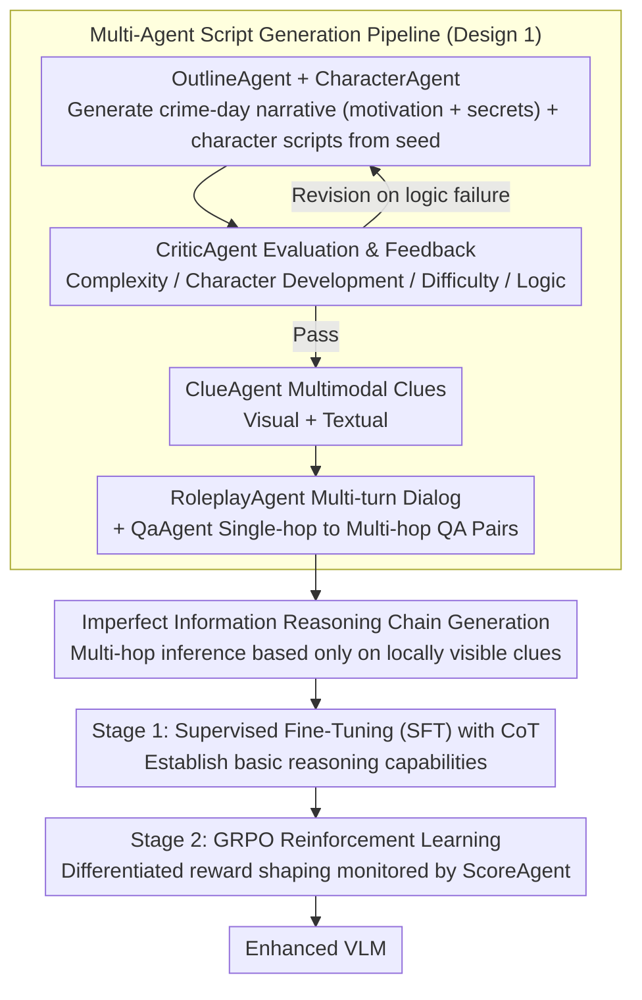

# Collaborative Multi-Agent Scripts Generation for Enhancing Imperfect-Information Reasoning in Murder Mystery Games

**Conference**: ACL 2026 Findings  
**arXiv**: [2604.11741](https://arxiv.org/abs/2604.11741)  
**Code**: None  
**Area**: Multimodal VLM  
**Keywords**: Imperfect-information reasoning, Murder Mystery, Multi-agent data generation, Vision-language model, Reinforcement Learning

## TL;DR
Ours proposes a collaborative multi-agent framework for the automated generation of high-quality Murder Mystery game scripts and training data. Through a two-stage training strategy (CoT fine-tuning + GRPO reinforcement learning with ScoreAgent reward shaping), the multi-hop reasoning capability of VLMs under imperfect information is enhanced. This significantly improves VLM narrative reasoning, fact extraction, and deception resistance on WhodunitBench.

## Background & Motivation

**Background**: Vision-Language Models (VLMs) perform exceptionally well in perception tasks but still degrade in complex multi-hop reasoning involving imperfect information, deception, and multi-player social interactions. Murder Mystery, as a social reasoning game requiring players to infer hidden truths based on partial clues, serves as an ideal testbed for studying such reasoning.

**Limitations of Prior Work**: (1) The Murder Mystery domain lacks large-scale, high-quality datasets for fine-tuning and evaluating VLMs; (2) Manual production of high-quality Murder Mystery scripts is costly and difficult to scale; (3) Existing VLMs struggle with character consistency (murderers need to deceive, innocent players need to cooperate) and multimodal multi-hop reasoning (combining textual and visual clues); (4) Role-playing and interactive discussions lack standard answers, making pure SFT insufficient for training such behaviors.

**Key Challenge**: VLMs need to perform reliable reasoning in incomplete and deceptive information environments, yet they lack appropriate training data and methodologies.

**Goal**: (1) Construct a scalable multi-agent data synthesis framework; (2) Design a two-stage training strategy suitable for imperfect-information reasoning.

**Key Insight**: Utilize a powerful LLM (Gemini 2.5 Pro) as an agent for collaborative game script generation, followed by an agent-monitored training strategy to enhance the target VLM.

**Core Idea**: Collaborative construction of training data via Generation Agents (Story Outline → Character Script → Clues → Dialog → QA) + Evaluation Agents (Quality Control + Reward Shaping), followed by two-stage training (SFT + GRPO with ScoreAgent) to enhance the VLM.

## Method

### Overall Architecture
Ours addresses the poor multi-hop reasoning of VLMs in Murder Mystery scenarios (characterized by "imperfect information + intentional lying") and the lack of relative data/training methods. The solution delegates both "data generation" and "model training" to agents. The system consists of two modules: The Data Generation Module employs six specialized agents in a pipeline to produce everything from story outlines to QA training pairs, specifically generating reasoning chains under "incomplete information" constraints. The Model Enhancement Module follows two stages: Stage 1 uses SFT to establish foundational reasoning capabilities, and Stage 2 employs GRPO reinforcement learning under ScoreAgent reward monitoring to refine role-specific behaviors (e.g., murderers learning to deceive, innocent players learning to cooperate).

### Key Designs

**1. Multi-Agent Script Generation Pipeline: Scalable Synthesis of Logically Consistent Murder Mystery Scripts**

The cost of manual script writing is extremely high and hard to scale, while letting a single model generate an entire script at once often leads to inconsistent motivations and clues. Ours decomposes generation into a relay among six agents with clear roles: OutlineAgent builds the crime-day narrative (motivation + secrets), CharacterAgent details daily actions and interactions for each character, CriticAgent scores and provides feedback across four dimensions (complexity, character development, difficulty, logical consistency), ClueAgent generates multimodal clues (visual + textual), RoleplayAgent simulates multi-turn dialogues, and QaAgent finally produces reasoning chains and QA pairs ranging from single-hop to multi-hop.

The advantage of this design is that the difficulty of "long-range logical consistency" is distributed across stages, with CriticAgent's feedback loop acting as a closed-loop gatekeeper—if any link fails logically, it is sent back for revision rather than hoping for a perfect single-pass generation. Experiments demonstrate that this framework produces diverse and logically consistent data, with CriticAgent's feedback mechanism being the primary guarantee of script quality.

**2. Reasoning Chain Generation under Imperfect Information: Training Data with "Information Incompleteness" Constraints**

Traditional CoT reasoning data assumes complete information by default. However, the core difficulty of Murder Mystery is that each player only sees their own clues and public information. Ours automatically generates reasoning chains "under incomplete information conditions"—for example, players must perform multi-hop inference based on locally visible information rather than an omniscient perspective. This creates a direct contrast with traditional CoT, training the model to "reason within gaps" rather than encountering information fragments for the first time during testing.

**3. ScoreAgent-Monitored GRPO: Creating Reward Signals for "No Standard Answer" Role-playing Behaviors**

Many behaviors in Murder Mystery (self-introductions, discussions, role-playing) do not have ground-truth answers; pure SFT cannot distinguish between "good deception" and "poor exposure." Ours designs different rewards for different data types: For **unverifiable data** (introductions, discussions), ScoreAgent (LLM-as-Judge) scores character consistency. In discussion sessions, an inquiry selection reward $S_{\text{choice}}$ is added—1 point for questioning a suspect, 0.5 points for others, and 0 points for questioning oneself—guiding the model to focus its inquiries on suspicious targets. For **verifiable data** (QA), a weighted combination of answer accuracy, format correctness, and clue matching accuracy is used.

Crucially, this differentiated reward system avoids training a separate reward model for tasks without standard answers—SFT builds foundational capabilities, and GRPO uses ScoreAgent's judgment to distinguish between good and bad role-playing. Ablations show that GRPO particularly improves role-playing behavior, filling the gap left by SFT on "non-standard answer" tasks.

### Full Example: From Seed to Training Sample
Given OutlineAgent a seed like "Manor owner murdered in the study," it first generates the crime-day narrative (the butler is the killer, the motive is inheritance, the secret is an illegitimate identity). CharacterAgent fills the butler, daughter, and doctor's schedules with interactions. CriticAgent's scoring finds that "the doctor's alibi conflicts with the timeline" and sends it back for revision. Once fixed, ClueAgent produces clues (a photo of bloodstains on the study carpet + a torn text fragment of a will), and RoleplayAgent simulates a discussion—the butler intentionally downplays going to the study that night (this is rewarded with a high consistency score by ScoreAgent, as it fits "the killer must deceive"). Finally, QaAgent generates a multi-hop QA: "Who has an inheritance motive and was near the crime scene that night?" The answer requires the player to perform two-hop reasoning by combining the bloodstain image (visual) + the will text (text). This sample thus simultaneously covers imperfect information, deception, multimodality, and multi-hop challenges.

### Loss & Training
Two stages: Stage 1 SFT uses generated script data to establish foundational reasoning; Stage 2 GRPO reinforcement learning uses rule-based weighted rewards for verifiable data and ScoreAgent scores for unverifiable data. This strategy proved effective at both 3B and 7B scales.

## Key Experimental Results

### Main Results (WhodunitBench)

| Method | MMR | CMD | RP | DM | LSU | TIU | MIU |
|------|-----|-----|----|----|-----|-----|-----|
| GPT-4V | 58.75 | 26.43 | 6.43 | 24.2% | 92.40 | 51.88 | 69.25 |
| Gemini-1.5-Pro | 57.39 | 19.20 | 7.22 | 16.9% | - | - | - |
| Qwen2.5-VL-3B | baseline | - | - | - | - | - | - |
| **Qwen2.5-VL-3B + Ours** | **Significant Gain** | **Gain** | **Gain** | **Gain** | **Gain** | **Gain** | **Gain** |

### Ablation Study

| Configuration | Description |
|------|------|
| SFT Only | Basic reasoning established, but poor character consistency |
| SFT + RL w/o ScoreAgent | Inaccurate reward signals, limited improvement |
| **SFT + ScoreAgent GRPO** | Improvement in both character consistency and reasoning quality |

### Key Findings
- **The multi-agent framework successfully generated diverse, logically consistent Murder Mystery data**, and CriticAgent's feedback mechanism significantly improved script quality.
- **The two-stage training is consistently effective across both 3B and 7B scales.**
- **The role-specific reward design of ScoreAgent** enabled the model to learn different behavioral patterns for murderers versus innocent characters.
- **GRPO's improvement on role-playing behavior is particularly significant**—SFT is less effective for training behaviors without standard answers.
- **Characteristics of low-scoring examples are clear**: drifting off-topic, self-contradiction, or premature identity exposure.

## Highlights & Insights
- **Modeling Murder Mystery as a reasoning training platform for VLMs** is a clever task choice—it encompasses challenges like imperfect information, deception detection, multi-hop reasoning, and multimodal integration.
- **The differentiated reward design of ScoreAgent** (different reward functions for verifiable vs. unverifiable data) is a practical solution that avoids training independent reward models for tasks without ground truth.
- **Scalability of the data generation framework**: By adding or adjusting specialized agents, it can be adapted to other game-theoretic tasks (e.g., Werewolf, courtroom simulations).

## Limitations & Future Work
- WhodunitBench contains only 50 scripts, limiting the evaluation scale.
- The quality of generated scripts depends on Gemini 2.5 Pro, which is costly.
- Role-playing evaluation still relies heavily on LLM-as-Judge, which is subjective.
- Real multi-player interactive training between multiple VLMs has not been explored.
- Visual clues are currently simple and do not involve complex scene understanding (e.g., surveillance video analysis).
- Diversity of training data is limited by the creativity of the generation agents.

## Related Work & Insights
- **vs WhodunitBench (Xie et al., 2024)**: WhodunitBench provides an evaluation platform but lacks data. Ours provides both a data generation framework and training methods.
- **vs AgentInstruct / MATRIX**: These focus on generic synthetic data; ours focuses on structured data generation for imperfect-information game scenarios.
- **vs Reason-RFT / SRPO**: Generic reasoning enhancement methods; ours' ScoreAgent design is specialized for character consistency.

## Rating
- Novelty: ⭐⭐⭐⭐ Using Murder Mystery as a VLM reasoning training scenario is novel; the multi-agent generation framework is well-designed.
- Experimental Thoroughness: ⭐⭐⭐ WhodunitBench scale is limited, and specific figures are somewhat incomplete.
- Writing Quality: ⭐⭐⭐⭐ The framework description is clear, though lengthy.
- Value: ⭐⭐⭐⭐ Significant contribution to VLM reasoning training under imperfect information.

<!-- RELATED:START -->

## Related Papers

- [\[CVPR 2025\] Collaborative Tree Search for Enhancing Embodied Multi-Agent Collaboration](../../CVPR2025/multi_agent/collaborative_tree_search_for_enhancing_embodied_multi-agent_collaboration.md)
- [\[AAAI 2026\] MAPS: Multi-Agent Personality Shaping for Collaborative Reasoning](../../AAAI2026/multi_agent/maps_multi-agent_personality_shaping_for_collaborative_reaso.md)
- [\[ICML 2026\] Systematic Failures in Collective Reasoning under Distributed Information in Multi-Agent LLMs](../../ICML2026/multi_agent/systematic_failures_in_collective_reasoning_under_distributed_information_in_mul.md)
- [\[ACL 2025\] GETReason: Enhancing Image Context Extraction through Hierarchical Multi-Agent Reasoning](../../ACL2025/multi_agent/getreason_enhancing_image_context_extraction_through_hierarchical_multi-agent_re.md)
- [\[ICLR 2026\] AgentPO: Enhancing Multi-Agent Collaboration via Reinforcement Learning](../../ICLR2026/multi_agent/agentpo_enhancing_multi-agent_collaboration_via_reinforcement_learning.md)

<!-- RELATED:END -->
