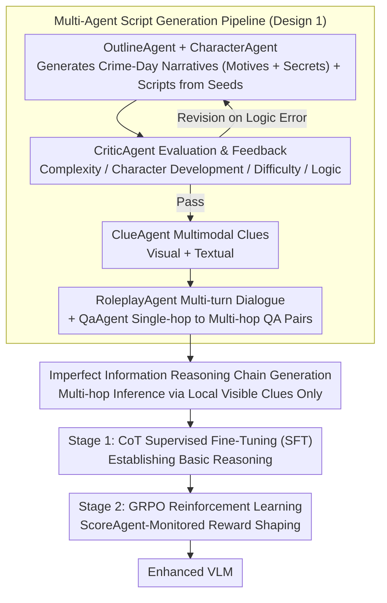

# Collaborative Multi-Agent Scripts Generation for Enhancing Imperfect-Information Reasoning in Murder Mystery Games

**Conference**: ACL 2026 Findings  
**arXiv**: [2604.11741](https://arxiv.org/abs/2604.11741)  
**Code**: None  
**Area**: Multimodal VLM  
**Keywords**: Imperfect-Information Reasoning, Murder Mystery Game, Multi-Agent Data Generation, Visual-Language Models, Reinforcement Learning

## TL;DR
A collaborative multi-agent framework is proposed to automatically generate high-quality murder mystery game scripts and training data. Through a two-stage training strategy (CoT Fine-tuning + GRPO Reinforcement Learning with ScoreAgent reward shaping), it enhances VLM's multi-hop reasoning capabilities under imperfect information, significantly improving narrative reasoning, fact extraction, and deception resistance on WhodunitBench.

## Background & Motivation

**Background**: Visual-Language Models (VLMs) perform excellently in perception tasks but still degrade in complex multi-hop reasoning involving imperfect information, deception, and multi-player social interactions. Murder Mystery games, as a form of social reasoning, require players to infer hidden truths based on partial clues, making them an ideal testbed for studying such reasoning.

**Limitations of Prior Work**: (1) The murder mystery domain lacks large-scale high-quality datasets for fine-tuning and evaluating VLMs; (2) Manual production of high-quality scripts is expensive and difficult to scale; (3) Existing VLMs perform poorly in character consistency (killers need to deceive, innocents need to cooperate) and multimodal multi-hop reasoning (combining text and visual clues); (4) Role-playing and interactive discussions lack standard answers, making pure SFT insufficient for training such behaviors.

**Key Challenge**: VLMs need to conduct reliable reasoning in environments with imperfect and deceptive information, yet they lack suitable training data and methodologies.

**Goal**: (1) Build a scalable multi-agent data synthesis framework; (2) Design a two-stage training strategy suitable for imperfect-information reasoning.

**Key Insight**: Utilize powerful LLMs (Gemini 2.5 Pro) as Agents to collaboratively generate game scripts, and then use Agent-monitored training strategies to enhance the target VLM.

**Core Idea**: Generative Agents (Story Outline → Character Scripts → Clues → Dialogues → QA) + Evaluative Agents (Quality Control + Reward Shaping) collaboratively construct training data; Two-stage training (SFT + GRPO with ScoreAgent) enhances the VLM.

## Method

### Overall Architecture
To solve the issue where VLMs struggle with multi-hop reasoning in "imperfect information + intentional lying" scenarios, this paper delegates both "data generation" and "model training" to agents. The system consists of two main modules: the Data Generation Module utilizes a pipeline of six specialized agents to generate everything from story outlines to QA training pairs, specifically following "imperfect information" constraints for reasoning chains; the Model Enhancement Module follows two stages—Stage 1 uses SFT to establish basic reasoning, and Stage 2 uses GRPO Reinforcement Learning under ScoreAgent reward monitoring to refine character-specific behaviors (e.g., killers learning to deceive and innocents learning to cooperate).

### Key Designs

**1. Multi-Agent Script Generation Pipeline: Scalable Synthesis of Logically Consistent Murder Mystery Scripts**

Manually writing murder mystery scripts is costly and hard to scale, while letting a single model generate an entire book in one go often leads to mismatched motives and clues or logical contradictions. This paper decomposes generation into a relay of six specialized agents: OutlineAgent sets the crime-day narrative (motives + secrets), CharacterAgent details daily actions and interactions, CriticAgent scores and provides feedback across four dimensions (complexity, character development, difficulty, logic), ClueAgent generates multimodal clues (visual + text), RoleplayAgent simulates multi-turn dialogues, and QaAgent finally produces reasoning chains and QA pairs ranging from single-hop to multi-hop.

The advantage of this design is distributing the difficulty of "long-range logical consistency" across various stages and using CriticAgent's feedback loop for quality control—revising any stage where logic fails rather than hoping for a perfect single-pass generation. Experiments show this framework produces diverse and logically consistent data, with the CriticAgent's feedback mechanism being the primary guarantee of script quality.

**2. Inference Chain Generation under Imperfect Information: Integrating Constraints into Training Data**

Traditional CoT reasoning data assumes complete information, but the core challenge of murder mysteries is that each player only sees their own clues and public information. This paper automatically generates reasoning chains under "incomplete information conditions"—for example, players must make multi-hop inferences based only on locally visible information rather than a god-view perspective. This directly contrasts with traditional CoT, training the model to "reason through gaps" rather than encountering information deficiency for the first time during testing.

**3. ScoreAgent-Monitored GRPO: Creating Reward Signals for "No Standard Answer" Role-playing**

Many behaviors in murder mysteries (self-introductions, discussions, role-playing) have no ground-truth answers; pure SFT cannot distinguish between "good deception" and "poor exposure." This paper designs different rewards for different data types: For **non-verifiable data** (self-intros, discussions), ScoreAgent (LLM-as-Judge) scores character consistency. A question-selection reward $S_{\text{choice}}$ is added during discussions—1 point for questioning suspects, 0.5 points for others, and 0 points for questioning oneself—guiding the model to focus its questioning on suspects. For **verifiable data** (QA), a weighted combination of answer accuracy, format correctness, and clue matching is used.

The key is that this differentiated reward system avoids training a separate reward model for tasks without standard answers—SFT establishes basic capabilities, and GRPO uses ScoreAgent's judgments to distinguish good from bad role-playing. Ablations show GRPO significantly improves role-playing behavior, filling the gap left by SFT.

### Loss & Training
Two stages: Stage 1 SFT uses generated script data to establish basic reasoning capabilities; Stage 2 GRPO reinforcement learning uses rule-based weighted rewards for verifiable data and ScoreAgent scores for non-verifiable data. This is effective for both 3B and 7B scales.

## Key Experimental Results

### Main Results (WhodunitBench)

| Method | MMR | CMD | RP | DM | LSU | TIU | MIU |
|------|-----|-----|----|----|-----|-----|-----|
| GPT-4V | 58.75 | 26.43 | 6.43 | 24.2% | 92.40 | 51.88 | 69.25 |
| Gemini-1.5-Pro | 57.39 | 19.20 | 7.22 | 16.9% | - | - | - |
| Qwen2.5-VL-3B | baseline | - | - | - | - | - | - |
| **Qwen2.5-VL-3B + Ours** | **Significant Gain** | **Gain** | **Gain** | **Gain** | **Gain** | **Gain** | **Gain** |

### Ablation Study

| Configuration | Description |
|------|------|
| SFT Only | Basic reasoning established, but poor character consistency |
| SFT + RL (No ScoreAgent) | Inaccurate reward signals, limited improvement |
| **SFT + ScoreAgent GRPO** | Gains in both character consistency and reasoning quality |

### Key Findings
- **The multi-agent framework successfully generates diverse, logically consistent murder mystery data**, with the CriticAgent's feedback mechanism significantly improving script quality.
- **Two-stage training is consistently effective across both 3B and 7B scales**.
- **ScoreAgent's character-specific reward design** enables the model to learn different behavioral patterns for killers and innocents.
- **GRPO's improvement on role-playing behavior is particularly notable**—SFT has limited effectiveness for behaviors without standard answers.
- **Low-score samples exhibit clear features**: going off-topic, self-contradiction, or premature identity exposure.

## Highlights & Insights
- **Modeling murder mysteries as a reasoning training platform for VLMs** is a clever task choice—it covers challenges like imperfect information, deception detection, multi-hop reasoning, and multimodal integration.
- **Differentiated reward design via ScoreAgent** (verifiable vs. non-verifiable data) is a practical solution that avoids training independent reward models for tasks without ground truth.
- **Scalability of the data generation framework**: By adding or adjusting specialized agents, it can be adapted to other game-theory tasks (e.g., Werewolf, courtroom simulations).

## Limitations & Future Work
- WhodunitBench contains only 50 scripts, limiting evaluation scale.
- Generated script quality depends on Gemini 2.5 Pro's capabilities, which can be costly.
- Role-playing evaluation still relies heavily on LLM-as-Judge, which is subjective.
- Multi-player interaction training between multiple VLMs has not been explored.
- Visual clues are currently simple and do not involve complex scene understanding (e.g., surveillance video analysis).
- Training data diversity is constrained by the creativity of the generative agents.

## Related Work & Insights
- **vs. WhodunitBench (Xie et al., 2024)**: WhodunitBench provides an evaluation platform but lacks data. This paper provides a data generation framework and training methodology.
- **vs. AgentInstruct / MATRIX**: These focus on general synthetic data; this paper focuses on structured data generation for imperfect-information game scenarios.
- **vs. Reason-RFT / SRPO**: General reasoning enhancement methods; this paper's ScoreAgent design is specialized for character consistency.

## Rating
- Novelty: ⭐⭐⭐⭐ Utilizing murder mysteries for VLM reasoning training is novel; multi-agent data generation is well-designed.
- Experimental Thoroughness: ⭐⭐⭐ WhodunitBench scale is limited; specific numerical results are somewhat incomplete.
- Writing Quality: ⭐⭐⭐⭐ Framework description is clear, though lengthy.
- Value: ⭐⭐⭐⭐ Unique contribution to VLM reasoning training under imperfect information.

<!-- RELATED:START -->

## Related Papers

- [\[CVPR 2025\] Collaborative Tree Search for Enhancing Embodied Multi-Agent Collaboration](../../CVPR2025/multi_agent/collaborative_tree_search_for_enhancing_embodied_multi-agent_collaboration.md)
- [\[ACL 2025\] GETReason: Enhancing Image Context Extraction through Hierarchical Multi-Agent Reasoning](../../ACL2025/multi_agent/getreason_enhancing_image_context_extraction_through_hierarchical_multi-agent_re.md)
- [\[AAAI 2026\] MAPS: Multi-Agent Personality Shaping for Collaborative Reasoning](../../AAAI2026/multi_agent/maps_multi-agent_personality_shaping_for_collaborative_reaso.md)
- [\[ICML 2026\] Systematic Failures in Collective Reasoning under Distributed Information in Multi-Agent LLMs](../../ICML2026/multi_agent/systematic_failures_in_collective_reasoning_under_distributed_information_in_mul.md)
- [\[CVPR 2026\] Paper2Figure: A Multi-Agent Collaborative System for Figure Generation Towards Academic Research Paper](../../CVPR2026/multi_agent/paper2figure_a_multi-agent_collaborative_system_for_figure_generation_towards_ac.md)

<!-- RELATED:END -->
