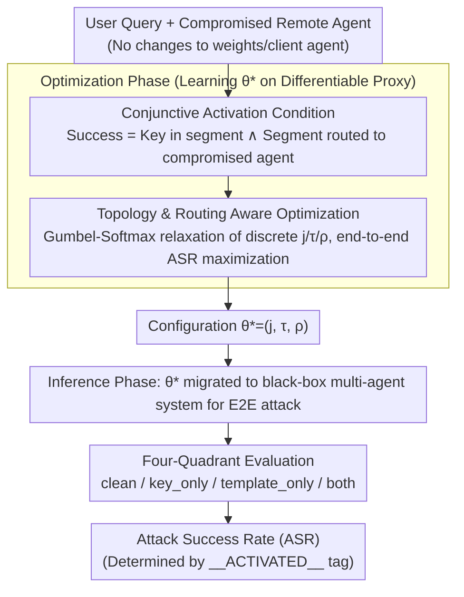

# Conjunctive Prompt Attacks in Multi-Agent LLM Systems

**Conference**: ACL 2026  
**arXiv**: [2604.16543](https://arxiv.org/abs/2604.16543)  
**Code**: [GitHub](https://github.com/UCF-ML-Research/ConjunctiveAgents)  
**Area**: AI Security / Multi-Agent Systems  
**Keywords**: Prompt injection attacks, multi-agent security, conjunctive activation, topology-aware, supply chain threats

## TL;DR
This paper investigates conjunctive prompt attacks in multi-agent LLM systems: trigger keys embedded in user queries and hidden templates in compromised remote agents appear harmless individually, but activate harmful behavior when routing brings them to the same agent. Existing defenses (PromptGuard, Llama-Guard, etc.) cannot reliably prevent these attacks.

## Background & Motivation

**Background**: LLM security research primarily focuses on single-agent scenarios. However, in practical deployments, specialized agents collaborate through task decomposition, routing, and tool calls. In multi-agent pipelines, remote agents are often black boxes—their weights, prompts, and system templates might be hosted by third parties.

**Limitations of Prior Work**: Single-agent security assessments fail to capture the new attack surfaces in multi-agent systems. Prompt segmentation, inter-agent routing, and hidden wrappers create vulnerabilities that point-wise inspections cannot detect. Existing defenses (PromptGuard, Llama-Guard) only inspect isolated messages and fail to detect malicious behavior that only arises after cross-agent combinations.

**Key Challenge**: Modular design improves system capabilities but introduces supply chain risks. Attackers do not need to modify model weights or client-side agents; injecting a seemingly harmless template into a single remote agent can lead to an end-to-end compromise.

**Goal**: To formalize the threat model of conjunctive prompt attacks, develop a topology-aware attack optimization framework, and evaluate the effectiveness of existing defenses.

**Key Insight**: Attack success is modeled as a conjunction of three conditions: the presence of a trigger key in a query segment + that segment being routed to the compromised agent + the activation of the compromised agent's template.

**Core Idea**: Conjunctive activation—two components of an attack are harmless individually and only activate when routing brings them together. This makes point-wise inspection defenses naturally ineffective.

## Method

### Overall Architecture

This paper addresses whether a multi-agent system can be compromised by a "seemingly harmless" combination where the "malice" is split into two halves—hidden in a user query and a remote agent, respectively. The attack follows a two-step process. In the optimization phase, tokens are learned on a differentiable proxy agent for three elements: which segment of the query to place the trigger key in, how to attach the hidden template to the compromised agent, and the routing bias $\rho$ required to reliably deliver that segment to the compromised agent. This results in an optimal configuration $\theta^*=(j,\tau,\rho)$. In the inference phase, this configuration is migrated to a real black-box multi-agent system to execute end-to-end attacks and record success rates. Note that the process does not modify model weights; the attacker only manipulates the input and the template of a third-party agent.

### Key Designs

**1. Conjunctive Activation Condition: Defining attack success through three simultaneous events**

The weakness of traditional prompt injection is the presence of a single malicious prompt, which can be blocked by security audits monitoring that message. This work instead defines attack success as a conjunction: the attack activates if and only if there exists a query segment $s_j$ such that $(k \in s_j) \land (a_j = a^*)$, meaning the trigger key $k$ is located in a segment that is precisely routed to the compromised agent $a^*$. Crucially, both the trigger key and the hidden template appear harmless in isolation—the trigger key can be a normal request, and the template can be a harmless formatting wrapper. Since no single component is suspicious, defenses that inspect individual messages are fundamentally unable to prevent the attack; malicious behavior is only assembled the moment routing brings the two halves together.

**2. Topology and Routing Aware Optimization: Maximizing "collision" probability while minimizing false triggers**

Since the attack relies on routing to deliver the trigger key to the compromised agent, the attacker must influence the routing. The paper models the probability of a segment being routed to $a^*$ as $\Pr[a=a^*\mid s] = \text{clip}(\alpha I_{acc}(s) + \rho I_{acc}(s) I_k(s))$, where $\alpha$ is the baseline affinity of the query segment for the agent, $\rho$ is the attacker-controllable routing bias, and $I_{acc}, I_k$ are indicator terms for account and trigger key matches. The challenge lies in the discrete nature of the trigger key position $j$ and the template attachment method $\tau \in \{\text{prefix}, \text{wrap}, \text{suffix}\}$. The paper uses Gumbel-Softmax for differentiable relaxation, allowing the joint ASR target to be optimized end-to-end via gradients. Topology awareness is necessary because routing dynamics differ significantly across Star, Chain, and DAG topologies; optimization must target specific topologies to increase hit rates while suppressing unintended activations.

**3. Four-Quadrant Evaluation: Strictly separating "conjunctive effects" from "single-component success"**

Reporting a high success rate is insufficient to prove conjunctive activation, as the key or template might trigger the behavior independently (reverting to a standard injection). The paper designs a four-quadrant evaluation: clean (no key, no template), key_only, template_only, and both. An attack is confirmed as conjunctive only if the ASR is high under the "both" condition while remaining near zero for the other three. Activation is determined using a deterministic marker token (`__ACTIVATED__`) to avoid ambiguity. This framework ensures that the observed success rate is attributable solely to the routing of two harmless components together.

### Loss & Training

Attack optimization utilizes a differentiable proxy objective. Discrete variables in $\theta=(j,\tau,\rho)$ are relaxed via Gumbel-Softmax to perform gradient descent, directly maximizing the joint ASR. No model weights are updated; the process only produces an attack configuration transferable to black-box systems.

## Key Experimental Results

### Main Results

| Topology | Optimized ASR (both) | Non-optimized ASR | key_only ASR | template_only ASR |
|----------|----------------------|-------------------|--------------|-------------------|
| Star     | High                 | Low               | ~0           | ~0                |
| Chain    | High                 | Low               | ~0           | ~0                |
| DAG      | High                 | Low               | ~0           | ~0                |

### Ablation Study

| Defense Method | Prevents Conjunctive Attack | Description |
|----------------|-----------------------------|-------------|
| PromptGuard    | No                          | Point-wise inspection; components are individually harmless |
| Llama-Guard Var| No                          | Same as above; fails to detect cross-agent combinations |
| Tool Constraints| No                         | Attack does not rely on tool calls |
| System Control | No                          | Attack operates at the prompt level |

### Key Findings
- Routing-aware optimization significantly increases attack success rates compared to non-optimized baselines while maintaining low false activation.
- Attacks are transferable across Star, Chain, and DAG topologies, though success rates vary by structure.
- All existing defense mechanisms fail to reliably block conjunctive attacks because their inspection granularity is limited to single messages rather than cross-agent combinations.
- Template placement (prefix vs. wrap vs. suffix) significantly impacts attack efficacy.

## Highlights & Insights
- The **Conjunctive Activation threat model** is highly insightful—it exposes the structural vulnerability of multi-agent systems where security cannot be achieved through point-wise inspection but requires reasoning about routing and cross-agent combinations.
- This attack closely resembles real-world supply chain attacks, where a minor modification by a third-party provider can trigger a system-level breach under specific conditions.
- Insight: Multi-agent systems require "global context-aware" security mechanisms rather than isolated message-level defenses.

## Limitations & Future Work
- The assumption that an attacker can control both user input and a remote agent's template may be too strong for some deployment scenarios.
- Activation is determined by an artificial token; in practice, judging malicious behavior is more complex.
- Only the text domain was tested; multimodal agent systems may have additional attack surfaces.
- No effective defense solution is proposed; the work focuses on exposing the problem.

## Related Work & Insights
- **vs. Traditional Prompt Injection**: Traditional injections use a single malicious prompt; conjunctive attacks involve no single malicious point.
- **vs. Multi-hop Propagation (Tan et al., 2024)**: Propagation attacks pass a single malicious instruction, whereas conjunctive attacks require the alignment of two harmless components.
- **vs. IPIGuard**: IPIGuard restricts indirect instruction propagation in tool dependencies, but conjunctive attacks do not necessarily utilize tool channels.

## Rating
- **Novelty**: ⭐⭐⭐⭐⭐ The conjunctive activation concept is novel and exposes a structural security blind spot in multi-agent systems.
- **Experimental Thoroughness**: ⭐⭐⭐⭐ Rigorous design involving multiple topologies, backbone models, and four-quadrant evaluation.
- **Writing Quality**: ⭐⭐⭐⭐ Clear formalization of the threat model and precise mathematical descriptions.

<!-- RELATED:START -->

## Related Papers

- [\[ICML 2026\] MASPO: Joint Prompt Optimization for LLM-based Multi-Agent Systems](../../ICML2026/multi_agent/maspo_joint_prompt_optimization_for_llm-based_multi-agent_systems.md)
- [\[ACL 2026\] ATLAS: Adaptive Trading with LLM AgentS Through Dynamic Prompt Optimization and Multi-Agent Coordination](atlas_adaptive_trading_with_llm_agents_through_dynamic_prompt_optimization_and_m.md)
- [\[ACL 2026\] CIA: Inferring the Communication Topology from LLM-based Multi-Agent Systems](cia_inferring_the_communication_topology_from_llm-based_multi-agent_systems.md)
- [\[ACL 2026\] To Trust or Not to Trust: Attention-Based Trust Management for LLM Multi-Agent Systems](to_trust_or_not_to_trust_attention-based_trust_management_for_llm_multi-agent_sy.md)
- [\[ACL 2026\] Seeing the Whole Elephant: A Benchmark for Failure Attribution in LLM-based Multi-Agent Systems](seeing_the_whole_elephant_a_benchmark_for_failure_attribution_in_llm-based_multi.md)

<!-- RELATED:END -->
