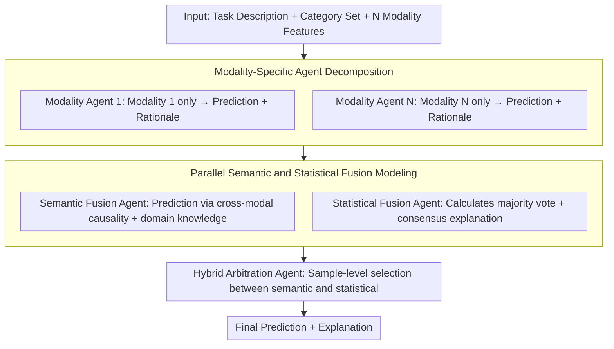

# ConSensus: Multi-Agent Collaboration for Multimodal Sensing

**Conference**: ACL2026 Findings  
**arXiv**: [2601.06453](https://arxiv.org/abs/2601.06453)  
**Code**: https://github.com/nokia/multi-agent-collaboration-for-multimodal-sensing  
**Area**: Multimodal Sensing / LLM Agent  
**Keywords**: Multi-agent collaboration, Multimodal sensing, Sensor fusion, Statistical consensus, Semantic fusion  

## TL;DR
ConSensus is a training-free multi-agent sensor fusion framework that assigns different sensing modalities to specialized agents for independent interpretation. It then utilizes semantic fusion, statistical consensus, and hybrid arbitration to derive final judgments. Across five multimodal sensing benchmarks, it achieves an average accuracy improvement of 7.1% over single-agent methods while reducing fusion token costs to approximately 1/12.7 of multi-round debate methods.

## Background & Motivation
**Background**: LLMs are increasingly utilized to interpret real-world sensor data, such as motion recognition, sleep stage identification, stress detection, and health monitoring. A common approach involves embedding statistical features from multiple sensors into a single prompt for a single LLM to perform inference in one go.

**Limitations of Prior Work**: Heterogeneous sensors vary in information density, reliability, and semantic meaning. A single agent tends to overlook certain modalities or be dominated by one prominent modality. Furthermore, pure LLM judges are influenced by prior knowledge (e.g., over-relying on medically significant ECG), while pure majority voting is fragile when sensors are missing or noise is high.

**Key Challenge**: Multimodal sensing requires both semantic understanding and statistical robustness. Semantic aggregation can identify sensor failures and contextual clues but suffers from knowledge bias; statistical voting can suppress individual agent errors but depends on voters being reliable and independent. In real-world sensing environments, these two conditions are often simultaneously violated.

**Goal**: The authors aim to propose a training-agnostic, model-agnostic collaboration protocol that can be deployed across various sensing tasks, enabling LLMs to fuse heterogeneous modalities more robustly without re-training sensor encoders.

**Key Insight**: This work decomposes a "one-size-fits-all" multimodal prompt into multiple modality-aware agents, where each agent interprets only one sensing modality. It then explicitly introduces three types of roles—semantic fusion, statistical fusion, and final hybrid arbitration—to balance different inductive biases.

**Core Idea**: Each sensing modality speaks independently first. The final fusion agent then observes both the "semantic interpretation" and the "statistical consensus," allowing for dynamic selection between knowledge bias and voting vulnerability.

## Method

The core of ConSensus is not training a new model but designing a multi-agent reasoning workflow. Given a task description and $N$ sensing modalities, the system assigns a specialized agent to each modality to output a prediction and interpretation. Subsequently, three fusion agents sequentially perform semantic aggregation, statistical consensus, and final hybrid arbitration.

### Overall Architecture

The input consists of the task description, category sets, and multimodal sensor features. In the first layer, each modality agent receives only features from a single modality and the task instructions, outputting its own prediction $\hat{y}_i$ and rationale $r_i$. These unimodal conclusions are simultaneously sent to two parallel fusion agents: the semantic fusion agent integrates cross-modal semantic evidence for a knowledge-driven prediction, while the statistical fusion agent provides a consensus-driven explanation centered on the majority vote. Finally, the hybrid fusion agent reads both streams to output the final category and explanation. The entire process relies solely on prompts and LLM calls without any supervised training. The main experiments use gpt-oss-20B with temperature set to 0, evaluating accuracy across five sensing tasks.

### Key Designs

**1. Modality-Specific Agent Decomposition: Ensuring independent interpretation of each weak signal**

When a single agent processes all sensor features in one large prompt, common issues include context overload and modality dominance (where weak signals are drowned out by prominent modalities). ConSensus decomposes the prompt: the $i$-th agent only sees modality $m_i$ and task $T$, forced to explicitly state evidence for that modality and output $(\hat{y}_i, r_i)$. This ensures that even modalities with low information density have a distinct voice before fusion.

**2. Parallel Semantic and Statistical Fusion Modeling: Cultivating two mutually exclusive inductive biases**

The difficulty in fusion lies in the fact that no single bias is always correct. Semantic aggregation excels at detecting sensor failures and reading contextual clues but is prone to over-reliance on priors (e.g., blindly trusting ECG in medical contexts). Majority voting reduces the impact of a single erroneous agent, but only if voters are reliable and independent—a premise that fails during sensor loss or high noise. ConSensus cultivates two parallel agents: the semantic fusion agent provides predictions based on cross-modal causality and domain knowledge after reading all $(\hat{y}_i, r_i)$, while the statistical fusion agent calculates the majority vote $\hat{y}_{vote}=\arg\max_c \sum_i \mathbf{1}[\hat{y}_i=c]$ and generates an explanation for it. Their respective blind spots offset each other, preparing independent evidence sources for sample-level selection.

**3. Hybrid Arbitration Agent: Dynamic decision-making per sample**

Optimal fusion rules are not fixed; the most reliable evidence source changes based on specific samples, missingness patterns, and noise levels. The hybrid fusion agent observes both $(\hat{y}_{sem}, r_{sem})$ and $(\hat{y}_{stat}, r_{stat})$, providing the final prediction $\hat{y}$ based on the current reliability of the rationales. Instead of simple averaging, the LLM determines on a per-sample basis whether to trust semantic consistency or statistical stability. This step provides significant gains: when statistical certainty drops (e.g., high missingness), the agent pivots to semantic interpretation, avoiding the rapid performance degradation of pure voting.

### Loss & Training

ConSensus is a training-free method with no parameter updates or loss functions. All models run deterministic inference using 1-shot in-context learning, representing sensor features as structured text prompts. The "training strategy" is essentially the inference-time protocol design: a single round of modality interpretation followed by a single round of semantic/statistical/hybrid fusion, rather than Self-Consistency or multi-round debate.

## Key Experimental Results

### Main Results

| Method | WESAD | SleepEDF | ActionSense | MMFit | PAMAP2 | Avg. | Extra Fusion Tokens |
|------|-------|----------|-------------|-------|--------|------|----------------|
| Single-Agent | 0.793 | 0.519 | 0.577 | 0.819 | 0.551 | 0.652 | None |
| Self-Consistency | 0.786 | 0.541 | 0.555 | 0.862 | 0.547 | 0.658 | Multi-path sampling |
| Self-Refine | 0.747 | 0.551 | 0.566 | 0.822 | 0.563 | 0.650 | Two refinement rounds |
| Debate | 0.873 | 0.548 | 0.609 | 0.984 | 0.561 | 0.715 | ~76K |
| ReConcile | 0.880 | 0.571 | 0.640 | 0.964 | 0.579 | 0.727 | ~78.6K |
| Semantic Fusion | 0.825 | 0.580 | 0.605 | 0.964 | 0.559 | 0.707 | ~6K |
| Statistical Fusion | 0.927 | 0.592 | 0.597 | 0.960 | 0.534 | 0.722 | ~6K |
| **Ours** (ConSensus) | 0.880 | 0.600 | 0.611 | 0.967 | 0.558 | 0.723 | ~6K |

ConSensus improves accuracy by an average of 7.1 percentage points over Single-Agent. While its accuracy is slightly lower than ReConcile's 0.727, it requires only one round of fusion, reducing aggregation tokens from ~78.6K to 6K—a 12.7x reduction in cost compared to typical multi-agent debate.

### Ablation Study

| Experiment | Key Experimental Results | Explanation |
|------|----------|------|
| Semantic vs Statistical | Statistical Fusion Avg 0.722, Semantic Fusion Avg 0.707 | Statistical consensus is stronger overall, but optimal strategies vary by dataset. |
| Hybrid Fusion | Outperforms semantic/statistical branches on SleepEDF, ActionSense, MMFit | Hybrid agents select more reliable biases at the sample level. |
| Missing Modality Robustness | Statistical Fusion drops to 41.4% at 50% missingness; Semantic Fusion holds 59.9% | Pure voting is highly fragile under high missingness. |
| ConSensus vs Statistical | 9.1% and 18.4% higher at 30% and 50% missingness respectively | Hybrid pivots to semantic explanation when statistical certainty decreases. |
| Small Model Generalization | Single-Agent 0.293 vs ConSensus 0.456 on Llama-3.1-8B | Small models gain +16.3 points via agent decomposition. |

### Key Findings
- Modality decomposition itself is critical. Even without hybrid fusion, semantic/statistical fusion significantly outperforms a single agent.
- Although ReConcile yields high accuracy, its token cost is prohibitive; ConSensus serves as a structured single-round protocol that approaches debate-level performance.
- Statistical voting is useful for tasks where semantic priors might mislead (like WESAD), but it degrades rapidly with missing modalities.
- ConSensus is particularly valuable for small models. The single-agent performance of Llama-3.1-8B is weak, but multi-agent decomposition provides substantial relative gains.

## Highlights & Insights
- The most insightful aspect is explicitly splitting "fusion" into two inductive biases rather than letting a single judge decide. Semantic interpretation and statistical consensus have complementary blind spots.
- Improving performance across multiple datasets without training sensor models makes this approach highly suitable for real-world deployment where labeled data is scarce.
- Majority voting in sensor fusion is not inherently reliable. Missing modalities violate the assumptions of voter independence and reliability, a principle that applies to multimodal LLM systems as well.
- This work suggests that in multimodal tasks, constructing an intermediate interpretation layer to preserve evidence from each modality is superior to stuffing all inputs into a single context window.

## Limitations & Future Work
- The scale of experiments is limited by the reasoning costs of multi-agent systems. The authors used computable subsets of datasets rather than full data.
- The current evaluation focuses primarily on classification tasks; standard benchmarks for open-ended generative sensing or subjective reasoning are still lacking.
- ConSensus has not yet integrated Self-Consistency, Self-Refine, or confidence-aware debate, which could further push its performance upper bound.
- Future work could explicitly model sensor reliability, such as weighted voting, using tools to estimate signal quality, or learning modality reliability from historical sensor streams.

## Related Work & Insights
- **vs Single-Agent Sensing**: Single agents merge all features into one prompt, often missing specific modality evidence; ConSensus ensures each signal is interpreted independently.
- **vs Multi-Agent Debate**: Methods like MAD and ReConcile rely on multi-round interactions, which are effective but token-expensive; ConSensus uses fixed fusion roles for one-shot aggregation.
- **vs Supervised Fusion**: Traditional methods require task-specific training; ConSensus achieves training-free inference via LLM world knowledge and prompt protocols, though it remains dependent on the LLM's ability to understand textual sensor features.

## Rating
- Novelty: ⭐⭐⭐⭐ Clearly designed multi-agent collaboration for heterogeneous sensor fusion with a distinct split between semantic and statistical biases.
- Experimental Thoroughness: ⭐⭐⭐⭐ Covers 5 datasets, 12 modalities, multiple backbones, and missing modality experiments; limited only by computational costs for full-scale evaluation.
- Writing Quality: ⭐⭐⭐⭐ Coherent motivation and observations; rich information in tables.
- Value: ⭐⭐⭐⭐ Highly relevant for training-free sensing and multimodal agent systems, especially in low-annotation or low-budget scenarios.

<!-- RELATED:START -->

## Related Papers

- [\[ICLR 2026\] MMedAgent-RL: Optimizing Multi-Agent Collaboration for Multimodal Medical Reasoning](../../ICLR2026/multi_agent/mmedagent-rl_optimizing_multi-agent_collaboration_for_multimodal_medical_reasoni.md)
- [\[ACL 2025\] Voting or Consensus? Decision-Making in Multi-Agent Debate](../../ACL2025/multi_agent/voting_or_consensus_decision-making_in_multi-agent_debate.md)
- [\[ACL 2026\] PosterForest: Hierarchical Multi-Agent Collaboration for Scientific Poster Generation](posterforest_hierarchical_multi-agent_collaboration_for_scientific_poster_genera.md)
- [\[AAAI 2026\] LLandMark: A Multi-Agent Framework for Landmark-Aware Multimodal Interactive Video Retrieval](../../AAAI2026/multi_agent/llandmark_a_multi-agent_framework_for_landmark-aware_multimodal_interactive_vide.md)
- [\[ACL 2026\] Scaling External Knowledge Input Beyond Context Windows of LLMs via Multi-Agent Collaboration](scaling_external_knowledge_input_beyond_context_windows_of_llms_via_multi-agent_.md)

<!-- RELATED:END -->
