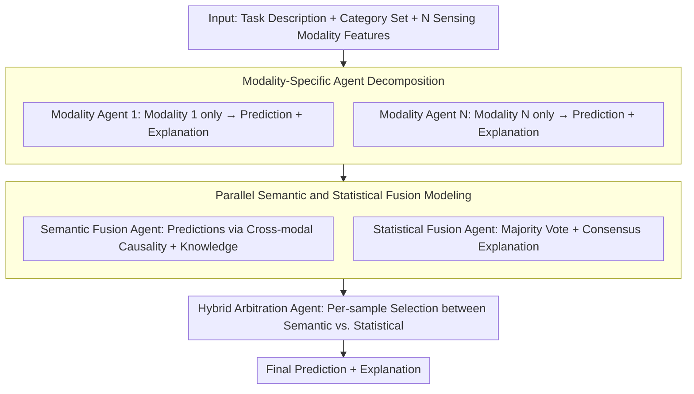

# ConSensus: Multi-Agent Collaboration for Multimodal Sensing

**Conference**: ACL2026 Findings  
**arXiv**: [2601.06453](https://arxiv.org/abs/2601.06453)  
**Code**: https://github.com/nokia/multi-agent-collaboration-for-multimodal-sensing  
**Area**: Multimodal Sensing / LLM Agent  
**Keywords**: Multi-agent collaboration, Multimodal sensing, Sensor fusion, Statistical consensus, Semantic fusion  

## TL;DR
ConSensus is a training-free multi-agent sensor fusion framework that assigns specialized agents to independently interpret different sensing modalities. By utilizing semantic fusion, statistical consensus, and hybrid arbitration, it achieves an average 7.1% accuracy improvement over single-agent methods across five multimodal sensing benchmarks, while reducing fusion token costs to approximately 1/12.7 of multi-round debate methods.

## Background & Motivation
**Background**: LLMs are increasingly utilized to interpret real-world sensor data for tasks such as motion recognition, sleep stage identification, stress detection, and health monitoring. A common approach involves embedding statistical features from multiple sensors into a single prompt for one-shot reasoning by a single LLM.

**Limitations of Prior Work**: Heterogeneous sensors vary in information density, reliability, and semantic meaning. Single-agent systems often overlook certain modalities or are dominated by a single salient modality. Furthermore, pure LLM judges are susceptible to prior knowledge biases (e.g., over-relying on medically significant ECG data), while pure majority voting is fragile under sensor loss or high noise.

**Key Challenge**: Multimodal sensing requires both semantic understanding and statistical robustness. Semantic aggregation can identify sensor failures and contextual clues but suffers from knowledge bias; statistical voting suppresses individual agent errors but relies on the voters being reliable and independent. In real-world sensing environments, these conditions are frequently violated simultaneously.

**Goal**: This work aims to propose a training-free and model-agnostic collaboration protocol that enables LLMs to robustly fuse heterogeneous sensing modalities without retraining sensor encoders.

**Key Insight**: Instead of a "comprehensive" multimodal prompt, the paper decomposes the task into multiple modality-aware agents. Each agent interprets only one sensing modality, followed by an explicit setup of semantic fusion, statistical fusion, and hybrid arbitration roles to balance different inductive biases.

**Core Idea**: Each sensing modality speaks independently first. The final fusion agent then examines both the "semantic interpretation" and the "majority consensus," allowing for a dynamic choice between knowledge-driven bias and voting-driven robustness.

## Method

The core of ConSensus is a multi-agent reasoning workflow rather than a new model architecture. Given a task description and $N$ sensing modalities, the system assigns a specialized agent to each modality to output predictions and explanations. Subsequently, three fusion agents sequentially perform semantic aggregation, statistical consensus, and final hybrid arbitration.

### Overall Architecture

The input consists of task descriptions, category sets, and multimodal sensor features. In the first layer, each modality agent receives only features from a single modality and task instructions to output its prediction $\hat{y}_i$ and rationale $r_i$. These unimodal conclusions are sent to two parallel fusion agents: the semantic fusion agent synthesizes cross-modal semantic evidence for a knowledge-driven prediction, while the statistical fusion agent provides a consensus-driven explanation based on majority voting. Finally, the hybrid fusion agent reviews both paths to output the final category and explanation. The entire process relies solely on prompts and LLM calls without supervised training. Main experiments used gpt-oss-20B (temperature = 0) and were evaluated on five sensing tasks using accuracy.

### Key Designs

**1. Modality-specific agent decomposition: Ensuring independent interpretation of weak signals**

Single-agent models stuffing all sensor features into one large prompt often suffer from context overload (neglecting details) and modality dominance (salient modalities burying weak signals). ConSensus decomposes the prompt: the $i$-th agent sees only modality $m_i$ and task $T$, forced to explicitly state evidence for that modality to output $(\hat{y}_i, r_i)$. This ensures low-density modalities are heard before fusion.

**2. Parallel semantic and statistical fusion modeling: Cultivating opposing inductive biases**

The difficulty in fusion lies in the fact that no single bias is always correct. Semantic aggregation excels at detecting sensor failure and reading contextual cues but can over-rely on priors. Majority voting reduces the impact of a single erroneous agent but assumes voters are reliable and independent—a condition that breaks with missing or noisy sensors. ConSensus develops two parallel agents: the semantic fusion agent predicts based on cross-modal causality, while the statistical fusion agent calculates the majority vote $\hat{y}_{vote}=\arg\max_c \sum_i \mathbf{1}[\hat{y}_i=c]$ and provides a supporting explanation.

**3. Hybrid arbitration agent: Dynamic per-sample selection**

There is no fixed optimal fusion rule for real sensing tasks. The hybrid fusion agent observes both $(\hat{y}_{sem}, r_{sem})$ and $(\hat{y}_{stat}, r_{stat})$ and provides the final prediction $\hat{y}$ based on current reliability. It performs per-sample judgment rather than simple averaging. When statistical certainty drops (e.g., high missing rates), it shifts toward semantic explanations, avoiding the rapid performance degradation seen in pure voting under modality loss.

### Loss & Training

ConSensus is a training-free method with no parameter updates or loss functions. All models run deterministic inference using 1-shot in-context learning, with sensor features represented as structured text prompts. The "strategy" is the protocol design: single-round modality interpretation followed by semantic/statistical/hybrid fusion.

## Key Experimental Results

### Main Results

| Method | WESAD | SleepEDF | ActionSense | MMFit | PAMAP2 | Avg. | Extra Fusion Tokens |
|------|-------|----------|-------------|-------|--------|------|----------------|
| Single-Agent | 0.793 | 0.519 | 0.577 | 0.819 | 0.551 | 0.652 | None |
| Self-Consistency | 0.786 | 0.541 | 0.555 | 0.862 | 0.547 | 0.658 | Multi-path sampling |
| Self-Refine | 0.747 | 0.551 | 0.566 | 0.822 | 0.563 | 0.650 | Two-round refinement |
| Debate | 0.873 | 0.548 | 0.609 | 0.984 | 0.561 | 0.715 | ~76K |
| ReConcile | 0.880 | 0.571 | 0.640 | 0.964 | 0.579 | 0.727 | ~78.6K |
| Semantic Fusion | 0.825 | 0.580 | 0.605 | 0.964 | 0.559 | 0.707 | ~6K |
| Statistical Fusion | 0.927 | 0.592 | 0.597 | 0.960 | 0.534 | 0.722 | ~6K |
| ConSensus | 0.880 | 0.600 | 0.611 | 0.967 | 0.558 | 0.723 | ~6K |

ConSensus improves accuracy by an average of 7.1 percentage points over Single-Agent. While slightly below ReConcile (0.727), it reduces aggregation tokens from ~78.6K to 6K, a 12.7x reduction in fusion cost.

### Ablation Study

| Experiment | Key Result | Description |
|------|----------|------|
| Semantic vs. Statistical | Statistical Fusion avg 0.722, Semantic Fusion avg 0.707 | Statistical consensus is generally stronger, but optimal strategy varies by dataset. |
| Hybrid Fusion | Outperforms single branches on SleepEDF, ActionSense, MMFit | Hybrid agents choose the more reliable bias per sample. |
| Robustness to Missing Modalities | Statistical Fusion drops to 41.4% at 50% missingness; Semantic Fusion stays at 59.9% | Pure voting is fragile at high missing rates. |
| ConSensus vs. Statistical | +9.1% and +18.4% at 30% and 50% missingness respectively | Hybrid shifts to semantics when statistical certainty drops. |
| Small Model Generalization | Llama-3.1-8B: Single-Agent 0.293, ConSensus 0.456 | Small models gain +16.3 points from agent decomposition. |

### Key Findings
- Modality decomposition is critical. Even without hybrid fusion, individual semantic/statistical branches outperform single-agent models.
- ConSensus serves as a structured single-round protocol that achieves performance close to multi-round debate with much lower token costs.
- Statistical voting is effective for tasks where semantic priors might mislead, but it degrades quickly with missing modalities.
- ConSensus is particularly valuable for smaller models (e.g., Llama-3.1-8B), which see larger relative gains from multi-agent decomposition.

## Highlights & Insights
- Decomposing "fusion" into two explicit inductive biases (semantic interpretation and statistical consensus) allows for complementary error correction.
- The training-free approach is highly practical for real-world deployment where labeled sensing data is scarce.
- Majority voting in sensor fusion is not inherently reliable; its assumptions of voter independence are easily broken by missing modalities.
- The work suggests that for multimodal tasks, building an intermediate interpretation layer for each modality is superior to stuffing all inputs into a single context window.

## Limitations & Future Work
- The scale of experiments was limited by multi-agent inference costs, requiring computational subsets of datasets.
- Evaluation focused on classification; open-ended generative sensing reasoning remains largely untested.
- ConSensus does not currently incorporate Self-Consistency or multi-round debate, which could further raise the performance ceiling.
- Future directions include explicit sensor reliability modeling, such as confidence-weighted voting or using tools to estimate signal quality.

## Related Work & Insights
- **vs. Single-Agent Sensing**: Single agents overlook modalities; ConSensus ensures every signal is independently interpreted.
- **vs. Multi-Agent Debate**: Methods like ReConcile are effective but token-heavy; ConSensus uses fixed roles for one-shot aggregation.
- **vs. Supervised Fusion**: Traditional methods require task-specific training; ConSensus leverages world knowledge for training-free inference but depends on the LLM's text-based sensor understanding.

## Rating
- Novelty: ⭐⭐⭐⭐ Applying multi-agent collaboration to heterogeneous sensor fusion with explicit bias separation.
- Experimental Thoroughness: ⭐⭐⭐⭐ Covers 5 datasets and 12 modalities, though cost constraints limited full dataset testing.
- Writing Quality: ⭐⭐⭐⭐ Logical flow and clear observations.
- Value: ⭐⭐⭐⭐ Highly relevant for training-free sensing and multimodal agent systems, especially in low-budget scenarios.

<!-- RELATED:START -->

## Related Papers

- [\[ICLR 2026\] MMedAgent-RL: Optimizing Multi-Agent Collaboration for Multimodal Medical Reasoning](../../ICLR2026/multi_agent/mmedagent-rl_optimizing_multi-agent_collaboration_for_multimodal_medical_reasoni.md)
- [\[ACL 2025\] Voting or Consensus? Decision-Making in Multi-Agent Debate](../../ACL2025/multi_agent/voting_or_consensus_decision-making_in_multi-agent_debate.md)
- [\[AAAI 2026\] LLandMark: A Multi-Agent Framework for Landmark-Aware Multimodal Interactive Video Retrieval](../../AAAI2026/multi_agent/llandmark_a_multi-agent_framework_for_landmark-aware_multimodal_interactive_vide.md)
- [\[ACL 2026\] PosterForest: Hierarchical Multi-Agent Collaboration for Scientific Poster Generation](posterforest_hierarchical_multi-agent_collaboration_for_scientific_poster_genera.md)
- [\[ACL 2026\] Scaling External Knowledge Input Beyond Context Windows of LLMs via Multi-Agent Collaboration](scaling_external_knowledge_input_beyond_context_windows_of_llms_via_multi-agent_.md)

<!-- RELATED:END -->
## Related Papers

- [\[ICLR 2026\] MMedAgent-RL: Optimizing Multi-Agent Collaboration for Multimodal Medical Reasoning](../../ICLR2026/multi_agent/mmedagent-rl_optimizing_multi-agent_collaboration_for_multimodal_medical_reasoni.md)
- [\[ACL 2025\] Voting or Consensus? Decision-Making in Multi-Agent Debate](../../ACL2025/multi_agent/voting_or_consensus_decision-making_in_multi-agent_debate.md)
- [\[ACL 2026\] PosterForest: Hierarchical Multi-Agent Collaboration for Scientific Poster Generation](posterforest_hierarchical_multi-agent_collaboration_for_scientific_poster_genera.md)
- [\[AAAI 2026\] LLandMark: A Multi-Agent Framework for Landmark-Aware Multimodal Interactive Video Retrieval](../../AAAI2026/multi_agent/llandmark_a_multi-agent_framework_for_landmark-aware_multimodal_interactive_vide.md)
- [\[ACL 2026\] Scaling External Knowledge Input Beyond Context Windows of LLMs via Multi-Agent Collaboration](scaling_external_knowledge_input_beyond_context_windows_of_llms_via_multi-agent_.md)

<!-- RELATED:END -->
