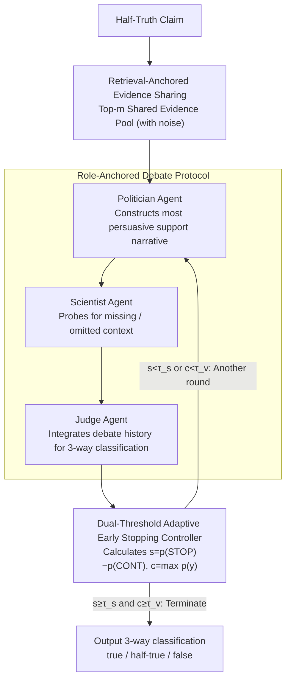

# Debating the Unspoken: Role-Anchored Multi-Agent Reasoning for Half-Truth Detection

**Conference**: ACL 2026  
**arXiv**: [2604.19005](https://arxiv.org/abs/2604.19005)  
**Code**: [https://github.com/tangyixuan/RADAR](https://github.com/tangyixuan/RADAR)  
**Area**: Fact Verification / Misinformation Detection  
**Keywords**: Half-truth detection, multi-agent debate, omission reasoning, role-anchoring, adaptive termination

## TL;DR

This paper proposes the RADAR framework, which detects half-truth information based on omitted context through role-anchored (Politician vs. Scientist) multi-agent debate. Coupled with a dual-threshold adaptive early stopping mechanism, it consistently outperforms single-agent and traditional multi-agent baselines under noisy retrieval conditions.

## Background & Motivation

**Background**: Fact verification systems have made progress in detecting explicit misinformation but remain blind to "half-truths"—claims that are factually correct but misleading due to the omission of critical context. For instance, the statement "A politician reduced the national debt by 15%" might be correct, but it hides the fact that the debt was first increased by 20% during the same period.

**Limitations of Prior Work**: (1) Single-agent methods (encoder classifiers, instructed LLMs) perform single-pass reasoning, making them prone to misjudgment when key context is missing. (2) Traditional multi-agent debate (MAD) uses fixed Pro/Con roles designed for explicit contradictions, which are unsuitable for omission reasoning where the core issue is missing context rather than opposing claims. (3) TRACER was the first to explicitly model omissions but assumes the existence of golden evidence and uses a single-agent pipeline.

**Key Challenge**: Omission detection requires reasoning about "what was not said" rather than "what is wrong"—existing verification systems look for contradictions instead of absences.

**Goal**: Design a fact verification framework capable of discovering missing context under realistic noisy retrieval conditions.

**Key Insight**: Model verification as a structured debate between complementary roles—one side constructing the best possible narrative (exposing the motivation for selective framing) and the other probing for omissions (revealing the missing context).

**Core Idea**: Replace Pro/Con debates with "Politician" and "Scientist" roles to transform omission detection from contradiction-seeking into active probing of missing context.

## Method

### Overall Architecture

RADAR addresses the specific type of lie known as a "half-truth"—where the claim is factually correct but misleading because key context is omitted. The process consists of two steps: first, pulling a shared evidence pool for each claim under realistic noisy retrieval conditions; second, having three role-anchored agents engage in multiple rounds of debate over this pool, with an adaptive early stopping mechanism determining when to conclude. Each agent has a specific function: the Politician constructs the most persuasive supporting narrative from the evidence, the Scientist scrutinizes the same evidence for what was omitted, and the Judge performs a 3-way classification (true/half-true/false) and controls whether to terminate the debate.

### Key Designs

**1. Retrieval-Anchored Evidence Sharing: Ensuring divergence stems from reasoning, not information asymmetry**

If agents rely on internal model knowledge, it becomes unclear whether differing conclusions result from reasoning or disparate information. RADAR requires all agents to share the same evidence pool (top-m retrieval results) and mandates that every argument in the debate cites retrieved evidence rather than internal knowledge. Consequently, different conclusions can only stem from varying interpretations of the same evidence. Compared to traditional MAD which relies on internal knowledge, this approach improves transparency and traceability while allowing the framework to operate under realistic noisy retrieval settings.

**2. Role-Anchored Debate Protocol: Replacing Pro/Con with "Politician vs. Scientist" to focus on omissions**

Traditional MAD uses fixed Pro/Con roles designed for "explicit contradictions." However, the root of a half-truth is not a factual error but intentional incompleteness, which simple opposition fails to capture. RADAR employs complementary reasoning personas: the Politician agent constructs the most persuasive narrative from the evidence, naturally leaning toward confirmatory reasoning and selective presentation; the Scientist agent examines the same evidence for missing or weak points, naturally leaning toward analytical skepticism. The debate progresses from opening statements to rebuttals and final summaries, with the Judge making a 3-way judgment. The nuance lies in the Politician acting as the "maker" of the half-truth and the Scientist as the "debunker," simulating the generation and detection mechanisms of such claims.

**3. Dual-Threshold Adaptive Early Stopping: Terminating only when information is sufficient and judgment is stable**

Excessive debate rounds waste computation, while stopping too early leads to misjudgments on difficult half-truths. After each round, the Judge calculates two metrics: the stopping margin $s = p(\text{STOP}) - p(\text{CONTINUE})$ and the maximum label confidence $c = \max_y p(y)$. Termination occurs only when $s \geq \tau_s$ and $c \geq \tau_v$ are both satisfied, with both thresholds calibrated on the development set. The dual-threshold approach is used because stopping intent alone might trigger too early on uncertain cases—precisely the category half-truths fall into. It ensures both that enough information has been gathered and that a high-confidence judgment has been reached.

### Key Experimental Results

### Main Results

On the PolitiFact-Hidden benchmark (under retrieved evidence conditions):

| Method | Accuracy | F1_macro | F1_HalfTrue |
|------|----------|---------|-------------|
| FIRE | 60.3 | 46.9 | 34.1 |
| D2D (MAD) | 63.0 | 50.9 | 39.7 |
| RADAR_single | 58.4 | 51.0 | 41.5 |
| **Ours (Multi)** | **77.7** | **63.3** | **56.5** |

### Ablation Study

| Configuration | Accuracy | Description |
|------|----------|------|
| Golden Evidence + RADAR | 83.6 | Upper bound with perfect retrieval |
| Retrieved Evidence + RADAR | 77.7 | Strong performance in realistic conditions |
| No Early Stopping | ~76 | Slight decrease with increased cost |
| Fixed Pro/Con Roles | ~65 | Role design is critical |

### Key Findings

- RADAR achieves a 14.7% accuracy Gain over the best traditional method (D2D) under retrieval conditions, with a significant advantage in half-truth detection (F1 improved from 39.7 to 56.5).
- Role-anchoring is the core contribution: performance drops sharply when replaced by traditional Pro/Con roles, validating the necessity of complementary reasoning designs.
- Adaptive early stopping reduces the average number of debate rounds by approximately 30% without sacrificing performance.
- It consistently outperforms baselines in both golden and retrieved evidence settings, demonstrating the framework's robustness.

## Highlights & Insights

- The "Politician-Scientist" metaphor is ingenious: half-truths are common in political discourse, so using roles that simulate these discourse strategies to detect them creates a "fight fire with fire" design philosophy.
- The dual-threshold early stopping mechanism is a practical engineering innovation: it balances reasoning cost and quality, which is crucial for inherently uncertain categories like half-truths.
- The paradigm shift from "finding contradictions" to "discovering omissions" opens a new direction for the fact verification field.

## Limitations & Future Work

- Currently only tested on political fact-checking datasets; half-truth detection in other domains (science, medical) remains to be verified.
- Role design is effective but relies on manually defined prompt templates, which may limit generalizability.
- Retrieval quality remains a bottleneck—the ~6% gap between golden and retrieved evidence suggests that improvements in retrieval could lead to further gains.
- 3-way classification (true/half-true/false) may be too coarse; in reality, the degree of "half-truth" is likely continuous.

## Related Work & Insights

- **vs TRACER**: First omission detection framework but assumes golden evidence and is single-agent; RADAR achieves stronger performance through multi-agent debate under noisy retrieval.
- **vs D2D/TED**: Traditional MAD use fixed Pro/Con for explicit contradictions; RADAR's role-anchoring targets omission reasoning, yielding a 12+ point F1 Gain.
- **vs FIRE**: Uses iterative search-verify loops but remains single-agent; RADAR achieves deeper reasoning through structured debate.

## Rating
- Novelty: ⭐⭐⭐⭐⭐ New paradigm for role-anchoring and omission reasoning.
- Experimental Thoroughness: ⭐⭐⭐⭐ Multi-baseline comparison + ablation + efficiency analysis.
- Writing Quality: ⭐⭐⭐⭐⭐ Clear motivation, intuitive role design.
- Value: ⭐⭐⭐⭐⭐ Fills an important gap in half-truth detection.

<!-- RELATED:START -->

## Related Papers

- [\[ACL 2025\] CortexDebate: Debating Sparsely and Equally for Multi-Agent Debate](../../ACL2025/multi_agent/cortexdebate_debating_sparsely_and_equally_for_multi-agent_debate.md)
- [\[AAAI 2026\] Beyond Detection: Exploring Evidence-based Multi-Agent Debate for Misinformation Intervention and Persuasion](../../AAAI2026/multi_agent/beyond_detection_exploring_evidence-based_multi-agent_debate_for_misinformation_.md)
- [\[ACL 2026\] From Query to Counsel: Structured Reasoning with a Multi-Agent Framework and Dataset for Legal Consultation](from_query_to_counsel_structured_reasoning_with_a_multi-agent_framework_and_data.md)
- [\[CVPR 2026\] Agent4FaceForgery: Multi-Agent LLM Framework for Realistic Face Forgery Detection](../../CVPR2026/multi_agent/agent4faceforgery_multi-agent_llm_framework_for_realistic_face_forgery_detection.md)
- [\[ACL 2026\] When Identity Skews Debate: Anonymization for Bias-Reduced Multi-Agent Reasoning](when_identity_skews_debate_anonymization_for_bias-reduced_multi-agent_reasoning.md)

<!-- RELATED:END -->
