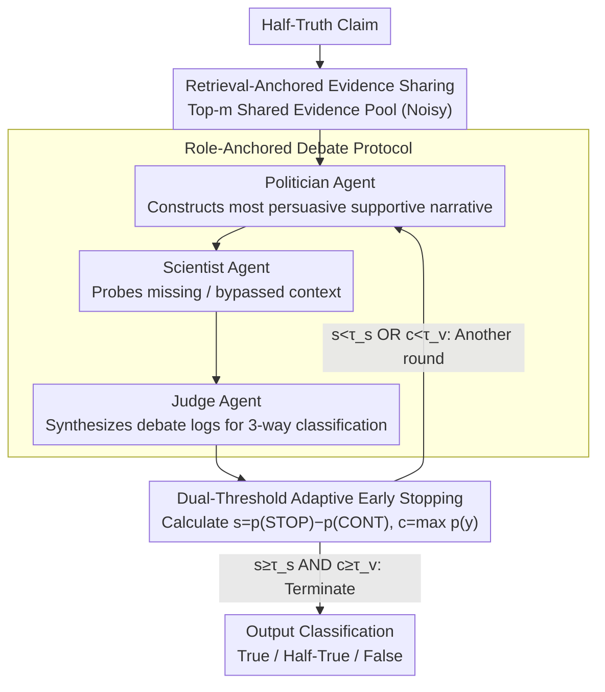

# Debating the Unspoken: Role-Anchored Multi-Agent Reasoning for Half-Truth Detection

**Conference**: ACL 2026  
**arXiv**: [2604.19005](https://arxiv.org/abs/2604.19005)  
**Code**: [https://github.com/tangyixuan/RADAR](https://github.com/tangyixuan/RADAR)  
**Area**: Fact Verification / Misinformation Detection  
**Keywords**: Half-truth detection, Multi-agent debate, Omission reasoning, Role-anchoring, Adaptive termination  

## TL;DR

This paper proposes the RADAR framework, which detects half-truths based on omitted context through role-anchored (Politician vs. Scientist) multi-agent debate. Combined with a dual-threshold adaptive early stopping mechanism, it consistently outperforms single-agent and traditional multi-agent baselines under noisy retrieval conditions.

## Background & Motivation

**Background**: Fact verification systems have made progress in detecting explicit misinformation but remain blind to "half-truths"—claims that are factually correct but misleading due to the omission of critical context. For example, "A politician reduced the national debt by 15%" might be correct in isolation but hides the fact that it first increased by 20% during the same period.

**Limitations of Prior Work**: (1) Single-agent methods (encoder classifiers, instruction-tuned LLMs) perform single-pass reasoning and easily misjudge when critical context is missing; (2) Traditional Multi-Agent Debate (MAD) uses fixed Pro/Con roles designed for explicit contradictions, which are unsuitable for omission reasoning—the core issue is the missing context rather than an opposing claim; (3) While TRACER first explicitly modeled omissions, it assumes the availability of "gold" evidence and uses a single-agent pipeline.

**Key Challenge**: Omission detection requires reasoning about "what was not said" rather than "what is wrong"—existing verification systems look for contradictions rather than absences.

**Goal**: Design a fact-verification framework capable of discovering missing context under realistic noisy retrieval conditions.

**Key Insight**: Model verification as a structured debate between complementary roles—one side constructing the best possible narrative (exposing the motivation for selective framing) and the other probing for omissions (revealing missing context).

**Core Idea**: Replace Pro/Con debate with "Politician" and "Scientist" role-anchoring to transform omission detection from contradiction searching into active probing of missing context.

## Method

### Overall Architecture

RADAR addresses "half-truths," a specific type of deception where claims are factually correct but misleading through omitted context. The process consists of two steps: first, retrieving a shared evidence pool for each claim under noisy conditions; second, conducting multiple rounds of debate among three role-anchored agents on this pool, governed by an adaptive early stopping mechanism. The three roles serve distinct functions: the Politician weaves evidence into the most persuasive supportive narrative, the Scientist monitors the same evidence to identify what was skipped, and the Judge adjudicates the three-way classification (True/Half-True/False) and controls termination.

### Key Designs

**1. Retrieval-Anchored Evidence Sharing: Divergence from Reasoning, Not Information**

If agents rely on internal knowledge, differences in conclusions cannot be distinguished between superior reasoning or mere information asymmetry. RADAR mandates that all agents share a single evidence pool (top-m retrieval results) and requires every argument to cite this pool rather than internal knowledge. Consequently, differing conclusions stem solely from divergent reasoning over the same data. Compared to traditional MAD, this improves transparency and allows the framework to function under noisy retrieval settings rather than assuming gold evidence.

**2. Role-Anchored Debate Protocol: "Politician vs. Scientist" instead of Pro/Con**

Traditional MAD uses Pro/Con roles for "explicit contradictions." However, half-truths stem from intentional incompleteness rather than factual error. RADAR employs complementary reasoning personas: the **Politician** builds a persuasive supportive narrative from the evidence (confirmatory reasoning/selective presentation), while the **Scientist** scrutinizes the same evidence for missing or weak points (analytical skepticism). The debate follows a structure of Opening Statement → Rebuttal → Closing Summary. The Politician acts as the "creator" of the half-truth, and the Scientist as its "debunker," simulating the generation and detection of deception.

**3. Dual-Threshold Adaptive Early Stopping: Balancing Sufficiency and Stability**

Excessive debate rounds waste computation, while stopping too early leads to misjudgment on complex half-truths. RADAR requires the Judge to calculate a stop margin $s = p(\text{STOP}) - p(\text{CONTINUE})$ and a maximum label confidence $c = \max_y p(y)$. Termination occurs only when $s \geq \tau_s$ and $c \geq \tau_v$ simultaneously. Using two thresholds prevents premature stopping on uncertain cases where the intent to stop might be high, but confidence remains low—a common scenario for half-truths.

### Loss & Training

RADAR is an unsupervised reasoning framework and does not require training. The two early stopping thresholds, $\tau_s$ and $\tau_v$, are calibrated on a development set.

## Key Experimental Results

### Main Results

Results on the PolitiFact-Hidden benchmark (under retrieval conditions):

| Method | Accuracy | F1_macro | F1_HalfTrue |
| :--- | :--- | :--- | :--- |
| FIRE | 60.3 | 46.9 | 34.1 |
| D2D (MAD) | 63.0 | 50.9 | 39.7 |
| RADAR_single | 58.4 | 51.0 | 41.5 |
| **Ours (RADAR_multi)** | **77.7** | **63.3** | **56.5** |

### Ablation Study

| Configuration | Accuracy | Description |
| :--- | :--- | :--- |
| Gold Evidence + RADAR | 83.6 | Upper bound with perfect retrieval |
| Retrieval Evidence + RADAR | 77.7 | Strong performance in reality |
| No Early Stopping | ~76 | Slight decline with increased cost |
| Fixed Pro/Con | ~65 | Role design is critical |

### Key Findings

- **Ours** improves accuracy by 14.7% over the best traditional method (D2D) under retrieval conditions, with a massive gain in half-truth detection (F1 improved from 39.7 to 56.5).
- Role-anchoring is the core contribution: performance drops significantly when replaced with Pro/Con roles, validating the need for complementary reasoning designs.
- Adaptive early stopping reduces the average number of debate rounds by approximately 30% without sacrificing performance.
- Superiority over baselines is consistent across both gold and retrieval evidence settings, demonstrating robustness.

## Highlights & Insights

- The **"Politician-Scientist"** metaphor is highly effective: half-truths are a common tactic in political discourse; using roles that simulate these strategies to detect them creates a "fight fire with fire" design philosophy.
- The **Dual-Threshold Early Stopping** is a practical engineering innovation: it balances reasoning cost and quality, which is crucial for inherently uncertain categories like half-truths.
- The paradigm shift from **"finding contradictions"** to **"discovering absences"** opens a new direction for the fact-verification field.

## Limitations & Future Work

- Tested only on political fact-verification datasets; generalizability to other domains (science, healthcare) remains to be verified.
- Role design, while effective, relies on manually defined prompt templates, which may limit generalizability.
- Retrieval quality remains a bottleneck—the 6% gap between gold and retrieval settings suggests that improved retrieval could lead to further gains.
- Three-way classification (True/Half-True/False) might be too coarse; in reality, "half-truthfulness" exists on a continuum.

## Related Work & Insights

- **vs TRACER**: First omission detection framework but assumes gold evidence and uses a single agent; RADAR achieves higher performance via multi-agent debate under noisy retrieval.
- **vs D2D/TED**: Traditional MAD uses Pro/Con for explicit contradictions; RADAR's role-anchoring targets omission reasoning, improving F1 by 12+ points.
- **vs FIRE**: Uses iterative search-verify loops but remains single-agent; RADAR achieves deeper reasoning through structured debate.

## Rating
- Novelty: ⭐⭐⭐⭐⭐ New paradigm of role-anchoring + omission reasoning
- Experimental Thoroughness: ⭐⭐⭐⭐ Multi-baseline comparison + ablation + efficiency analysis
- Writing Quality: ⭐⭐⭐⭐⭐ Clear motivation and intuitive role design
- Value: ⭐⭐⭐⭐⭐ Fills a critical gap in half-truth detection

<!-- RELATED:START -->

## Related Papers

- [\[ACL 2025\] CortexDebate: Debating Sparsely and Equally for Multi-Agent Debate](../../ACL2025/multi_agent/cortexdebate_debating_sparsely_and_equally_for_multi-agent_debate.md)
- [\[AAAI 2026\] Beyond Detection: Exploring Evidence-based Multi-Agent Debate for Misinformation Intervention and Persuasion](../../AAAI2026/multi_agent/beyond_detection_exploring_evidence-based_multi-agent_debate_for_misinformation_.md)
- [\[ACL 2026\] From Query to Counsel: Structured Reasoning with a Multi-Agent Framework and Dataset for Legal Consultation](from_query_to_counsel_structured_reasoning_with_a_multi-agent_framework_and_data.md)
- [\[ACL 2026\] When Identity Skews Debate: Anonymization for Bias-Reduced Multi-Agent Reasoning](when_identity_skews_debate_anonymization_for_bias-reduced_multi-agent_reasoning.md)
- [\[ICML 2026\] Voting Protocols as Coordination Mechanisms for Role-Constrained Multi-Agent Tutoring Systems](../../ICML2026/multi_agent/voting_protocols_as_coordination_mechanisms_for_role-constrained_multi-agent_tut.md)

<!-- RELATED:END -->
