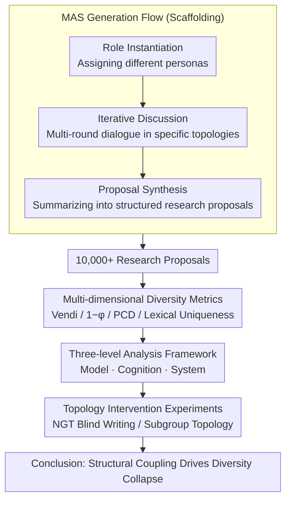

# Diversity Collapse in Multi-Agent LLM Systems: Structural Coupling and Collective Failure in Open-Ended Idea Generation

**Conference**: ACL 2026 Findings  
**arXiv**: [2604.18005](https://arxiv.org/abs/2604.18005)  
**Code**: [https://github.com/Xtra-Computing/MAS_Diversity](https://github.com/Xtra-Computing/MAS_Diversity)  
**Area**: LLM Agent  
**Keywords**: Multi-agent systems, diversity collapse, structural coupling, idea generation, collaboration topology

## TL;DR

This paper systematically reveals the "diversity collapse" phenomenon in multi-agent LLM systems by evaluating over 10,000 research proposals across three levels: model intelligence, agent cognition, and system dynamics. It demonstrates that stronger models, authority-driven role assignments, and dense communication topologies suppress semantic diversity, identifying the root cause as the interaction structure rather than a lack of model capability.

## Background & Motivation

**Background**: Multi-agent systems (MAS) are increasingly utilized for open-ended idea generation (e.g., scientific hypothesis generation, strategic planning, creative design). The expectation is that the collective interaction of multiple agents will broaden the exploration space. MAS frameworks typically assign different roles/perspectives to agents, hoping that diversity arises through their interaction.

**Limitations of Prior Work**: (1) Whether MAS truly generates more diverse outputs than a single model has never been systematically verified; (2) Existing MAS frameworks often rely on homogeneous underlying models (sharing pre-training distributions and alignment targets), so multi-agent interaction might merely amplify shared priors rather than introduce true diversity; (3) What conditions cause MAS to "backfire"—not only failing to expand the solution space but leading to premature convergence?

**Key Challenge**: Intuitively, more interaction should produce more diverse results, but in practice, the interaction itself can be the source of diversity loss. Increased collaboration leads to more mutual influence and trajectory synchronization, eventually triggering diversity collapse.

**Goal**: To systematically diagnose diversity issues in MAS idea generation from three bottom-up levels: model layer, cognitive layer, and system layer.

**Key Insight**: The study uses "scientific research proposal generation" as a standardized task for idea generation because it offers both open-endedness and structural constraints suitable for quantitative evaluation. The authors designed 20 topics × 50 independent discussions = 1,000 proposals/configurations.

**Core Idea**: Diversity collapse is a collective failure driven by "structural coupling"—interaction structures inadvertently contract the agents' exploration space, rather than a lack of model capability.

## Method

### Overall Architecture

The study constructs a general multi-agent interaction framework comprising three stages: role instantiation (assigning different personas), iterative discussion (multi-round dialogue under specific topologies), and proposal synthesis (summarizing discussions into structured research proposals), producing over 10,000 research proposals for analysis. Upon this, a **multi-dimensional diversity metric** is used to quantify semantic diversity. Then, a **three-level analysis framework** (Model Intelligence, Agent Cognition, System Dynamics) is applied to locate the sources of diversity collapse. Finally, **topology intervention experiments** (NGT, subgroup topologies) are used to verify the root causes and provide practical mitigation strategies.

### Key Designs

**1. Multi-dimensional diversity metric system: Quantifying "semantic diversity" via four complementary indicators**

Judging whether MAS becomes more diverse requires a robust definition of "diversity," as any single indicator might overlook specific aspects. This paper employs four complementary metrics: Vendi Score, based on the spectral entropy of a kernel matrix, measures the number of effectively independent semantic patterns; Structural Disorder $1-\phi$ measures the average cosine distance between individuals and the group mean, where low values indicate a "echo chamber" effect; Semantic Dispersion (PCD) is the mean pairwise cosine distance characterizing the overall spread of the distribution; and Lexical Uniqueness uses IDF-weighted n-gram statistics to capture surface-level redundancy. These metrics monitor the number of effective patterns, distribution shape, pairwise distance, and surface repetition. After human evaluation, the Vendi Score showed an 87% consistency rate with human judgment.

**2. Three-level analysis framework: Bottom-up attribution of "diversity collapse" to specific stages**

The dynamics of multi-agent systems are entangled, so the paper decomposes the analysis into three layers. The model layer reveals a "computational efficiency paradox": models with stronger alignment produce higher quality single samples but exhibit diminishing marginal diversity. Alignment acts as a global semantic regularization that flattens the exploration space. The cognitive layer compares five collaboration structures (Naive / Leadership-driven / Horizontal / Interdisciplinary / Vertical), finding that authority-driven structures systematically suppress diversity, while horizontal collaboration led by junior researchers achieves the highest diversity (Vendi 8.08 vs. 4.65 for interdisciplinary). The system layer examines group size, rounds, and topology: more agents lead to diminishing returns (diversity utilization $Vendi/N$ drops from 1.03 to 0.47), and denser communication topologies accelerate premature convergence.

**3. Topology intervention experiments (NGT / Subgroups): Proving the root cause through intervention**

While the first two designs diagnose "structural coupling" as the cause, causality must be established. If the root cause is the interaction structure, then changing the interaction mode without changing the model should mitigate the collapse. Three groups were compared: standard discussion, Nominal Group Technique (NGT, where agents "blind write" before discussing), and subgroup topologies (dividing the social graph into local clusters). NGT maximized diversity in the early stages, while subgroup topologies maintained the highest density of constructive conflict in later stages. These successful interventions confirm that diversity collapse stems from the interaction structure.

## Key Experimental Results

### Main Results

| Cognitive Structure | Vendi Score | Semantic Dispersion | Structural Disorder | Overall Quality |
| :--- | :--- | :--- | :--- | :--- |
| Horizontal (Junior) | **8.08** | **0.31** | **0.170** | 7.88 |
| Vertical (Mixed) | 6.93 | 0.296 | 0.161 | 8.32 |
| Leadership-driven | 6.08 | 0.285 | 0.154 | 8.03 |
| Naive Collaboration | 5.57 | 0.272 | 0.146 | 7.95 |
| Interdisciplinary | 4.65 | 0.25 | 0.19 | **8.50** |

### Ablation Study

| Configuration | Vendi Score | Diversity Efficiency | Description |
| :--- | :--- | :--- | :--- |
| N=3 agents | ~3.1 | 1.03 | Baseline, high efficiency |
| N=5 agents | ~3.8 | 0.76 | Diminishing returns begin |
| N=7 agents | ~3.3 | 0.47 | Severe diminishing returns |
| Standard Topology | Low | - | Continuous diversity decline |
| NGT Topology | High (Initial) | - | Effective blind-writing phase |
| Subgroup Topology | High (Late) | - | Preserves constructive conflict |

### Key Findings

- **Computational Efficiency Paradox**: Stronger aligned models (e.g., GPT-5.1) have higher single-sample quality but lower diversity. Alignment essentially acts as a global semantic regularization that compresses the exploration space.
- **Authority Suppresses Diversity**: Horizontal collaboration led by junior researchers is 73% more diverse than interdisciplinary expert groups (Vendi 8.08 vs 4.65), while the quality gap is only 0.6 points (on a 10-point scale), suggesting that authority leads to "sycophancy traps."
- **Ringelmann Effect in System Dynamics**: The marginal diversity gain of increasing agent count drops sharply, similar to "social loafing" in human groups.
- **"Expansion within Consensus" Pattern**: Diversity can increase locally within a single session as discussions deepen, yet inter-session diversity shrinks due to structural convergence.

## Highlights & Insights

- **"Structural Coupling" Theoretical Framework**: Proposes a unified explanation—diversity collapse is not due to weak models, but because the interaction structure itself contracts the exploration space. This insight serves as a warning for MAS designers.
- **Asymmetric Relationship between Quality and Diversity**: Interdisciplinary teams produce the highest quality but the lowest diversity, indicating that optimizing for quality and diversity are distinct goals requiring explicit trade-offs.
- **Experimental Scale and Rigor**: The study features a comprehensive cross-experiment with 10,000+ proposals, 20 topics, and various topologies/cognitive structures, all backed by human validation and solid empirical foundations.
- **Subgroup Topology as a Diversity Preservation Strategy**: Creating "local pockets of disagreement" to resist premature consensus offers a directly applicable strategy for real-world MAS design.

## Limitations & Future Work

- Verified only on "scientific proposal generation"; whether the conclusions generalize to other open-ended tasks like code generation or creative writing remains to be seen.
- All agents shared the same underlying LLM; the effects of heterogeneous model ensembles were not fully explored.
- Evaluation relies on semantic metrics in embedding space, which might miss certain types of conceptual innovation.
- The paper is long (56 pages); the core findings could be presented more concisely.
- While it diagnoses the problem, it does not propose a single finalized system-wide solution.

## Related Work & Insights

- **vs. Du et al. (2024) Multi-agent Debate**: Whereas debate frameworks assume interaction improves reasoning, this paper proves interaction can backfire in creative tasks.
- **vs. Wang et al. (2025a) Echo Chamber Effects**: This work extends the echo chamber effect from social media to LLM multi-agent systems with quantitative analysis.
- **vs. Moon et al. (2025)**: Also focuses on diversity in MAS, but this paper’s three-level analysis is more systematic and the experimental scale is significantly larger.

## Rating

- Novelty: ⭐⭐⭐⭐⭐ First to systematically reveal diversity collapse in MAS for creative generation and propose the "structural coupling" theory.
- Experimental Thoroughness: ⭐⭐⭐⭐⭐ Extremely thorough, utilizing 10,000+ proposals across 20 topics with multi-dimensional analysis.
- Writing Quality: ⭐⭐⭐⭐ Deep analysis and excellent visualization, though the length is quite substantial.
- Value: ⭐⭐⭐⭐⭐ Highly significant for MAS design; the conclusion that "more collaboration does not equal more diversity" has broad impact.

<!-- RELATED:START -->

## Related Papers

- [\[ACL 2026\] Seeing the Whole Elephant: A Benchmark for Failure Attribution in LLM-based Multi-Agent Systems](seeing_the_whole_elephant_a_benchmark_for_failure_attribution_in_llm-based_multi.md)
- [\[ICML 2026\] EngiAgent: Fully Connected Coordination of LLM Agents for Solving Open-ended Engineering Problems with Feasible Solutions](../../ICML2026/multi_agent/engiagent_fully_connected_coordination_of_llm_agents_for_solving_open-ended_engi.md)
- [\[ACL 2026\] Memory-Augmented LLM-based Multi-Agent System for Automated Feature Generation on Tabular Data](memory-augmented_llm-based_multi-agent_system_for_automated_feature_generation_o.md)
- [\[ACL 2026\] LLM-Based Human-Agent Collaboration and Interaction Systems: A Survey](llm-based_human-agent_collaboration_and_interaction_systems_a_survey.md)
- [\[ACL 2026\] Conjunctive Prompt Attacks in Multi-Agent LLM Systems](conjunctive_prompt_attacks_in_multi-agent_llm_systems.md)

<!-- RELATED:END -->
