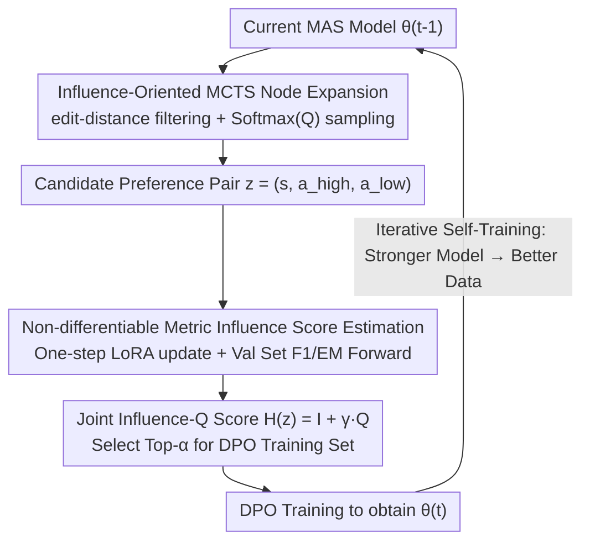

# Efficient Multi-Agent System Training with Data Influence-Oriented Tree Search

**Conference**: ACL 2026  
**arXiv**: [2502.00955](https://arxiv.org/abs/2502.00955)  
**Code**: https://github.com/swt-user/DITS  
**Area**: Multi-Agent / LLM Training / MCTS / Data Synthesis  
**Keywords**: Multi-Agent Systems, Influence Functions, Monte Carlo Tree Search, DPO, Self-Training

## TL;DR
This paper proposes DITS, using "training data influence scores" instead of traditional Q-values as the guiding signal for MCTS tree search and preference data selection. It derives an influence score estimation formula for non-differentiable metrics that can be calculated via forward inference, enabling MAS to achieve a 2.5–2.7% average improvement over Optima-iSFT-DPO across 7 datasets and 3 multi-agent tasks.

## Background & Motivation

**Background**: LLM Multi-Agent Systems (MAS, such as MetaGPT, AutoGen, and Camel) decompose complex tasks for collaborative completion by multiple agents, representing a mainstream path to breaking single-agent capability limits. The standard approach to optimizing such MAS is "MCTS synthetic trajectory generation → preference pair extraction → DPO training," exemplified by works like Optima.

**Limitations of Prior Work**: The core signal of MCTS, the Q-value, is adopted directly from the inference phase—it measures "whether this node can win," but MAS training actually requires "whether this data can improve the model." The scatter plot in Figure 2(a) demonstrates that the correlation between high Q-value samples and real training gains is weak; data selected by Q-value ranking does not necessarily yield the maximum downstream benefit.

**Key Challenge**: There is a misalignment between the MCTS guiding signal (Q-value) and the training objective (validation gain). Furthermore, the correlation between DPO loss and downstream performance is low (< 0.2), causing traditional influence functions that estimate influence via DPO loss to fail in this context.

**Goal**: (1) Identify a data score truly aligned with training gains; (2) integrate this score into both MCTS selection and final preference pair selection; (3) ensure this score can be calculated for large models at a reasonable cost.

**Key Insight**: The classic influence function (Koh & Liang, 2017) measures how much the training loss changes if a data point is removed. The authors redefine this from "training loss" to "non-differentiable metrics $\mathcal{F}$ (F1 / EM) on the validation set," bypassing the decoupling of DPO loss and downstream performance. They further replace the second-order Hessian with pure forward inference using "one-step gradient descent + finite difference."

**Core Idea**: Replace Q-value with an influence score oriented toward non-differentiable validation metrics $\mathcal{I}_{\mathcal{F}_{\text{val}}}$ as the data quality signal for MAS self-training, transforming MCTS into an "influence-oriented" tree search.

## Method

### Overall Architecture
DITS decomposes a single training round into three steps: (1) Perform MCTS rollouts using the current MAS, expanding agent calls on a directed graph $\mathcal{G}=(\mathcal{V},\mathcal{E})$ in topological order to obtain a pool of synthetic trajectories with Q-values; (2) calculate the influence score $\mathcal{I}$ for each candidate preference pair $z=(s, a^h, a^l)$, ranking them by $H(z_i)=\mathcal{I}_{\mathcal{F}_{\text{val}}}(z_i,\mathcal{D}_{\text{val}},\theta)+\gamma\cdot Q(s,a_i^h)$ and selecting the Top-α for the DPO training set $\mathcal{D}_{\text{tr}}$; (3) train $\theta_t$ using $\mathcal{D}_{\text{tr}}$ and return to step 1 for the next iteration. This pipeline is the influence-oriented version of "iSFT-DPO," termed DITS-iSFT-DPO.

### Key Designs

**1. Influence-Oriented MCTS Node Expansion: Selection serves "trainability" rather than "correctness"**

Traditional MCTS selection is adapted from the inference phase, aiming to repeatedly explore high Q-value subtrees to find the correct answer. However, this leads to a collapse in synthetic trajectory diversity—trajectories cluster around pathways that "look like winners." DITS shifts the focus to which node is more likely to yield preference pairs with high training gains. Specifically, the candidate node set $N_{\text{cand}}$ is first filtered by an edit-distance similarity threshold $S_{i,j}\geq 0.25$ to remove branches highly redundant with already expanded nodes. Then, nodes are sampled via $n\sim\text{Softmax}(\{Q(n)\}_{n\in N_{\text{cand}}})$. Final preference pairs consist of the highest and lowest Q-value actions $(a_i^h, a_i^l)$ at the current state. Similarity filtering encourages exploration and prevents redundant searching on homogeneous branches, fundamentally pivoting the search from "finding the right answer" to "finding data that can teach the model."

**2. Influence Estimation on Non-differentiable Metrics: Replacing Hessian with Forward Inference**

Classic influence functions measure the change in training loss when a data point is removed, but two obstacles exist: the correlation between DPO loss and downstream performance is < 0.2, and calculating the second-order Hessian-vector product is prohibitively expensive for 8B-scale models. DITS bypasses both by changing the influence target directly to non-differentiable metrics $\mathcal{F}_{\text{val}}$ (F1 / EM) on the validation set, defined as:

$$\mathcal{I}_{\mathcal{F}_{\text{val}}}(z_i,\mathcal{D}_{\text{val}}):=\frac{\mathcal{F}_{\text{val}}(z_i,\theta_{\epsilon,z_i}^{*})-\mathcal{F}_{\text{val}}(z_i,\theta^{*})}{\epsilon},$$

By approximating the perturbed optimal parameters with one-step gradient descent $\theta_{\epsilon,z_i}^{*}\approx\theta^{*}-\eta\epsilon\nabla_{\theta}\mathcal{L}_{\text{tr}}(z_i,\theta^{*})$, we get:

$$\mathcal{I}\approx\frac{1}{\epsilon}\Big[\mathcal{F}_{\text{val}}\big(z_i,\theta^{*}-\eta\epsilon\nabla_{\theta}L_{\text{tr}}(z_i,\theta^{*})\big)-\mathcal{F}_{\text{val}}(z_i,\theta^{*})\Big].$$

This requires only one LoRA step update and one validation set forward pass per candidate, eliminating second-order gradients. By directly observing the response of F1/EM to perturbations, it avoids the "loss is not performance" dilemma and reduces the cost of influence functions to a level feasible for LLMs and large batches.

**3. Joint Influence-Q Scoring + Iterative Self-Training: Complementary Signals and Positive Feedback**

Relying solely on influence scores can be misled by noisy metrics like F1, while relying solely on Q-values leads to misalignment with training gains. DITS fuses them using a weighted comprehensive score:

$$H(z_i)=\mathcal{I}_{\mathcal{F}_{\text{val}}}(z_i,\mathcal{D}_{\text{val}},\theta)+\gamma\cdot Q(s,a_i^h)$$

to select Top-α data for the DPO training set. When $\gamma=0$, it is a pure influence score; when $\gamma=1$, it integrates Q-values as a prior for "data plausibility" while using the influence score as the true signal for validation gain. This is wrapped in an iterative loop: in round $t$, $\theta_{t-1}$ is used for MCTS to synthesize $\mathcal{D}_{\text{tr}}^{t}$, and $\theta_t$ is trained from the initial SFT model. This creates a positive feedback loop of "stronger model → higher quality synthetic data → even stronger model."

### Loss & Training
The objective is standard DPO: $\mathcal{L}_{DPO}=\mathbb{E}_{z}[-\log\sigma(\beta[\log\frac{\pi_{\theta}(a_i^h\mid s)}{\pi_{\text{ref}}(a_i^h\mid s)}-\log\frac{\pi_{\theta}(a_i^l\mid s)}{\pi_{\text{ref}}(a_i^l\mid s)}])]$. Llama-3-8B-Instruct is used for static scenarios and QwQ-32B for dynamic ones. MCTS settings include $d=3$ depth and $k=8$ repetitions. The validation set size is $V=20$. Defaults are $\alpha=0.5$ and $\gamma=1$. LoRA is used for the one-step gradient descent during influence estimation to save memory.

## Key Experimental Results

### Main Results
On 6 datasets spanning Information Exchange (HotpotQA / 2WMH QA / TriviaQA / CBT) and Debate (ARC-C / MMLU), DITS-iSFT-DPO consistently outperforms Optima-iSFT-DPO:

| Dataset | Metric | DITS-iSFT-DPO | Optima-iSFT-DPO | Gain |
|--------|------|--------------|----------------|------|
| HotpotQA | F1 | 57.2 | 55.6 | +1.6 |
| 2WMH QA | F1 | 76.0 | 74.2 | +1.8 |
| TriviaQA | F1 | 78.4 | 77.1 | +1.3 |
| CBT | F1 | 72.0 | 70.1 | +1.9 |
| ARC-C | Acc | 77.6 | 77.1 | +0.5 |
| MMLU | Acc | 60.5 | 60.2 | +0.3 |
| WebWalker (DeepSearch, QwQ-32B) | Acc | 47.2 | 46.6 (Optima-DPO) | +0.6 |

The improvement in DeepSearch is notable: using QwQ-32B + WebThinker, DITS-DPO pushed accuracy from 46.6 to 47.2 in one round, proving the effectiveness of influence signals at 32B scale and under dynamic agent topologies.

### Ablation Study
Comparison of data selection strategies under a single iteration (baseline is Optima-DPO with the full set):

| Config | HotpotQA | 2WMH QA | TriviaQA | CBT | ARC-C | MMLU |
|------|---------|---------|---------|------|-------|------|
| Optima-DPO (Full) | 46.6 | 61.2 | 70.9 | 57.2 | 71.5 | 51.6 |
| Random Select (50%) | 51.5 | 60.6 | 70.3 | 58.0 | 74.0 | 51.1 |
| Q-value Select (50%) | 50.5 | 61.1 | 69.8 | 58.6 | 73.7 | 50.2 |
| DITS-DPO ($\gamma=0$) | **53.1** | **62.2** | **72.2** | **59.6** | 74.2 | 50.8 |
| DITS-DPO ($\gamma=1$) | 52.8 | 61.5 | 71.0 | 59.1 | **74.5** | **52.3** |

Notably, Q-value Select performed worse than Random Select, strongly supporting the claim that Q-values are misaligned with training gains.

Cost analysis (2WMH QA): DITS-DPO achieved F1=0.612 using $2.0\times 10^{7}$ tokens, 8,500 samples, and 106 GPUh. In contrast, even when scaled to $3.34\times 10^{7}$ tokens and 34,000 samples, Optima-DPO only reached F1=0.610 after 195 GPUh.

### Key Findings
- **Allocating budget to influence estimation yields higher returns than scaling Q-value estimation**: Figure 2(b) shows that for the same token budget, curves allocating more compute to influence estimation significantly outperform others, suggesting synthesis-time scaling should prioritize influence estimation.
- **As iterations increase, the influence score distribution of synthetic data shows a higher mean and lower variance**, confirming the "stronger model → higher quality data" feedback loop, though the authors note that decreasing variance might imply a loss of diversity.
- **The optimal $\gamma$ is task-dependent**: Information Exchange tasks (with noisy F1 metrics) favor $\gamma=0$ (pure influence), while Debate tasks (with stable EM metrics) benefit more from $\gamma=1$ (fusing Q-values). The noise level of the metric determines the reliability of Q-value signals.
- **Validation set size $V$ correlates with performance but incurs linear cost increase**; $V=20$ is the empirical sweet spot for cost-benefit.
- **A selection ratio $\alpha$ that is too small leads to performance drops**, indicating that "pure quality" cannot replace sufficient sample volume—both quality and quantity are essential.

## Highlights & Insights
- By redefining "influence" from "loss impact" to "non-differentiable metric impact," the paper solves the disconnect between DPO loss and downstream performance, a key modification for adapting influence functions to the LLM era.
- Replacing the Hessian-vector product with one-step gradient descent and finite difference is a crucial engineering trick that reduces influence estimation to a single forward pass and one-step LoRA update, making influence functions practical for 8B+ models.
- The counter-intuitive finding that "Q-value Selection is worse than Random" serves as a powerful evidence that "MCTS signals $\neq$ training signals."
- New dimension for synthesis-time scaling: Conventionally, 90% of budget increases are devoted to rollout quantity. This work proves that investing in "influence estimation" is more cost-effective than investing in "more accurate Q-values," offering a new direction for future data synthesis research.

## Limitations & Future Work
- The authors acknowledge that DITS is an offline/training-time data selection mechanism; the cost of multiple inferences for each candidate is unacceptable for strict latency scenarios and cannot be used for online/streaming quality assessment.
- Current validation is limited to static topologies and specific dynamic scenarios (WebThinker); open-ended multi-agent collaboration like dynamic agent spawning or emergent team formation remains uncovered.
- One-step gradient descent approximation might have errors under sharp losses like DPO; while empirically effective here, theoretical guarantees are limited to convex/differentiable assumptions.
- The validation set size $V$ is a manual hyperparameter; there is no exploration of online adaptive adjustments, which could be a bottleneck for high-noise tasks (e.g., open-ended generation).
- Future directions: lightweight influence estimation with single inference, end-to-end learnable influence models, and benchmarks for open-ended collaboration.

## Related Work & Insights
- **vs Optima (Chen 2024b)**: Both use MCTS + DPO for data synthesis, but Optima ranks by Q-values. DITS proves the misalignment of Q-values with training gains and achieves significantly higher sample efficiency using joint Influence-Q ranking.
- **vs Classic Influence Function (Koh & Liang 2017)**: Traditional IF depends on training loss and Hessian-vector products, which are impractical for LLMs. DITS adapts the target to non-differentiable metrics and the solution to one-step finite difference for real-world LLM applications.
- **vs LESS / Data Selection for SFT**: Most existing methods focus on influence estimation for SFT loss. DITS is the first influence-oriented data synthesis method designed for DPO/preference pairs and MAS multi-agent topologies.
- **vs MCTS-based Reasoning (rStar / o1-like)**: Those works use MCTS for finding answers at inference time. DITS repurposes MCTS to "find good data at training time," highlighting the fundamental difference between search-for-data and search-for-answer, providing a key insight for self-improvement and self-play frameworks.

## Rating
- Novelty: ⭐⭐⭐⭐ Adapting influence functions to DPO + MAS + non-differentiable metrics is quite novel in combination, though individual components have precedents.
- Experimental Thoroughness: ⭐⭐⭐⭐ Covers 7 datasets, 3 task types, static/dynamic topologies, and 8B/32B scales, with extensive sensitivity analysis in the appendix.
- Writing Quality: ⭐⭐⭐⭐ Clear motivation and compelling evidence (Figure 2a). Derivations are dense but well-supported.
- Value: ⭐⭐⭐⭐ Opens a new scaling dimension for MAS self-training and DPO data synthesis, with methods transferable to RLHF and self-play scenarios.

<!-- RELATED:START -->

## Related Papers

- [\[CVPR 2025\] Collaborative Tree Search for Enhancing Embodied Multi-Agent Collaboration](../../CVPR2025/multi_agent/collaborative_tree_search_for_enhancing_embodied_multi-agent_collaboration.md)
- [\[ACL 2026\] Memory-Augmented LLM-based Multi-Agent System for Automated Feature Generation on Tabular Data](memory-augmented_llm-based_multi-agent_system_for_automated_feature_generation_o.md)
- [\[ACL 2026\] Latent Agents: A Post-Training Procedure for Internalized Multi-Agent Debate](latent_agents_a_post-training_procedure_for_internalized_multi-agent_debate.md)
- [\[ICLR 2026\] Stop Wasting Your Tokens: Towards Efficient Runtime Multi-Agent Systems](../../ICLR2026/multi_agent/stop_wasting_your_tokens_towards_efficient_runtime_multi-agent_systems.md)
- [\[ACL 2026\] Topology Matters: Measuring Memory Leakage in Multi-Agent LLMs](topology_matters_measuring_memory_leakage_in_multi-agent_llms.md)

<!-- RELATED:END -->
