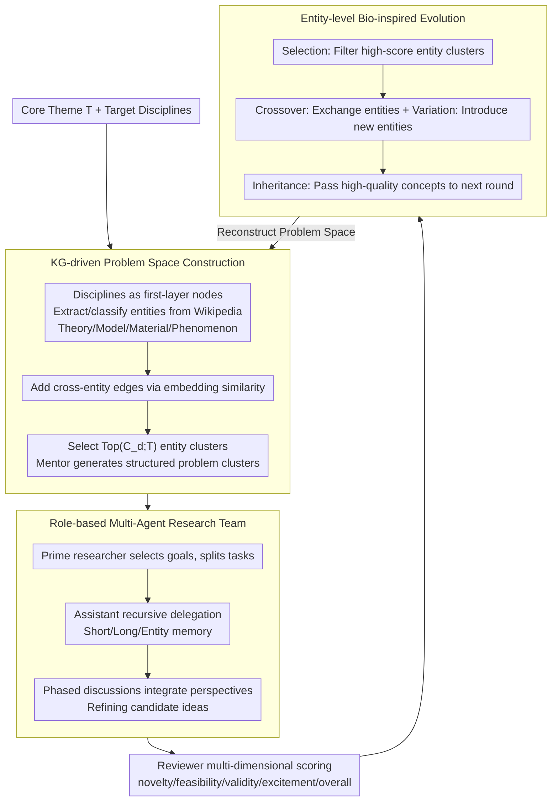

# EvoSci: A Bio-Inspired Multi-Agent Framework for the Evolution of Scientific Discovery

**Conference**: ACL2026  
**arXiv**: [2605.24018](https://arxiv.org/abs/2605.24018)  
**Code**: No public code link found in cache  
**Area**: LLM Agent / AI for Science / Multi-Agent Scientific Discovery  
**Keywords**: scientific discovery, multi-agent collaboration, bio-inspired evolution, knowledge graph, idea generation

## TL;DR
This paper proposes EvoSci, which models the generation of scientific ideas as a multi-agent collaboration and bio-inspired evolutionary cycle. By constructing a problem space, executing research in teams, providing reviewer feedback, and performing entity-level crossover/variation/selection, it generates research ideas with higher novelty and overall quality across 10 scientific topics.

## Background & Motivation
**Background**: LLMs have begun to participate in scientific discovery workflows, including literature mining, hypothesis generation, experimental design, code generation, and paper writing. Systems such as AI-Scientist, SciPIP, SciAgents, and CoScientist have demonstrated the potential of using agents or retrieval-augmented methods to assist research.

**Limitations of Prior Work**: Many systems still treat LLMs as one-off executors in fixed pipelines: given a topic, retrieve literature, generate several ideas, and end with a review. Real scientific research is a long-term, iterative, and collaborative process where research questions are constantly rewritten, different roles reassign tasks based on intermediate findings, and good ideas evolve through feedback.

**Key Challenge**: Scientific discovery requires both open exploration and quality convergence to occur simultaneously. Pursuing only divergence leads to unrealistic fantasies; pursuing only feasibility lead's to local, conservative, incremental ideas. Existing LLM agent frameworks lack a mechanism to organize interdisciplinary exploration, multi-role collaboration, and reviewer feedback into a long-term loop.

**Goal**: Build a multi-agent framework capable of continuously generating, evaluating, reorganizing, and improving research ideas, allowing LLMs to simulate mentors, researchers, and reviewers in actual research teams, using bio-evolutionary mechanisms to maintain exploratory diversity.

**Key Insight**: The authors transform scientific discovery from a one-off mapping of "topic to idea" into a closed loop of "problem space to research team to evaluation feedback to entity evolution." Knowledge graphs provide interdisciplinary entities, role-based agents perform research execution, and reviewer feedback provides selection pressure.

**Core Idea**: Utilize multi-agent research collaboration to generate candidate ideas, then inherit, crossover, mutate, and select the conceptual entities within high-quality ideas to drive the next round of problem space reconstruction.

## Method
EvoSci consists of four phases: Problem Space Construction, Collaborative Research Execution, Research Idea Evaluation, and Bio-Inspired Evolutionary Iteration. It does not train model parameters but organizes the long-term scientific exploration of LLMs through workflows, role division, memory, and reviewer feedback.

### Overall Architecture
The system starts with a core research theme $T$ and a target set of disciplines. First, it constructs a multi-layer knowledge graph: disciplines serve as first-level nodes, entities are extracted from Wikipedia summaries and hyperlinks, categorized by LLMs into types such as Theory, Model, Material, and Phenomenon, and connected via cross-entity edges based on embedding similarity.

Next, a mentor agent maps the theme to core disciplines and organizes domain expert agents (from real scientist datasets) for Q&A-style discussions to supplement domain entities and interdisciplinary directions. The system selects relevant entity clusters around the theme and target disciplines to generate structured problem clusters.

In the research execution phase, the prime researcher selects targets from the problem clusters, assembles assistant researchers, and uses a CrewAI-style lead-and-collaborate mechanism for task decomposition, recursive delegation, periodic integration, and idea refinement. Finally, reviewer agents score based on dimensions such as novelty, feasibility, validity, excitement, and overall quality, and provide improvement suggestions. This feedback then enters the evolutionary cycle.

### Key Designs

**1. KG-driven Problem Space Construction: Anchoring fuzzy themes into explorable problem clusters**

Prompting LLMs directly with "give a topic, generate an idea" often leads to either wild divergence or repetitive ideas due to a lack of semantic anchors. EvoSci constructs a lightweight KG around the core theme $T$: disciplines are first-layer nodes; entities are classified into Theory/Model/Material/Phenomenon types; and cross-entity edges are added via embedding similarity. For each discipline $d$, the most promising entity clusters $Top(\mathcal{C}_d;T)$ are selected based on relevance to the theme. The mentor then generates structured research questions based on the triplet $\langle T,d,Top(\mathcal{C}_d;T)\rangle$. This anchors exploration to specific entities, preventing aimlessness while preserving interdisciplinary connections through cross-entity edges—the level where evolution occurs.

**2. Role-based multi-agent research team: Simulating real collaboration via mentor/researcher/reviewer roles**

A single perspective rarely produces ideas that are both novel and grounded. EvoSci allows the prime researcher to select goals from problem clusters, decompose tasks, and assign them to assistant researchers (who can further delegate recursively). Three types of memory—short-term, long-term, and entity-specific—are used to store intermediate results. Periodic discussions integrate multi-perspective outputs, and finally, a reviewer scores the ideas based on novelty, feasibility, validity, excitement, and overall quality while providing refinement advice. Team size is not "the bigger the better"—experiments found that $team\_size=5$ is optimal, while $7/9$ saw a drop in scores due to coordination overhead, suggesting that "moderate diversity" is the sweet spot.

**3. Entity-level Bio-inspired Evolution: Inheriting conceptual clues from successful ideas**

Simply "asking the model to rewrite ideas based on feedback" often causes high-quality concepts to be lost or results in premature convergence to conservative solutions. EvoSci keeps the discipline layer fixed and treats the entity layer as an evolvable population. It applies four operators to entity clusters: Selection (filtering high-score clusters based on reviewer fitness), Crossover (exchanging entities), Variation (introducing new entities), and Inheritance (passing high-quality concepts to the next round of problem space reconstruction). Thus, reviewer feedback is transformed into selection pressure at the entity level, preserving successful concepts while maintaining exploratory diversity through mutation.

### A Complete Example: From a theme to an evolved idea

For the core theme $T$ "Efficient CO2 reduction catalysts," target disciplines are Chemistry, Materials, and AI. The mentor maps $T$ to these disciplines. The KG clusters entities under Materials (e.g., single-atom catalysts, transition metals, adsorption energy descriptors). After selecting $Top(\mathcal{C}_d;T)$, the mentor generates the question: "Can GNNs predict adsorption energy of single-atom sites to accelerate screening?" The prime researcher selects this, splits it into "Literature Review / Descriptor Design / Model Selection" for assistants, and integrates them into an initial idea. The reviewer evaluates it as high in novelty but low in feasibility. Entering the evolution cycle: Selection retains this high-score entity cluster, Crossover swaps in "Active Learning," and Variation introduces "Uncertainty Estimation." The next problem space is reconstructed as "Using Active Learning + Uncertainty Estimation to reduce DFT labeling costs"—an idea that inherits original concepts but is more feasible. This illustrates feedback accumulation across rounds via entity-level evolution.

### Loss & Training
EvoSci has no parameter training loss; optimization comes from reviewer feedback and evolutionary selection within the workflow. Each idea is scored by a reviewer as $s=(s_{nov},s_{fea},s_{eff},s_{exc},s_{overall})$, accompanied by a rationale, confidence, and improvement suggestions. Evaluation utilizes two mechanisms: a multi-reviewer + meta-reviewer setup simulating ICLR/NeurIPS peer reviews, and tournament-style pairwise ranking for multi-round comparisons of all generated ideas.

## Key Experimental Results

### Main Results

| Backbone | Metric | EvoSci (Ours) | Strongest Baseline | Conclusion |
|--------|------|------|----------|------|
| GPT-4o | ICLR Overall / NeurIPS Overall | 4.45 / 3.44 | VirSci 4.28 / 3.26 | EvoSci achieves highest overall score |
| DeepSeek-v3 | ICLR Overall / NeurIPS Overall | 4.90 / 3.95 | AI Scientist 4.68; CoI-Agent 3.72 | Largest Gain under DeepSeek-v3 |
| Qwen3-max | ICLR Overall / NeurIPS Overall | 4.72 / 3.81 | SciPIP 4.54; CoI-Agent 3.62 | Stable lead across backbones |
| DeepSeek-v3 | Novelty / Excitement | 5.71 / 5.15 | VirSci 5.48 / 5.11 | Leading in innovation-related dimensions |
| Tournament | Avg Wins / Top-10 Count | GPT-4o: 4.27 / 54；DeepSeek-v3: 4.19 / 47；Qwen3-max: 4.25 / 50 | Other methods lower across all backbones | Relative ranking supports main conclusion |

### Ablation Study

| Configuration | Key Metric | Description |
|------|---------|------|
| w/ Problem Guidance | Novelty 4.78, ICLR 4.45, NeurIPS 3.44 | Structured problem space improves novelty and quality |
| w/o Problem Guidance | Novelty 4.22, ICLR 4.22, NeurIPS 3.28 | Exploration directly from raw prompts is weaker |
| team_size sweep | team_size=5 is optimal | Scores improve from 1 to 5, then drop at 7/9 due to overhead |
| w/ Evo vs w/o Evo | NeurIPS 3.38→3.424；ICLR 4.334→4.364 | Evolution brings small but systematic average gains |
| Meta Review vs Single Review | Mean 3.44 vs 3.40, Var 0.018 vs 0.035 | Meta-review doesn't inflate scores but reduces volatility |

### Key Findings
- EvoSci leads stably in Validity, Excitement, and Overall metrics, proving that multi-agent collaboration and evolutionary feedback improve credibility, not just "flashiness."
- Problem guidance is particularly important for novelty. Without problem construction, novelty drops from 4.78 to 4.22, indicating that generating good scientific ideas requires first constructing an explorable problem space.
- The average gain from the evolution module is modest but consistent in direction; meanwhile, under the NeurIPS template, within-topic Std increased from 0.146 to 0.176, showing that evolution enhances exploratory dynamics rather than simply repeating existing ideas.
- Meta-review yields lower variance, suggesting that aggregating multiple reviewers makes LLM evaluation more stable, though the evaluation mechanism itself remains a key bottleneck for future systems.

## Highlights & Insights
- The most interesting aspect of this paper is applying "biological evolution" to the entity level rather than keeping it as a metaphor. Inheritance, crossover, variation, and selection of entity clusters allow feedback to affect the next round's problem space rather than just rewriting the previous text.
- The multi-agent team size results are practical: more agents are not always better; a moderate diversity of around 5 is superior to large teams of 7/9. This is a useful reference for agent workflow design.
- Problem space construction is more critical than direct idea generation. Many scientific agent systems fail not because they cannot write ideas, but because they fail to decompose research questions into evolvable and comparable subspaces.
- Tournament-style ranking is a beneficial supplement to absolute scoring. Absolute LLM scores may drift, while pairwise comparisons are better at capturing relative quality.

## Limitations & Future Work
- The authors acknowledge that extensive interdisciplinary exploration leads to a trade-off between creativity and feasibility; some ideas are novel but have low practical feasibility.
- Evaluation still relies primarily on LLM reviewers and meta-reviewers. Although variance decreases, objective assessment of "good scientific ideas" remains difficult and requires more expert human verification.
- 10 topics cover some AI Scientist settings but are insufficient to represent the full complexity of real scientific discovery; the interdisciplinary KG is also lightweight and may miss deep domain constraints.
- Future work could strengthen structured knowledge representation, causal reasoning, research loops involving real literature/data/experiments, and memory management/quality control in long-term autonomous discovery.

## Related Work & Insights
- **vs AI Scientist**: AI Scientist is closer to end-to-end research automation; EvoSci emphasizes problem space construction, multi-role collaboration, and multi-round evolution, resulting in stronger idea novelty/overall quality.
- **vs SciPIP**: SciPIP uses RAG for hypothesis generation; EvoSci adds research team collaboration and entity-level evolution for longer-term exploration.
- **vs SciAgents / CoScientist**: These systems show the potential for multi-agent scientific reasoning, but EvoSci differs by explicitly turning reviewer feedback into selection pressure to drive the next round's problem space.
- **Insight**: When building scientific agents, one should not only optimize the quality of a single output. It is more important to design inheritable intermediate states so that good concepts, failure feedback, and interdisciplinary connections can accumulate over multiple rounds.

## Rating
- Novelty: ⭐⭐⭐⭐ While multi-agent science is not entirely new, the combination of the entity-level evolutionary closed-loop and problem space construction is quite comprehensive.
- Experimental Thoroughness: ⭐⭐⭐⭐ Covers 10 topics, 3 backbones, main experiments, and multiple ablations; lacks long-term verification by human experts.
- Writing Quality: ⭐⭐⭐⭐ Clear framework description and comprehensive tables; the bio-evolutionary mechanism still contains some conceptual expressions.
- Value: ⭐⭐⭐⭐ High reference value for scientific agents, idea generation, and long-term open-ended exploration systems.

<!-- RELATED:START -->

## Related Papers

- [\[ACL 2026\] PosterForest: Hierarchical Multi-Agent Collaboration for Scientific Poster Generation](posterforest_hierarchical_multi-agent_collaboration_for_scientific_poster_genera.md)
- [\[ACL 2026\] EvoSpark: Endogenous Interactive Agent Societies for Unified Long-Horizon Narrative Evolution](evospark_endogenous_interactive_agent_societies_for_unified_long-horizon_narrati.md)
- [\[ICLR 2026\] Auditing Cascading Risks in Multi-Agent Systems via Semantic–Geometric Co-evolution](../../ICLR2026/multi_agent/auditing_cascading_risks_in_multi-agent_systems_via_semanti-geometric_co-evolut.md)
- [\[ACL 2026\] A Multi-Agent Framework for Feature-Constrained Difficulty Control in Reading Comprehension Item Generation](a_multi-agent_framework_for_feature-constrained_difficulty_control_in_reading_co.md)
- [\[ACL 2026\] MATA: Multi-Agent Framework for Reliable and Flexible Table Question Answering](mata_multi-agent_framework_for_reliable_and_flexible_table_question_answering.md)

<!-- RELATED:END -->
