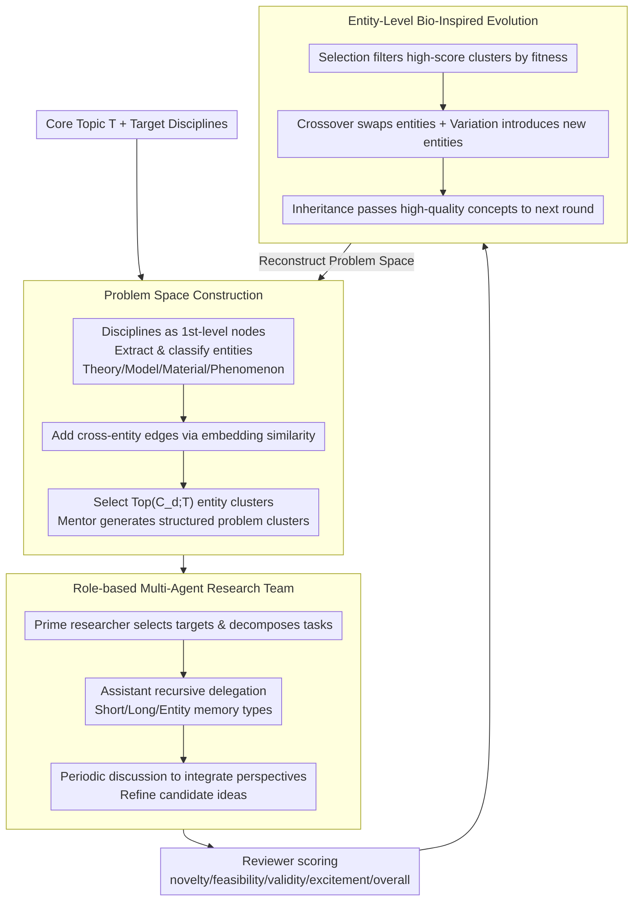

# EvoSci: A Bio-Inspired Multi-Agent Framework for the Evolution of Scientific Discovery

**Conference**: ACL2026  
**arXiv**: [2605.24018](https://arxiv.org/abs/2605.24018)  
**Code**: No public code link found in cache  
**Area**: LLM Agent / AI for Science / Multi-agent Scientific Discovery  
**Keywords**: scientific discovery, multi-agent collaboration, bio-inspired evolution, knowledge graph, idea generation

## TL;DR
This paper proposes EvoSci, which models scientific idea generation as a cycle of multi-agent collaboration and bio-inspired evolution. By constructing problem spaces, executing team-based research, applying reviewer feedback, and performing entity-level crossover/mutation/selection, the framework generates research ideas with higher novelty and overall quality across 10 scientific themes.

## Background & Motivation
**Background**: LLMs have begun to participate in the scientific discovery process, including literature mining, hypothesis generation, experimental design, code generation, and paper writing. Systems like AI-Scientist, SciPIP, SciAgents, and CoScientist have demonstrated the potential of using agents or retrieval-augmented methods to assist research.

**Limitations of Prior Work**: Many systems still treat LLMs as one-off executors within fixed pipelines: given a topic, they retrieve literature, generate ideas, and finish after a review. Real scientific research is a long-term, iterative, and collaborative process where research questions are constantly rewritten, different roles redistribute work based on intermediate findings, and good ideas evolve through feedback.

**Key Challenge**: Scientific discovery requires open exploration and quality convergence to occur simultaneously. Pursuing only divergence leads to unrealistic fantasies, while pursuing only feasibility often falls into local, conservative incremental ideas. Existing LLM agent frameworks lack a mechanism to organize interdisciplinary exploration, multi-role collaboration, and reviewer feedback into a long-term loop.

**Goal**: To build a multi-agent framework capable of continuously generating, evaluating, reorganizing, and improving research ideas, simulating mentors, researchers, and reviewers in real research teams while maintaining exploration diversity through bio-evolutionary mechanisms.

**Key Insight**: The authors transform the one-time mapping of "topic to idea" into a closed loop of "problem space to research team to reviewer feedback to entity evolution." Knowledge graphs provide interdisciplinary entities, role-based agents perform research execution, and reviewer feedback provides selection pressure.

**Core Idea**: Utilize multi-agent research collaboration to produce candidate ideas, then inherit, crossover, mutate, and select conceptual entities within high-quality ideas to drive the reconstruction of the problem space for the next round.

## Method
EvoSci consists of four stages: Problem Space Construction, Collaborative Research Execution, Research Idea Evaluation, and Bio-Inspired Evolutionary Iteration. It does not train model parameters but organizes long-term scientific exploration by LLMs through workflows, role assignments, memory, and reviewer feedback.

### Overall Architecture
The system begins with a core research topic $T$ and a set of target disciplines. First, a multi-layer knowledge graph is constructed: disciplines serve as first-level nodes, and entities are extracted from Wikipedia summaries and hyperlinks, categorized by LLMs into types such as Theory, Model, Material, and Phenomenon, with cross-entity edges added based on embedding similarity.

Next, a mentor agent maps the topic to core disciplines and organizes Q&A-style discussions among domain expert agents (sourced from real scientist datasets) to supplement domain entities and interdisciplinary directions. The system selects relevant entity clusters around the topic and target disciplines to generate structured problem clusters.

In the research execution phase, a prime researcher selects targets from the problem clusters and assembles assistant researchers. They use a CrewAI-style lead-and-collaborate mechanism for task decomposition, recursive delegation, periodic integration, and idea refinement. Finally, reviewer agents score the ideas across dimensions—novelty, feasibility, validity, excitement, and overall—and provide improvement suggestions, which enter the evolutionary cycle.

### Key Designs

**1. Knowledge Graph-Driven Problem Space Construction: Anchoring Vague Topics into Explorable Problem Clusters**

When LLMs are given a topic to produce ideas directly, they tend to either diverge into wild fantasies or repeat the same types of thoughts, lacking a semantic anchor. EvoSci builds a lightweight knowledge graph around the core topic $T$ and target disciplines: disciplines are first-level nodes, and entities are categorised by type (Theory/Model/Material/Phenomenon) from Wikipedia. Cross-entity edges are supplemented using embedding similarity. Then, for each discipline $d$, the most promising entity clusters $Top(\mathcal{C}_d;T)$ are selected based on relevance to the topic. The mentor generates structured research questions based on the triplet $\langle T,d,Top(\mathcal{C}_d;T)\rangle$. This anchors exploration to specific entities, preventing aimlessness while preserving interdisciplinary connections through cross-entity edges—this entity level is where subsequent evolution operates.

**2. Role-based Multi-Agent Research Team: Simulating Real Collaboration with Mentor/Researcher/Reviewer**

A single perspective rarely produces ideas that are both novel and grounded. EvoSci allows a prime researcher to select targets from problem clusters and decompose tasks for several assistant researchers, who can delegate further recursively. Intermediate results are stored in short-term, long-term, and entity-based memories. Multi-perspective outputs are integrated during phase discussions. Finally, reviewers score and suggest improvements based on novelty, feasibility, validity, excitement, and overall quality. Team size follows a "sweet spot": experiments show that `team_size=5` is optimal, whereas 7 or 9 leads to performance drops due to coordination overhead.

**3. Entity-Level Bio-Inspired Evolution: Inheriting Conceptual Clues from Successful Ideas**

If a system merely "rewrites ideas based on feedback," concepts from good ideas are easily lost or converge prematurely to conservative solutions. EvoSci keeps the discipline layer fixed and treats the entity layer as an evolvable population, executing four operators on entity clusters: Crossover (exchanging entities), Variation (introducing new entities), Selection (filtering high-score clusters via reviewer fitness), and Inheritance (passing high-quality concepts to the next round of problem space reconstruction). Thus, reviewer feedback is transformed into selection pressure at the entity level, preserving successful concepts while maintaining exploration diversity through mutation.

### Main Results

| Backbone | Metric | EvoSci | Strongest Baseline | Conclusion |
|--------|------|------|----------|------|
| GPT-4o | ICLR Overall / NeurIPS Overall | 4.45 / 3.44 | VirSci 4.28 / 3.26 | EvoSci has the highest composite score |
| DeepSeek-v3 | ICLR Overall / NeurIPS Overall | 4.90 / 3.95 | AI Scientist 4.68; CoI-Agent 3.72 | Largest advantage under DeepSeek-v3 |
| Qwen3-max | ICLR Overall / NeurIPS Overall | 4.72 / 3.81 | SciPIP 4.54; CoI-Agent 3.62 | Stable lead across backbones |
| DeepSeek-v3 | Novelty / Excitement | 5.71 / 5.15 | VirSci 5.48 / 5.11 | Leads in innovation-related dimensions |
| Tournament | Avg Wins / Top-10 Count | GPT-4o: 4.27 / 54; DeepSeek-v3: 4.19 / 47; Qwen3-max: 4.25 / 50 | Other methods lower across all backbones | Relative ranking supports main conclusion |

### Ablation Study

| Configuration | Key Metrics | Explanation |
|------|---------|------|
| w/ Problem Guidance | Novelty 4.78, ICLR 4.45, NeurIPS 3.44 | Structured problem space improves novelty and quality |
| w/o Problem Guidance | Novelty 4.22, ICLR 4.22, NeurIPS 3.28 | Direct exploration from raw prompts is weaker |
| team_size sweep | team_size=5 optimal | Performance increases from 1 to 5 agents, drops after 7/9 |
| w/ Evo vs w/o Evo | NeurIPS 3.38→3.424; ICLR 4.334→4.364 | Evolution brings small but systematic average gains |
| Meta Review vs Single Review | Mean 3.44 vs 3.40, Var 0.018 vs 0.035 | Meta-review reduces variance rather than raising scores |

### Key Findings
- EvoSci consistently leads in Validity, Excitement, and overall metrics, indicating that multi-agent collaboration and evolutionary feedback do not just make ideas "fancier" but also improve credibility.
- Problem guidance is particularly crucial for novelty. Without problem construction, novelty drops from 4.78 to 4.22, suggesting that generating good scientific ideas requires first constructing an explorable problem space.
- The average gain from the evolution module is stable; meanwhile, the within-topic standard deviation under the NeurIPS template increased from 0.146 to 0.176, indicating that evolution enhances exploratory dynamics rather than simply repeating existing ideas.
- Meta-review yields lower variance, suggesting that aggregating multiple reviewers makes LLM evaluation more stable, though the evaluation mechanism itself remains a key bottleneck.

## Highlights & Insights
- The most interesting aspect is applying "bio-evolution" to the entity level rather than keeping it as a metaphor. The inheritance, crossover, mutation, and selection of entity clusters allow feedback to influence the next round’s problem space, not just rewrite the previous round's text.
- The multi-agent team size results are practical: more agents are not necessarily better; moderate diversity around 5 agents is superior to large teams of 7 or 9. This is a useful reference for agent workflow design.
- Problem space construction is more critical than direct idea generation. Many scientific agent systems fail not because they cannot write ideas, but because they fail to decompose the research problem into evolvable, comparable subspaces.
- Tournament-style ranking is a beneficial supplement to absolute scoring. While absolute LLM scores may drift, pairwise comparisons more easily capture relative quality.

## Limitations & Future Work
- The authors acknowledge that extensive interdisciplinary exploration in EvoSci leads to a trade-off between creativity and feasibility, with some ideas being novel but having low practical feasibility.
- Evaluation still relies primarily on LLM and meta-reviewers. Although variance decreases, objective assessment of "good scientific ideas" remains difficult and requires more human expert validation.
- The 10 themes cover some AI Scientist settings but are insufficient to represent the full complexity of real scientific discovery; the interdisciplinary knowledge graph is also relatively lightweight and may miss deep domain constraints.
- Future work could strengthen structured knowledge representation, causal reasoning, closed loops with real literature/data/experiments, and memory management in long-term autonomous discovery.

## Related Work & Insights
- **vs AI Scientist**: AI Scientist focuses more on end-to-end research automation; EvoSci emphasizes problem space construction, multi-role collaboration, and multi-round evolution, thus performing stronger in idea novelty/overall quality.
- **vs SciPIP**: SciPIP uses retrieval-augmented hypothesis generation; EvoSci adds research team collaboration and entity-level evolution for longer-term exploration.
- **vs SciAgents / CoScientist**: These systems demonstrate the potential of multi-agent scientific reasoning; EvoSci differs by explicitly turning reviewer feedback into selection pressure to drive changes in the next round's problem space.
- **Insight**: When designing scientific agents, one should not just optimize for single-output quality; it is more important to design inheritable intermediate states so that good concepts, failure feedback, and interdisciplinary connections can accumulate over multiple rounds.

## Rating
- Novelty: ⭐⭐⭐⭐ Multi-agent science is not entirely new, but the combination of entity-level evolution and problem space construction is comprehensive.
- Experimental Thoroughness: ⭐⭐⭐⭐ Covers 10 topics, 3 backbones, and multiple ablation groups; lacks long-term validation by real experts.
- Writing Quality: ⭐⭐⭐⭐ The framework is clearly narrated with sufficient experimental tables; some parts of the bio-evolution mechanism remain conceptual.
- Value: ⭐⭐⭐⭐ High reference value for research agents, idea generation, and long-term open-ended exploration systems.

<!-- RELATED:START -->

## Related Papers

- [\[ACL 2026\] PosterForest: Hierarchical Multi-Agent Collaboration for Scientific Poster Generation](posterforest_hierarchical_multi-agent_collaboration_for_scientific_poster_genera.md)
- [\[CVPR 2026\] Symphony: A Cognitively-Inspired Multi-Agent System for Long-Video Understanding](../../CVPR2026/multi_agent/symphony_a_cognitively-inspired_multi-agent_system_for_long-video_understanding.md)
- [\[ACL 2026\] EvoSpark: Endogenous Interactive Agent Societies for Unified Long-Horizon Narrative Evolution](evospark_endogenous_interactive_agent_societies_for_unified_long-horizon_narrati.md)
- [\[CVPR 2026\] SciEducator: Scientific Video Understanding and Educating via Deming-Cycle Multi-Agent System](../../CVPR2026/multi_agent/scieducator_scientific_video_understanding_and_educating_via_deming-cycle_multi-.md)
- [\[ICLR 2026\] Auditing Cascading Risks in Multi-Agent Systems via Semantic–Geometric Co-evolution](../../ICLR2026/multi_agent/auditing_cascading_risks_in_multi-agent_systems_via_semanti-geometric_co-evolut.md)

<!-- RELATED:END -->
