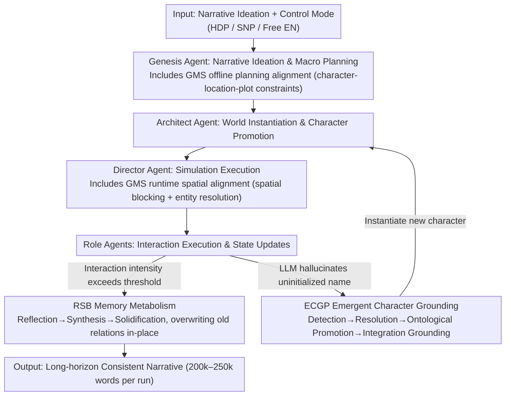

# EvoSpark: Endogenous Interactive Agent Societies for Unified Long-Horizon Narrative Evolution

**Conference**: ACL 2026  
**arXiv**: [2604.12776](https://arxiv.org/abs/2604.12776)  
**Code**: None  
**Area**: LLM/NLP  
**Keywords**: Multi-agent Narrative, Long-horizon Story Evolution, Social Memory Metabolism, Spatial Alignment, Emergent Characters

## TL;DR
EvoSpark proposes a multi-agent framework for long-horizon narrative evolution. It addresses social memory stacking and narrative-spatial misalignment through three designs: hierarchical recursive memory (RSB for social cognitive metabolism), Generative Mise-en-scène (GMS for character-location-plot alignment), and the Emergent Character Grounding Protocol (ECGP to transform LLM hallucinations into persistent characters).

## Background & Motivation

**Background**: LLM multi-agent systems have progressed in narrative generation (e.g., Generative Agents, BookWorld) but face systematic degradation in long-horizon simulations.

**Limitations of Prior Work**: (1) Social memory stacking—additive memory leads to the accumulation of contradictory relationship states (e.g., simultaneously friends and enemies), causing behavioral incoherence; (2) Narrative-spatial misalignment—text agents lack spatial state synchronization, resulting in characters appearing in locations that contradict plot logic.

**Key Challenge**: Long-horizon narratives require a balance between "open emergence" and "logical consistency"—excessive control sacrifices autonomy, while excessive freedom leads to chaos. Existing frameworks are either strictly scripted (sacrificing emergence) or fully open (sacrificing coherence).

**Goal**: Build a unified framework that supports a full spectrum of control, from strict hierarchical planning to complete free emergence, while maintaining long-term logical consistency.

**Key Insight**: Redesign the memory system and spatial management—memory should not be an additive log but "living cognition" (metabolizable and updateable), and space should not be a passive container but a "virtual stage manager."

**Core Idea**: Role Social Foundation (RSB) for memory metabolism + Generative Mise-en-scène (GMS) for spatial alignment + Emergent Character Grounding (ECGP) to transform hallucinations into creativity.

## Method

### Overall Architecture
Four types of agents collaborate: Genesis Agent (narrative ideation and macro planning), Architect Agent (world instantiation and character promotion), Director Agent (simulation execution and spatial alignment), and Role Agents (interaction execution and memory updates). The framework supports three control modes: HDP (Hierarchical Detailed Planning), SNP (Sequential Key Nodes), and Free EN (Fully Free Emergence). Three core mechanisms are embedded in this agent pipeline: Genesis and Director execute GMS (Generative Mise-en-scène) for spatial alignment; Role Agent interactions trigger RSB (Role Social Foundation) for memory metabolism; when the Director detects a hallucinated new name, it collaborates with the Architect to complete the ECGP (Emergent Character Grounding Protocol) to instantiate the new character.

### Key Designs

**1. Role Social Foundation (RSB): Enabling Social Memory "Metabolism" instead of Mindless Addition**

The most fatal issue in long-horizon simulation is social memory stacking—additive logs allow "A and B are friends" and a later "A and B are enemies" to coexist, leading to schizophrenic behavior. EvoSpark splits memory into four functional layers: Episodic Evolution Buffer (EEB) for short-term caching, Shared World Knowledge Base (SWKB) for immutable global truths, Role Episodic Bank (REB) for immutable experience logs (for traceability), and Role Social Foundation (RSB) for mutable current state snapshots. When interaction intensity exceeds a threshold, it triggers a "Reflection-Synthesis-Solidification" cycle: reflection is triggered first; the synthesis stage compares new EEB data with the old RSB state to resolve relational topology conflicts; the solidification stage overwrites the RSB in-place—old relationships are replaced by new ones rather than stacked. This is the missing step in Generative Agents' reflection: GA only synthesizes observations and maintains state without metabolism, leading to inevitable contradictions over long durations.

**2. Generative Mise-en-scène (GMS): A "Virtual Stage Manager" for the Textual World**

Pure text agents lack spatial state synchronization, frequently placing characters in locations that conflict with plot logic (narrative-spatial misalignment). GMS manages space in two stages: in the offline planning alignment phase, the Genesis Agent establishes initial constraints across character, location, and plot dimensions; in the runtime dynamic spatial alignment phase, the Director Agent uses spatial blocking to synchronize narrative intent with real-time context, inserting an entity resolution step to correct identity hallucinations where the LLM confuses characters. GMS acts like a stage manager, implicitly providing spatial awareness to each agent, moving beyond passive containers like BookWorld which have discrete geographic tracking but lack fine-grained character-location-plot alignment.

**3. Emergent Character Grounding Protocol (ECGP): Turning "Hallucinated Names" into Formal New Characters**

When an LLM produces an uninitialized name despite a restricted character list, it is usually treated as a bug. ECGP, conversely, interprets this as a signal that the "narrative requires a new character." The process involves four steps: Trigger Detection (hallucinating a name under constraints = necessity signal) → Entity Resolution (Director verifies if it is a truly new entity or an alias) → Ontological Promotion (elevating its status based on plot importance) → Integration and Grounding (Architect instantiates the character in the world and RSB). Thus, hallucinations evolve from errors into creative assets, providing a mechanism for emergent character growth in open-world expansion—approximately 20% of emergent characters contributed significantly to subsequent narratives in experiments.

### Illustration: How a Tavern Conflict is Processed

In Free EN mode, characters Alice and Bob are initially allies. A heated argument breaks out in a tavern (interaction intensity exceeds threshold) → RSB triggers Reflection-Synthesis-Solidification: the synthesis stage identifies that the new "hostile" data in EEB conflicts with the old "ally" state in RSB; the solidification stage overwrites the Alice-Bob relationship as "hostile," while REB preserves the history. Simultaneously, the Director’s GMS determines the plot requires Alice to leave, moving her to the "back alley" via spatial blocking to prevent her from remaining in the tavern in contradiction to the plot. During this, the LLM hallucinates an uninitialized name "Innkeeper Carol"—ECGP detection identifies narrative necessity, entity resolution confirms Carol is not an alias, ontological promotion grants her secondary character status, and the Architect instantiates Carol in the world and RSB. A single conflict thus completes memory metabolism, spatial alignment, and character emergence.

### Loss & Training
EvoSpark is a pure inference-time framework and does not involve training. It utilizes various LLM backbones (GPT-4o and open-source models were used in experiments).

## Key Experimental Results

### Main Results
EvoSpark significantly outperforms Open-Theatre, BookWorld, and HoLLMwood across three modes (HDP, SNP, Free EN) and multi-language/multi-backbone settings in terms of character performance, narrative coherence, and spatial consistency. In long-horizon settings, it generates 200k-250k words per run.

### Ablation Study

| Configuration | Key Metrics | Description |
|------|---------|------|
| W/O GMS Dynamic Alignment | Increased spatial contradictions | Characters "lost in space" |
| W/O RSB Metabolism | Long-term behavioral incoherence | Contradictions due to memory stacking |
| W/O ECGP | Limited world expansion | Loss of emergent character capability |

### Key Findings
- The presence of GMS directly impacts physical consistency—without it, logical contradictions like "character staring at A but body facing B" occur.
- The RSB metabolism mechanism is central to long-term consistency—additive memory shows severe stacking after 15 events.
- ECGP demonstrates the potential of "hallucination as creativity"—roughly 20% of emergent characters contribute meaningfully to the narrative.

## Highlights & Insights
- The ECGP design, which **transforms LLM hallucinations into creativity**, is highly inspiring—in other contexts, LLM "errors" might be redefined as "exploration."
- The concept of **memory metabolism** is superior to simple memory management—it is not about managing storage space but making memory "living" and "metabolic," which is closer to the nature of human memory.
- The unified framework for three control modes (HDP/SNP/Free EN) demonstrates how to support a full spectrum of control, from strict to free, within a single architecture.

## Limitations & Future Work
- Evaluation was primarily on fictional narratives; applicability to other simulations (e.g., social science) remains to be verified.
- High computational cost—long-horizon simulations require numerous LLM calls.
- RSB metabolism thresholds are hyperparameters that might require different configurations for different story genres.
- ECGP entity resolution may fail when the number of characters is very large.

## Related Work & Insights
- **vs Generative Agents**: GA uses reflection to synthesize observations without metabolism; EvoSpark uses RSB for in-place updates to solve memory stacking.
- **vs BookWorld**: BW has discrete geographic tracking but lacks character-location-plot alignment; EvoSpark achieves fine-grained spatial management via GMS.
- **vs HoLLMwood**: HW uses a writer-editor workflow to refine narrative quality but lacks spatial and memory metabolism mechanisms.

## Rating
- Novelty: ⭐⭐⭐⭐⭐ The concepts of memory metabolism, spatial scheduling, and hallucination transformation are highly novel.
- Experimental Thoroughness: ⭐⭐⭐⭐ Three modes, multiple baseline comparisons, and long-term consistency analysis.
- Writing Quality: ⭐⭐⭐⭐ Detailed framework description, though the high number of component names increases cognitive load.

<!-- RELATED:START -->

## Related Papers

- [\[ICLR 2026\] LH-Deception: Simulating and Understanding LLM Deceptive Behaviors in Long-Horizon Interactions](../../ICLR2026/multi_agent/lh-deception_simulating_and_understanding_llm_deceptive_behaviors_in_long-horizo.md)
- [\[ACL 2026\] EvoSci: A Bio-Inspired Multi-Agent Framework for the Evolution of Scientific Discovery](evosci_a_bio-inspired_multi-agent_framework_for_the_evolution_of_scientific_disc.md)
- [\[AAAI 2026\] Conversational Learning Diagnosis via Reasoning Multi-Turn Interactive Learning](../../AAAI2026/multi_agent/conversational_learning_diagnosis_via_reasoning_multi-turn_interactive_learning.md)
- [\[AAAI 2026\] LLandMark: A Multi-Agent Framework for Landmark-Aware Multimodal Interactive Video Retrieval](../../AAAI2026/multi_agent/llandmark_a_multi-agent_framework_for_landmark-aware_multimodal_interactive_vide.md)
- [\[ACL 2026\] Topology Matters: Measuring Memory Leakage in Multi-Agent LLMs](topology_matters_measuring_memory_leakage_in_multi-agent_llms.md)

<!-- RELATED:END -->
