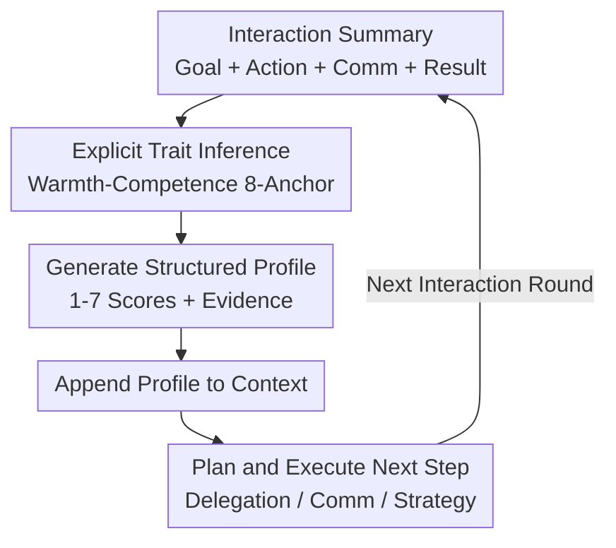

# Explicit Trait Inference for Multi-Agent Coordination

**Conference**: ACL 2026  
**arXiv**: [2604.19278](https://arxiv.org/abs/2604.19278)  
**Code**: None  
**Area**: LLM Multi-Agent / Social Reasoning  
**Keywords**: Multi-agent coordination, trait inference, warmth-competence dimensions, social cognition, game theory

## TL;DR

This paper proposes the Explicit Trait Inference (ETI) method, which enables LLM agents to reason about and track the behavioral characteristics of partners based on the psychological dimensions of warmth and competence. This approach reduces payoff losses by 45-77% in economic games and improves task performance by 3-29% on MultiAgentBench.

## Background & Motivation

**Background**: LLM-based multi-agent systems (MAS) demonstrate potential in complex tasks, but remain prone to coordination failures. Issues such as goal drift, error cascades, insufficient information sharing, and behavioral misalignment limit their reliability and scalability.

**Limitations of Prior Work**: (1) Structured methods (e.g., CAMEL, ChatDev) organize collaboration through fixed roles but do not involve agents reasoning about or adapting to one another; (2) Theory of Mind (ToM) methods primarily model transient mental states (beliefs, intentions) rather than stable behavioral traits (reliability, willingness to cooperate); (3) Reputation systems only track task metrics (success rates) without capturing the "why" and "how" of behavioral patterns.

**Key Challenge**: The core challenge is not whether agents can execute individual actions, but whether they can coordinate effectively with each other—this requires forming stable, actionable cognitive representations of partners.

**Goal**: To provide a lightweight, psychology-based mechanism that allows agents to infer partner traits from interaction history and adjust their behavior accordingly.

**Key Insight**: Borrowing from the warmth-competence two-dimensional model in social psychology (Fiske et al., 2007), social evaluations are mapped into actionable coordination signals.

**Core Idea**: Agents explicitly infer and maintain trait profiles of partners across the dimensions of warmth (trust/cooperation) and competence (skill/reliability) to guide delegation, communication, and strategy adjustment.

## Method

### Overall Architecture

ETI is a framework based on prompting and context management. After each interaction, the agent receives a structured summary containing task goals, actions, communications, and outcomes, and is prompted to reason about the partner's traits. The agent generates (a) 1-7 Likert scores for each trait and (b) brief evidence supporting the judgment. These profiles are appended to the context for subsequent planning and execution, forming a reasoning-planning-execution loop that updates continuously across rounds.

### Key Designs

**1. Warmth-Competence Trait Framework: Creating a structured profile for partners via two dimensions and eight anchors**

While structured methods (CAMEL, ChatDev) fix roles without inter-agent reasoning, ToM methods model only transient states, and reputation systems track only success rates, ETI utilizes the psychological warmth-competence model. Eight behavioral anchors are categorized into two dimensions: Warmth (Goal Alignment, Cooperativeness, Trustworthiness, Maliciousness) and Competence (Execution, Reliability, Adaptability, Efficiency). These dimensions are strictly separated to prevent common linguistic misinterpretations, such as mistaking "uncooperativeness" for "incompetence." This division directly addresses two types of coordination failures: low warmth (goal drift, unreliable cooperation) prompts agents to clarify intentions or discount unreliable inputs, while low competence (execution errors, cascade failures) prompts task redistribution or increased verification.

**2. Reasoning-Planning-Execution Loop: Integrating trait inference into the multi-agent pipeline**

Definitions alone are insufficient; trait inference must influence decisions in real-time. After each iteration, the agent first reasons about partner traits based on action and outcome history, generating 1-7 Likert scores and supporting evidence. This structured profile is then appended to the context, which is used to plan and execute the next step. Prompts specifically instruct the model to focus on primary behavioral patterns rather than isolated events and to remain domain-agnostic. The mechanism is purely prompt-based, requiring no fine-tuning or additional data, making it a low-overhead, plug-and-play addition to any MAS architecture.

**3. Parameterizing Competence in Economic Games: Creating an environment with ground truth to verify inference accuracy**

To verify the accuracy of trait inference, an environment is needed where intentions and competence are separable and ground truth exists. ETI introduces a competence parameter to standard Prisoner's Dilemma and Stag Hunt games: the intended action of a player succeeds only with probability $p_i$. This allows the agent to infer intent from actions (cooperation vs. selfishness) and competence from results (success rate). By decoupling these, the accuracy of trait judgments can be precisely evaluated. Experiments involve agents playing against parameterized rule-based opponents for 50 rounds, requiring both simplicity and adaptive reasoning.

### An Example: How profiles update decisions in a 50-round Prisoner's Dilemma

In early rounds, a rule-based opponent intends to cooperate but occasionally "slips" into betrayal because $p_i < 1$. A CoT baseline, observing a few betrayals, turns conservative and suffers long-term losses. Conversely, the ETI agent updates its profile after each round: as the opponent chooses cooperation in most rounds, it is judged high in the warmth dimension (high cooperativeness/trustworthiness). Occasional failures are inferred as fluctuations in competence (execution) rather than malice based on $p_i$, resulting in only minor score deductions for competence. In subsequent planning, the high-warmth profile encourages the agent to continue cooperating without being deterred by isolated betrayals, reducing payoff deviation by 45-77% compared to CoT. This explains the ablation finding: only "informative" profiles are useful; generalized profiles lack such discriminative power and are largely ineffective.

### Loss & Training

ETI is a pure prompting method and does not involve training. Qwen3-8B was used as the agent, with 25 independent repetitions across all configurations.

## Key Experimental Results

### Main Results

In economic games (Qwen3-8B vs. Rule-based opponent):

| Game | Method | Payoff Deviation↓ | Description |
|------|------|----------|------|
| Prisoner's Dilemma | CoT Baseline | High | Lacks opponent modeling |
| Prisoner's Dilemma | ETI | **Reduced 45-77%** | Trait-aware decision making |
| Stag Hunt | CoT Baseline | High | Defaults to conservative strategy |
| Stag Hunt | ETI | **Significant Improvement** | Accurately judges cooperation likelihood |

On MultiAgentBench:

| Scenario Type | ETI Gain | Coordination Gain |
|---------|---------|---------|
| Cooperative | 3-29% | 6-42% |
| Competitive | Improved | Significant |

### Ablation Study

| Configuration | Effect | Description |
|------|------|------|
| ETI (Informative Profile) | Optimal | Driven by diverse trait judgments |
| ETI (Generalized Profile) | Slight Improvement | Non-discriminative profiles are ineffective |
| No Trait Inference | Baseline | CoT focuses only on task-level reasoning |
| Trait Predicted Behavior | Accurate | ETI profiles indeed predict agent actions |

### Key Findings

- The gains of ETI come from "targeted reasoning" rather than "more reasoning"—generalized profiles are nearly ineffective; only highly informative profiles provide utility.
- Trait inference capability is verified: The profiles generated by ETI successfully predict subsequent agent behavior, proving the model can reliably infer stable traits from interaction history.
- In complex scenarios on MultiAgentBench, ETI achieves a maximum improvement of 29%, demonstrating the scalability of the method from controlled settings to realistic MAS.
- The warmth dimension is more critical in cooperative scenarios (detecting unreliable collaborators), while the competence dimension is more critical in complex task scenarios (task redistribution).

## Highlights & Insights

- Introducing the psychological warmth-competence model to MAS is an elegant interdisciplinary innovation: trust and coordination in human society operate on these two dimensions, and formalizing this as an inter-agent reasoning framework is natural.
- The design of "behavior-anchored" trait definitions is noteworthy: descriptive behavioral anchors (rather than abstract concepts) prevent LLMs from conflating dimensions during reasoning, a technique applicable to any scenario requiring structured LLM judgments.
- The pure prompting implementation implies zero additional training costs and plug-and-play capability, which is extremely friendly for practical MAS deployment.

## Limitations & Future Work

- The accuracy of trait inference depends on the social reasoning capabilities of the underlying LLM; weaker models may generate inaccurate profiles.
- The current framework assumes traits are relatively stable—capability to detect strategic disguise (e.g., cooperating early to betray later) is limited.
- While the selection of 8 traits is psychologically grounded, it may not be the optimal design for MAS—task-specific trait dimensions might be more effective.
- In extremely large-scale MAS (>10 agents), the context cost of maintaining trait profiles for all partners may become excessive.

## Related Work & Insights

- **vs. ToM Methods (Li et al., 2023)**: Models transient beliefs/intentions without tracking stable traits; ETI provides persistent representations across interactions.
- **vs. Reputation Systems (Lou et al., 2026)**: Tracks only metrics like success rates without capturing behavioral motivation; ETI provides richer representations (Why + How).
- **vs. CoT/Reflexion**: Focuses solely on structured task-level reasoning without reasoning about others; ETI extends this to the social reasoning domain.

## Rating
- Novelty: ⭐⭐⭐⭐⭐ First systematic combination of psychological trait theory and MAS.
- Experimental Thoroughness: ⭐⭐⭐⭐⭐ Comprehensive verification from accuracy to causality across controlled games and realistic MAS.
- Writing Quality: ⭐⭐⭐⭐⭐ Clear motivation and excellent interdisciplinary integration.
- Value: ⭐⭐⭐⭐⭐ Provides a lightweight and effective new paradigm for LLM multi-agent coordination.

<!-- RELATED:START -->

## Related Papers

- [\[AAAI 2026\] iMAD: Intelligent Multi-Agent Debate for Efficient and Accurate LLM Inference](../../AAAI2026/multi_agent/imad_intelligent_multi-agent_debate_for_efficient_and_accura.md)
- [\[ICLR 2026\] Multi-agent Coordination via Flow Matching](../../ICLR2026/multi_agent/multi-agent_coordination_via_flow_matching.md)
- [\[ACL 2026\] SILO-BENCH: A Scalable Environment for Evaluating Distributed Coordination in Multi-Agent LLM Systems](silo-bench_a_scalable_environment_for_evaluating_distributed_coordination_in_mul.md)
- [\[ACL 2026\] ATLAS: Adaptive Trading with LLM AgentS Through Dynamic Prompt Optimization and Multi-Agent Coordination](atlas_adaptive_trading_with_llm_agents_through_dynamic_prompt_optimization_and_m.md)
- [\[AAAI 2026\] Adaptive Theory of Mind for LLM-based Multi-Agent Coordination](../../AAAI2026/multi_agent/adaptive_theory_of_mind_for_llm-based_multi-agent_coordination.md)

<!-- RELATED:END -->
