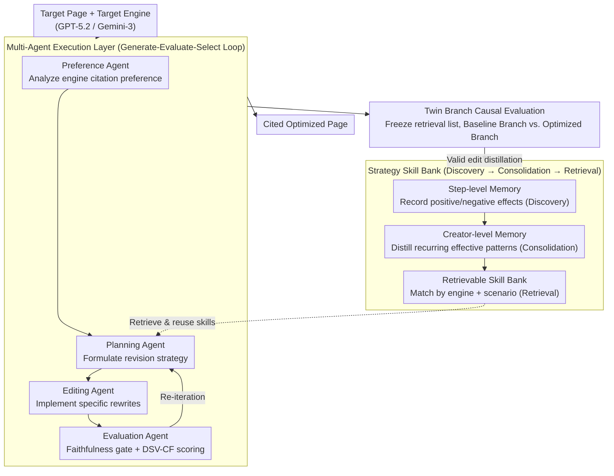

# MAGEO: From Experience to Skill — Multi-Agent Generative Engine Optimization via Reusable Strategy Learning

**Conference**: ACL 2026 Findings  
**arXiv**: [2604.19516](https://arxiv.org/abs/2604.19516)  
**Code**: [https://github.com/Wu-beining/MAGEO](https://github.com/Wu-beining/MAGEO)  
**Area**: Model Compression  
**Keywords**: Generative Engine Optimization, multi-agent framework, strategy reuse, citation faithfulness, visibility optimization

## TL;DR

This paper reframes Generative Engine Optimization (GEO) from instance-by-instance heuristic optimization into a strategy learning problem. It proposes MAGEO, a multi-agent framework where the execution layer consists of four collaborating agents (Preference/Planning/Editing/Evaluation). The learning layer distills validated editing patterns into reusable engine-specific strategy skills. By introducing the Twin Branch causal evaluation protocol and DSV-CF dual-axis metrics, MAGEO significantly outperforms heuristic baselines across three mainstream engines.

## Background & Motivation

**Background**: Generative engines (e.g., ChatGPT, Gemini) are reshaping information acquisition by replacing search link lists with citation-anchored answers. Content creators need to optimize pages to be cited in these generated answers—a process known as Generative Engine Optimization (GEO).

**Limitations of Prior Work**: (1) Existing GEO methods optimize independently for each instance, failing to accumulate or transfer effective strategies; (2) Evaluation confuses surface visibility with semantic impact, allowing exposure gains to be accompanied by incorrect citations; (3) Engine preference modeling is coarse, lacking engine-specific strategy learning.

**Key Challenge**: Current GEO is trapped in a cycle of instance-by-instance trial and error rather than evolving into a cumulative, skill-building process. Each optimization starts from zero, unable to leverage previous successful experiences.

**Goal**: (1) Reformulate GEO as a strategy learning problem; (2) Construct a multi-agent framework capable of accumulating and reusing strategies; (3) Design causally attributable evaluation methods.

**Key Insight**: A dual-layer architecture: the execution layer handles collaborative optimization, while the learning layer distills reusable strategy skills from successful experiences.

**Core Idea**: Validated editing patterns are abstracted into structured strategy skills (comprising applicable conditions, editing operations, and effect evaluations), which are stored in a Skill Bank and retrieved for reuse in new tasks.

## Method

### Overall Architecture

MAGEO addresses a specific challenge: helping content creators ensure their pages are cited by generative engines (like ChatGPT or Gemini). Previous GEO methods treated every new page as a fresh trial-and-error task. MAGEO decomposes this into two layers. The **Execution Layer** is a Generate-Evaluate-Select iterative loop: the Preference Agent analyzes target engine citation preferences, the Planning Agent formulates revision strategies, the Editing Agent implements specific rewrites, and the Evaluation Agent performs quality checks and faithfulness gating. The **Learning Layer** preserves validated editing actions—using step-level memory within sessions and creator-level memory across sessions—to build a retrievable Skill Bank. Connecting these layers is the Twin Branch evaluation protocol, designed to isolate the causal impact of an edit from background noise.

### Key Designs

**1. Multi-Agent Execution Layer: Collaboratively iterating through "Preference-Planning-Editing-Evaluation"**

When a single LLM handles GEO, it often struggles to balance preference analysis, strategy planning, rewriting, and quality control simultaneously, often sacrificing citation faithfulness for exposure gains. MAGEO's execution layer assigns these tasks to four specialized agents in a Generate-Evaluate-Select loop. This specialization ensures controllable behavior, while the gated loop guarantees that only edits improving both visibility and faithfulness are accepted. This serves as the foundation for the learning layer's reliable experience accumulation.

**2. DSV-CF Dual-axis Metrics: Linking visibility with citation faithfulness**

Existing GEO metrics often count exposure or quality separately, allowing optimizers to boost surface visibility through "mis-citations" without penalty. The DSV-CF metric used by the Evaluation Agent integrates both axes into a single score:

$$S_{DSV\text{-}CF} = \lambda \cdot \bar{S}_{SSV} + (1-\lambda) \cdot \bar{S}_{ISI} - \gamma(1-AA)$$

Where SSV (Surface Semantic Visibility) aggregates word-level visibility, positional authority, citation prominence, and subjective impression. ISI (Intrinsic Semantic Impact) evaluates attribution accuracy, response faithfulness, key point coverage, and answer dominance. The final term $\gamma$ penalizes incorrect attribution ($1-AA$, where $AA$ is attribution accuracy). This ensures that exposure gains without accurate attribution result in a lower score.

**3. Twin Branch Evaluation Protocol: Freezing retrieval to isolate causal editing effects**

The difficulty with black-box engines is that retrieval and generation are intertwined. It is often unclear if a citation rate change is due to "better content" or a "lucky change in retrieval ranking." Twin Branch freezes the retrieval list and opens two branches: the Baseline Branch keeps the original document, while the Optimized Branch replaces only the target document. By comparing engine responses under identical retrieval lists, any difference is causally attributed to the edit itself, eliminating the confounding variable of retrieval fluctuations.

**4. Strategy Skill Bank: Distilling one-off successes into reusable skills**

MAGEO avoids wasting successful patterns by managing them through a three-stage lifecycle: **Discovery** (recording effects via step-level memory), **Consolidation** (extracting recurring patterns into structured skills with engine types, scenarios, operations, and metrics), and **Retrieval** (matching skills for new tasks). It includes retention policies based on frequency and recency to ensure scalability. This shifts GEO from "instance-based trial and error" to "experience-to-skill" evolution.

### Mechanism Example

Consider a product review page optimized for GPT-5.2: The **Preference Agent** identifies that GPT-5.2 favors "structured subheadings with data support." The **Planning Agent** retrieves a consolidated skill from the bank: "In GPT scenarios, prefixing core conclusions + adding a source tag significantly improves attribution accuracy." The **Editing Agent** implements this rewrite. The **Evaluation Agent** applies the faithfulness gate and calculates DSV-CF. Finally, **Twin Branch** validates the edit by freezing the retrieval list; if the optimized branch shows higher ISI compared to the baseline, the edit is confirmed as causally effective and flows back into memory for potential consolidation.

### Loss & Training

MAGEO is a multi-agent reasoning framework based on LLMs and does not involve neural network training; hence, there is no loss function. Constraints are implemented via the Evaluation Agent's faithfulness gate and DSV-CF thresholds. The implementation uses GPT-5.2 and Gemini-3 Pro as base and evaluation engines, validated on MSME-GEO-Bench (covering 15 sub-categories across 5 domains).

## Key Experimental Results

### Main Results

**DSV-CF Performance across Mainstream Engines**

| Method | GPT 5.2 SSV | GPT 5.2 ISI | Gemini-3 SSV | Gemini-3 ISI |
|------|------------|------------|-------------|-------------|
| No Optimization | Baseline | Baseline | Baseline | Baseline |
| GEO (Heuristic) | Moderate Gain | Mixed | Moderate Gain | Mixed |
| RAID | Gain | Gain | Gain | Gain |
| **MAGEO** | **Optimal** | **Optimal** | **Optimal** | **Optimal** |

### Ablation Study

| Configuration | Effect | Description |
|------|------|------|
| Full MAGEO | Optimal | Complete framework |
| w/o Skill Bank | Decrease | Significant contribution of strategy reuse |
| w/o Preference Agent | Decrease | Essential for engine-specific modeling |
| w/o Evaluation Agent | Decrease + Faithfulness Collapse | Faithfulness gate is indispensable |
| w/o Twin Branch | Attribution Failure | Decreased evaluation reliability |

### Key Findings

- Engine-specific preference modeling and strategy reuse are the most critical components.
- The Evaluation Agent's faithfulness gate is vital to prevent optimizers from boosting exposure via mis-citation.
- Strategy skills transfer well across scenarios within the same engine but have limited cross-engine transferability.
- Traditional SEO tactics (e.g., keyword stuffing) are ineffective or even harmful for generative engines.

## Highlights & Insights

- The paradigm shift from "instance-level trial and error" to "strategy learning" is a major theoretical contribution to GEO.
- The Twin Branch evaluation protocol solves the fundamental problem of evaluating black-box engines.
- The three-stage lifecycle of the Skill Bank (Discovery → Consolidation → Retrieval) is applicable to other agent systems requiring experience accumulation.

## Limitations & Future Work

- Strategy skill effectiveness may decay as engines are updated.
- Evaluation relies heavily on LLM-as-Judge, which may introduce systematic bias.
- The query diversity in MSME-GEO-Bench remains somewhat limited.
- Future work could explore automated skill updates and cross-engine transfer learning.

## Related Work & Insights

- **vs GEO/GEO-Bench**: Previous work quantified exposure but lacked strategy accumulation; MAGEO adds a learning layer.
- **vs RAID**: RAID focuses on intent-awareness but lacks strategy reuse; MAGEO enables experience transfer via the Skill Bank.
- **vs AutoGEO**: AutoGEO learns preference rules but does not accumulate strategies cross-instances; MAGEO's Skill Bank evolves continuously.

## Rating

- Novelty: ⭐⭐⭐⭐⭐ Reframes GEO as strategy learning; Twin Branch and Skill Bank are significant contributions.
- Experimental Thoroughness: ⭐⭐⭐⭐ Multi-engine evaluation, though real-world verification could be broader.
- Writing Quality: ⭐⭐⭐⭐ Clear framework design and rigorous metric definitions.
- Value: ⭐⭐⭐⭐ Provides a scalable, learning-driven paradigm for the GEO field.

<!-- RELATED:START -->

## Related Papers

- [\[AAAI 2026\] Conversational Learning Diagnosis via Reasoning Multi-Turn Interactive Learning](../../AAAI2026/multi_agent/conversational_learning_diagnosis_via_reasoning_multi-turn_interactive_learning.md)
- [\[AAAI 2026\] SafeSieve: From Heuristics to Experience in Progressive Pruning for LLM-based Multi-Agent Communication](../../AAAI2026/multi_agent/safesieve_from_heuristics_to_experience_in_progressive_pruning_for_llm-based_mul.md)
- [\[ACL 2026\] ATLAS: Adaptive Trading with LLM AgentS Through Dynamic Prompt Optimization and Multi-Agent Coordination](atlas_adaptive_trading_with_llm_agents_through_dynamic_prompt_optimization_and_m.md)
- [\[ICML 2026\] OMAC: A Holistic Optimization Framework for LLM-Based Multi-Agent Collaboration](../../ICML2026/multi_agent/omac_a_holistic_optimization_framework_for_llm-based_multi-agent_collaboration.md)
- [\[ICML 2026\] MASPO: Joint Prompt Optimization for LLM-based Multi-Agent Systems](../../ICML2026/multi_agent/maspo_joint_prompt_optimization_for_llm-based_multi-agent_systems.md)

<!-- RELATED:END -->
