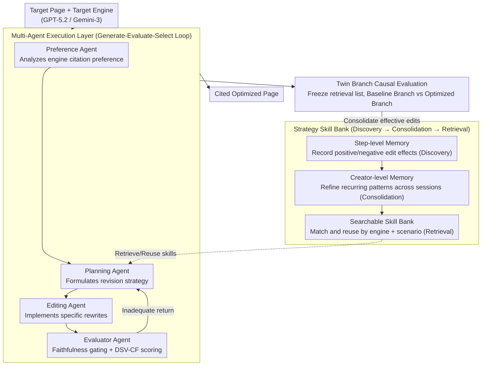

# MAGEO: From Experience to Skill — Multi-Agent Generative Engine Optimization via Reusable Strategy Learning

**Conference**: ACL 2026 Findings  
**arXiv**: [2604.19516](https://arxiv.org/abs/2604.19516)  
**Code**: [https://github.com/Wu-beining/MAGEO](https://github.com/Wu-beining/MAGEO)  
**Area**: Model Compression  
**Keywords**: Generative Engine Optimization, Multi-agent framework, Strategy reuse, Citation faithfulness, Visibility optimization

## TL;DR

This paper reformulates Generative Engine Optimization (GEO) from instance-wise heuristic optimization into a strategy learning problem. It proposes the MAGEO multi-agent framework—where the execution layer consists of collaboration between preference/planning/editing/evaluator agents, and the learning layer distills validated editing patterns into reusable engine-specific strategy skills. By introducing the Twin Branch causal evaluation protocol and DSV-CF dual-axis metrics, MAGEO significantly outperforms heuristic baselines across three mainstream engines.

## Background & Motivation

**Background**: Generative engines (e.g., ChatGPT, Gemini) are reshaping information retrieval by replacing search link lists with citation-anchored answers. Content creators need to optimize pages to be cited in generated answers—a process known as Generative Engine Optimization (GEO).

**Limitations of Prior Work**: (1) Existing GEO methods optimize independently per instance, failing to accumulate or transfer effective strategies; (2) Evaluation confuses surface visibility with semantic impact, allowing exposure gains at the cost of incorrect citations; (3) Engine preference modeling is coarse, lacking engine-specific strategy learning.

**Key Challenge**: Current GEO is trapped in per-instance trial-and-error rather than evolving into a cumulative, skill-building process. Each optimization starts from scratch, unable to leverage past successful experiences.

**Goal**: (1) Reformulate GEO as a strategy learning problem; (2) Build a multi-agent framework capable of accumulating and reusing strategies; (3) Design a causally-attributable evaluation method.

**Key Insight**: A dual-layer architecture—the execution layer handles collaborative optimization, while the learning layer extracts reusable strategy skills from successful experiences.

**Core Idea**: Abstract validated editing patterns into structured strategy skills (including applicability conditions, editing operations, and effect evaluations), which are stored in a skill library for retrieval and reuse in new tasks.

## Method

### Overall Architecture

MAGEO addresses a specific challenge: helping content creators get their pages cited by generative engines (ChatGPT, Gemini) while moving beyond the zero-sum trial-and-error of previous GEO methods. The system is split into two layers. The **Execution Layer** is a Generate-Evaluate-Select iterative loop: a Preference Agent analyzes the citation preferences of the target engine, a Planning Agent formulates revision strategies based on these preferences, an Editing Agent implements specific rewrites, and an Evaluator Agent performs quality checks and faithfulness gating (returning the work to the planning stage if it fails). The **Learning Layer** captures validated editing actions—using step-level memory for single sessions and creator-level memory for cross-session patterns—eventually forming a searchable strategy skill library. The Twin Branch evaluation protocol sits between these layers, isolating the causal utility of edits from background noise.

### Key Designs

**1. Multi-agent Execution Layer: Decomposing "Preference Modeling–Planning–Rewriting–Evaluation" into Dedicated Agents**

When a single LLM handles GEO optimization, preference analysis, strategy planning, text rewriting, and quality control are often blurred into a single generation event. This makes quality control difficult and risks sacrificing citation faithfulness for exposure gains. MAGEO's execution layer assigns these tasks to four specialized agents in a Generate-Evaluate-Select loop. This division of labor ensures each agent is accountable for a specific behavior, while the gated feedback loop ensures that only edits that "increase visibility while passing faithfulness checks" are accepted—a prerequisite for consolidating reliable experience into the learning layer.

**2. DSV-CF Dual-axis Metrics: Binding Visibility to Citation Faithfulness**

Existing GEO metrics often count exposure or quality separately, allowing optimizers to inflate visibility through "mis-citations" without penalty. The DSV-CF metric used by the Evaluator Agent integrates both axes into a single score:

$$S_{DSV\text{-}CF} = \lambda \cdot \bar{S}_{SSV} + (1-\lambda) \cdot \bar{S}_{ISI} - \gamma(1-AA)$$

Where SSV (Surface Semantic Visibility) aggregates word-level visibility, positional authority, citation prominence, and subjective impression. ISI (Intrinsic Semantic Impact) evaluates attribution accuracy, response faithfulness, key-point coverage, and answer dominance. The final term $\gamma$ applies a direct penalty for incorrect attribution ($1-AA$, where $AA$ is Attribution Accuracy). Consequently, visibility gains without accurate attribution result in score deductions, closing the loophole of prioritizing exposure over faithfulness.

**3. Twin Branch Evaluation Protocol: Freezing Retrieval to Isolate Causal Effects**

Black-box engines present a challenge because retrieval and generation are intertwined. If a document's citation rate changes after editing, it is unclear if the improvement stems from "better writing" or a coincidental change in "retrieval ranking." Twin Branch addresses this by freezing the retrieval list and splitting into two branches: the Baseline Branch keeps the original document, while the Optimized Branch replaces it with the edited version. By comparing engine responses within the same retrieval context, any difference is causally attributed to the edit itself, eliminating the confounding variable of retrieval ranking fluctuations.

**4. Strategy Skill Bank: Distilling Successful Edits into Reusable Structured Skills**

A major inefficiency in instance-wise optimization is discarding patterns that work consistently for a specific engine. The Skill Bank manages the experience lifecycle in three stages: **Discovery** (recording positive/negative effects of each edit in step-level memory), **Consolidation** (extracting recurring patterns across sessions into structured skills with four elements: engine type, scenario, editing operation, and effect metrics), and **Retrieval** (matching skills by engine and scenario for new tasks). An eviction strategy based on usage frequency and recency ensures the library remains scalable. This layer advances GEO from "instance-wise trial-and-error" to "experience-to-skill" evolution.

### An Integration Example

Consider optimizing a product review page for GPT-5.2: The **Preference Agent** identifies that GPT-5.2 prefers "content with clear data support and structured subheadings." The **Planning Agent** queries the Skill Bank and retrieves a consolidated skill: "In GPT scenarios, moving core conclusions to the front and adding a source tag significantly improves attribution accuracy." The **Editing Agent** rewrites the document accordingly. The **Evaluator Agent** performs faithfulness gating (ensuring no sources were fabricated) and calculates the DSV-CF. Finally, **Twin Branch** freezes the retrieval list and confirms that the Optimized Branch's ISI is indeed higher than the baseline. This success is recorded in step-level memory and may eventually be promoted to a reusable skill if it continues to succeed.

### Loss & Training

MAGEO is an LLM-based multi-agent reasoning framework and does not involve neural network training; hence, there is no loss function. Constraints are implemented through the Evaluator Agent's faithfulness gating and DSV-CF thresholds. The implementation uses GPT-5.2 and Gemini-3 Pro as both target and evaluation engines, validated on MSME-GEO-Bench (covering 15 sub-classes across 5 domains).

> ⚠️ Model names such as GPT-5.2 / Gemini-3 Pro and arXiv IDs are preserved as per the original text.

## Key Experimental Results

### Main Results

**DSV-CF Performance across Three Mainstream Engines**

| Method | GPT 5.2 SSV | GPT 5.2 ISI | Gemini-3 SSV | Gemini-3 ISI |
| :--- | :--- | :--- | :--- | :--- |
| No Optimization | Baseline | Baseline | Baseline | Baseline |
| GEO (Heuristic) | Moderate Gain | Mixed | Moderate Gain | Mixed |
| RAID | Gain | Gain | Gain | Gain |
| **Ours (MAGEO)** | **Best** | **Best** | **Best** | **Best** |

### Ablation Study

| Configuration | Effect | Description |
| :--- | :--- | :--- |
| Full MAGEO | Best | Complete framework |
| w/o Skill Bank | Decrease | Strategy reuse provides significant contribution |
| w/o Preference Agent | Decrease | Engine-specific modeling is critical |
| w/o Evaluator Agent | Decrease + Faithfulness Collapse | Faithfulness gating is indispensable |
| w/o Twin Branch | Attribution Failure | Evaluation reliability decreases |

### Key Findings

- Engine-specific preference modeling and strategy reuse are the two most critical components.
- Evaluator Agent faithfulness gating is vital—without it, optimization may inflate visibility through mis-citations.
- Strategy skills show strong transferability across scenarios for the same engine but limited cross-engine transferability.
- Traditional SEO strategies (e.g., keyword stuffing) are ineffective or even harmful for generative engines.

## Highlights & Insights

- The paradigm shift from "instance-wise trial-and-error" to "policy learning" is a major theoretical contribution to the GEO field.
- The Twin Branch causal evaluation protocol solves the fundamental attribution problem in black-box engine evaluation.
- The three-stage skill lifecycle (Discovery → Consolidation → Retrieval) is applicable to other agent systems requiring experience accumulation.

## Limitations & Future Work

- Strategy skill effectiveness may decay as engines are updated.
- Evaluation relies heavily on LLM-as-Judge, which may introduce systematic biases.
- MSME-GEO-Bench has limited query diversity.
- Future work could explore automatic skill updates and cross-engine transfer learning.

## Related Work & Insights

- **vs GEO/GEO-Bench**: Quantifies exposure but optimizes per instance without strategy accumulation; MAGEO adds a learning layer.
- **vs RAID**: Intent-aware but lacks strategy reuse; MAGEO enables experience transfer via the Skill Bank.
- **vs AutoGEO**: Learns preference rules but does not accumulate cross-instance strategies; MAGEO's Skill Bank evolves continuously.

## Rating

- Novelty: ⭐⭐⭐⭐⭐ Reframing GEO as strategy learning; Skill Bank and Twin Branch are novel contributions.
- Experimental Thoroughness: ⭐⭐⭐⭐ Extensive multi-engine evaluation, though real-world validation remains limited.
- Writing Quality: ⭐⭐⭐⭐ Clear framework design and well-defined metrics.
- Value: ⭐⭐⭐⭐ Provides a scalable, learning-driven paradigm for the GEO field.

<!-- RELATED:START -->

## Related Papers

- [\[ICLR 2026\] Adaptive Collaboration with Humans: Metacognitive Policy Optimization for Multi-Agent LLMs with Continual Learning](../../ICLR2026/multi_agent/adaptive_collaboration_with_humans_metacognitive_policy_optimization_for_multi-a.md)
- [\[AAAI 2026\] SafeSieve: From Heuristics to Experience in Progressive Pruning for LLM-based Multi-Agent Communication](../../AAAI2026/multi_agent/safesieve_from_heuristics_to_experience_in_progressive_pruning_for_llm-based_mul.md)
- [\[ICLR 2026\] MAS²: Self-Generative, Self-Configuring, Self-Rectifying Multi-Agent Systems](../../ICLR2026/multi_agent/mas2_self-generative_self-configuring_self-rectifying_multi-agent_systems.md)
- [\[AAAI 2026\] Conversational Learning Diagnosis via Reasoning Multi-Turn Interactive Learning](../../AAAI2026/multi_agent/conversational_learning_diagnosis_via_reasoning_multi-turn_interactive_learning.md)
- [\[ACL 2026\] ATLAS: Adaptive Trading with LLM AgentS Through Dynamic Prompt Optimization and Multi-Agent Coordination](atlas_adaptive_trading_with_llm_agents_through_dynamic_prompt_optimization_and_m.md)

<!-- RELATED:END -->
