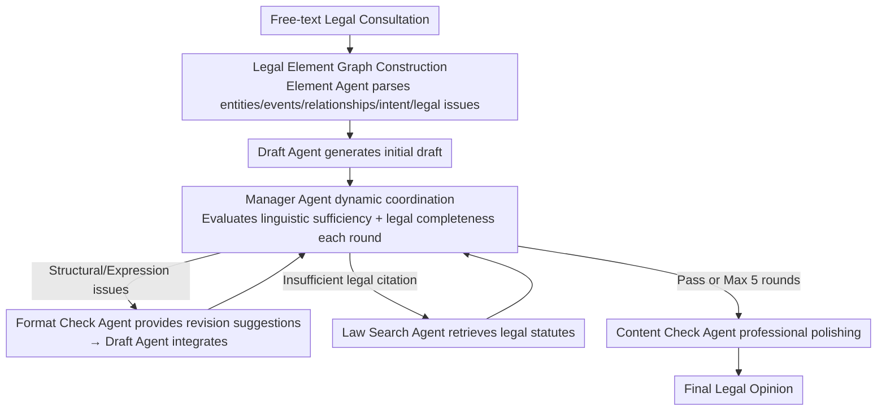

# From Query to Counsel: Structured Reasoning with a Multi-Agent Framework and Dataset for Legal Consultation

**Conference**: ACL 2026  
**arXiv**: [2604.10470](https://arxiv.org/abs/2604.10470)  
**Code**: None  
**Area**: LLM Agent / Legal NLP  
**Keywords**: Legal consultation Q&A, multi-agent, legal element graph, task decomposition, Chinese law

## TL;DR
This paper constructs JurisCQAD—a large-scale dataset containing 43,000+ real Chinese legal consultations—and proposes the JurisMA multi-agent framework. By utilizing legal element graphs for structured task decomposition and dynamic multi-agent collaboration (Manager Agent + Format Check + Law Search), it significantly outperforms general and legal-specific LLMs on LawBench.

## Background & Motivation

**Background**: Legal Consultation Question Answering (Legal CQA) is a core task in legal AI, requiring the generation of evidence-based and actionable legal advice from personalized legal dilemmas. Existing methods primarily rely on continuous pre-training on legal corpora or utilizing retrieval-augmented generation to assist in output.

**Limitations of Prior Work**: (1) Lack of high-quality training data—existing legal LLMs (e.g., LawGPT) are mainly trained on synthetic data, leading to domain shift from real-world consultation scenarios; (2) Legal CQA involves complex task combinations—it requires identifying legal relationships, judging causality, locating core issues, and matching statutes, which end-to-end models struggle to cover completely; (3) High context dependency—precise interpretation of legal entities, relationships, and user intentions is necessary.

**Key Challenge**: Real-world legal consultations are often vague and multifaceted, demanding dynamic interpretation of facts, subjects, and legal implications. Existing methods either rely on coarse continuous pre-training (low-quality supervision signals) or sentence-level statute retrieval (prone to confusing legally distinct but linguistically similar concepts).

**Goal**: Construct a large-scale real-world legal consultation dataset and design an interpretable task decomposition and multi-agent collaboration framework.

**Key Insight**: Decompose legal consultations into structured legal element graphs—extracting entities, events, relationships, user intentions, and legal issues—then iteratively optimize legal opinions through multi-agent collaboration.

**Core Idea**: Element graphs provide the semantic foundation $\rightarrow$ the Manager Agent dynamically coordinates sub-tasks $\rightarrow$ the Format Check Agent and Law Search Agent perform iterative refinement $\rightarrow$ the Content Check Agent provides final polishing.

## Method

### Overall Architecture
JurisMA is designed to handle "vague, multifaceted, and highly context-dependent" queries typical of real legal consultations, which are difficult for end-to-end models to address in a single pass. It decomposes the process into three sequential stages: first, the Element Agent parses the free-text query into a legal semantic graph (mapping entities, events, relationships, user intentions, and legal issues to a graph) to provide global context for downstream reasoning. Then, it enters an iterative multi-agent optimization phase, where a Manager Agent dynamically evaluates the current draft and invokes the Format Check Agent to fix structure or the Law Search Agent to supplement statutes as needed. Finally, the Content Check Agent performs end-stage polishing for linguistic quality and professionalism. This pipeline mimics the workflow in a real law firm where multiple roles collaborate to revise a legal opinion.

### Key Designs

**1. Legal Element Graph: Transforming free-text queries into structured legal semantic representations**

Legal reasoning essentially revolves around "key facts, involved subjects, and mutual legal relationships," but flat text makes it difficult to extract this structural information explicitly. The Element Agent thus parses the query into a graph $G=(V,E)$: nodes $V$ cover legal entities (individuals/organizations, with roles, status, and time attributes), legal events, user claims, key facts, and inferred legal issues; edges $E$ represent semantic relationships (e.g., kinship, contractual obligations). This graph is serialized into JSON and concatenated with the original query as augmented semantic input. The design is inspired by Hart’s primary/secondary rule theory and Kelsen’s hierarchical model of norms—providing the model with the "skeleton" of the case from the start rather than just raw text.

**2. Manager Agent Dynamic Coordination: Selectively activating sub-agents based on actual draft deficiencies rather than a fixed pipeline**

Not every draft requires every type of revision; a fixed pipeline is both slow and prone to over-editing. In each iteration, the Manager Agent checks two criteria for the draft: linguistic sufficiency (clarity, conciseness) and legal completeness (inclusion of authoritative legal citations). If structural or expression issues are found, it invokes the Format Check Agent to generate suggestions for the Draft Agent to integrate. If legal citations are insufficient, it calls the Law Search Agent to retrieve relevant clauses from the statute database. The loop continues for a maximum of 5 rounds or stops early if the Manager Agent returns "Pass." This dynamic routing activates only necessary sub-agents, balancing efficiency and controllability while reflecting the "who should fix what" logic in a law firm.

**3. JurisCQAD Dataset: Replacing synthetic Q&A with real consultation triplets for high-quality supervision**

Existing Chinese legal datasets are mostly synthetic Q&A or law retrieval tasks, failing to reflect the complexity and linguistic diversity of real consultations, which causes domain shift in legal LLMs. JurisCQAD contains 43,000+ instances, each organized into a (Question, Positive Answer, Negative Answer) triplet: questions originate from real user consultations, positive answers are verified by professional lawyers, and negative answers are model-generated but labeled as insufficient or incorrect. Covering high-frequency legal domains, this triplet format not only serves as training material but naturally supports contrastive learning and preference optimization—acting as both an infrastructure contribution and the data foundation for JurisMA's performance.

### Method Example
Consider a consultation about "a landlord withholding a security deposit without cause": The **Element Agent** first parses it into a graph—extracting entity nodes (Tenant, Landlord), events (Leasing, Withholding Deposit), relationships (Contractual Obligation), user intention (Return of Deposit), and the inferred legal issue (Security Deposit Return Dispute). This is serialized as JSON and appended to the query. The **Draft Agent** writes an initial draft based on this. In the first round of review, the **Manager Agent** finds that the draft explains the facts but lacks legal citations (insufficient legal completeness); it thus invokes the **Law Search Agent** to retrieve relevant statutes on deposit returns. In the second round, it finds the new version's structure is loose (insufficient linguistic sufficiency) and calls the **Format Check Agent** for revision suggestions, which the **Draft Agent** integrates. In the third round, the Manager Agent determines both language and legal criteria are met, returning "Pass" to exit the loop. Finally, the **Content Check Agent** performs professional polishing. Throughout the process, the Manager Agent only calls for specific missing capabilities rather than running every sub-agent in every round.

### Loss & Training
Supervised Fine-Tuning (SFT) is performed on JurisCQAD with inputs augmented by the element graph. Evaluation is conducted using a revised LawBench, covering various lexical and semantic metrics.

## Key Experimental Results

### Main Results

| Model Category | Representative Model | LawBench Performance |
| :--- | :--- | :--- |
| General LLM | GPT-4, Qwen | Medium |
| Legal LLM | LawGPT, ChatLaw | Medium-Low |
| **JurisMA** | Ours (trained on JurisCQAD) | **Significantly Optimal** |

### Ablation Study

| Configuration | Performance | Note |
| :--- | :--- | :--- |
| Full JurisMA | Optimal | Complete framework |
| w/o Element Graph | Decrease | Loss of structured semantic foundation |
| w/o Multi-Agent Iteration | Decrease | Incomplete legal citations |
| w/o LawSearch Agent | Significant Decrease | Loss of legal grounding capability |

### Key Findings
- Models trained on JurisCQAD significantly outperform general and specialized legal LLMs, validating the value of high-quality data.
- Structured context provided by element graphs is more effective than raw text input.
- Multi-agent iterations typically converge in 2-3 rounds, indicating the efficiency of the Manager Agent's quality judgment.
- Interestingly, specialized legal LLMs sometimes perform worse than general LLMs—likely due to inconsistent quality in their pre-training data.

## Highlights & Insights
- **Semantic Representation via Legal Element Graphs**: Transforming free-text queries into graph structures containing entities-relationships-events provides an interpretable semantic foundation for legal reasoning. This approach can be generalized to other professional domains requiring structured understanding (e.g., medicine, finance).
- **Dynamic Agent Routing**: The Manager Agent activates sub-agents on demand rather than through a fixed process, balancing efficiency and quality.
- **The Power of Real-world Data**: A high-quality dataset of 43,000 real legal consultations is a major infrastructure contribution.

## Limitations & Future Work
- The framework only covers the Chinese legal system; cross-jurisdictional applicability has not been verified.
- The quality of the element graph depends on the Element Agent's comprehension capabilities.
- The retrieval scope of the LawSearch Agent may be incomplete.
- The multi-agent system entails higher inference costs (multiple iterations + multiple agent calls).

## Related Work & Insights
- **vs. LawGPT**: Relies on continuous pre-training on legal corpora but with coarse data processing. JurisMA uses structured task decomposition and high-quality data.
- **vs. LawLuo**: A fixed-pipeline legal multi-agent system. JurisMA's Manager Agent provides dynamic routing.
- **vs. RAG Methods (e.g., LSIM)**: Sentence-level statute retrieval may confuse concepts that are linguistically similar but legally distinct. Element graphs provide more precise context.

## Rating
- Novelty: ⭐⭐⭐⭐ The combination of legal element graphs and multi-agent collaboration is a novel design in legal NLP.
- Experimental Thoroughness: ⭐⭐⭐⭐ Multiple baseline comparisons and comprehensive ablation studies.
- Writing Quality: ⭐⭐⭐⭐ Systematically described methodology with accurate legal terminology.
- Value: ⭐⭐⭐⭐ Both the dataset and the framework provide direct contributions to legal AI research.

<!-- RELATED:START -->

## Related Papers

- [\[AAAI 2026\] FinRpt: Dataset, Evaluation System and LLM-based Multi-agent Framework for Equity Research Report Generation](../../AAAI2026/multi_agent/finrpt_dataset_evaluation_system_and_llm-based_multi-agent_framework_for_equity_.md)
- [\[ACL 2026\] Debating the Unspoken: Role-Anchored Multi-Agent Reasoning for Half-Truth Detection](debating_the_unspoken_role-anchored_multi-agent_reasoning_for_half-truth_detecti.md)
- [\[ACL 2026\] Multi-Agent Reasoning Improves Compute Efficiency: Pareto-Optimal Test-Time Scaling](multi-agent_reasoning_improves_compute_efficiency_pareto-optimal_test-time_scali.md)
- [\[AAAI 2026\] MedLA: A Logic-Driven Multi-Agent Framework for Complex Medical Reasoning with Large Language Models](../../AAAI2026/multi_agent/medla_a_logic-driven_multi-agent_framework_for_complex_medic.md)
- [\[ACL 2026\] MASFactory: A Graph-centric Framework for Orchestrating LLM-Based Multi-Agent Systems with Vibe Graphing](masfactory_a_graph-centric_framework_for_orchestrating_llm-based_multi-agent_sys.md)

<!-- RELATED:END -->
