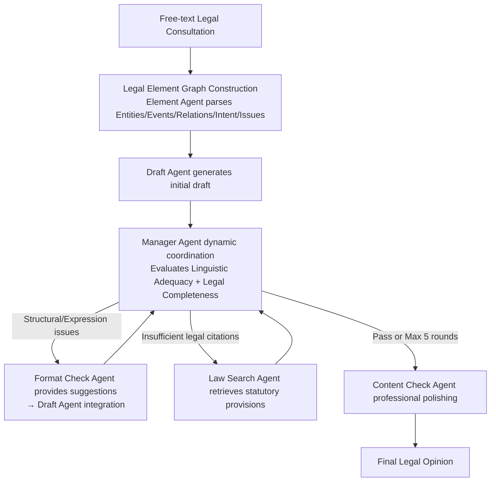

# From Query to Counsel: Structured Reasoning with a Multi-Agent Framework and Dataset for Legal Consultation

**Conference**: ACL 2026  
**arXiv**: [2604.10470](https://arxiv.org/abs/2604.10470)  
**Code**: None  
**Area**: LLM Agent / Legal NLP  
**Keywords**: Legal Consultation QA, Multi-Agent, Legal Element Graph, Task Decomposition, Chinese Law

## TL;DR
This paper constructs JurisCQAD—a large-scale dataset containing 43,000+ real-world Chinese legal consultations—and proposes the JurisMA multi-agent framework. By performing structured task decomposition via legal element graphs and dynamic multi-agent collaboration (Manager Agent + Format Check + Law Search), it significantly outperforms general and legal-specific LLMs on LawBench.

## Background & Motivation

**Background**: Legal Consultation Question Answering (Legal CQA) is a core task in legal AI, requiring the generation of evidence-based and actionable legal advice from personalized legal dilemmas. Existing methods primarily rely on continued pre-training on legal corpora or retrieval-augmented generation.

**Limitations of Prior Work**: (1) Lack of high-quality training data—existing legal LLMs (e.g., LawGPT) are mostly trained on synthetic data, leading to domain shift from real-world scenarios; (2) Legal CQA involves complex task combinations—requiring identification of legal relations, causal judgment, core issue localization, and legal provision matching, which end-to-end models struggle to cover entirely; (3) High context dependency—requiring precise interpretation of legal entities, relationships, and user intent.

**Key Challenge**: Real-world legal consultations are often vague and multifaceted, requiring dynamic interpretation of facts, subjects, and legal implications. Existing methods either rely on coarse continued pre-training (low-quality supervision signals) or sentence-level retrieval (prone to confusing legally distinct but linguistically similar concepts).

**Goal**: Construct a large-scale real-world legal consultation dataset and design an interpretable framework for task decomposition and multi-agent collaboration.

**Key Insight**: Decompose legal consultations into structured legal element graphs—extracting entities, events, relations, user intent, and legal issues—followed by iterative optimization of legal opinions through multi-agent collaboration.

**Core Idea**: Element graphs provide the semantic foundation → Manager Agent dynamically coordinates sub-tasks → Format Check Agent and Law Search Agent iterate on refinement → Content Check Agent performs final polishing.

## Method

### Overall Architecture
JurisMA addresses "vague, multifaceted, and highly context-dependent" queries in real legal consultations that are difficult for end-to-end models to resolve in a single pass. The workflow is decomposed into three sequential stages: first, the Element Agent parses free-text queries into a legal semantic graph (mapping entities, events, relations, intent, and legal issues) to provide global context for downstream reasoning. This is followed by iterative multi-agent optimization, where a Manager Agent dynamically evaluates drafts, calling the Format Check Agent for structural edits or the Law Search Agent for legal provision supplementation as needed. Finally, the Content Check Agent performs terminal polishing for linguistic quality and professionalism. This pipeline mimics a real law firm workflow where multiple roles collaboratively revise a legal opinion.

### Key Designs

**1. Legal Element Graph Construction: Transforming free-text queries into structured legal semantic representations**

Legal reasoning centers on "key facts, involved subjects, and mutual legal relations," structural information that is difficult to extract from flat text. The Element Agent parses the query into a graph $G=(V,E)$: nodes $V$ include legal entities (individuals/organizations with roles, status, and temporal attributes), legal events, user claims, key facts, and inferred legal issues; edges $E$ represent semantic relationships (e.g., kinship, contractual obligations). This graph is serialized into JSON and prepended to the original query. Inspired by Hart's primary/secondary rules and Kelsen's hierarchy of norms, this structure allows the model to grasp the "skeleton" of the case from the start.

**2. Manager Agent Dynamic Coordination: Selectively activating sub-agents based on actual draft deficiencies**

Not every draft requires all types of revisions; fixed pipelines are often slow and prone to over-writing. The Manager Agent evaluates two criteria per iteration: linguistic adequacy (clarity, conciseness) and legal completeness (authoritative citations). If structural or expression issues are found, it triggers the Format Check Agent; if legal citations are lacking, it triggers the Law Search Agent to retrieve relevant statutes. The cycle continues for a maximum of 5 rounds or until the Manager Agent returns a "Pass," balancing efficiency and controllability by mimicking professional labor division.

**3. JurisCQAD Dataset: Replacing synthetic Q&A with real-world consultation triplets**

Existing Chinese legal datasets often consist of synthetic Q&A or retrieval tasks that fail to reflect the complexity of real consultations. JurisCQAD comprises 43,000+ instances organized as (Question, Positive Answer, Negative Answer) triplets. Questions originate from real user consultations, positive answers are verified by professional lawyers, and negative answers are model-generated but labeled as inadequate or erroneous. This format supports contrastive learning and preference optimization, serving as the foundational infrastructure for JurisMA.

### Mechanism
Consider a consultation regarding "a landlord withholding a security deposit without cause": The **Element Agent** parses this into a graph—nodes identify entities (tenant, landlord), events (leasing, withholding deposit), relations (contractual obligation), intent (recovery of deposit), and legal issues (deposit return dispute). The **Draft Agent** generates an initial response. In the first round, the **Manager Agent** identifies clear facts but no legal citations (insufficient legal completeness), thus invoking the **Law Search Agent** to retrieve relevant return-of-deposit statutes. In the second round, the Manager detects loose structure (insufficient linguistic adequacy) and invokes the **Format Check Agent**. Once both criteria are met, the Manager returns "Pass," and the **Content Check Agent** performs final professional polishing. 

### Loss & Training
The model undergoes SFT training on JurisCQAD with element-graph-enhanced inputs. Evaluation is performed on a revised LawBench, encompassing various lexical and semantic metrics.

## Key Experimental Results

### Main Results

| Model Category | Representative Model | LawBench Performance |
| :--- | :--- | :--- |
| General LLM | GPT-4, Qwen | Medium |
| Legal LLM | LawGPT, ChatLaw | Medium-Low |
| **JurisMA** | **Ours (JurisCQAD-trained)** | **Significantly Optimal** |

### Ablation Study

| Configuration | Effect | Description |
| :--- | :--- | :--- |
| Full JurisMA | Best | Complete framework |
| w/o Element Graph | Decrease | Loss of structured semantic foundation |
| w/o Multi-Agent Iteration | Decrease | Incomplete legal citations |
| w/o LawSearch Agent | Significant Decrease | Loss of legal grounding capability |

### Key Findings
- Models trained on JurisCQAD significantly outperform general and legal-specific LLMs, validating the value of high-quality data.
- Structured context provided by element graphs is more effective than raw text input.
- Multi-agent iterations typically converge within 2-3 rounds, proving the effectiveness of the Manager Agent's judgment.
- Interestingly, some legal-specific LLMs underperform compared to general LLMs, likely due to inconsistent pre-training data quality.

## Highlights & Insights
- **Semantic Representation via Legal Element Graphs**: Transforming free-text queries into entity-relation-event graphs provides an interpretable semantic basis for legal reasoning, a concept transferable to other professional domains (e.g., medicine, finance).
- **Dynamic Agent Routing**: The Manager Agent activates sub-agents on demand rather than following a fixed pipeline, balancing efficiency and quality.
- **Power of Real-World Data**: The JurisCQAD dataset of 43,000 real consultations is a major infrastructure contribution to the field.

## Limitations & Future Work
- The framework is limited to the Chinese legal system; cross-jurisdictional applicability remains unverified.
- Element graph quality is dependent on the initial Element Agent's comprehension capability.
- The LawSearch Agent's retrieval scope may be incomplete.
- The multi-agent system incurs higher inference costs due to multiple iterations and agent calls.

## Related Work & Insights
- **vs. LawGPT**: LawGPT relies on continued pre-training on legal corpora but utilizes coarse data processing. JurisMA employs structured task decomposition and high-quality data.
- **vs. LawLuo**: LawLuo uses a fixed-pipeline legal multi-agent system, whereas JurisMA's Manager Agent provides dynamic routing.
- **vs. RAG Methods**: Sentence-level retrieval can confuse linguistically similar but legally distinct concepts. Element graphs provide more precise context for retrieval.

## Rating
- Novelty: ⭐⭐⭐⭐ The combination of legal element graphs and multi-agent collaboration is a novel design in legal NLP.
- Experimental Thoroughness: ⭐⭐⭐⭐ Strong baselines and comprehensive ablation studies.
- Writing Quality: ⭐⭐⭐⭐ Systematic description of methods with accurate legal terminology.
- Value: ⭐⭐⭐⭐ Both the dataset and framework provide direct contributions to legal AI research.

<!-- RELATED:START -->

<!-- RELATED:END -->

## Related Papers

- [\[AAAI 2026\] FinRpt: Dataset, Evaluation System and LLM-based Multi-agent Framework for Equity Research Report Generation](../../AAAI2026/multi_agent/finrpt_dataset_evaluation_system_and_llm-based_multi-agent_framework_for_equity_.md)
- [\[CVPR 2026\] MOTOR-Bench: A Real-world Dataset and Multi-agent Framework for Zero-shot Human Mental State Understanding](../../CVPR2026/multi_agent/motor-bench_a_real-world_dataset_and_multi-agent_framework_for_zero-shot_human_m.md)
- [\[ACL 2026\] Debating the Unspoken: Role-Anchored Multi-Agent Reasoning for Half-Truth Detection](debating_the_unspoken_role-anchored_multi-agent_reasoning_for_half-truth_detecti.md)
- [\[ACL 2026\] Multi-Agent Reasoning Improves Compute Efficiency: Pareto-Optimal Test-Time Scaling](multi-agent_reasoning_improves_compute_efficiency_pareto-optimal_test-time_scali.md)
- [\[AAAI 2026\] MedLA: A Logic-Driven Multi-Agent Framework for Complex Medical Reasoning with Large Language Models](../../AAAI2026/multi_agent/medla_a_logic-driven_multi-agent_framework_for_complex_medic.md)

<!-- RELATED:END -->
