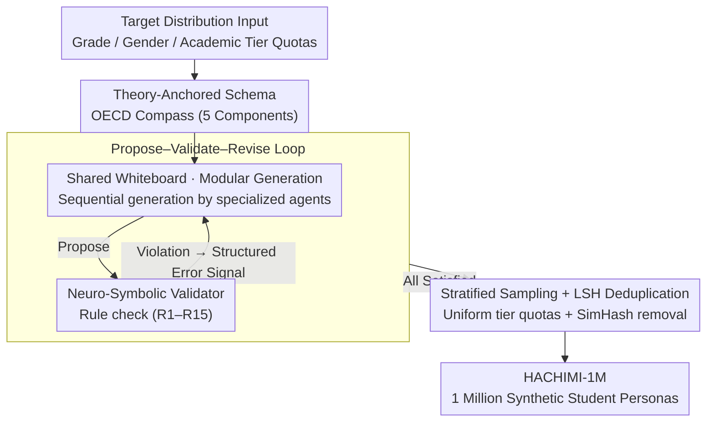

# HACHIMI: Scalable and Controllable Student Persona Generation via Orchestrated Agents

**Conference**: ACL 2026  
**arXiv**: [2603.04855](https://arxiv.org/abs/2603.04855)  
**Code**: https://github.com/ZeroLoss-Lab/HACHIMI  
**Area**: LLM Evaluation / Education / Agent  
**Keywords**: Student Persona, Multi-Agent, Neuro-Symbolic Verification, Stratified Sampling, Population Consistency

## TL;DR
HACHIMI formalizes "student persona generation" as a TAD-PG (Theory-Aligned and Distribution-Controllable) task. By utilizing a "propose-validate-revise" multi-agent framework integrated with a neuro-symbolic validator and stratified sampling, the authors produced 1 million synthetic student personas for grades 1–12. Group-level evaluations on CEPS / PISA 2022 reveal a distinct "fidelity gradient"—constructs related to mathematics and curiosity are highly aligned, while well-being and family dynamics show only weak alignment.

## Background & Motivation

**Background**: Educational LLMs (for personalized tutoring, virtual classrooms, teacher training) increasingly rely on large-scale "synthetic students" for dialogue simulation and performance evaluation. Traditional methods rely on interviews, surveys, or observations to manually build a small number of representative personas (HCI personas), which are detailed but non-scalable. Recent approaches use LLMs for "role-playing + one-shot generation," which is scalable but suffers from quality degradation.

**Limitations of Prior Work**: Purely prompted LLM student personas exhibit three systemic defects: (1) **Intra-profile contradictions**: conflicting descriptions across long contexts; (2) **Lack of theoretical anchoring**: generated "motivations/personalities" rarely align with established pedagogical or developmental psychology theories (e.g., Piaget, Erikson, OECD Learning Compass); (3) **Uncontrollable population distribution**: proportions of high/low achievers, gender, or psychological risk levels are random, failing to meet the need for "evaluation based on real demographic structures." Frameworks like RAG or memory only mitigate consistency issues without addressing the latter two.

**Key Challenge**: Synthetic students in education require three hard constraints: theory alignment, population quotas, and individual intra-consistency. These three factors trade off against each other (strong consistency $\rightarrow$ mode collapse; high diversity $\rightarrow$ violation of theoretical constraints; strict quotas $\rightarrow$ dilution of rare groups). One-shot prompting cannot satisfy all simultaneously.

**Goal**: (1) Formally propose the Theory-Aligned and Distribution-Controllable Persona Generation (TAD-PG) task; (2) Design a framework that allows LLMs to strictly satisfy educational theories and quotas while maintaining diversity; (3) Perform group-level external validation using large-scale real-world surveys (China's CEPS and international PISA 2022).

**Key Insight**: Generation is decomposed into multiple agents, each responsible for different dimensions within a schema, using a shared whiteboard to share intermediate states and prevent intra-profile contradictions. Pedagogical theories are hard-coded as executable logical predicates, enabling a "propose-validate-revise" cycle via a "Symbolic Validator." Stratified sampling combined with LSH deduplication is used to combat mode collapse.

**Core Idea**: Transform the "soft constraints" of prompt engineering into hard constraints via "propose-validate-revise" with neuro-symbolic predicates, while treating "quota scheduling" as an external scheduler rather than an internal generation objective.

## Method

### Overall Architecture
The HACHIMI pipeline consists of: (1) **Target Distribution Input**—specifying quotas for grade, gender, and academic level; (2) **Theory-Anchored Schema**—dividing personas into five components based on the OECD Learning Compass (Demographics & Development, Academic Profile, Personality & Values, Social Relations & Creativity, Mental Health & Well-being); (3) **Modular Multi-agent Generation**—each component is written by an independent agent with shared whiteboard sequential conditioning; (4) **Neuro-Symbolic Validator**—checks for violations against an executable rule set R1–R15 (e.g., mapping grade to Piaget/Erikson stages) and sends structured errors back to agents; (5) **Stratified Sampling + LSH Semantic Deduplication**—fixing 250k personas per academic tier and using SimHash to remove near-duplicates. This produced HACHIMI-1M (1 million personas, ~3200 H100·h using Qwen2.5-72B). Components (3) and (4) form an internal "propose-validate-revise" loop, while (5) acts as the external scheduler.

### Key Designs

**1. Modular Generation via Shared Whiteboard (Mechanism I): Decomposing persona generation across multiple agents without component conflict.**
Generating a full persona via a single prompt often leads to intra-profile contradictions, as LLMs lose track of details in long contexts. HACHIMI decomposes each persona into 5 components (§3.2). Each component is generated by a dedicated agent. All agents share a "whiteboard" context: subsequent agents must condition their output on the intermediate products already written to the whiteboard. This replaces "one-shot long-context generation" with "incremental accumulation and constant look-back," externalizing memory and providing strong alignment constraints while allowing each agent to use specialized prompts.

**2. Neuro-Symbolic Constraint Satisfaction (Mechanism II, Propose-Validate-Revise): Converting theory alignment from vague LLM judgments into hard logic.**
LLMs excel at creativity but struggle with theoretical consistency, whereas symbolic systems are rigorous but lack narrative flair. HACHIMI formalizes developmental and educational axioms into logical predicates (R1–R15). For example, grade=2 must map to Piaget's "concrete operational" stage and Erikson's "industry vs. inferiority" stage; moral stages must be subsets of Kohlberg's six stages. After generation, the Symbolic Validator runs these rules. Any violation triggers a structured error signal (specifying the rule violated, the erroneous field, and expected values) for the agent to rewrite. This serves as a "hardened" version of self-refine, where symbols act as "red-line checkers."

**3. Stratified Sampling + LSH Semantic Deduplication (Mechanism III): Preventing mode collapse and ensuring quota adherence during batch generation.**
Random sampling under LLM bias naturally oversamples high-frequency personas, causing million-scale datasets to converge toward a few "average students" and diluting rare groups like low achievers. HACHIMI utilizes an external stratified sampler to ensure uniform sampling across orthogonal factors (4 academic tiers × 12 grades × 2 genders). The "academic tier" is propagated as a conditional variable, influencing downstream attributes like self-efficacy and help-seeking. Post-generation, narratives are mapped to a binary hash space using SimHash:

$$h(x)=\text{sign}\big(W\phi(x)\big)$$

Near-duplicates are removed based on a Hamming distance threshold. Unlike n-gram methods, LSH ensures diversity at the semantic level, effectively capturing LLM-style paraphrased redundancy.

### Loss & Training
The framework does not train new models. Qwen2.5-72B is used for generation, and DeepSeek-V3.2 is used as the "student agent" for shadow surveys. The focus is on the Propose-Validate-Revise loop and the scheduler at inference time; hence, there is no loss function, but "constraint satisfaction" serves as the stopping condition.

## Key Experimental Results

### Main Results: CEPS Grade 8 Population-Level Consistency
Personas were instantiated as student agents to complete a shadow survey based on the China Education Panel Survey (CEPS) for Grade 8. Comparisons were made across 16 cohorts (4 academic tiers × 2 genders × 2 psychological risk levels) using 16-dimensional mean vectors.

| CEPS Target Construct | Pearson $r$ | Spearman $\rho$ | Rating |
|------|------|------|------|
| Educational aspirations (w2b18) | ≥ 0.86 | ≥ 0.90 | High |
| Parental achievement expectation (w2a27) | ≥ 0.86 | ≥ 0.90 | High |
| Perceived difficulty in Math/English (w2b02/04) | 0.86 / 0.85 | 0.81 / 0.80 | High |
| Teacher attention (aggregated) | ≈ 0.86 | ≈ 0.90 | High |
| Mother-child relationship (w2a23) | 0.73 | 0.66 | Medium |
| Prosocial behavior | — | ≈ 0.63 | Medium |
| Misbehavior / parental pressure | — | Medium | Medium |
| School bonding / Depression symptoms / Self-rated health | Weak/Negative | Weak/Negative | Low |
| Parental strictness | Weak/Negative | Weak/Negative | Low |

Generality was verified using PISA 2022 across 5 regions × 16 cohorts. MATHEFF showed $r>0.95$ in all regions, and CURIOAGR $r\gtrsim 0.85$. Disciplinary climate and belonging ranked medium, while mental health and workload were near 0 or showed sign flips across regions.

### Ablation Study: vs. One-Shot Baseline (10K samples, same protocol)

| Metric | One-shot baseline | HACHIMI | Gain |
|------|------|------|------|
| Hard error rate ↓ | 12.03% | **0.00%** | −12.03 |
| Warning rate ↓ | 25.33% | **0.82%** | −24.51 |
| Distinct-1 ↑ | 0.2328 | **0.3285** | +0.0957 |
| Distinct-2 ↑ | 0.4589 | **0.7893** | +0.3304 |
| Near-duplicate pairs ↓ | 157 | **0** | −157 |
| CEPS teacher-attention $\rho$ | base | +0.132 | +0.132 |
| PISA MATHEASE $r$ | 0.45–0.63 | +0.27–0.29 | +0.27 |

### Key Findings
- **Fidelity Gradient**: In both CEPS and PISA, "school-oriented and observable" constructs (math efficacy, teacher attention, learning interest) show extremely high alignment. "Latent and private" constructs (depression, parental strictness, well-being) show weak or negative correlation. This suggests a fundamental difficulty in inferring latent psychological variables from static personas.
- **Multi-agent + Neuro-symbolic Validation = Nearly Zero Hard Errors**: The hard error rate dropped from 12% to 0%. Instead of post-filtering, the Propose-Validate-Revise loop forces the agent to correct itself, proving superior to simple RAG or prompt engineering.
- **Distinct-2 improved from 0.46 to 0.79**: Stratified sampling and LSH deduplication nearly doubled phrase-level diversity, proving that default LLM sampling suffers from severe mode collapse.
- **Stable Consistency Across Datasets**: The ranking of strengths and weaknesses on CEPS was replicated across five PISA regions, indicating the fidelity gradient is a characteristic of synthetic persona capability rather than a dataset artifact.

## Highlights & Insights
- **Formalizing theory alignment as executable predicates (R1–R15)**: This transforms "pedagogical compliance" from a subjective judgment into a machine-verifiable, debuggable attribute. This approach of hard-coding domain knowledge into a validator is directly transferable to medical or legal LLM data generation.
- **Shared Whiteboard as a lightweight anti-contradiction tool**: It avoids the need for training specialized consistency models. Simply allowing agents to sequentially write on and read from a "scratchpad" reduces self-contradiction to near zero.
- **Discovery of the Fidelity Gradient**: This is a standalone contribution, informing the community on what synthetic students can credibly evaluate (math efficacy, academic expectations) and where they are unreliable (depression, well-being, family dynamics). It sets a "red line" for educational AI evaluation claims.

## Limitations & Future Work
- **Static vs. Dynamic Students**: HACHIMI personas are static states rather than evolving learners, missing long-term learning trajectories and classroom micro-interactions.
- **Base Model Singularity**: All agents depend on Qwen2.5-72B and DeepSeek-V3.2. Changing base models or decoding strategies might alter alignment; base model ablation was not performed.
- **Simplified Logic in Theoretical Schema**: Folding complex constructs like mental health into limited labels and narratives inevitably loses the continuous spectrum of variance—potentially the root cause of poor performance in low-fidelity constructs.
- **Future Directions**: Incorporate dynamic learning trajectories (episodic agent states) and multi-model ensembles; use "real data augmentation" rather than pure synthesis for low-fidelity constructs.

## Related Work & Insights
- **vs. MathDial / Book2Dial**: Prior works focus on dialogue data where personas are byproducts. HACHIMI treats the persona as a first-class citizen with explicit quota and theoretical constraints, allowing them to serve as benchmark populations.
- **vs. Generative Agents (Park 2023)**: While the former uses memory and reflection for long-term consistency, Ours uses a shared whiteboard and symbolic critic to handle intra-profile contradictions in batch generation.
- **vs. PPLM / GeDi**: Controlled decoding aims for quota control but fails to scale on 5-dimensional complex student schemas. HACHIMI shifts "control" to the agent scheduling layer, improving interpretability and scalability.

## Rating
- Novelty: ⭐⭐⭐⭐ TAD-PG task formalization + first systematic neuro-symbolic validator for personas.
- Experimental Thoroughness: ⭐⭐⭐⭐ Dual-layer external validation (CEPS/PISA) + intrinsic testing + controlled baseline.
- Writing Quality: ⭐⭐⭐⭐ Clearly explained mechanisms and a coherent discovery of the fidelity gradient.
- Value: ⭐⭐⭐⭐ 1M personas + evaluation framework as a public infrastructure for the educational LLM community.

<!-- RELATED:START -->

## Related Papers

- [\[AAAI 2026\] Scalable and Accurate Graph Reasoning with LLM-Based Multi-Agents](../../AAAI2026/multi_agent/scalable_and_accurate_graph_reasoning_with_llm-based_multi-agents.md)
- [\[ACL 2026\] SILO-BENCH: A Scalable Environment for Evaluating Distributed Coordination in Multi-Agent LLM Systems](silo-bench_a_scalable_environment_for_evaluating_distributed_coordination_in_mul.md)
- [\[ACL 2026\] Latent Agents: A Post-Training Procedure for Internalized Multi-Agent Debate](latent_agents_a_post-training_procedure_for_internalized_multi-agent_debate.md)
- [\[ACL 2026\] Memory-Augmented LLM-based Multi-Agent System for Automated Feature Generation on Tabular Data](memory-augmented_llm-based_multi-agent_system_for_automated_feature_generation_o.md)
- [\[ACL 2026\] ATLAS: Adaptive Trading with LLM AgentS Through Dynamic Prompt Optimization and Multi-Agent Coordination](atlas_adaptive_trading_with_llm_agents_through_dynamic_prompt_optimization_and_m.md)

<!-- RELATED:END -->
