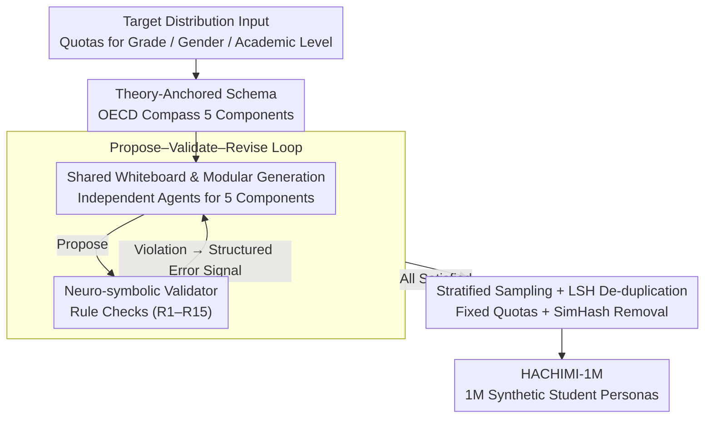

# HACHIMI: Scalable and Controllable Student Persona Generation via Orchestrated Agents

**Conference**: ACL 2026  
**arXiv**: [2603.04855](https://arxiv.org/abs/2603.04855)  
**Code**: https://github.com/ZeroLoss-Lab/HACHIMI  
**Area**: LLM Evaluation / Education / Agent  
**Keywords**: Student Persona, Multi-Agent, Neuro-symbolic Verification, Stratified Sampling, Population Consistency

## TL;DR
HACHIMI formalizes "student persona generation" as the TAD-PG (Theory-Aligned and Distribution-Controllable) task. By employing a "propose-validate-revise" multi-agent framework integrated with neuro-symbolic validators and stratified sampling, it produces 1 million synthetic student personas for grades 1–12. Group-level evaluations on CEPS / PISA 2022 reveal a distinct "fidelity gradient"—high alignment for constructs like mathematics and curiosity, but weak alignment for well-being and family dynamics.

## Background & Motivation

**Background**: Educational LLMs (for personalized tutoring, virtual classrooms, and teacher training) increasingly rely on large-scale "synthetic students" for dialogue simulation and performance evaluation. Traditional methods rely on manually constructed HCI personas via interviews or surveys, which are detailed but unscalable. Recent approaches use LLM "role-playing + one-shot generation," which is scalable but suffers from significant quality degradation.

**Limitations of Prior Work**: Purely prompted LLM student personas exhibit three systemic defects: (1) **Intra-profile contradictions**: Descriptions conflict across long contexts. (2) **Lack of theoretical anchoring**: Generated "motivations/personalities" rarely align with established pedagogical or developmental psychology theories (e.g., Piaget, Erikson, OECD Learning Compass). (3) **Uncontrollable population distribution**: The proportions of high/low achievers, gender, and psychological risks are often random, failing to meet the demand for evaluations based on authentic demographic structures. RAG and memory frameworks only mitigate consistency issues without addressing the latter two.

**Key Challenge**: Synthetic students in education require three hard constraints: theory alignment, population quotas, and intra-individual consistency. These constraints conflict: strong consistency often leads to mode collapse, high diversity may violate theoretical constraints, and strict quotas can dilute rare group characteristics. One-shot prompting cannot satisfy all three simultaneously.

**Goal**: (1) Formally propose the Theory-Aligned and Distribution-Controllable Persona Generation (TAD-PG) task; (2) Design a framework that allows LLMs to strictly satisfy educational theories and quotas while maintaining diversity; (3) Perform group-level external validation using large-scale real-world surveys (CEPS from China, international PISA 2022).

**Key Insight**: Decompose generation into multiple agents responsible for different schema dimensions, using a shared whiteboard to prevent intra-profile contradictions. Encode pedagogical theories into executable logical predicates for a "Symbolic Validator" in a "propose-validate-revise" loop. Use stratified sampling paired with LSH de-duplication to combat mode collapse.

**Core Idea**: Transform "soft constraints" from prompt engineering into hard constraints via a "propose-validate-revise" loop with neuro-symbolic predicates, moving "quota scheduling" to an external scheduler rather than internal prompting.

## Method

### Overall Architecture
The HACHIMI pipeline includes: (1) **Target Distribution Input**—specifying quotas for grade, gender, and academic level; (2) **Theory-Anchored Schema**—dividing personas into 5 components based on the OECD Learning Compass (Demographics & Development, Academic Profile, Personality & Values, Social Relations & Creativity, Mental Health & Well-being); (3) **Modular Multi-agent Generation**—each component is written by an independent agent with sequential conditioning via a shared whiteboard; (4) **Neuro-symbolic Validator**—checks for violations against the R1–R15 executable rule set (e.g., grade-to-Piaget/Erikson stage mapping) and sends structured errors back to agents; (5) **Stratified Sampling + LSH De-duplication**—ensures 250,000 personas per academic tier and uses SimHash to remove near-duplicates. This produced HACHIMI-1M (1 million personas, ~3200 H100-hours using Qwen2.5-72B). Components (3) and (4) form the "propose-validate-revise" inner loop.

### Key Designs

**1. Modular Generation via Shared Whiteboard (Mechanism I): Decomposing generation without component conflicts.**

The primary issue with one-shot full-length persona generation is intra-profile contradiction, where LLMs lose track of earlier descriptions in long contexts. HACHIMI decomposes each persona into 5 components. Each component is managed by a specialized agent. All agents share a "Whiteboard" context: subsequent agents must condition their generation on the intermediate outputs already written to the whiteboard. This transforms one-shot generation into a "segment-by-segment accumulation" with explicit memory, ensuring consistency and allowing agents to use more precise prompts for specialized sub-tasks.

**2. Neuro-Symbolic Constraint Satisfaction (Mechanism II, Propose-Validate-Revise): Turning theory alignment into hard logical checks.**

LLMs excel at creative narrative but struggle with theoretical consistency, while symbolic systems are rigorous but lack descriptive vividness. HACHIMI combines these by formalizing developmental and pedagogical axioms into a set of logical predicates (R1–R15). For instance, `grade=2` must map to Piaget’s "concrete operational" stage and Erikson’s "industry vs. inferiority" stage. After generation, the Symbolic Validator runs these rules; any violation triggers a structured error signal (specifying the broken rule, the faulty field, and the expected value) sent back to the agent for revision. This "neural creation + symbolic judgment" loop ensures the symbolic system acts as a "hard-line checker."

**3. Stratified Sampling + LSH De-duplication (Mechanism III): Preventing mode collapse and ensuring representative quotas.**

Random sampling in LLMs often oversamples high-frequency personas, causing million-scale datasets to converge toward a few "average students" and diluting rare groups. HACHIMI employs an external stratified sampler to ensure uniform distribution across orthogonal factors (e.g., 4 academic tiers × 12 grades × 2 genders). The "academic tier" serves as a conditional variable influencing downstream attributes like self-efficacy. Post-generation, narratives are mapped to binary hash space using SimHash:

$$h(x)=\text{sign}\big(W\phi(x)\big)$$

Near-duplicates are removed based on Hamming distance. Unlike n-gram methods, LSH ensures diversity at the semantic level rather than just the literal level, effectively countering LLM-based homogeneity.

### Loss & Training
The framework does not train new models. It utilizes Qwen2.5-72B for generation and DeepSeek-V3.2 for downstream "student agents" in shadow surveys. The focus is on the Propose-Validate-Revise loop and scheduler during inference; thus, "constraint satisfaction" serves as the termination condition rather than a loss function.

## Key Experimental Results

### Main Results: CEPS Grade 8 Group-level Consistency
HACHIMI personas were instantiated as student agents to perform a shadow survey on the China Education Panel Survey (CEPS) Grade 8 dataset. Comparisons were made across 16 cohorts (4 academic tiers × 2 genders × 2 psychological risks) using 16-dimensional mean vectors.

| CEPS Target Construct | Pearson $r$ | Spearman $\rho$ | Rating |
|------|------|------|------|
| Educational aspirations (w2b18) | ≥ 0.86 | ≥ 0.90 | High |
| Parental achievement expectation (w2a27) | ≥ 0.86 | ≥ 0.90 | High |
| Perceived difficulty Math/English (w2b02/04) | 0.86 / 0.85 | 0.81 / 0.80 | High |
| Teacher attention (aggregated) | ≈ 0.86 | ≈ 0.90 | High |
| Mother-child relationship (w2a23) | 0.73 | 0.66 | Moderate |
| Prosocial behavior | — | ≈ 0.63 | Moderate |
| Misbehavior / parental pressure | — | Moderate | Moderate |
| School bonding / Depressive symptoms / Health | Weak/Neg | Weak/Neg | Low |
| Parental strictness | Weak/Neg | Weak/Neg | Low |

Generality was verified in PISA 2022 across 5 regions (East Asia, West Europe, South Europe, Latin America, Middle East). MATHEFF achieved $r > 0.95$ and CURIOAGR $r \gtrsim 0.85$ in all regions, while mental health and workload alignment remained near zero.

### Ablation Study: vs. One-Shot Baseline (10K samples)

| Metric | One-shot baseline | HACHIMI | $\Delta$ |
|------|------|------|------|
| Hard error rate ↓ | 12.03% | **0.00%** | −12.03 |
| Warning rate ↓ | 25.33% | **0.82%** | −24.51 |
| Distinct-1 ↑ | 0.2328 | **0.3285** | +0.0957 |
| Distinct-2 ↑ | 0.4589 | **0.7893** | +0.3304 |
| Near-duplicate counts ↓ | 157 | **0** | −157 |
| CEPS teacher-attention $\rho$ | base | +0.132 | +0.132 |
| PISA MATHEASE $r$ | 0.45–0.63 | +0.27–0.29 | +0.27 |

### Key Findings
- **Fidelity Gradient**: Across datasets, "school-facing and observable" constructs (math efficacy, teacher attention) show extremely high alignment. "Latent and private" constructs (depression, family strictness, personal well-being) show weak or even negative correlation. Inferring psychological latent variables from static personas is inherently more difficult.
- **Multi-agent + Neuro-symbolic Validation = Zero Hard Errors**: Hard errors dropped from 12% to 0%. Instead of post-processing, the "propose-validate-revise" loop forces the agent to correct itself.
- **Diversity Gains**: Distinct-2 increased from 0.46 to 0.79. Stratified sampling and LSH de-duplication nearly doubled phrase-level diversity, proving random sampling in LLMs leads to severe mode collapse.
- **Stable Consistency**: The rankings of strong/weak constructs in CEPS were replicated in PISA across 5 regions, suggesting the fidelity gradient is a boundary of synthetic persona capability rather than a dataset artifact.

## Highlights & Insights
- **Formalizing theory alignment as predicates (R1–R15)**: Turning pedagogical compliance into a machine-verifiable and debuggable property. This approach of hard-coding domain knowledge into a validator is directly applicable to medical or legal LLM data generation.
- **Shared Whiteboard as a consistency weapon**: Prevents contradictions without requiring a specialized consistency model by allowing agents to read others' intermediate states sequentially.
- **Discovery of the Fidelity Gradient**: Provides a clear guideline on what is credible in synthetic student evaluations (academic efficacy, teacher attention) and what is dangerous (mental health, family relationships).

## Limitations & Future Work
- **Static vs. Dynamic Students**: HACHIMI personas are static states and do not cover learning trajectories or micro-level classroom interactions.
- **Base Model Dependency**: All agents rely on Qwen2.5-72B and DeepSeek-V3.2. Changing models or decoding strategies may affect alignment.
- **Simplified Constructs**: Folding complex well-being or family relations into discrete labels and narratives ignores the spectrum of continuous differences, which likely contributes to the lower fidelity in those areas.

## Related Work & Insights
- **vs. MathDial / Book2Dial**: Previous works focused on dialogue data where personas were byproducts. HACHIMI treats the persona as a first-class citizen with explicit theoretical and quota constraints.
- **vs. Generative Agents (Park 2023)**: While Park uses memory/reflection for long-term consistency, HACHIMI uses a shared whiteboard and symbolic critic to resolve intra-profile contradictions in batch generation.
- **vs. PPLM / GeDi**: Controllable decoding for attribute control does not scale to complex 5-dimensional student schemas. HACHIMI moves "control" to the agent orchestration layer for better interpretability.

## Rating
- Novelty: ⭐⭐⭐⭐ Formalization of TAD-PG + systemized neuro-symbolic validator for personas.
- Experimental Thoroughness: ⭐⭐⭐⭐ Two-layer external validation (CEPS+PISA) + intrinsic tests.
- Writing Quality: ⭐⭐⭐⭐ Clear mechanisms and a cohesive "fidelity gradient" conclusion.
- Value: ⭐⭐⭐⭐ 1 million personas provided as public infrastructure for the educational LLM community.

- **Generative Agents**: https://arxiv.org/abs/2304.03442
- **OECD Learning Compass 2030**: https://www.oecd.org/education/2030-project/teaching-and-learning/learning/

## Related Papers

- [\[AAAI 2026\] Scalable and Accurate Graph Reasoning with LLM-Based Multi-Agents](../../AAAI2026/multi_agent/scalable_and_accurate_graph_reasoning_with_llm-based_multi-agents.md)
- [\[ICML 2026\] Does Persona Make LLMs K-pop Fans? A Pilot Study of LLM-Based Online Concert Audience Agents](../../ICML2026/multi_agent/does_persona_make_llms_k-pop_fans_a_pilot_study_of_llm-based_online_concert_audi.md)
- [\[ACL 2026\] SILO-BENCH: A Scalable Environment for Evaluating Distributed Coordination in Multi-Agent LLM Systems](silo-bench_a_scalable_environment_for_evaluating_distributed_coordination_in_mul.md)
- [\[ACL 2026\] Latent Agents: A Post-Training Procedure for Internalized Multi-Agent Debate](latent_agents_a_post-training_procedure_for_internalized_multi-agent_debate.md)
- [\[ACL 2026\] Memory-Augmented LLM-based Multi-Agent System for Automated Feature Generation on Tabular Data](memory-augmented_llm-based_multi-agent_system_for_automated_feature_generation_o.md)

<!-- RELATED:END -->

<!-- RELATED:START -->

## Related Papers

- [\[ACL 2026\] SILO-BENCH: A Scalable Environment for Evaluating Distributed Coordination in Multi-Agent LLM Systems](silo-bench_a_scalable_environment_for_evaluating_distributed_coordination_in_mul.md)
- [\[ACL 2026\] RoadMapper: A Multi-Agent System for Roadmap Generation of Solving Complex Research Problems](roadmapper_a_multi-agent_system_for_roadmap_generation_of_solving_complex_resear.md)
- [\[ACL 2026\] A Multi-Agent Framework for Feature-Constrained Difficulty Control in Reading Comprehension Item Generation](a_multi-agent_framework_for_feature-constrained_difficulty_control_in_reading_co.md)
- [\[ACL 2026\] ATLAS: Adaptive Trading with LLM AgentS Through Dynamic Prompt Optimization and Multi-Agent Coordination](atlas_adaptive_trading_with_llm_agents_through_dynamic_prompt_optimization_and_m.md)
- [\[ACL 2026\] Diversity Collapse in Multi-Agent LLM Systems: Structural Coupling and Collective Failure in Open-Ended Idea Generation](diversity_collapse_in_multi-agent_llm_systems_structural_coupling_and_collective.md)

<!-- RELATED:END -->
