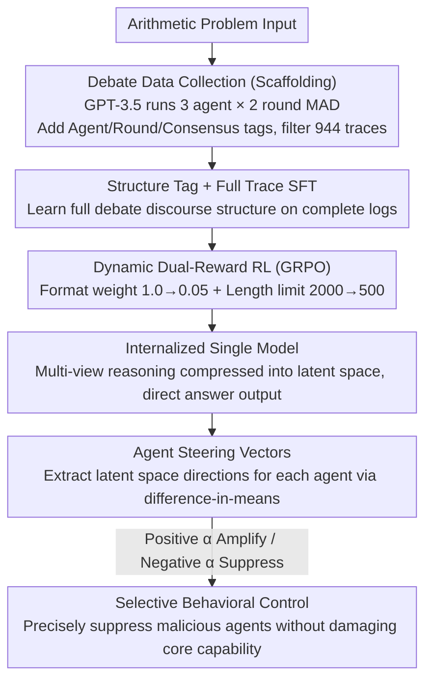

# Latent Agents: A Post-Training Procedure for Internalized Multi-Agent Debate

**Conference**: ACL 2026  
**arXiv**: [2604.24881](https://arxiv.org/abs/2604.24881)  
**Code**: https://github.com/johnsk95/latent_agents  
**Area**: LLM Agent / Multi-Agent / Interpretability  
**Keywords**: Multi-Agent Debate, Knowledge Distillation, Activation Steering, Agent Subspace, GRPO

## TL;DR
The paper proposes the IMAD (Internalized Multi-Agent Debate) framework, which "internalizes" multi-agent debate into a single LLM using a two-stage post-training pipeline (SFT + GRPO). This approach reduces token consumption by up to 93% and demonstrates through activation steering that the internalized model retains separable and controllable "agent subspaces" within its latent space.

## Background & Motivation

**Background**: Multi-Agent Debate (MAD) has been widely proven to improve LLM reasoning accuracy and reduce hallucinations. This is achieved by allowing multiple LLM instances to criticize and refine each other's answers over multiple rounds of dialogue, finally reaching a conclusion through voting.

**Limitations of Prior Work**: MAD incurs massive inference costs—a typical setup (3 agents × 2 rounds) can generate tens of thousands of tokens in dialogue logs to produce a final answer, making the cost per inference 5–16 times that of a single agent. Existing distillation work (e.g., DebateGPT, Subramaniam et al.) only fine-tunes on the "final consensus answer," failing to inherit the benefits of intermediate multi-perspective reasoning.

**Key Challenge**: The reasoning gains of MAD stem from the **process** of "multi-perspective collision + iterative refinement," rather than just the final conclusion. However, retaining this process consumes tokens, while removing it sacrifices performance gains—presenting a fundamental trade-off between performance and efficiency.

**Goal**: (1) Distill the complete MAD debate process (not just the conclusion) into a single LLM; (2) Verify whether internalization truly embeds "multiple agents" into the model's latent space or merely memorizes input-output mappings; (3) Utilize this internalized structure for selective behavioral control (e.g., suppressing malicious/hallucinating agents).

**Key Insight**: The authors observe that if a model learns the structure of the entire debate trace (using structural tags like `<|Agent 1|>`) during the SFT stage, subsequent RL—combined with **linearly decaying format rewards** and **gradually tightening length constraints**—can force the model to compress multi-perspective reasoning from "explicit output" into "latent computation."

**Core Idea**: Use a two-stage post-training approach (first learning structure, then internalizing via dynamic rewards) to compress explicit debate into implicit reasoning. Subsequently, the "difference-in-means" method is used to extract steering vectors for each agent, proving that the internalized model forms separable "agent subspaces" that allow for precise suppression of "bad agents" via negative steering.

## Method

### Overall Architecture

The entire pipeline consists of three stages:

1.  **Debate Data Collection**: A standard 3-agent × 2-round MAD is executed using GPT-3.5 turbo on arithmetic expressions composed of six two-digit numbers (e.g., $91+24\times 13+45-41\times 38$). Samples where a majority consensus is not reached are filtered out. Each trace is prefixed with structural tags such as `<|Agent i|>`, `<|Round j|>`, `<|Consensus|>`, and `<|endofdebate|>`, resulting in 944 `{Question, Trace, Answer}` triplets.
2.  **Structure Learning (SFT)**: Standard autoregressive next-token prediction is performed on the complete traces (rather than just the final answer), enabling the single LLM to learn the entire debate format—actively generating multi-agent dialogues, iterative rounds, and the final consensus.
3.  **Internalization (RL/GRPO)**: Group Relative Policy Optimization is employed with dual dynamic rewards: "format reward weight decay" + "length limit annealing." This forces the explicit debate to be gradually compressed into implicit reasoning.

The input is a problem. During early training, the output is the complete debate trace with structural tags + the final answer; by the end of training, the model directly outputs the final answer (with intermediate reasoning remaining in the hidden states).

### Key Designs

**1. Structure Tag + Full Trace SFT: Learning the structure of the entire debate rather than just the final answer**

Distillation efforts like DebateGPT only perform SFT on the "final consensus answer," which essentially discards the process of multi-perspective collision and only inherits the conclusion. Consequently, the reasoning gains of MAD are lost. This paper takes the opposite approach, performing standard cross-entropy next-token training on complete traces containing structural tags like `<|Agent i|>`, `<|Round j|>`, `<|Consensus|>`, and `<|endofdebate|>`. and This allows the single model to learn the entire discourse structure of generating multi-agent utterances and iterating until consensus.

These structural tags serve more than just formatting: they provide parsable reward hooks for subsequent RL (format rewards depend on tag matching) and make different agents more separable in the latent space. Ablations show that removing tags significantly decreases the separability of agent subspaces. Interestingly, because the SFT model "sees" all previous agent utterances during step-by-step generation (unlike real MAD where agents are parallel and only see others at the end of a round), it is even less prone to coordination failures than explicit MAD.

**2. Dynamic Dual-Reward RL: Using format weight decay + length annealing to push explicit debate into latent space**

The SFT-trained model still explicitly outputs the entire debate trace, saving no token costs. The goal of the RL stage is to transition from "explicitly outputting the debate" to "reasoning in the latent space" while ensuring answer accuracy. The reward is a weighted sum $r(x,y)=w_{fmt}R^{fmt}+w_{clip}R(y;l)$: where $R^{fmt}$ is the structural tag matching reward encouraging the retention of the debate format in early stages (with $w_{fmt}$ decaying linearly from 1.0 to 0.05); and $R(y;l)$ is a length-clipping accuracy reward, giving 1 if and only if the correct answer $y^*$ appears within the first $l$ tokens of $y$, and 0 otherwise. The length limit $l$ is annealed from 2000 down to 500.

The combination of these two dynamic signals creates an "impossible task": the model must write a full debate while fitting the answer into the first 500 tokens. To resolve this, the model's only viable strategy is to move multi-perspective reasoning into the hidden states. Gradually tightening $l$ instead of imposing a strict limit from the start ensures the model has room to explore the reasoning space initially. This approach draws inspiration from the internalization of long CoT by Hou et al. (2025) but is applied to multi-agent scenarios for the first time.

**3. Agent Steering Vectors based on Difference-in-Means: Explicitly extracting directions for each internalized agent**

After internalization, a key question remains: does the multi-agent structure truly exist in the latent space, or has it been compressed into an undifferentiated single reasoning path? The most direct way to answer this is to see if agent-specific directions can be found in the latent space. This paper uses Contrastive Activation Addition (CAA) to construct positive samples (an agent $i$'s real response following a debate history) and negative samples (the average activation of the other two agents' responses following the same history) for each agent $i$. The steering vector is obtained at layer $\ell$ using difference-in-means:

$$\mathbf{v}_i = \frac{1}{|\mathcal{D}|}\sum_{p,c\in\mathcal{D}}\left(\mathbf{h}_\ell(p,c_i) - \mathbf{h}_\ell(p,c_{\neg i})\right)$$

During inference, $\alpha\cdot \mathbf{v}_i$ is added to the hidden states. A positive $\alpha$ amplifies the agent's characteristics, while a negative $\alpha$ suppresses them. Vectors are extracted from the SFT checkpoint to avoid artifacts introduced by RL optimization. These separable directions not only prove that "internalization did not erase the multi-agent structure" but also provide a handle for behavioral control—applying negative steering to a malicious agent's direction can selectively suppress bad behavior without destroying general capabilities, turning "controllability" into a "designable" property.

### Loss & Training

SFT uses standard next-token CE, trained for 3–6 epochs. RL uses GRPO for 2 epochs: $k$ candidates are sampled for each query, scored by $r(x,y)$, and the differences form an on-the-fly preference dataset; $w_{fmt}$ goes from 1.0 → 0.05; $l$ goes from 2000 → 500. Both stages use LoRA. For "malicious agent suppression" experiments, $R^{fmt}$ is replaced with an "ethics/honesty" reward provided by an LLM-judge during the RL stage.

## Key Experimental Results

### Main Results

Five settings—Single / Debate / DebateGPT / SFT / IMAD (SFT+RL)—were compared across three benchmarks (GSM8K, MMLU-Pro, BBH), with 1,000 problems randomly sampled per benchmark and averaged over 3 runs.

| Model | Method | GSM8K | MMLU-Pro | BBH | GSM8K tokens | Savings vs. Debate |
|------|------|-------|----------|-----|--------------|------------------|
| LLaMA-3.1 8B | Debate | 83.03 | 64.60 | 51.06 | 5757.78 | — |
| LLaMA-3.1 8B | **IMAD** | **85.20** | 62.00 | **58.53** | 644.33 | **88.8%** |
| Qwen 2.5 7B | Debate | 91.37 | 57.67 | 67.58 | 2319.71 | — |
| Qwen 2.5 7B | **IMAD** | 89.67 | 52.87 | **70.11** | 389.13 | **83.2%** |
| Mistral Nemo 12B | Debate | 61.03 | 41.30 | 62.76 | 1696.99 | — |
| Mistral Nemo 12B | **IMAD** | **80.00** | 38.97 | **63.73** | 358.01 | **78.9%** |

Across three models, IMAD achieved comparable or superior accuracy using only 6.3%–21.1% of the tokens required by Debate, with the most extreme case being Mistral Nemo 12B on GSM8K, which outperformed explicit Debate by 18.97 percentage points.

### Ablation Study

| Experiment | Configuration | Key Metric | Description |
|------|------|----------|------|
| Pipeline Ablation | SFT only | LLaMA GSM8K 79.23 / 992 tokens | SFT already stronger than most baselines but uses more tokens than IMAD |
| Pipeline Ablation | SFT + RL (IMAD) | LLaMA GSM8K 85.20 / 644 tokens | RL stage simultaneously improves score and cuts tokens by up to 66% |
| Tag Ablation | Remove tags | Sig. drop in subspace separation | Verifies importance of tags for forming agent subspaces |
| Agent steering | IMAD vs base, ROUGE-L AUC | IMAD higher by **15.41%** avg. | Agent 3 (PoT) improved most (21–25%), proving code-like styles are most distinct |
| Evil Suppression | $\alpha=-3.0\sim-5.0$ | IMAD score drops to 0; base persists at 1.01 | Internalization makes malicious traits highly localized and eradicable |
| Hallucination | $\alpha$ range | Partial suppression for both (baseline ≈65) | Hallucination is a distributed trait, but IMAD remains linearly controllable |
| Task Retention | GSM8K @ extreme $\alpha$ | IMAD remains stable; base collapses | IMAD's subspaces are "cleaner"; steering does not break core capabilities |

### Key Findings
- **RL stage is both a token killer and a performance booster**: Compared to SFT, GRPO + length annealing can cut 66% more tokens on LLaMA while gaining 6 points, validating the efficacy of dynamic dual rewards.
- **Strong cross-domain generalization**: Although trained only on arithmetic, the model showed synchronous improvements on knowledge and reasoning tasks like MMLU-Pro and BBH, indicating that the "multi-perspective reasoning schema" was internalized rather than just arithmetic skills.
- **Personas truly exist in latent space**: A minor steering of $\alpha=0.5$ in IMAD yields outputs distinctly featuring step enumeration (Agent 1), self-criticism (Agent 2), or code/equations (Agent 3), whereas the base model produces mixed styles under the same steering.
- **Trait distribution determines controllability**: "Evil" is a localized trait in latent space that can be completely neutralized; "hallucination" is a distributed trait that can only be linearly weakened—providing a diagnostic framework for LLM safety research.
- **Model capacity threshold**: Models ≤7B perform poorly at internalization; 7B+ parameters are required to stably host multi-agent subspaces.

## Highlights & Insights
- **"Dynamic Reward Annealing = Explicit-to-Implicit Training Topology Control"**: Simultaneously annealing reward weights and length limits is an elegant way to induce the model to shift observable computation into the latent space. This design is more stable than simple length penalties and can be directly transferred to scenarios like long CoT compression, ReAct internalization, and tool-use simplification.
- **"Internalization creates separable subspaces" is a counter-intuitive finding**: One might fear that distillation would collapse multi-perspective views into a single representation. However, the authors provide triple evidence (ROUGE AUC, persona steering, and GSM8K retention) that the agent structure is "etched" into the latent space and can be extracted using a simple difference-in-means approach, opening a new path for interpretability research.
- **Safety application of "Malicious Agent Internalization → Precise Removal via Negative Steering"**: Instead of searching for harmful directions in a general model (which risk "friendly fire"), it is better to **actively plant** a bad agent and then surgically remove it. This transforms controllability into a designability problem—a brilliant reverse-engineering approach applicable to jailbreak defense, persona fine-tuning, and value alignment.

## Limitations & Future Work
- **Narrow Data Distribution**: Training data is limited to 6-number arithmetic expressions with a fixed 3 agent × 2 round setup. Generalization to more complex debate structures and open-ended tasks (e.g., long-form QA, creative writing) requires further validation.
- **Dependence on SFT Stage Format Learning**: While LLaMA stably learns the structure, Qwen/Mistral occasionally fails to do so thoroughly in certain settings, causing the lower bound of internalization to be limited by the base model's in-context schema-following ability.
- **LLM-judge Bias**: Evil/Hallucination scores rely on GPT-4o-mini as a judge. While human-LLM consistency experiments were performed, a protocol entirely independent of self-evaluation is still needed.
- **Capacity Threshold of 7B+**: Small models (<7B) show negligible gains from internalization, likely due to a capacity bottleneck. Future work could explore reproducing these effects in small models via MoE or mixture-of-personas.
- **Improvement Ideas**: (a) Upgrade difference-in-means to Sparse Autoencoders (SAE) to extract finer-grained agent circuits; (b) Use internalized agents as inference-time control knobs linked to sampling temperature or CoT length; (c) Extend the "plant-and-remove" framework to precise implantation of positive traits (e.g., politeness, NDA compliance).

## Related Work & Insights
- **vs. Debate (Du et al., 2023)**: Classic MAD is an inference-time protocol; this work is a train-time distillation that absorbs the protocol into the weights, plunging inference costs. MAD is flexible but expensive; IMAD is cheap after training but has a fixed schema.
- **vs. DebateGPT / Subramaniam et al.**: They perform SFT only on the "final consensus answer"; this work uses complete traces + structural tags for SFT + dynamic RL, inheriting reasoning gains from intermediate processes (IMAD consistently outperforms DebateGPT).
- **vs. Hou et al. (2025) Long CoT Internalization**: Both use length-based RL for internalization, but Hou focuses on a single agent/view. This work handles multiple agents/views + dual rewards + subspace interpretability, upgrading internalization from "compression" to "structure-preserving compression."
- **vs. Persona Vectors (Chen et al., 2025)**: They extract persona/trait directions from general models; this work **actively plants** personas using IMAD before extraction, resulting in subspaces with higher separation and more thorough trait suppression without hurting core capabilities—a "training-enhanced" version of persona steering.
- **vs. Coconut (Hao et al., 2024) Continuous Latent Reasoning**: Both move reasoning into the latent space, but Coconut passes hidden states as thought tokens in the forward pass. This work uses reward pressure to let the model learn implicit reasoning on its own, maintaining the utility of a discrete token interface.

## Rating
- Novelty: ⭐⭐⭐⭐⭐ First to distill the complete multi-agent debate structure into a single model with accompanying subspace analysis and safety applications.
- Experimental Thoroughness: ⭐⭐⭐⭐ Cross-model/benchmark evaluation with extensive ablations and steering/safety/perplexity analysis; however, training data is limited to arithmetic.
- Writing Quality: ⭐⭐⭐⭐ Clear three-part narrative (efficiency → interpretability → controllability) with well-integrated formulas and intuitive explanations.
- Value: ⭐⭐⭐⭐⭐ Simultaneously advances "reasoning efficiency," "LLM interpretability," and "safety steering," with open-sourced, reproducible code.

<!-- RELATED:START -->

## Related Papers

- [\[ACL 2026\] Efficient Multi-Agent System Training with Data Influence-Oriented Tree Search](efficient_multi-agent_system_training_with_data_influence-oriented_tree_search.md)
- [\[ACL 2026\] When Identity Skews Debate: Anonymization for Bias-Reduced Multi-Agent Reasoning](when_identity_skews_debate_anonymization_for_bias-reduced_multi-agent_reasoning.md)
- [\[ACL 2026\] HACHIMI: Scalable and Controllable Student Persona Generation via Orchestrated Agents](hachimi_scalable_and_controllable_student_persona_generation_via_orchestrated_ag.md)
- [\[ACL 2026\] ATLAS: Adaptive Trading with LLM AgentS Through Dynamic Prompt Optimization and Multi-Agent Coordination](atlas_adaptive_trading_with_llm_agents_through_dynamic_prompt_optimization_and_m.md)
- [\[ICML 2026\] When Cloud Agents Meet Device Agents: Lessons from Hybrid Multi-Agent Systems](../../ICML2026/multi_agent/when_cloud_agents_meet_device_agents_lessons_from_hybrid_multi-agent_systems.md)

<!-- RELATED:END -->
