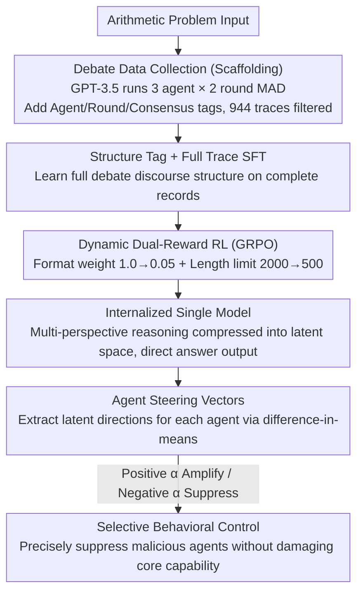

# Latent Agents: A Post-Training Procedure for Internalized Multi-Agent Debate

**Conference**: ACL 2026  
**arXiv**: [2604.24881](https://arxiv.org/abs/2604.24881)  
**Code**: https://github.com/johnsk95/latent_agents  
**Area**: LLM Agent / Multi-Agent / Interpretability  
**Keywords**: Multi-Agent Debate, Knowledge Distillation, Activation Steering, Agent Subspace, GRPO

## TL;DR
The Internalized Multi-Agent Debate (IMAD) framework is proposed, utilizing a two-stage post-training pipeline (SFT + GRPO) to "internalize" multi-agent debate into a single LLM. This approach reduces token consumption by up to 93% and demonstrates through activation steering that the internalized model retains separable and controllable "agent subspaces" within its latent space.

## Background & Motivation

**Background**: Multi-Agent Debate (MAD) has been widely proven to improve the reasoning accuracy of LLMs and reduce hallucinations. This is achieved by allowing multiple LLM instances to criticize and correct each other's answers over multiple rounds of dialogue, finally reaching a conclusion through voting.

**Limitations of Prior Work**: The inference cost of MAD is substantial—a typical setup (3 agents × 2 rounds) can generate tens of thousands of tokens in dialogue logs to produce a single final answer, with inference costs reaching 5–16 times that of a single agent. Existing distillation works (e.g., DebateGPT, Subramaniam et al.) only fine-tune on the "final consensus answer," failing to inherit the benefits of multi-perspective intermediate reasoning.

**Key Challenge**: The reasoning gains of MAD stem from the **process** of "multi-perspective collision + iterative refinement," rather than just the final conclusion. However, retaining this process incurs high token costs, while removing it leads to a loss of performance gains—representing a fundamental trade-off between performance and efficiency.

**Goal**: (1) Distill the complete MAD debate process (not just the conclusion) into a single LLM; (2) Verify whether internalization truly embeds "multiple agents" into the model's latent space or merely memorizes input-output mappings; (3) Utilize this internalized structure for selective behavioral control (e.g., suppressing malicious/hallucinating agents).

**Key Insight**: The authors observed that if a model is taught the structure of the entire debate trace (using structural tags like `<|Agent 1|>`) during the SFT stage, RL can subsequently be used with **gradually decaying format rewards** and **gradually tightening length constraints** to force the model to compress multi-perspective reasoning from "explicit generation" into "latent computation."

**Core Idea**: A two-stage post-training approach—"learning structure first, then internalizing with dynamic rewards"—is used to compress external debate into implicit reasoning. Furthermore, difference-in-means is used to extract steering vectors for each agent, proving that the internalized model forms separable "agent subspaces" which allow for precise suppression of "bad agents" via negative steering.

## Method

### Overall Architecture

The entire pipeline consists of three stages:

1.  **Debate Data Collection**: Standard 3 agent × 2 round MAD is run using GPT-3.5 turbo on arithmetic expressions consisting of six two-digit numbers (e.g., $91+24\times 13+45-41\times 38$). Samples without a majority consensus are filtered out. Each trace is annotated with structural tags such as `<|Agent i|>`, `<|Round j|>`, `<|Consensus|>`, and `<|endofdebate|>`, resulting in 944 `{Question, Trace, Answer}` triplets.
2.  **Structure Learning (SFT)**: Standard autoregressive next-token prediction is performed on the full traces (not just the final answer), enabling the single LLM to mimic the entire debate format—including initiating multi-agent speeches, multi-round iterations, and the final consensus.
3.  **Internalization (RL/GRPO)**: Group Relative Policy Optimization is used for further optimization, introducing a dual dynamic reward of "format reward weight decay" + "length limit annealing" to gradually compress explicit debate into implicit reasoning.

The input is a problem. At the beginning of training, the output is a complete debate trace with structural tags + the final answer; by the end of training, it directly outputs the final answer (with intermediate reasoning remaining in hidden states).

### Key Designs

**1. Structure Tag + Full Trace SFT: Learning Structure on Full Debate Records Instead of Just the Final Answer**

Distillation works like DebateGPT only perform SFT on the "final consensus answer," essentially discarding the multi-perspective collision process and inheriting only the conclusion—thereby failing to capture MAD's reasoning gains. This work takes the opposite approach, performing standard cross-entropy next-token training on complete traces with tags like `<|Agent i|>`, `<|Round j|>`, `<|Consensus|>`, and `<|endofdebate|>`. This allows the single model to learn the entire discourse structure of generating multi-agent responses and iterating until consensus.

These structural tags are not merely decorative: they provide parsable reward hooks for subsequent RL (format rewards depend on matching these tags) and facilitate the separation of different agents in the latent space. Ablations show that removing these tags significantly decreases the separability of agent subspaces. Interestingly, the SFT model can "see" all previous agent responses during generation (whereas agents are parallel in real MAD), leading to fewer coordination failures and making the SFT stage alone stronger than explicit debate.

**2. Dynamic Dual-Reward RL: Using Format Weight Decay + Length Annealing to Force Explicit Debate into Latent Space**

The model learned via SFT still explicitly generates the entire debate, saving no token costs. The goal of the RL stage is to transition from "explicitly generating the debate" to "reasoning in the latent space" while ensuring answer accuracy. The reward is a weighted sum $r(x,y)=w_{fmt}R^{fmt}+w_{clip}R(y;l)$: where $R^{fmt}$ is the structural tag matching reward encouraging the retention of the debate format in early stages, with its weight $w_{fmt}$ linearly decaying from 1.0 to 0.05. $R(y;l)$ is a length-clipping correctness reward, giving 1 if and only if the correct answer $y^*$ appears within the first $l$ tokens of $y$, and 0 otherwise. The length limit $l$ anneals from 2000 down to 500.

These two dynamic signals create an "impossible task": writing a full debate while fitting the answer within the first 500 tokens. The only viable strategy for the model is to move multi-perspective reasoning into hidden states. Gradually tightening $l$ instead of setting a strict limit immediately prevents the model from losing the room to explore the reasoning space. Simultaneously phasing out the length limit and format reward smoothly pushes the model from being an "explicit debater" to an "implicit debater." This approach draws inspiration from the internalization of long CoT by Hou et al. (2025) but applies it to a multi-agent scenario for the first time.

**3. Agent Steering Vectors based on Difference-in-Means: Explicitly Extracting Internalized Agent Directions**

A key question remains after internalization: does the multi-agent structure truly exist in the latent space, or is it compressed into an undifferentiated single reasoning path? The most direct way to answer this is to check for agent-specific directions in the latent space. Contrastive Activation Addition (CAA) is used to construct positive samples (an agent's true response following a debate history) and negative samples (the average activation of other agents' responses following the same history) for each agent $i$. The steering vector is obtained by taking the difference-in-means at layer $\ell$:

$$\mathbf{v}_i = \frac{1}{|\mathcal{D}|}\sum_{p,c\in\mathcal{D}}\left(\mathbf{h}_\ell(p,c_i) - \mathbf{h}_\ell(p,c_{\neg i})\right)$$

During inference, $\alpha\cdot \mathbf{v}_i$ is added to the hidden states; a positive $\alpha$ amplifies the agent's characteristics, while a negative $\alpha$ suppresses them. Vectors are extracted from the SFT checkpoint to avoid artifacts introduced by RL optimization. Separable directions not only prove that "internalization did not erase the multi-agent structure" but also provide a handle for behavioral control—negatively adding the vector of a malicious agent allows for the selective suppression of bad behavior without destroying general capabilities, turning a "controllability" problem into a "designability" problem.

### Loss & Training

SFT uses standard next-token CE for 3–6 epochs. RL uses GRPO for 2 epochs: $k$ candidates are sampled per query and scored by $r(x,y)$, with the difference pairs forming an on-the-fly preference dataset. $w_{fmt}$ decays from 1.0 → 0.05; $l$ anneals from 2000 → 500. LoRA is used in both stages. For "malicious agent suppression" experiments, $R^{fmt}$ is replaced with an "ethics/honesty" reward provided by an LLM-judge during the RL stage.

## Key Experimental Results

### Main Results

Five settings—Single / Debate / DebateGPT / SFT / IMAD (SFT+RL)—are compared across three benchmarks: GSM8K, MMLU-Pro, and BBH. 1000 problems are randomly sampled per benchmark, and the mean of 3 runs is reported.

| Model | Method | GSM8K | MMLU-Pro | BBH | GSM8K tokens | Relative Debate Gain |
|------|------|-------|----------|-----|--------------|------------------|
| LLaMA-3.1 8B | Debate | 83.03 | 64.60 | 51.06 | 5757.78 | — |
| LLaMA-3.1 8B | **IMAD** | **85.20** | 62.00 | **58.53** | 644.33 | **88.8%** |
| Qwen 2.5 7B | Debate | 91.37 | 57.67 | 67.58 | 2319.71 | — |
| Qwen 2.5 7B | **IMAD** | 89.67 | 52.87 | **70.11** | 389.13 | **83.2%** |
| Mistral Nemo 12B | Debate | 61.03 | 41.30 | 62.76 | 1696.99 | — |
| Mistral Nemo 12B | **IMAD** | **80.00** | 38.97 | **63.73** | 358.01 | **78.9%** |

Across three models, IMAD achieves comparable or better accuracy than Debate using only 6.3%–21.1% of the tokens. The most extreme case is on GSM8K with Mistral Nemo 12B, where it outperforms explicit Debate by 18.97 points.

### Ablation Study

| Experiment | Configuration | Key Metric | Description |
|------|------|----------|------|
| Pipeline Ablation | SFT only | LLaMA GSM8K 79.23 / token 992 | SFT already outperforms most baselines but uses more tokens than IMAD |
| Pipeline Ablation | SFT + RL (IMAD) | LLaMA GSM8K 85.20 / token 644 | RL stage simultaneously improves accuracy and cuts tokens by up to 66% |
| Structure Tag Ablation | Remove tags | Significant drop in subspace separability | Verifies the importance of tags for forming agent subspaces |
| Agent Steering | IMAD vs base, ROUGE-L AUC | IMAD is on average **15.41%** higher (6.1%–24.97%) | Agent 3 (PoT) shows the largest gain (21–25%), proving code-like styles are most separable |
| Evil Suppression | $\alpha=-3.0\sim-5.0$ | IMAD score drops to 0; base remains at 1.01 | Internalization makes malicious traits highly localized and fully suppressible |
| Hallucination Suppression | Within $\alpha$ range | Both models only partially suppress (baseline ≈65) | Hallucination is a distributed trait, but IMAD remains linearly controllable |
| Task Preservation | GSM8K @ extreme $\alpha$ | IMAD remains stable; base collapses | IMAD's subspaces are "cleaner," steering does not destroy main capability |

### Key Findings
- **RL stage is both a token killer and a performance booster**: Compared to SFT, GRPO + length annealing can cut an additional 66% of tokens while gaining 6 points on LLaMA, verifying the effectiveness of dynamic dual rewards.
- **Good cross-domain generalization**: Although trained only on arithmetic, performance improved simultaneously on knowledge and reasoning tasks like MMLU-Pro and BBH, indicating the internalization of a "multi-perspective reasoning schema" rather than just arithmetic skills.
- **Personas truly exist in latent space**: A small steering of $\alpha=0.5$ causes IMAD's output to clearly exhibit three styles: step enumeration (Agent 1), self-criticism (Agent 2), and code/equations (Agent 3), while the base model shows mixed styles under the same steering.
- **Trait distribution determines controllability**: "Evil" is a localized trait in latent space that can be zeroed out via steering; "hallucination" is a distributed trait that can only be linearly weakened. This provides a diagnostic framework for LLM safety research.
- **Model capacity threshold**: Models ≤ 7B perform poorly in internalization; 7B+ is required to stably host multi-agent subspaces.

## Highlights & Insights
- **"Dynamic Reward Annealing = Topology Control for Training Explicit → Implicit"**: Simultaneously annealing reward weights and length limits is an elegant way to induce the model to shift observable computation to the latent space. This is more stable than simple length penalties or one-time cuts and can be directly transferred to scenarios like long CoT compression or ReAct internalization.
- **"Internalization creating separable subspaces" is a counterintuitive discovery**: Usually, there is concern that distillation might compress multiple perspectives into a single representation. The authors provide triple evidence (ROUGE AUC + persona steering + GSM8K preservation) that agent structures are truly "etched" into the latent space and can be read out via simple difference-in-means, opening a new avenue for interpretability research.
- **Safety application of "Malicious Agent Internalization → Precise Removal via Negative Steering"**: Instead of searching for harmful directions in a general model (which risk "overkill"), it is better to **actively seed** a bad agent and then remove it. Converting controllability into designability is a brilliant reverse-engineering style idea that could be applied to jailbreak defense and value alignment.

## Limitations & Future Work
- **Narrow data distribution**: Training data is limited to 6-number arithmetic expressions with a fixed 3 agent × 2 round setup. Generalization to more complex debate structures and open-ended tasks requires further validation.
- **Reliance on SFT stage format learning**: LLaMA learns the structure stably, but Qwen/Mistral fail to do so completely in some settings, leading to poor subspace separability—the floor of internalization is limited by the base model's in-context schema-following ability.
- **Bias in LLM-judge evaluation**: Evil/Hallucination scores rely on GPT-4o-mini as a judge. While human-LLM consistency experiments were performed, protocols independent of self-evaluation still need development.
- **Capacity threshold 7B+**: Internalization gains are not obvious for small models (<7B), likely due to a capacity bottleneck. Future work could explore reproducing effects on small models via smarter LoRA configurations or MoE.
- **Improvement ideas**: (a) Upgrade difference-in-means to Sparse Dictionary Learning/SAE for finer-grained agent circuits; (b) Use internalized agents as inference-time control knobs linked to sampling temperature or CoT length; (c) Extend the "seed-and-remove" framework to the precise implantation of positive traits.

## Related Work & Insights
- **vs Debate (Du et al., 2023)**: Classic MAD is an inference-time protocol; this work is train-time distillation that absorbs the protocol into weights, drastically lowering inference costs. The trade-off is MAD's flexibility vs IMAD's efficiency and fixed schema.
- **vs DebateGPT / Subramaniam et al.**: They only perform SFT on the "final consensus answer"; this work utilizes full traces + tags for SFT + dynamic RL, inheriting reasoning gains from intermediate processes (IMAD consistently outperforms DebateGPT).
- **vs Hou et al. (2025) Long CoT Internalization**: Also uses length-based RL for internalization, but Hou's work is single-agent/single-perspective. This work is multi-agent/multi-perspective with dual rewards and subspace interpretability, upgrading internalization from "compression" to "structure-preserving compression."
- **vs Persona Vectors (Chen et al., 2025)**: They extract persona/trait directions from general models; this work **seeds** personas via IMAD before extraction, obtaining subspaces with higher separability and enabling more thorough trait suppression without hurting core capabilities—a "training-enhanced version" of persona steering.
- **vs Coconut (Hao et al., 2024) Continuous Latent Reasoning**: Both move reasoning into the latent space, but Coconut passes hidden states as thought tokens in the forward pass, whereas this work uses reward pressure to let the model learn implicit reasoning while maintaining a practical discrete token interface.

## Rating
- Novelty: ⭐⭐⭐⭐⭐ First to distill the full structure of multi-agent debate into a single model, combined with subspace analysis and safety applications.
- Experimental Thoroughness: ⭐⭐⭐⭐ 3 models × 3 benchmarks + extensive ablations + steering/safety/perplexity analysis; however, training data is limited to arithmetic.
- Writing Quality: ⭐⭐⭐⭐ Clear three-part narrative (efficiency → interpretability → controllability) with well-integrated formulas and intuition.
- Value: ⭐⭐⭐⭐⭐ Simultaneously advances reasoning efficiency, LLM interpretability, and safety steering; code is open-source and reproducible.

<!-- RELATED:START -->

## Related Papers

- [\[ACL 2026\] Efficient Multi-Agent System Training with Data Influence-Oriented Tree Search](efficient_multi-agent_system_training_with_data_influence-oriented_tree_search.md)
- [\[ICLR 2026\] MARTI: A Framework for Multi-Agent LLM Systems Reinforced Training and Inference](../../ICLR2026/multi_agent/marti_a_framework_for_multi-agent_llm_systems_reinforced_training_and_inference.md)
- [\[ICLR 2026\] Multi-Agent Debate with Memory Masking (MAD-M²)](../../ICLR2026/multi_agent/multi-agent_debate_with_memory_masking.md)
- [\[ACL 2026\] When Identity Skews Debate: Anonymization for Bias-Reduced Multi-Agent Reasoning](when_identity_skews_debate_anonymization_for_bias-reduced_multi-agent_reasoning.md)
- [\[ACL 2026\] HACHIMI: Scalable and Controllable Student Persona Generation via Orchestrated Agents](hachimi_scalable_and_controllable_student_persona_generation_via_orchestrated_ag.md)

<!-- RELATED:END -->
