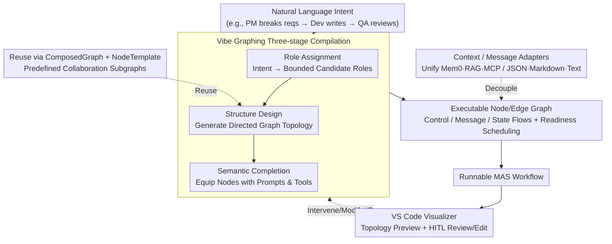

# MASFactory: A Graph-centric Framework for Orchestrating LLM-Based Multi-Agent Systems with Vibe Graphing

**Conference**: ACL 2026  
**arXiv**: [2603.06007](https://arxiv.org/abs/2603.06007)  
**Code**: https://github.com/BUPT-GAMMA/MASFactory (Available)  
**Area**: LLM Multi-Agent Systems / Graph Orchestration / Engineering Framework  
**Keywords**: Multi-agent Orchestration, Vibe Graphing, Computational Graph, Human-AI Collaboration, Context Adaptation

## TL;DR
MASFactory models LLM Multi-Agent Systems (MAS) as Node/Edge computational graphs and introduces the "Vibe Graphing" three-stage pipeline (Role Assignment → Structure Design → Semantic Completion) to compile natural language intent into executable MAS workflows. It provides Context/Message Adapters, ComposedGraph templates for reuse, and VS Code visualization. On 7 benchmarks, it replicates 5 representative MAS with comparable or superior performance; end-to-end Vibe Graphing reduces ChatDev's 1,511 lines of code to 45 lines, with API costs an order of magnitude lower than Vibe Coding.

## Background & Motivation

**Background**: LLM-based MAS extend single-agent capabilities through role division, mutual verification, and iterative collaboration (e.g., AutoGen, MetaGPT, ChatDev, AgentVerse, CAMEL). Mainstream orchestration abstractions use directed computational graphs—LangGraph models workflows as stateful graphs, and Dify provides a DAG canvas.

**Limitations of Prior Work**: ① High engineering costs to implement a full MAS, requiring manual role prompting, node routing, and inter-agent communication protocols. ② Real-world applications require connecting heterogeneous context sources (Mem0, MemGPT, LlamaIndex, GraphRAG, MCP), leading to poor portability due to workflow-specific glue code. ③ Massive amounts of "globally similar, locally distinct" repetitive subgraphs lack versioning or template support. ④ Even with graph frameworks like LangGraph, complex MAS still require thousands of lines of code (ChatDev original: 1,511 Python lines).

**Key Challenge**: User intent is typically natural language ("I want a coding MAS: PM breaks requirements, dev writes, QA reviews"), but existing systems force developers to translate intent into a "graph wiring + prompt + protocol" triad, resulting in high conversion costs and maintenance burdens.

**Goal**: Enable users to obtain runnable, editable, and reusable MAS workflows from natural language intents while guaranteeing performance comparable to manual implementations.

**Key Insight**: Borrow the "Vibe Coding" philosophy but make it more structured—instead of direct code generation, generate a structured intermediate representation (IR) involving a graph skeleton and node configurations. LLMs handle "graph design," while the framework handles "graph execution," incorporating human-in-the-loop reviews at each stage.

**Core Idea**: Reformulate MAS construction as a three-stage "intent → structured graph → executable workflow" compilation, supported by reusable ComposedGraph templates and pluggable Context/Message Adapters.

## Method

### Overall Architecture

The foundation is a Node/Edge computational graph: Nodes are computing units (extendable to Graph, Loop, Agent, CustomNode, Interaction, Switch), and Edges represent dependencies and message paths. Collaboration flows are explicitly split into three types: **Control flow** (scheduling), **Message flow** (horizontal transmission of node outputs), and **State flow** (synchronizing shared context across parent-child graphs). The Runtime employs readiness-based scheduling for concurrent execution of ready nodes, natively supporting serial, parallel, branching, and looping patterns. Agent nodes follow a Perception-Reasoning-Action loop, decoupled via pluggable Message Adapters (JSON, Markdown, free text) and Context Adapters (standardizing Mem0, LlamaIndex, MCP, RAG). Three orchestration interfaces are provided: (a) Vibe Graphing (NL-driven), (b) Imperative (Python), and (c) Declarative (Config). A VS Code Visualizer provides topology previews, runtime tracing, and human-in-the-loop interaction.

### Key Designs

**1. Vibe Graphing Pipeline: Compiling Intent to Executable Graphs instead of Code**

Directly asking LLMs to write code (Vibe Coding) often results in logical errors and unrunnable graphs, alongside high API costs. MASFactory splits the "intent → executable workflow" process into three compilation steps, each producing a readable and editable structured intermediate representation (IR): (i) Role Assignment maps task intent to a set of bounded candidate agent roles; (ii) Structure Design generates a topological skeleton based on information dependencies and control constraints; (iii) Semantic Completion parameterizes the skeleton with prompts and tools. This isolates "structural correctness" from LLM generation—the LLM fills semantics while the framework ensures executability, reducing errors via a more constrained task space.

**2. Context / Message Adapter Layers: Decoupling Heterogeneous Dependencies**

Real-world MAS rely on external context sources (Mem0, LlamaIndex, MCP) with varying APIs and formats. Historically, this required workflow-specific glue code, coupling topology to specific frameworks. MASFactory abstracts this: Context Adapters break sources into standardized units with unified interfaces; Message Adapters format agent IO according to protocols (JSON Schema, Markdown, plain text). This allows swapping memory backends or communication protocols without altering the graph structure.

**3. ComposedGraph + NodeTemplate Reuse Mechanism**

Common collaboration patterns—such as "review-critique-revise" or "propose-vote-merge"—are often rewritten manually. This framework provides two-level reuse: NodeTemplate allows defining structural templates for cloning nodes with different parameters, while ComposedGraph offers predefined specialized graphs. For instance, replicating ChatDev via ComposedGraph allowed fixing original routing bugs, yielding a 22-point improvement on HumanEval by decoupling engineering flaws from the methodology.

### A Complete Example: ChatDev in 45 Lines

Given the intent "I want a coding MAS: PM breaks requirements, dev writes, QA reviews":
- **Role Assignment** parses roles: Product Manager, Developer, QA.
- **Structure Design** generates the skeleton: PM → Dev → QA, with a feedback edge from QA to Dev for failed reviews.
- **Semantic Completion** fills prompts (e.g., PM req templates, coding instructions) and tools.
This end-to-end Vibe Graphing description uses **45 lines** to replace ChatDev's original **1,511 lines** of Python, with construction costs of approximately $\$0.26$ (compared to $>\$3$ for Vibe Coding).

## Key Experimental Results

### Main Results (Scores out of 100)

| Method | HumanEval | MBPP | BigCodeBench | SRDD | MMLU-Pro | GAIA | GPQA |
|---|---|---|---|---|---|---|---|
| ChatDev (orig) | 82.50 | 71.40 | 50.70 | 82.91 | – | – | – |
| ChatDev (MASFactory) | 81.30 | 74.20 | 53.30 | **84.23** | – | – | – |
| MetaGPT (orig) | 67.07 | 36.03 | 50.10 | 78.19 | – | – | – |
| MetaGPT (MASFactory) | **89.02** | **59.14** | 51.70 | 72.77 | – | – | – |
| AgentVerse (orig) | 85.00 | 74.54 | 65.92 | 87.55 | 64.64 | 12.12 | 38.39 |
| AgentVerse (MASFactory) | 85.00 | 75.15 | 64.12 | **91.06** | 64.16 | **12.73** | 37.50 |
| **Vibe Graphing-ChatDev** | 83.50 | 74.20 | 45.30 | 88.13 | – | – | – |
| **Vibe Graphing-Task Specific** | 84.76 | 72.37 | 51.67 | 90.71 | 51.73 | 12.12 | 39.51 |

Replicated versions are broadly consistent or better than originals. Vibe Graphing workflows match or exceed manual versions in most tasks.

### Ablation Study (LOC & Cost)

| Implementation | Code Volume (lines) | Note |
|---|---|---|
| ChatDev (Original) | 1,511 | Manual |
| MASFactory Replicated | 1,114 | ComposedGraph Reuse |
| Vibe Graphing-ChatDev (Staged) | 203 | Per-stage VibeGraph component |
| Vibe Graphing-Task Specific (End-to-End) | 45 | Single VibeGraph compilation |

| Workflow | Vibe Graphing Cost ($) | Vibe Coding (Low) ($) | Vibe Coding (Med) ($) |
|---|---|---|---|
| ChatDev | **0.26** | 3.49 | 3.02 |
| AgentVerse | **0.59** | 4.43 | 6.08 |

### Key Findings
- Structured IR is the key to cost-efficiency and stability; LLMs focus on structural design while the framework ensures executability.
- Decoupling engineering implementations into templates reveals the true effectiveness of the underlying methodologies (e.g., MetaGPT +22 on HumanEval).
- Generalization to GAIA/GPQA proves the paradigm works beyond programming scenarios.

## Highlights & Insights
- The three-stage decomposition aligns MAS construction with human design intuition, offering better control and lower costs than one-shot Vibe Coding.
- The Context Adapter layer provides significant engineering value by unifying disparate sources (Mem0/RAG/MCP), allowing the graph to remain agnostic to external ecosystem shifts.
- The separation of "Three Flows" (Control, Message, State) provides a robust systems design where complex logic naturally maps to readiness-based scheduling.

## Limitations & Future Work
- Lack of checkpointing/recovery for long workflows.
- The ComposedGraph library requires more diverse collaboration patterns.
- High dependency on gpt-5.2 for the construction stage; stability with smaller models is unverified.
- Tool-intensive tasks (e.g., HuggingGPT replication) show a gap, suggesting the need for more granular adapters.

## Related Work & Insights
- **vs LangGraph/Dify**: Offers higher-level abstraction via Vibe Graphing, ComposedGraphs, and Adapters, reducing manual node logic implementation.
- **vs AutoGen/MetaGPT**: Acts as a meta-framework capable of replicating these specific methods with significantly reduced code.
- **vs Vibe Coding**: Demonstrates that structured IR and stage-wise compilation outperform end-to-end code generation in cost ($10 \times$ lower) and reliability.

## Rating
- Novelty: ⭐⭐⭐ (Solid integration of engineering framework and staged compilation)
- Experimental Thoroughness: ⭐⭐⭐ (Broad benchmark coverage; lacks latency/failure analysis)
- Writing Quality: ⭐⭐⭐⭐ (Clear architecture and tables)
- Value: ⭐⭐⭐⭐ (Drastic reduction in developer effort via 1511 → 45 lines)

<!-- RELATED:START -->

<!-- RELATED:END -->

## Related Papers

- [\[ACL 2026\] BookAgent: Orchestrating Safety-Aware Visual Narratives via Multi-Agent Cognitive Calibration](bookagent_orchestrating_safety-aware_visual_narratives_via_multi-agent_cognitive.md)
- [\[AAAI 2026\] Scalable and Accurate Graph Reasoning with LLM-Based Multi-Agents](../../AAAI2026/multi_agent/scalable_and_accurate_graph_reasoning_with_llm-based_multi-agents.md)
- [\[AAAI 2026\] A Graph-Theoretical Perspective on Law Design for Multiagent Systems](../../AAAI2026/multi_agent/a_graph-theoretical_perspective_on_law_design_for_multiagent_systems.md)
- [\[ACL 2026\] Conjunctive Prompt Attacks in Multi-Agent LLM Systems](conjunctive_prompt_attacks_in_multi-agent_llm_systems.md)
- [\[ACL 2026\] CIA: Inferring the Communication Topology from LLM-based Multi-Agent Systems](cia_inferring_the_communication_topology_from_llm-based_multi-agent_systems.md)

<!-- RELATED:END -->
