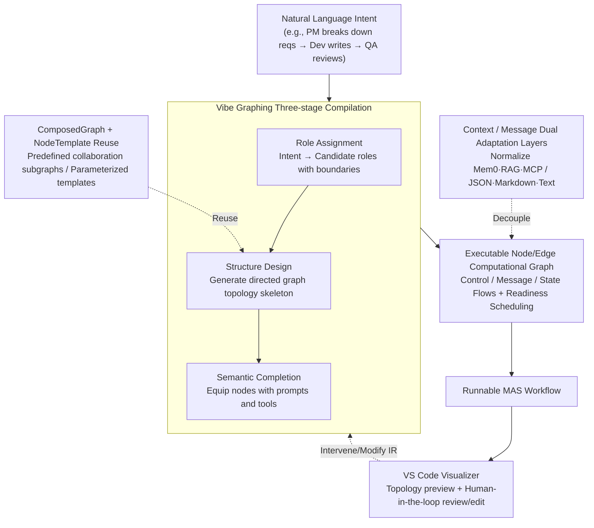

# MASFactory: A Graph-centric Framework for Orchestrating LLM-Based Multi-Agent Systems with Vibe Graphing

**Conference**: ACL 2026  
**arXiv**: [2603.06007](https://arxiv.org/abs/2603.06007)  
**Code**: https://github.com/BUPT-GAMMA/MASFactory (Available)  
**Area**: LLM Multi-Agent Systems / Graph Orchestration / Engineering Framework  
**Keywords**: Multi-agent Orchestration, Vibe Graphing, Computational Graph, Human-AI Collaboration, Context Adaptation

## TL;DR
MASFactory models LLM multi-agent systems as Node/Edge computational graphs and introduces the "Vibe Graphing" three-stage pipeline (Role Assignment → Structure Design → Semantic Completion) to compile natural language intents into executable MAS workflows. It provides Context/Message Adapters, ComposedGraph template reuse, and VS Code visualization. On 7 benchmarks, it reproduces 5 representative MAS with comparable or superior performance. End-to-end Vibe Graphing reduces ChatDev's code from 1511 lines to 45, with API costs an order of magnitude lower than Vibe Coding.

## Background & Motivation

**Background**: LLM-based Multi-Agent Systems (MAS) extend single-agent capabilities through role specialization, mutual verification, and iterative collaboration. Representative systems include AutoGen, MetaGPT, ChatDev, AgentVerse, and CAMEL. The dominant orchestration abstraction is the directed computational graph—LangGraph models workflows as stateful graphs, while Dify provides a DAG canvas.

**Limitations of Prior Work**: ① Implementing a complete MAS incurs high engineering costs, requiring developers to manually write role prompts, wire node routing, and define inter-agent communication protocols. ② Real-world applications require integration with heterogeneous context sources like memory (Mem0, MemGPT), RAG (LlamaIndex, GraphRAG), and MCP, but existing frameworks rely on workflow-specific glue code, resulting in poor portability. ③ MAS contains numerous repetitive subgraphs that are "globally similar but locally different," yet current frameworks offer limited support for versioned and templated reuse. ④ Even with graph frameworks like LangGraph, writing complex MAS still requires thousands of lines of code (the original ChatDev is 1511 lines of Python).

**Key Challenge**: User intent is typically expressed in natural language ("I want a coding MAS: PM breaks down requirements, Dev writes code, QA reviews"). However, existing systems force developers to translate intent into a "graph wiring + prompt + protocol" triad, leading to high conversion costs and heavy maintenance burdens.

**Goal**: To enable users to generate runnable, editable, and reusable MAS workflows from natural language intents while maintaining performance comparable to manual implementations.

**Key Insight**: Drawing inspiration from "Vibe Coding" but with more structure—instead of generating code directly, the system generates a structured intermediate representation (graph skeleton + node configurations). This allows the LLM to focus on "graph design" while the framework handles "graph execution," incorporating human-in-the-loop reviews at each stage.

**Core Idea**: Reformulate MAS construction as a three-stage compilation of "intent → structured graph → executable workflow," paired with reusable ComposedGraph templates and pluggable Context/Message Adapters.

## Method

### Overall Architecture

The underlying structure is a Node/Edge computational graph: Nodes are computational units (extensible to Graph, Loop, Agent, CustomNode, Interaction, Switch), and Edges represent dependencies and message paths. Collaboration flows are explicitly decoupled into three types: **Control flow** (scheduling), **Message flow** (horizontal transmission of node outputs), and **State flow** (synchronizing shared context across parent-child graphs). The runtime uses readiness-based scheduling to execute multiple ready nodes concurrently, natively supporting serial, parallel, branching, and looping patterns. Agent nodes follow a Perception-Reasoning-Action loop and are decoupled via pluggable Message Adapters (JSON, Markdown, or free text) and Context Adapters (supporting Mem0, LlamaIndex, MCP, and RAG). The top layer provides three orchestration interfaces: (a) Vibe Graphing driven by natural language, (b) Imperative manual Python code, and (c) Declarative configuration files. An accompanying VS Code Visualizer provides topology previews, runtime tracing, and human-in-the-loop interaction.

### Key Designs

**1. Vibe Graphing Three-stage Compilation Pipeline: Compiling natural language into executable graphs instead of direct code**

Asking LLMs to write code directly (Vibe Coding) often results in logical errors and non-runnable graphs, along with high API costs. MASFactory addresses this by splitting the "intent → executable workflow" process into three stages, each producing a readable and editable structured Intermediate Representation (IR): (i) Role Assignment maps task intent to a set of candidate agent roles with clear boundaries; (ii) Structure Design generates a directed graph topology based on information dependencies and control constraints; (iii) Semantic Completion instantiates and parameterizes the skeleton by assigning prompts and tools to each node, producing a workflow ready for compilation/execution.

The essence of this staged approach is decoupling "graph structure correctness" from the LLM’s free-form generation. The LLM only provides semantics (roles, connections, prompts), while the framework ensures executability. Consequently, the LLM faces a more constrained and less error-prone task. Each stage's structured IR can be modified via human-in-the-loop intervention in the VS Code Visualizer. In engineering practice, gpt-5.2 is used to generate the IR, while the cheaper gpt-4o-mini handles execution.

> ⚠️ Model names such as gpt-5.2 follow the original text.

**2. Context Adapter / Message Adapter Dual Adaptation Layers: Decoupling heterogeneous external dependencies from collaboration graphs**

Real-world MAS rely heavily on external context sources, but Mem0 long-term memory, LlamaIndex RAG, and Anthropic MCP each have distinct APIs and data formats. Previously, developers had to write extensive workflow-specific glue code to stitch these into each agent, resulting in topologies tightly coupled to specific frameworks. Ours abstracts this via two layers: the Context Adapter slices different context sources into standardized units with a unified interface for graph nodes, and the Message Adapter formats agent I/O according to specified protocols (JSON Schema, Markdown sections, or plain text) with support for custom protocols.

The direct benefit of this decoupling is that a collaboration graph can seamlessly switch memory backends or communication protocols without changing its topology—switching from Mem0 to LlamaIndex or from JSON to Markdown only requires modifying the adapter configuration.

**3. ComposedGraph + NodeTemplate Reuse Mechanism: Declaring, reusing, and versioning repetitive subgraphs as templates**

Collaboration patterns like "review-critique-revise" or "propose-vote-merge" recur frequently. Manual implementation is time-consuming and inconsistent. Ours provides two levels of reuse: NodeTemplate allows users to declare structure templates before instantiation, enabling the cloning of multiple graphs that are globally identical but locally parameterized. ComposedGraph is a specialized Graph with a predefined structure that users can instantiate by filling node configs or activating specific branches. The framework includes common collaboration subgraphs (e.g., DyLan-style dynamic scheduling), and users can package their own designs into reusable components.

Templating reduces code redundancy and allows subgraphs to be managed like software libraries. A strong piece of evidence: implementing ChatDev with ComposedGraph fixed routing bugs present in the original version, leading to a reproduce version that outperformed the original by 22 points on HumanEval—the underlying methodology's effectiveness was revealed once the messy engineering was decoupled into templates.

### A Complete Example: Orchestrating ChatDev in 45 Lines

Taking the natural language intent "I want a coding MAS: first PM breaks down requirements, then dev writes code, and QA reviews" through the Vibe Graphing pipeline:

- **Role Assignment** parses the intent into three roles: Product Manager (requirement breakdown), Developer (coding), and QA (review), defining their respective boundaries.
- **Structure Design** generates the topology based on information dependencies: a directed chain of PM → Dev → QA, with a feedback edge for message/control looping back from QA to Dev if the review fails.
- **Semantic Completion** assigns prompts to each node (PM's breakdown template, Dev's coding instructions, QA's review criteria) and tools, compiling them into an executable workflow.

The end-to-end Vibe Graphing description replaces ChatDev's **1511 lines** of Python with just **45 lines**. The construction cost is approximately **$0.26** (compared to over $3 for Vibe Coding on the same task), while performance remains parity with or superior to the manual version. Users can review the IR at any of the three stages in the VS Code Visualizer to adjust role boundaries or feedback loops manually.

### Loss & Training
The framework has no training objective; all agents use LLM inference (defaulting to gpt-4o-mini). The Vibe Graphing stage uses gpt-5.2 for IR generation. Evaluation includes 5 reproduced MAS and 2 Vibe Graphing variants (Staged ChatDev and Task-Specific end-to-end).

## Key Experimental Results

### Main Results (Scores out of 100, "–" indicates the framework is not applicable to general reasoning benchmarks)

| Method | HumanEval | MBPP | BigCodeBench | SRDD | MMLU-Pro | GAIA | GPQA |
|---|---|---|---|---|---|---|---|
| ChatDev (orig) | 82.50 | 71.40 | 50.70 | 82.91 | – | – | – |
| ChatDev (MASFactory) | 81.30 | 74.20 | 53.30 | **84.23** | – | – | – |
| MetaGPT (orig) | 67.07 | 36.03 | 50.10 | 78.19 | – | – | – |
| MetaGPT (MASFactory) | **89.02** | **59.14** | 51.70 | 72.77 | – | – | – |
| AgentVerse (orig) | 85.00 | 74.54 | 65.92 | 87.55 | 64.64 | 12.12 | 38.39 |
| AgentVerse (MASFactory) | 85.00 | 75.15 | 64.12 | **91.06** | 64.16 | **12.73** | 37.50 |
| CAMEL (orig) | 62.20 | 60.60 | 63.51 | 89.42 | 50.08 | 9.70 | 32.59 |
| CAMEL (MASFactory) | **71.85** | 57.80 | **78.16** | 89.69 | **63.04** | **12.73** | 24.78 |
| HuggingGPT (orig) | 82.32 | 68.60 | 28.42 | 87.96 | 65.59 | 9.09 | 56.67 |
| HuggingGPT (MASFactory) | 80.49 | 64.40 | 29.91 | 83.26 | 63.66 | 10.91 | 47.32 |
| **Vibe Graphing-ChatDev** | 83.50 | 74.20 | 45.30 | 88.13 | – | – | – |
| **Vibe Graphing-Task Specific** | 84.76 | 72.37 | 51.67 | 90.71 | 51.73 | 12.12 | 39.51 |

Reproduction versions are broadly consistent or better (MetaGPT's +22 on HumanEval is due to ComposedGraph fixing original routing bugs). Workflows automatically generated via Vibe Graphing achieve or surpass manual originals in most tasks.

### Ablation Study (Code Volume + Cost)

| Implementation | Code Volume (lines) | Notes |
|---|---|---|
| ChatDev (Original) | 1,511 | Hand-written |
| MASFactory Reproduction | 1,114 | ComposedGraph reuse |
| Vibe Graphing-ChatDev (Staged) | 203 | One VibeGraph component per stage |
| Vibe Graphing-Task Specific (E2E) | 45 | Single VibeGraph compilation |

| Workflow | Vibe Graphing Cost ($) | Vibe Coding low ($) | Vibe Coding medium ($) |
|---|---|---|---|
| ChatDev | **0.26** | 3.49 | 3.02 |
| AgentVerse | **0.59** | 4.43 | 6.08 |

Vibe Graphing is approximately 10x cheaper than Vibe Coding, and Vibe Coding outputs frequently suffer from graph logic errors making them non-executable.

### Key Findings
- Using structured IR instead of direct code generation is key to Vibe Graphing's cost-efficiency and stability—LLMs handle the constrained task of "graph structure + prompt design," while the framework ensures "executability."
- ComposedGraph allowed the MetaGPT reproduction to outperform the original (HumanEval +22, MBPP +23), suggesting that decoupling messy engineering into templates allows the underlying methodology's true potential to emerge.
- On general reasoning tasks like GAIA and GPQA, workflows automatically generated by Vibe Graphing are comparable to or slightly better than manual AgentVerse (GPQA 39.51 vs 38.39), proving the paradigm generalizes beyond coding scenarios.
- HuggingGPT reproduction was slightly lower (GPQA 47.32 vs 56.67), attributed to detailed tool-calling interface differences—indicating that Vibe Graphing requires more refined Context Adapters for tool-heavy MAS.

## Highlights & Insights
- Decomposing MAS construction into "intent → structure → semantics" explicitly encodes human design intuition: "select roles," "draw connections," and "define prompts." This is more controllable and cheaper than the "one-shot magic" of Vibe Coding.
- The Context Adapter abstraction is highly pragmatic: normalizing Mem0, LlamaIndex, MCP, and RAG into standardized context units decouples graph topology from the external ecosystem.
- The separation of three flows (control, message, state) is a significant systems design insight: by separating scheduling signals, data, and shared state, complex control flows like loops and concurrency naturally fall into readiness-based scheduling.
- Reducing ChatDev from 1511 lines to 45 lines via Vibe Graphing is a powerful testament to developer experience—the future of MAS frameworks likely lies in "writing less code and more intent."

## Limitations & Future Work
- Lack of checkpointing/interrupt recovery means long workflows must restart upon failure, a critical issue for production deployment.
- The ComposedGraph component library is still being built and lacks coverage of many collaboration patterns.
- Vibe Graphing construction heavily relies on gpt-5.2 (top-tier model); whether small models can stably generate the IR has not been systematically evaluated.
- Experimental metrics lack system indicators like latency or throughput; performance under high concurrency for readiness-based scheduling is unknown.
- The gap in HuggingGPT reproduction suggests Context/Message Adapters are not yet fully comprehensive for tool protocols.
- Absence of RL or learned routing policies means all control flow decisions are LLM-based or predefined, which may become a bottleneck in long-chain dynamic decision-making.

## Related Work & Insights
- **vs LangGraph / Dify**: All use computational graphs, but LangGraph/Dify still require manual coding for node logic. Ours simplifies developer experience through Vibe Graphing, ComposedGraph reuse, and Context Adapters.
- **vs AutoGen / MetaGPT / ChatDev / CAMEL**: These are specific MAS methodologies; Ours is a meta-framework that reproduces these with significantly less code. The MetaGPT reproduction outperforming the original validates the framework's abstraction level.
- **vs CrewAI / Google ADK**: These are code-first programmatic orchestrators. Ours uses a "graph + natural language" dual drive, offering better visualization and human-in-the-loop support.
- **vs Vibe Coding**: Ours proves that structured IR and staged compilation significantly outperform end-to-end code generation in cost (10×) and accuracy (avoiding broken code), an insight valuable for all LLM-based software generation.

## Rating
- Novelty: ⭐⭐⭐ The primary contribution is the engineering framework and the "structured IR + three-stage compilation" pipeline.
- Experimental Thoroughness: ⭐⭐⭐ Cover 7 benchmarks, 5 reproductions, and 2 Vibe variants with code/cost analysis, but lacks latency and failure mode analysis.
- Writing Quality: ⭐⭐⭐⭐ Clear architecture diagrams and tables; highly accessible for framework users.
- Value: ⭐⭐⭐⭐ For MAS developers, the 1511 → 45 line improvement is a direct, tangible, and reusable enhancement to developer experience.

<!-- RELATED:START -->

## Related Papers

- [\[ACL 2026\] BookAgent: Orchestrating Safety-Aware Visual Narratives via Multi-Agent Cognitive Calibration](bookagent_orchestrating_safety-aware_visual_narratives_via_multi-agent_cognitive.md)
- [\[AAAI 2026\] A Graph-Theoretical Perspective on Law Design for Multiagent Systems](../../AAAI2026/multi_agent/a_graph-theoretical_perspective_on_law_design_for_multiagent_systems.md)
- [\[AAAI 2026\] Scalable and Accurate Graph Reasoning with LLM-Based Multi-Agents](../../AAAI2026/multi_agent/scalable_and_accurate_graph_reasoning_with_llm-based_multi-agents.md)
- [\[ACL 2026\] Conjunctive Prompt Attacks in Multi-Agent LLM Systems](conjunctive_prompt_attacks_in_multi-agent_llm_systems.md)
- [\[ACL 2026\] CIA: Inferring the Communication Topology from LLM-based Multi-Agent Systems](cia_inferring_the_communication_topology_from_llm-based_multi-agent_systems.md)

<!-- RELATED:END -->
