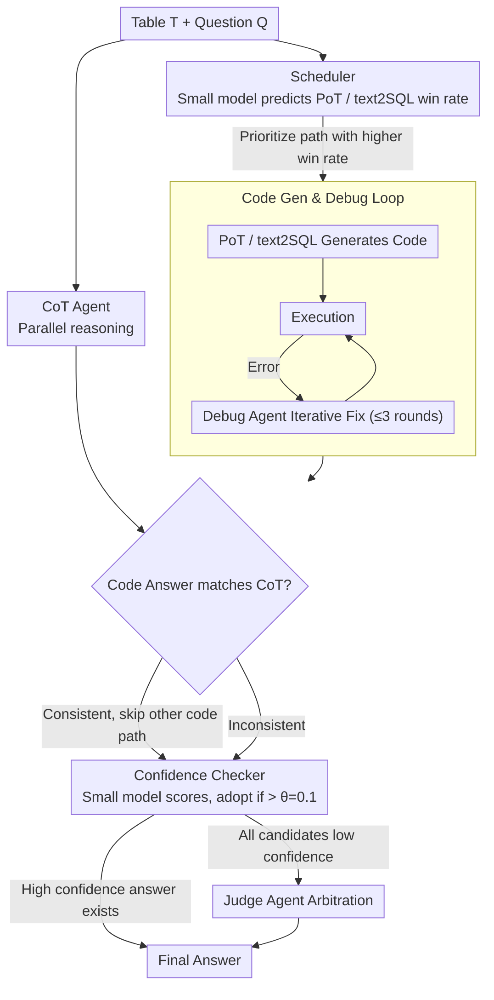

# MATA: Multi-Agent Framework for Reliable and Flexible Table Question Answering

**Conference**: ACL 2026 Findings  
**arXiv**: [2602.09642](https://arxiv.org/abs/2602.09642)  
**Code**: [GitHub](https://github.com/AIDASLab/MATA)  
**Area**: LLM Agent  
**Keywords**: Table QA, Multi-Agent Framework, Multi-Reasoning Paths, Model-Agnostic, LLM Efficiency

## TL;DR
The MATA multi-agent table QA framework is proposed. By employing a scheduler to prioritize reasoning paths (CoT/PoT/text2SQL), a confidence checker to filter answers, and a judge agent for arbitration, it achieves model-agnostic, efficient, and accurate TableQA with an average EM improvement of 40.1% across 10 LLMs.

## Background & Motivation

**Background**: LLMs have significantly advanced Table Question Answering (TableQA), enabling natural language interaction with structured tables. Existing methods typically leverage reasoning strategies such as CoT, PoT (Program-of-Thought), or text2SQL to generate answers.

**Limitations of Prior Work**: (1) Most high-performance methods depend on closed-source LLMs (e.g., GPT-4o), making them unsuitable for privacy-sensitive or cost-constrained scenarios, and their reliability on small open-source models is not fully verified; (2) To improve answer reliability, existing frameworks frequently call LLM reasoning (e.g., Self-Consistency), leading to high computational costs or even reduced accuracy due to over-prompting; (3) Most frameworks only utilize two reasoning paths (CoT + PoT), failing to exploit the diversity of the three complementary strategies: CoT, PoT, and text2SQL.

**Key Challenge**: The trade-off between reasoning diversity and reasoning efficiency—increasing reasoning paths can improve accuracy, but each path incurs LLM inference overhead. Blindly executing all paths is wasteful and may introduce noise.

**Goal**: Construct a model-agnostic TableQA framework that maintains high accuracy across various open-source and closed-source LLMs while minimizing LLM calls through intelligent scheduling.

**Key Insight**: Reasoning diversity does not require a fixed reasoning budget—a lightweight controller can determine which reasoning branches are necessary and when verification can be terminated early.

**Core Idea**: Use lightweight tool models (Scheduler, Confidence Checker, Format Matcher) to coordinate the selection of reasoning paths and answer verification for multiple LLM agents, achieving an optimal balance between reasoning diversity and efficiency.

## Method

### Overall Architecture
MATA receives a table T and a question Q, producing the final answer through a three-stage process: (1) Agent Selection: The Scheduler determines the execution priority of PoT and text2SQL, while the CoT Agent executes in parallel; (2) Code Generation and Debugging: PoT/text2SQL Agents generate code, which is iteratively fixed by the Debugging Agent; (3) Final Answer Decision: The Confidence Checker evaluates candidate answer confidence, calling the Judge Agent for arbitration if necessary. The pipeline follows the sequence of "Schedule first, Generate & Debug second, Verify last." The following three key designs correspond to these three stages.

### Key Designs

**1. Scheduler: Using a 24.65M small model to prioritize reasoning paths and avoid redundant branch execution**

CoT, PoT, and text2SQL paths have individual strengths, but executing each requires an LLM call, which is computationally expensive and potentially noisy. The Scheduler assigns the task of "who to deploy" to a lightweight classifier: a MobileBERT with two MLP layers (only 24.65M parameters). It inputs table meta-features (size, schema, data types) and question semantics to output the success probabilities for PoT and text2SQL. The system allows the CoT Agent to respond in parallel while prioritizing the code path with the higher probability; if its answer matches CoT, it skips the other path to save an LLM call. Training labels are derived from actual reasoning results of three LLMs on WikiTQ/TabMWP/TabFact—the Scheduler learns to prioritize the path that is more likely to succeed for a specific question type.

**2. Code Generation and Debugging Loop: Providing debuggers only for code paths**

PoT/text2SQL generate executable code, which is prone to syntax or logical errors. For these two paths, the generated code is executed first; if an error occurs, it is handed to the corresponding Debug Agent (PDA for PoT, SDA for text2SQL) for up to $N=3$ iterations. Early termination is implemented: if the new code is highly similar to the previous version and the execution result remains the same, it is deemed fixed and stopped. The CoT text path does not enter the debugging loop because iterative self-revision for text yields marginal gains and increases calls; thus, the debugging budget is reserved for code paths that can be corrected.

**3. Confidence Checker: Using a small model to assess answer stability before invoking the expensive Judge**

Handing every candidate answer to the Judge Agent for arbitration is unnecessarily costly. The Confidence Checker uses a fine-tuned DeBERTaV3-large (~435M parameters) as a gatekeeper: it inputs the table, question, and candidate answers from each path to output a confidence score for each. If the highest confidence exceeds the threshold $\theta=0.1$, that answer is adopted directly; the Judge Agent is only called for a comprehensive decision when all candidates are uncertain. This allows simple cases to be resolved instantly by the small model, with the Judge Agent intervening only in a few ambiguous cases.

### Mechanism Example: A Numerical Table Question Workflow

Assume the question is "Which penguin has the largest body mass?" with a table containing a schema and numerical columns. The Scheduler identifies this as a structured numerical query and determines that the win rate for text2SQL is higher than PoT. It prioritizes the text2SQL Agent while the CoT Agent runs in parallel. The initial SQL generated by text2SQL reports a column name error; the SDA corrects the column name and reruns it, obtaining an answer consistent with CoT. The Scheduler then skips PoT, saving an LLM call. The two consistent answers enter the Confidence Checker, and because the confidence exceeds $\theta=0.1$, the final answer is output without triggering the Judge Agent. Only two reasoning calls (text2SQL + CoT) plus one debug were used, avoiding the full execution of all paths or the expensive Judge.

### Loss & Training
The Scheduler and Confidence Checker were trained on 173,664 samples. Scheduler training labels indicate whether the PoT or text2SQL path was correct, while CC training labels indicate the correctness of all three individual paths. All LLM Agents share the same backbone model and are distinguished only by role prompts.

## Key Experimental Results

### Main Results

| Benchmark | Metric | MATA | MixSC | SynTQA | TabLaP |
|------|------|------|-------|--------|--------|
| Penguins (Avg) | EM | 0.881 | 0.626 | 0.810 | 0.524 |
| Penguins (Avg) | F1 | 0.881 | 0.637 | 0.811 | 0.544 |
| TableBench (Avg) | EM | 0.451 | 0.286 | 0.322 | 0.260 |
| TableBench (Avg) | F1 | 0.482 | 0.331 | 0.362 | 0.307 |

### Ablation Study

| Configuration | Penguins EM | TableBench EM | Description |
|------|------------|--------------|------|
| MATA (Full) | 0.881 | 0.451 | Complete framework |
| w/o Scheduler | ~0.86 | ~0.43 | Executes all paths, increased LLM calls |
| w/o CC (JA only) | ~0.85 | ~0.42 | Invokes Judge Agent every time |
| w/o Debug | ~0.82 | ~0.38 | No code debugging |

### Key Findings
- MATA shows the most significant improvements on small models (3B-7B): qwen2.5-3b improved from 0.163 EM (TabLaP) to 0.291, and mistral-7b improved from 0.036 to 0.294.
- On large models, MATA maintains an advantage, though the gap narrows as the inherent reasoning capability of larger models is stronger.
- The Scheduler effectively reduces LLM calls by approximately 30-40% while maintaining or even improving accuracy.

## Highlights & Insights
- The design of lightweight tool models (total < 1B parameters) acting as "gatekeepers" for LLM Agents is highly practical, avoiding unnecessary expensive inference calls.
- The complementarity of the three reasoning paths is fully verified: CoT excels in fuzzy/intuitive questions, PoT in numerical calculations, and text2SQL in precise structured queries.
- The model-agnostic design allows the framework to be directly migrated to any new LLM, which is valuable given the rapid iteration of open-source models.

## Limitations & Future Work
- The training of the Scheduler and CC relies on specific datasets (WikiTQ/TabMWP/TabFact), which may limit generalization to tables with significant domain differences.
- Currently, only single-table reasoning is supported; multi-table join question answering has not yet been addressed.
- The maximum number of Debug iterations $N=3$ is an empirical value; tasks of varying complexity may require adaptive adjustment.

## Related Work & Insights
- **vs MixSC**: MixSC only integrates CoT and Python paths using self-consistency voting, lacking text2SQL and intelligent scheduling. MATA's average EM is 25.5% higher.
- **vs SynTQA**: SynTQA integrates text2SQL and E2E TQA but lacks model-switching support. MATA's model-agnostic design offers a huge advantage for small models.
- **vs TabLaP**: TabLaP relies on multiple different LLMs and only supports specific models. MATA achieves better results using a single backbone.

## Rating
- Novelty: ⭐⭐⭐⭐ The architecture of lightweight tools + multi-agent coordination is novel and practical.
- Experimental Thoroughness: ⭐⭐⭐⭐⭐ Extremely broad coverage with 10 LLMs, two benchmarks, and three metrics.
- Writing Quality: ⭐⭐⭐⭐ Clear structure with detailed algorithmic descriptions.
- Value: ⭐⭐⭐⭐ The model-agnostic framework provides direct reference value for industrial deployment.

<!-- RELATED:START -->

## Related Papers

- [\[AAAI 2026\] Hierarchical Pedagogical Oversight: A Multi-Agent Adversarial Framework for Reliable AI Tutoring](../../AAAI2026/multi_agent/hierarchical_pedagogical_oversight_a_multi-agent_adversarial_framework_for_relia.md)
- [\[ACL 2026\] EvoSci: A Bio-Inspired Multi-Agent Framework for the Evolution of Scientific Discovery](evosci_a_bio-inspired_multi-agent_framework_for_the_evolution_of_scientific_disc.md)
- [\[ACL 2026\] From Query to Counsel: Structured Reasoning with a Multi-Agent Framework and Dataset for Legal Consultation](from_query_to_counsel_structured_reasoning_with_a_multi-agent_framework_and_data.md)
- [\[ICML 2025\] Is Your LLM-Based Multi-Agent a Reliable Real-World Planner? Exploring Fraud Detection in Travel Planning](../../ICML2025/multi_agent/is_your_llm-based_multi-agent_a_reliable_real-world_planner_exploring_fraud_dete.md)
- [\[ACL 2026\] A Multi-Agent Framework for Feature-Constrained Difficulty Control in Reading Comprehension Item Generation](a_multi-agent_framework_for_feature-constrained_difficulty_control_in_reading_co.md)

<!-- RELATED:END -->
