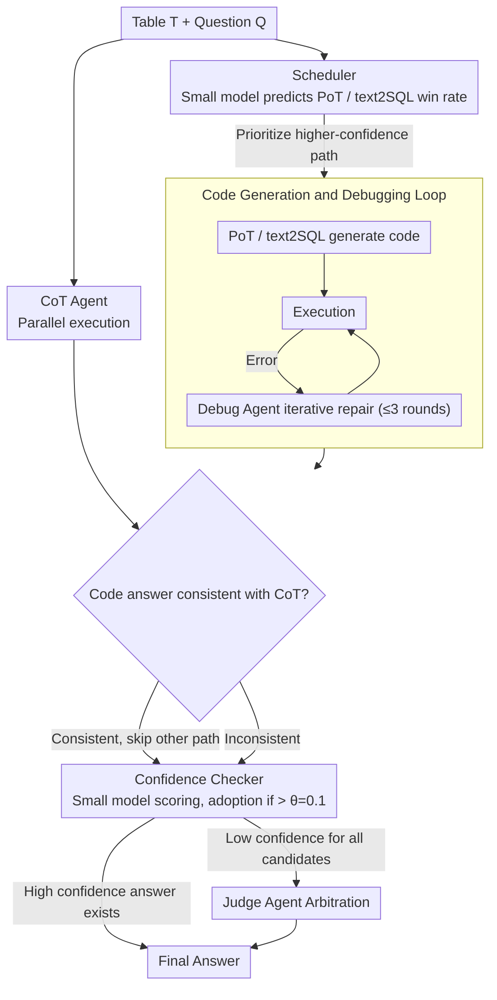

# MATA: Multi-Agent Framework for Reliable and Flexible Table Question Answering

**Conference**: ACL 2026 Findings  
**arXiv**: [2602.09642](https://arxiv.org/abs/2602.09642)  
**Code**: [GitHub](https://github.com/AIDASLab/MATA)  
**Area**: LLM Agent  
**Keywords**: Table Question Answering, Multi-Agent Framework, Multi-Reasoning Paths, Model-Agnostic, LLM Efficiency

## TL;DR
The authors propose MATA, a multi-agent framework for TableQA that uses a scheduler to prioritize reasoning paths (CoT/PoT/text2SQL), a confidence checker to filter answers, and a judge agent for arbitration. This model-agnostic, efficient framework achieves an average EM improvement of 40.1% across 10 LLMs.

## Background & Motivation

**Background**: LLMs have significantly advanced Table Question Answering (TableQA), enabling interaction between natural language and structured tables. Existing methods typically leverage reasoning strategies such as CoT, PoT (Program-of-Thought), or text2SQL to generate answers.

**Limitations of Prior Work**: (1) Most high-performance methods rely on closed-source LLMs (e.g., GPT-4o), making them unsuitable for privacy-sensitive or cost-constrained scenarios, and their reliability on small open-source models is not fully verified; (2) To improve reliability, existing frameworks frequently call LLM reasoning (e.g., Self-Consistency), leading to high computational costs or even reduced accuracy due to over-prompting; (3) Most frameworks utilize only CoT+PoT, failing to exploit the complementarity of CoT, PoT, and text2SQL.

**Key Challenge**: The trade-off between reasoning diversity and efficiency—increasing reasoning paths can improve accuracy, but each path incurs LLM overhead. Executing all paths blindly is wasteful and may introduce noise.

**Goal**: To build a model-agnostic TableQA framework that maintains high accuracy across various open/closed-source LLMs while minimizing LLM calls through intelligent scheduling.

**Key Insight**: Reasoning diversity does not require a fixed reasoning budget—lightweight controllers can decide which reasoning branches are necessary and when verification can be terminated early.

**Core Idea**: Utilizing lightweight tool models (Scheduler, Confidence Checker, Format Matcher) to coordinate the reasoning path selection and answer verification of multiple LLM agents, achieving an optimal balance between diversity and efficiency.

## Method

### Overall Architecture
MATA takes a table T and a question Q, producing a final answer through a three-stage process: (1) Agent Selection: The Scheduler determines the priority of PoT and text2SQL while the CoT Agent executes in parallel; (2) Code Generation and Debugging: The PoT/text2SQL Agents generate code, which is iteratively fixed by a Debugging Agent; (3) Final Answer Decision: The Confidence Checker evaluates the confidence of candidate answers, invoking a Judge Agent for arbitration only if necessary. The pipeline follows the sequence of "scheduling, then generation/debugging, and finally verification."

### Key Designs

**1. Scheduler: Using a 24.65M model to decide reasoning paths and avoid blind execution**

CoT, PoT, and text2SQL each have strengths, but each requires an LLM call. The Scheduler delegating the choice to a lightweight classifier: a MobileBERT with two MLP layers (24.65M parameters). It inputs table meta-features (size, schema, data types) and question semantics to output win probabilities for PoT and text2SQL. The system executes the higher-probability path; if its answer matches the CoT result, the third path is skipped, saving an LLM call. Training labels are derived from real inference results on WikiTQ/TabMWP/TabFact.

**2. Code Generation and Debugging: Allocating debugging budgets only to code paths**

PoT and text2SQL generate executable code, which is prone to syntax or logic errors. For these paths, code is executed first; errors trigger a Debugging Agent (PDA for PoT, SDA for text2SQL) for up to $N=3$ iterations. Early termination is applied if the new code is highly similar to the previous version with the same result. The CoT path does not enter the debugging loop, as iterative text revision yields diminishing returns.

**3. Confidence Checker: Using a small model to determine if a Judge Agent is necessary**

Consulting a Judge Agent for every candidate is expensive. The Confidence Checker uses a fine-tuned DeBERTaV3-large (~435M parameters) as a gatekeeper. It inputs the table, question, and candidate answers to output confidence scores. If the highest score exceeds the threshold $\theta=0.1$, the answer is adopted directly. The Judge Agent is only invoked for complex cases where all candidates lack confidence.

### Mechanism: Numerical Table Question Walkthrough

Consider the question "Which penguin has the highest body mass?" with a table containing a schema and numerical columns. The Scheduler identifies this as a structured numerical query and assigns a higher probability to text2SQL. The text2SQL Agent executes while the CoT Agent runs in parallel. The initial SQL fails due to a column name error; the SDA corrects it, and the resulting answer matches the CoT answer. The Scheduler then skips PoT. These consistent answers enter the Confidence Checker, exceed $\theta=0.1$, and the result is output without triggering the Judge Agent. This utilizes only two reasoning calls plus one debug step.

### Loss & Training
The Scheduler and Confidence Checker were trained on 173,664 samples. Scheduler labels indicate if PoT or text2SQL paths were correct, while CC labels track the correctness of all three paths. All LLM Agents share the same backbone model, distinguished only by role prompts.

## Key Experimental Results

### Main Results

| Benchmark | Metric | MATA | MixSC | SynTQA | TabLaP |
|------|------|------|-------|--------|--------|
| Penguins (Avg) | EM | 0.881 | 0.626 | 0.810 | 0.524 |
| Penguins (Avg) | F1 | 0.881 | 0.637 | 0.811 | 0.544 |
| TableBench (Avg) | EM | 0.451 | 0.286 | 0.322 | 0.260 |
| TableBench (Avg) | F1 | 0.482 | 0.331 | 0.362 | 0.307 |

### Ablation Study

| Configuration | Penguins EM | TableBench EM | Description |
|------|------------|--------------|------|
| MATA (Full) | 0.881 | 0.451 | Full framework |
| w/o Scheduler | ~0.86 | ~0.43 | Executes all paths, increased calls |
| w/o CC (JA only) | ~0.85 | ~0.42 | Always invokes Judge Agent |
| w/o Debug | ~0.82 | ~0.38 | No code debugging |

### Key Findings
- MATA achieves the most significant gains on small models (3B-7B): Qwen2.5-3b improved from 0.163 EM (TabLaP) to 0.291; Mistral-7b improved from 0.036 to 0.294.
- On large models, MATA maintains an advantage but the gap narrows as inherent reasoning capability increases.
- The Scheduler effectively reduces LLM calls by approximately 30-40% while maintaining or improving accuracy.

## Highlights & Insights
- The design of lightweight tool models (totaling <1B parameters) acting as gatekeepers for LLM Agents is practical for reducing expensive reasoning calls.
- The complementarity of the three paths is verified: CoT for intuitive questions, PoT for calculations, and text2SQL for precise structured queries.
- The model-agnostic design allows the framework to transition to any new LLM, which is valuable in the rapidly evolving landscape of open-source models.

## Limitations & Future Work
- The training of the Scheduler and CC relies on specific datasets, potentially limiting generalization on tables with high domain variance.
- Currently, only single-table reasoning is supported; multi-table QA is not yet addressed.
- The maximum iteration $N=3$ for debugging is empirical; different task complexities may require adaptive adjustment.

## Related Work & Insights
- **vs MixSC**: MixSC only integrates CoT and Python with self-consistency voting, lacking text2SQL and intelligent scheduling; MATA averages 25.5% higher EM.
- **vs SynTQA**: SynTQA integrates text2SQL and E2E TQA but lacks model flexibility; MATA's model-agnosticism provides a huge advantage on small models.
- **vs TabLaP**: TabLaP relies on multiple distinct LLMs and specific model support, while MATA achieves superior results using a single backbone.

## Rating
- Novelty: ⭐⭐⭐⭐ Innovative architecture using lightweight tools for multi-agent coordination.
- Experimental Thoroughness: ⭐⭐⭐⭐⭐ Extensive coverage with 10 LLMs, two benchmarks, and three metrics.
- Writing Quality: ⭐⭐⭐⭐ Clear structure with detailed algorithmic descriptions.
- Value: ⭐⭐⭐⭐ Model-agnostic framework provides direct reference for industrial deployment.

<!-- RELATED:START -->

## Related Papers

- [\[AAAI 2026\] Hierarchical Pedagogical Oversight: A Multi-Agent Adversarial Framework for Reliable AI Tutoring](../../AAAI2026/multi_agent/hierarchical_pedagogical_oversight_a_multi-agent_adversarial_framework_for_relia.md)
- [\[ACL 2026\] EvoSci: A Bio-Inspired Multi-Agent Framework for the Evolution of Scientific Discovery](evosci_a_bio-inspired_multi-agent_framework_for_the_evolution_of_scientific_disc.md)
- [\[ICLR 2026\] HAMLET: A Hierarchical and Adaptive Multi-Agent Framework for Live Embodied Theatre](../../ICLR2026/multi_agent/hamlet_a_hierarchical_and_adaptive_multi-agent_framework_for_live_embodied_theat.md)
- [\[ACL 2026\] From Query to Counsel: Structured Reasoning with a Multi-Agent Framework and Dataset for Legal Consultation](from_query_to_counsel_structured_reasoning_with_a_multi-agent_framework_and_data.md)
- [\[ACL 2026\] MAGEO: From Experience to Skill — Multi-Agent Generative Engine Optimization via Reusable Strategy Learning](from_experience_to_skill_multi-agent_generative_engine_optimization_via_reusable.md)

<!-- RELATED:END -->
