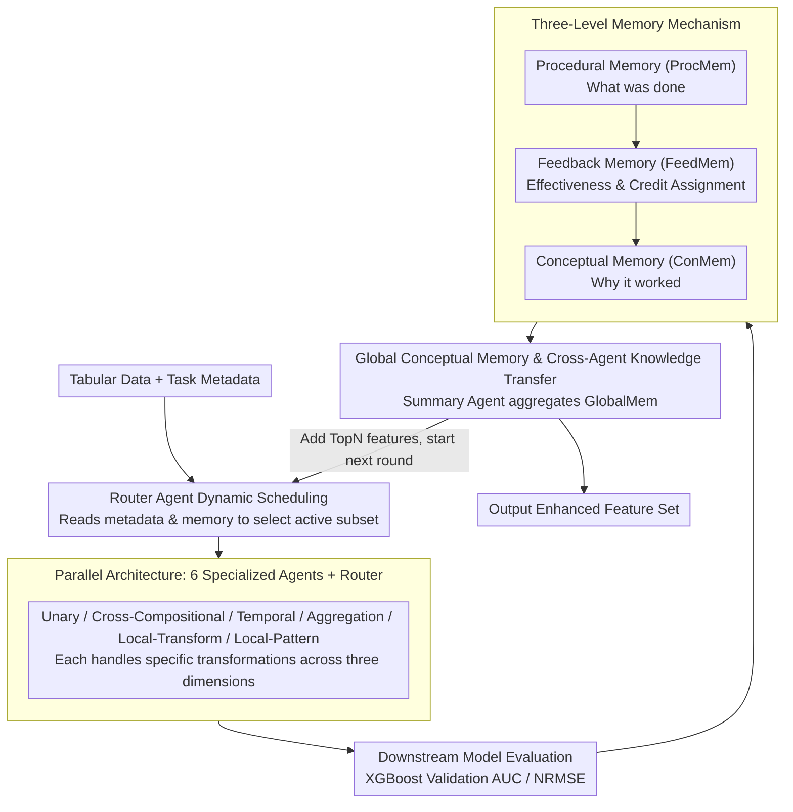

# Memory-Augmented LLM-based Multi-Agent System for Automated Feature Generation on Tabular Data

**Conference**: ACL 2026  
**arXiv**: [2604.20261](https://arxiv.org/abs/2604.20261)  
**Code**: [GitHub](https://github.com/fxdong24/MALMAS)  
**Area**: LLM/NLP  
**Keywords**: Automated Feature Engineering, Multi-Agent System, Memory-Augmented, Tabular Data, AutoML

## TL;DR
The authors propose MALMAS, a memory-augmented LLM multi-agent system for automated feature generation on tabular data. It utilizes six specialized agents to explore different feature space dimensions and a three-level memory mechanism (procedural, feedback, and conceptual) to achieve cross-iteration optimization. The system outperforms existing baselines across 16 classification and 7 regression datasets.

## Background & Motivation

**Background**: Automated feature generation is a critical component of AutoML, aiming to construct high-quality features from raw tabular data. Traditional methods (e.g., DFS, OpenFE) rely on predefined operator libraries for combinatorial search, while recent LLM-based approaches (e.g., CAAFE) introduce semantic information to guide transformations but still face limitations.

**Limitations of Prior Work**: (1) Traditional methods are restricted by fixed operator sets and cannot utilize task semantics, leading to a narrow search space. (2) Existing LLM methods rely on a single generation strategy and rigid thinking patterns, which limits feature space exploration. (3) Critically, current LLM methods lack feedback mechanisms from downstream learning objectives—the generation process is decoupled from model performance, resulting in inefficient trial-and-error exploration.

**Key Challenge**: The contradiction between the high dimensionality and diversity of the feature space and the limited exploration capacity of a single agent, coupled with the absence of a "generation -> evaluation -> optimization" closed loop.

**Goal**: To design a multi-agent collaborative and memory-driven automated feature generation framework capable of (1) extensively exploring the feature space through role specialization and (2) accumulating experience and adjusting strategies across iterations via multi-level memory.

**Key Insight**: Starting from the categorization of "golden features" in feature engineering practice, specialized agents are designed along three orthogonal dimensions (transformation complexity, data scope, and data type dependency). Furthermore, a three-level experience system is introduced: procedural memory (what was done), feedback memory (effectiveness), and conceptual memory (why it worked).

**Core Idea**: Decomposing feature generation into parallel exploration by multiple specialized agents, dynamic scheduling by a Router Agent, and iterative optimization driven by three-level memory.

## Method

### Overall Architecture
In each iteration: the Router Agent selects an active subset from the agent pool → each active agent constructs a prompt based on metadata and memory to generate features through LLM interaction → the performance of generated features is evaluated on a downstream model → the three-level memory is updated → the Summary Agent aggregates global conceptual memory → the TopN features are selected for the dataset → moving to the next round.

### Key Designs

**1. Parallel Architecture with 6 Specialized Agents + Router: Specialization across transformation categories to avoid homogenization.**

Repeated feature generation by a single LLM often leads to "feature homogenization," where ideas solidify around a few transformations. MALMAS assigns feature construction to six specialized agents: Unary, Cross-Compositional, Temporal, Aggregation-Construct, Local-Transform, and Local-Pattern. These roles cover orthogonal dimensions (complexity, scope, type), exploring complementary feature regions. Not all agents participate in every round; the Router Agent reads task metadata and accumulated memory to dynamically select an active subset, focusing compute power on directions most likely to yield results for the current dataset.

**2. Three-Level Memory Mechanism (Procedural + Feedback + Conceptual): Equipping stateless LLMs with experience chains.**

Without memory, an LLM starts from scratch every round, repeating failed transformations and failing to learn from success. MALMAS uses three levels to solidify feedback: Procedural Memory (ProcMem) records the full trace (base columns, operator, name, description, round) to avoid duplicates; Feedback Memory (FeedMem) binds features to downstream metrics for explicit credit assignment; Conceptual Memory (ConMem) distills reusable heuristic rules. These represent short-term error avoidance, mid-term orientation, and long-term strategy adaptation.

**3. Global Conceptual Memory and Cross-Agent Knowledge Transfer: Broadcasting effective patterns to the entire team.**

Local memory serves only individual agents; experience learned by Agent A is unavailable to Agent B, leading to redundant exploration. After each round, the Summary Agent aggregates conceptual and feedback memories into a `GlobalMem`. This global record informs the Router's scheduling and each agent's prompt construction in the next round, enabling effective patterns found by one agent to propagate and be reused across the system.

### A Complete Example: Iteration on the Titanic Dataset

Consider the Titanic dataset. At the start of a round, the Router detects task metadata (Age, Fare, Pclass, Sex, etc.) and existing memory. Determining that temporal features are irrelevant, it activates only the Unary, Cross-Compositional, and Aggregation agents. The Unary Agent applies a log transform to `Fare`, the Cross-Compositional Agent combines `Pclass` and `Sex`, and the Aggregation Agent calculates average fares per class. After evaluation via XGBoost, FeedMem records that "Pclass×Sex provided the largest gain." The Summary Agent notes "interactions between class and sex are effective" in the `GlobalMem`. In the next round, the Router emphasizes the cross-compositional direction, while ProcMem ensures `log(Fare)` is not recalculated. After several iterations, the AUC on Titanic reaches 0.872, surpassing the next best method (0.849).

### Loss & Training
The objective is to maximize the performance metrics of the downstream model on the validation set (AUC for classification, NRMSE for regression). XGBoost is used as the downstream model, and the TopN features are retained after each round via a selection process.

## Key Experimental Results

### Main Results (Classification AUC, Average Rank across 16 Datasets)

| Method | Type | Mean Rank |
|------|------|-----------|
| DFS | Traditional | 3.69 |
| OpenFE | Traditional | 3.12 |
| CAAFE | LLM | 3.57 |
| OCTree | LLM | 4.81 |
| LLMFE | LLM | 3.75 |
| **MALMAS** | **Multi-Agent+Memory** | **1.12** |

### Ablation Study (Contribution of Key Components)

| Configuration | Description |
|------|------|
| Single Agent (No Router) | Feature diversity drops; high homogenization |
| No Memory | Independent generation each round; massive redundant exploration |
| No Global Memory | No knowledge transfer between agents; increased redundant features |
| No Feedback Memory | Inability to learn which transformations are effective from history |
| **MALMAS (Full)** | Optimal performance, Mean Rank 1.12 |

### Key Findings
- **MALMAS achieves an average rank of 1.12 across 16 classification datasets**, significantly exceeding the runner-up OpenFE (3.12).
- **Stronger advantages on difficult datasets**: e.g., Titanic (0.872 vs 0.849 next best) and Credit_G (0.775 vs 0.758 next best).
- **Memory mechanism is critical**: Conceptual memory abstracts "why a transformation works" into reusable rules to guide subsequent exploration.
- **Dynamic scheduling via the Router Agent** avoids the overhead of activating all agents for every dataset.

## Highlights & Insights
- The **hierarchical memory design** is highly instructive: mapping operation traces to credit assignment to strategy abstraction mirrors procedural memory → working memory → metacognition in cognitive psychology. This is transferable to any multi-agent system requiring iterative optimization.
- **Dynamic scheduling by the Router Agent** solves the computational waste of "running every agent every time," achieving task-dependent resource allocation.
- **Designing Agent roles based on "Golden Feature" categories** is a best practice—encoding domain knowledge into the structural division of labor.

## Limitations & Future Work
- Agent roles are manually designed; can optimal roles be discovered automatically?
- The memory management lacks a forgetting mechanism, potentially leading to context bloat over many rounds.
- The downstream model is fixed to XGBoost; effectiveness on deep learning models remains unverified.
- End-to-end comparisons with full AutoML frameworks (e.g., Auto-sklearn) are missing.
- Competitive/debate mechanisms between agents could be explored to further enhance feature quality.

## Related Work & Insights
- **vs CAAFE**: CAAFE uses a single LLM, limited by a single generation strategy. MALMAS expands the exploration space through multi-agent specialization and memory feedback.
- **vs OpenFE**: OpenFE uses tree-based operator searches, which are efficient but limited to predefined operators. MALMAS leverages LLM semantic understanding for more diverse transformations.
- **vs Generative Agents**: While the latter uses multi-agent memory for social simulation, MALMAS applies this paradigm to feature engineering, representing a new application direction.

## Rating
- Novelty: ⭐⭐⭐⭐ The combination of multi-agent and three-level memory for feature generation is novel, though individual components are established.
- Experimental Thoroughness: ⭐⭐⭐⭐ Broad coverage with 23 datasets, though ablation details could be more granular.
- Writing Quality: ⭐⭐⭐⭐ Framework diagrams are clear, though some notation is slightly redundant.
- Value: ⭐⭐⭐⭐ Significant contribution to the AutoML community; the memory design strategy has broad transferability.

<!-- RELATED:START -->

## Related Papers

- [\[ACL 2026\] Efficient Multi-Agent System Training with Data Influence-Oriented Tree Search](efficient_multi-agent_system_training_with_data_influence-oriented_tree_search.md)
- [\[ACL 2025\] DocAgent: A Multi-Agent System for Automated Code Documentation Generation](../../ACL2025/multi_agent/docagent_a_multi-agent_system_for_automated_code_documentation_generation.md)
- [\[ACL 2026\] A Multi-Agent Framework for Feature-Constrained Difficulty Control in Reading Comprehension Item Generation](a_multi-agent_framework_for_feature-constrained_difficulty_control_in_reading_co.md)
- [\[ACL 2026\] ODUTQA-MDC: A Task for Open-Domain Underspecified Tabular QA with Multi-turn Dialogue-based Clarification](odutqa-mdc_a_task_for_open-domain_underspecified_tabular_qa_with_multi-turn_dial.md)
- [\[AAAI 2026\] AgentODRL: A Large Language Model-based Multi-agent System for ODRL Generation](../../AAAI2026/multi_agent/agentodrl_a_large_language_model-based_multi-agent_system_fo.md)

<!-- RELATED:END -->
