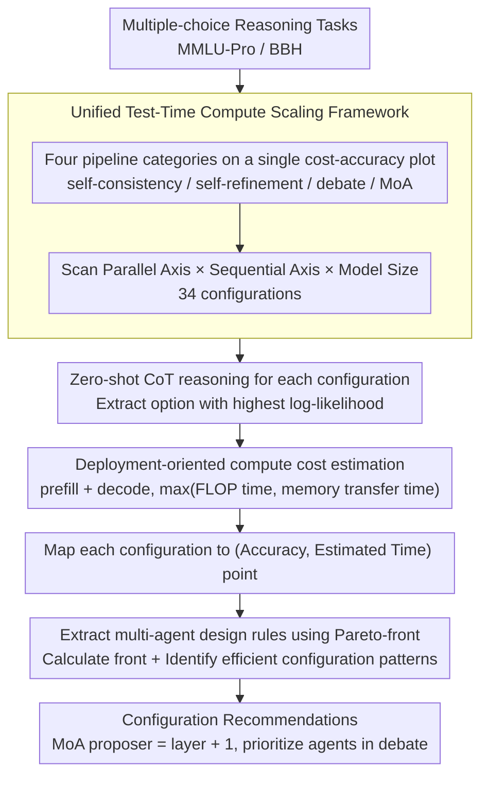

# Multi-Agent Reasoning Improves Compute Efficiency: Pareto-Optimal Test-Time Scaling

**Conference**: ACL 2026  
**arXiv**: [2605.01566](https://arxiv.org/abs/2605.01566)  
**Code**: https://github.com/Multi-Agent-LLMs/lm-evaluation-harness  
**Area**: LLM Reasoning  
**Keywords**: Test-time computation, Multi-agent reasoning, Pareto front, Mixture-of-Agents, Compute efficiency

## TL;DR

This paper compares self-consistency, self-refinement, multi-agent debate, and Mixture-of-Agents under a unified computational budget. It finds that multi-agent reasoning, particularly MoA, is more efficient on the Pareto front, improving MMLU-Pro accuracy from 64.3% to 71.4% at approximately 20x CoT budget.

## Background & Motivation

**Background**: Improvements in LLM reasoning capabilities no longer rely solely on training larger models; test-time computation has become a crucial tool. Common practices include chain-of-thought (CoT), self-consistency, multi-round self-refinement, multi-agent debate, and Mixture-of-Agents (MoA), which aggregates multiple candidate answers layer by layer. These methods share the commonality of spending more computation during the inference phase to obtain more stable or powerful answers.

**Limitations of Prior Work**: Many studies only report final accuracy without comparing different methods under the same computational budget. If a method calls a model dozens of times, it is naturally stronger than a single CoT, but this does not imply higher efficiency. Real-world deployment is more concerned with which pipeline yields higher accuracy given the same latency, compute power, and budget.

**Key Challenge**: Test-time computation involves a clear accuracy-cost trade-off. Parallel sampling increases candidate paths, while sequential refinement or debate rounds deepen reasoning, but both increase FLOPs, memory R/W, and inference latency. The core question is not "whether spending more compute is useful," but "whether compute should be spent on more samples, more agents, more interaction rounds, or larger models."

**Goal**: Systematically evaluate four categories of reasoning scaling strategies under the same computational metric to answer three practical questions: whether multi-agent is truly more compute-efficient than single-agent; how to configure parallel scale versus sequential depth in multi-agent systems; and whether extensive test-time scaling for small models is more cost-effective than few calls to large models.

**Key Insight**: The authors do not only track FLOPs but use estimated runtime, considering both arithmetic computation and model weight memory transfer, as the cost. They then use the Pareto front to identify configurations that achieve the "highest accuracy at a given cost." This avoids biases introduced by comparing based on generation counts or FLOPs alone.

**Core Idea**: Treat the test-time reasoning pipeline as a tunable compute allocation problem, compare methods using Pareto-optimal fronts, and summarize practical scaling rules for multi-agent reasoning from the frontal configurations.

## Method

### Overall Architecture

The experimental framework consists of a three-layer scan. The first layer is pipeline selection: comparing self-consistency, self-refinement, debate, and MoA. The second layer involves pipeline parameters: varying the number of samples for self-consistency, iteration rounds for self-refinement, number of agents and rounds for debate, and the number of proposers and aggregation layers for MoA. The third layer is model size: using Llama 3.1 70B and 8B from the same family to distinguish between "model capacity" and "test-time compute scaling."

All methods solve multiple-choice reasoning tasks in a zero-shot CoT style. The model is prompted as a reasoning expert, thinking step-by-step and outputting the final option at the end. After each pipeline, the authors use a "Final answer of choices {choices}:" prompt to extract candidate options and select the one with the highest log-likelihood as the final answer.

Two metrics are evaluated: accuracy and computational cost. Accuracy is the proportion of correct answers on MMLU-Pro and BBH. Computational cost is an estimated theoretical runtime rather than a simple call count. Generation is split into prefill and decode phases, estimating FLOP time and memory transfer time for each; the slower of the two is taken for each phase and summed for the total time. This accounts for the fact that real GPU inference is often memory-bandwidth bound, where FLOPs alone would overestimate the efficiency of small model calls.

The final analysis identifies the Pareto front relative to accuracy and cost. If a configuration achieves higher or equal accuracy at a lower or equal cost, the dominated configuration is not considered an efficient choice.

### Key Designs

**1. Unified Test-Time Compute Scaling Framework: Placing four architecturally distinct reasoning methods on the same cost-accuracy plot to compete under identical budgets.**

Historically, comparisons often blurred the line between "better method" and "simply more compute." A pipeline calling a model dozens of times will likely beat a single CoT, but it might be less efficient. The authors decompose all scaling into parallel and sequential axes: self-consistency adds parallel CoT samples, self-refinement adds sequential correction steps, debate involves both agents and rounds, and MoA involves both proposers and layers. After mapping to a unified coordinate system, multi-agent methods must compete directly with self-consistency, making conclusions relevant to real deployment.

**2. Deployment-Oriented Compute Cost Estimation: Measuring budget with a metric closer to real latency than FLOPs, avoiding the overestimation of "small model intensive calling" efficiency.**

Relying solely on FLOPs is misleading: while small models have lower arithmetic counts, real inference requires repeated weight movement, often limited by memory bandwidth. The authors split generation into prefill and decode phases. Computation time is determined by FLOPs ($2 \cdot P \cdot T$), while memory transfer time is determined by parameter count, quantization precision, batch size, number of GPUs, and bandwidth. By taking $\max(\text{FLOP time}, \text{memory time})$ for each phase, the trade-off between "many rounds with small models" and "few rounds with large models" is compared fairly.

**3. Pareto-Front for Multi-Agent Design Rules: Extracting truly efficient parameter combinations from hundreds of evaluations rather than focusing on single peak scores.**

The parameter space for multi-agent systems is vast; blindly adding agents or rounds can waste budget or decrease scores due to noise and error propagation. The authors calculate the Pareto front across 34 configurations—where a configuration is efficient only if no other achieves better or equal accuracy at lower cost. Clear patterns emerge: efficient debate points come from increasing agents rather than rounds; efficient MoA points almost always satisfy "proposers = layers + 1" (e.g., 3 models/2 layers, 4 models/3 layers). These data-driven rules become actionable configuration advice.

### Loss & Training

This work does not train new models or introduce extra loss functions; it is a pure test-time reasoning strategy evaluation. The main experiments utilize 4-bit quantized Llama 3.1 70B-Instruct, with supplementary experiments on the 8B model. Generation uses temperature 0.7 and top-p 0.95. To control costs, 1000 problems are sampled from MMLU-Pro and BBH for evaluation, with confidence intervals reported in the limitations.

## Key Experimental Results

### Main Results

Primary results focus on MMLU-Pro. CoT is a special case of self-consistency with 1 sample, yielding 64.3% accuracy. Within a budget of up to ~20x CoT, MoA dominates the Pareto front, followed by debate. Self-consistency saturates earlier, while self-refinement performs worse than CoT.

| Method / Config | MMLU-Pro Accuracy | Gain vs CoT | Comparison vs SC (same budget) | Key Conclusion |
|-----------------|-------------------|-------------|--------------------------------|----------------|
| CoT / SC 1 sequence | 64.3% | - | - | Baseline single inference |
| Self-consistency / 10 sequences | 68.7% | +4.4 pp | 0 | Parallel sampling works but saturates |
| Debate / 4 agents, 2 rounds | 70.0% | +5.7 pp | +1.3 pp | Multi-agent interaction more efficient than pure sampling |
| MoA / 5 models, 4 layers | 71.4% | +7.1 pp | +2.7 pp | Highest accuracy; dominates Pareto front |
| Self-refinement / multi-round | < 64.3% | Negative | Lower than others | Sequential self-correction yields no reliable gain |

Task difficulty analysis shows that extra test-time compute is more valuable for difficult problems. MMLU-Pro tasks were divided into easy, medium, and hard based on a 20-sample CoT solve rate.

| Compute Budget | Easy Acc | Medium Acc | Hard Acc | Observation |
|----------------|----------|------------|----------|-------------|
| CoT | 94.4% | 53.0% | 8.4% | CoT solves most easy problems |
| 1-5× CoT | 95.6% | 58.6% | 13.6% | Significant gains for medium/hard |
| 5-10× CoT | 95.4% | 60.4% | 14.7% | Continued budget helps non-easy tasks |
| 10-15× CoT | 96.0% | 62.1% | 14.2% | Hard fluctuates but stays above CoT |
| 15-20× CoT | 96.6% | 61.5% | 17.4% | Hard tasks see highest relative gain |
| Total Gain | +2.2 pp | +8.5 pp | +9.0 pp | Allocate budget adaptively by difficulty |

### Ablation Study

Rather than module ablation, this study scans parameters to analyze scaling directions. The most important conclusion is: debate should scale agents, and MoA efficient points typically satisfy "proposers = layers + 1".

| System | Parameter Change | Recommended Trend | Explanation |
|--------|------------------|-------------------|-------------|
| Debate | Increase agents | Accuracy peaks ~4 agents | More parallel views add diversity; too many add noise/cost |
| Debate | Increase rounds | 2 rounds usually best | More rounds lengthen context; errors may propagate in memory |
| MoA | Increase proposers| Best when models = layers + 1 | Sequential aggregation works better with sufficient candidates |
| MoA | Increase layers | Beneficial within ratio | Unlike debate, MoA doesn't accumulate full discussion memory, reducing sequential overhead |
| Size | 8B scaling vs 70B CoT | 70B CoT is stronger | Capacity cannot be fully replaced by low-quality model repetitions |

The authors examined model size allocation in MoA (5 models/4 layers). With 70B proposers, even an 8B aggregator maintained 69.6%. With 8B proposers, even a 70B aggregator only achieved 52.9%. MoA quality is clearly driven by the evidence generated by proposers in initial layers.

| MoA Config (5 models, 4 layers) | Aggregator 8B | Aggregator 70B | Key Insight |
|---------------------------------|---------------|----------------|-------------|
| Proposers 8B | 51.2% | 52.9% | Weak proposers provide low-quality evidence; aggregator cannot fix |
| Proposers 70B | 69.6% | 71.4% | Strong proposers are the primary source of quality |

### Key Findings

- MoA is the most robust Pareto-optimal method: improving MMLU-Pro from 64.3% to 71.4%, outperforming self-consistency by 2.7 pp at the same budget.
- Debate gains come primarily from parallel agents rather than more rounds; excessive rounds increase context costs and risk amplifying errors.
- Self-refinement performed poorly, proving "repeated self-modification" is not equivalent to stronger reasoning, especially without external feedback in multiple-choice tasks.
- Test-time compute is most worthwhile for hard and medium tasks; easy tasks saw only a 2.2 pp improvement, suggesting systems should use adaptive difficulty routing.
- Extreme scaling of small models does not beat large model CoT: at the same budget as 70B CoT, the best 8B configuration was still ~13 pp lower.
- Proposers are more critical than aggregators in MoA, as they generate the candidate evidence in the early layers.

## Highlights & Insights

- **Shifting from "Accuracy Race" to "Efficiency Race"**: The value lies not in inventing a new pipeline but in re-calibrating existing test-time scaling methods using the Pareto front, which is vital for real-world deployments where budgets are finite.
- **Practical MoA Heuristics**: The rule "proposers = layers + 1" is a memorable heuristic. The intuition is to provide the aggregator with sufficient candidate diversity before gradual synthesis through finite layers.
- **Critical Memory Transfer Costs**: Many papers estimate cost via FLOPs, but LLM inference is often memory-bandwidth bound. Incorporating weight movement costs provides a more sober judgment on the cost-effectiveness of small models.
- **Task Difficulty Routing is the Next Step**: Given the diminishing returns on easy tasks, combining these findings with adaptive routing (e.g., CoT for easy, MoA for hard) is a natural progression for efficient systems.
- **Informative Negative Results**: The failure of self-refinement across multiple configurations suggests that sequential reasoning without reliable feedback likely increases redundancy rather than quality.

## Limitations & Future Work

- **Limited Sample Size**: Due to the high cost of multi-agent evaluation, the main experiment sampled 1000 tasks. The 95% binomial confidence interval is approximately 0.028-0.03, meaning small differences between adjacent configurations should be interpreted carefully.
- **Theoretical Cost Estimation**: The runtime model covers FLOPs and memory transfer but excludes framework overhead, batching dynamics, KV cache management, communication latency, and server queuing.
- **Narrow Model Range**: Experiments primarily used 4-bit quantized Llama 3.1 70B/8B. Whether findings generalize to closed-source models, MoE architectures, or specialized reasoning models remains to be verified.
- **Task Type Concentration**: MMLU-Pro and BBH are broad but differ from open-ended generation, coding, tool use, or interactive agent tasks, where optimal parallel/sequential ratios might vary.
- **Homogeneous Model Setting**: For variable control, most MoA configurations used the same model for both proposers and aggregators. Real-world optimal cross-model budget allocation is still an open question.

## Related Work & Insights

- **vs Self-Consistency**: SC improves stability via independent paths; this paper finds it effective but prone to early saturation. MoA and debate are stronger for the same budget, showing "interaction/aggregation" is more valuable than "pure majority voting."
- **vs Self-Refine**: Self-refinement performed worse than CoT here, echoing findings that LLMs cannot reliably self-correct without external signals or verifiers.
- **vs Multi-Agent Debate**: Debate is more efficient than SC, but gains from rounds are unstable. Recommendation: prioritize agent count and limit rounds.
- **vs Mixture-of-Agents**: MoA dominates the Pareto front. Unlike debate, it does not require maintaining a full discussion history, reducing the cumulative "cost side-effects" of sequential layers.
- **vs Inference Scaling Laws**: While other work shows test-time compute can substitute for model size, this work provides structural comparisons, proving MoA's parallel-sequential balance is more cost-effective than simple best-of-n.

## Rating

- Novelty: ⭐⭐⭐⭐ Does not propose a brand-new algorithm but systematically re-evaluates reasoning strategies via Pareto optimality.
- Experimental Thoroughness: ⭐⭐⭐⭐ Covers 4 pipelines, 34 configurations, two benchmarks, and two model sizes; though sample size is limited.
- Writing Quality: ⭐⭐⭐⭐⭐ Clear problem definition, logical progression of experimental questions, and actionable practical conclusions.
- Value: ⭐⭐⭐⭐⭐ Highly relevant for test-time scaling and multi-agent deployment, offering direct guidance on choosing between SC, debate, and MoA.

<!-- RELATED:START -->

## Related Papers

- [\[CVPR 2026\] Visual Document Understanding and Reasoning: A Multi-Agent Collaboration Framework with Agent-Wise Adaptive Test-Time Scaling](../../CVPR2026/multi_agent/visual_document_understanding_and_reasoning_a_multi-agent_collaboration_framewor.md)
- [\[ACL 2026\] Scaling External Knowledge Input Beyond Context Windows of LLMs via Multi-Agent Collaboration](scaling_external_knowledge_input_beyond_context_windows_of_llms_via_multi-agent_.md)
- [\[ACL 2026\] From Query to Counsel: Structured Reasoning with a Multi-Agent Framework and Dataset for Legal Consultation](from_query_to_counsel_structured_reasoning_with_a_multi-agent_framework_and_data.md)
- [\[ACL 2026\] Debating the Unspoken: Role-Anchored Multi-Agent Reasoning for Half-Truth Detection](debating_the_unspoken_role-anchored_multi-agent_reasoning_for_half-truth_detecti.md)
- [\[ACL 2026\] When Identity Skews Debate: Anonymization for Bias-Reduced Multi-Agent Reasoning](when_identity_skews_debate_anonymization_for_bias-reduced_multi-agent_reasoning.md)

<!-- RELATED:END -->
