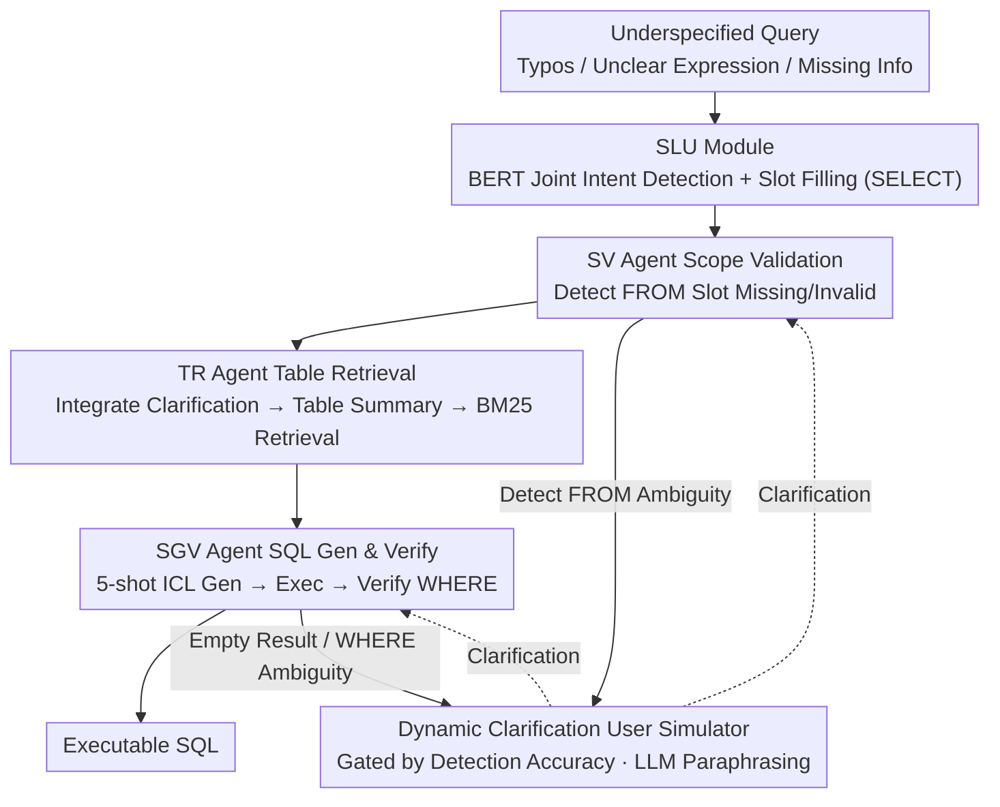

# ODUTQA-MDC: A Task for Open-Domain Underspecified Tabular QA with Multi-turn Dialogue-based Clarification

**Conference**: ACL 2026  
**arXiv**: [2604.10159](https://arxiv.org/abs/2604.10159)  
**Code**: [GitHub](https://github.com/jensenw1/ODUTQA-MDC)  
**Area**: LLM Evaluation  
**Keywords**: Tabular QA, Ambiguous Query Clarification, Multi-turn Dialogue, Multi-agent Framework, Text-to-SQL

## TL;DR
This paper proposes the ODUTQA-MDC task and benchmark, systematically investigating the detection and multi-turn dialogue clarification of user query ambiguity in open-domain scenarios for the first time. It constructs a large-scale dataset containing 25,105 QA pairs and designs the MAIC-TQA multi-agent framework to perform end-to-end "detection-clarification-reasoning" tabular QA.

## Background & Motivation

**Background**: Large Language Models (LLMs) have advanced the development of Tabular QA. Existing Text-to-SQL methods perform exceptionally well on standard datasets such as Spider. Open-domain tabular QA requires autonomous retrieval of relevant tables from large-scale databases, which further increases the difficulty.

**Limitations of Prior Work**: In real-world scenarios, user queries are often underspecified—containing spelling errors, unclear expressions, or incomplete information. For example, a user might omit a city name (missing FROM clause), use vague expressions instead of precise column names (unclear SELECT intent), or use abbreviations instead of full names (WHERE condition mismatch). These ambiguities fundamentally hinder the generation of correct SQL.

**Key Challenge**: Existing research either only detects ambiguity in closed domains (without resolving it) or uses static preset dialogues (PRACTIQ), which cannot capture the dynamic and unpredictable nature of real user interactions. There is a lack of appropriate datasets and evaluation frameworks to systematically study the complete "detect-clarify-QA" process.

**Goal**: To define the ODUTQA-MDC task and construct the first comprehensive benchmark, including a large-scale dataset, a fine-grained annotation scheme, and a dynamic clarification interface, while proposing a baseline system.

**Key Insight**: Categorize ambiguity according to the SQL structure—table scope ambiguity (FROM), query intent ambiguity (SELECT), query condition ambiguity (WHERE), and mixed types. This classification naturally corresponds to different stages of the Text-to-SQL pipeline.

**Core Idea**: Construct a "detection-clarification-redetection" closed-loop evaluation process. Achieve scalable multi-turn interaction evaluation through a dynamic user simulator, while proposing the MAIC-TQA multi-agent framework as a baseline.

## Method

### Overall Architecture
MAIC-TQA adopts a modular multi-agent architecture. The process is as follows: The SLU module extracts user intent and slot information $\rightarrow$ The Scope Validation (SV) Agent validates and clarifies table scope information $\rightarrow$ The Table Retrieval (TR) Agent integrates the original query and clarification information to determine the target table $\rightarrow$ The SQL Generation and Verification (SGV) Agent generates, executes, and verifies the SQL query. Each agent can dynamically trigger clarification dialogues with the user simulator during the process. Whether this dialogue yields effective clarification depends on whether the ambiguity was correctly identified in the previous step.

> The three types of detection (SELECT / FROM / WHERE) in the figure correspond exactly to the "Fine-grained Ambiguity Classification and Annotation System" (Design 1): the classification determines which clause each agent should check and what clarification to request from the simulator (Design 2); the backbone formed by the four agents is the MAIC-TQA framework (Design 3).

### Key Designs

**1. Fine-grained Ambiguity Classification and Annotation System: Decomposing ambiguity by SQL clauses so that "what is detected" directly informs the system "what to clarify"**

Existing datasets often label only one type of ambiguity and treat it as a generic binary label. Even if the system knows a "query is ambiguous," it does not know where the ambiguity lies or what to ask. This paper aligns ambiguity with SQL structures into three categories: intent ambiguity corresponds to SELECT and is labeled with binary classification; scope ambiguity corresponds to FROM and is labeled with a triplet $[\text{slot\_content}, \text{slot\_type}, \text{error\_type}]$, where $\text{error\_type} \in \{\text{Missing}, \text{Error}, \text{Unmatch}\}$ distinguishes between "omitted city name," "misspelled city name," and "abbreviation mismatch"; condition ambiguity corresponds to WHERE and is labeled with the triplet $[\text{slot\_content}, \text{slot\_type}, \text{"not exist"}]$. Co-occurrence of multiple types constitutes a Mixed type.

This "label as localization" design allows detection results to directly drive clarification: once the system determines a FROM slot is Missing, it knows to ask the user to supplement the city name rather than giving a vague response like "your question is unclear."

**2. Dynamic Clarification User Simulator: An automated user gated by detection accuracy to replace expensive and irreproducible human interaction**

The difficulty of multi-turn clarification evaluation lies in the "user" side—human interaction is costly, responses are inconsistent, and results are irreproducible. This paper implements the user as a callable Python interface and strictly gates it by detection accuracy: the simulator only returns corresponding clarification information when the system correctly identifies the type of ambiguity; if the detection is wrong, no hint is provided. To make responses human-like, the simulator uses an LLM to paraphrase standard templates into colloquial expressions while ensuring key information like city names and column names are not lost. It also provides a dynamic mode (diverse responses) and a fixed mode (standardized responses for reproducibility).

Gating is the key to this design: it blocks the "leakage" path where the system might guess the clarification correctly, ensuring that multi-turn scores truly reflect the system's detection capability rather than the simulator's generosity.

**3. Multi-agent Collaboration Framework (MAIC-TQA): Four agents, each managing one SQL clause, serializing "detection-clarification-reasoning" into an end-to-end loop**

Ambiguity is scattered across different SQL clauses. Forcing a single model to simultaneously detect, clarify, and generate at once is too burdensome and makes it difficult to locate errors. MAIC-TQA decomposes the task among four focused agents: the SLU module uses a BERT classifier to jointly perform intent detection and slot filling; the SV Agent (Scope Validation) checks if essential slots are missing or invalid and uses database validation functions; the TR Agent (Table Retrieval) integrates dialogue history to generate table summaries and retrieves target tables using exact matching or BM25; the SGV Agent (SQL Generation and Verification) uses 5-shot ICL to generate SQL, executes it to check result validity, and triggers condition clarification if necessary. Each agent can dynamically initiate dialogues with the user simulator during its respective phase.

This labor division allows each module to handle only one type of ambiguity corresponding to one segment of the SQL process. The detection-clarification-redetection loop is completed locally at the relevant stage rather than piling all uncertainty into the final SQL generation.

### Loss & Training
The SLU module uses BERT for joint training of intent classification and slot filling. Other agents utilize LLM in-context learning and do not require additional training. Multiple LLM backends are supported (Qwen3 32B/30B, Kimi K2, GLM 4, etc.).

## Key Experimental Results

### Main Results (Ambiguity Detection)

| Model | FROM Acc. | FROM F1 | WHERE Acc. | WHERE F1 | Mixed Acc. |
|------|-----------|---------|------------|----------|------------|
| Qwen3 32B | 77.66 | 82.82 | 69.59 | 66.02 | 54.96 |
| Qwen3 30B | 75.17 | 85.10 | 75.67 | 78.99 | 58.55 |
| Kimi K2 | 82.60 | 87.95 | 69.02 | 65.54 | 55.51 |
| SELECT (BERT) | 99.78 Acc. | 99.22 F1 | - | - | - |

### Ablation Study (MAIC-TQA vs. SLUTQA Baseline)

| Configuration | Function |
|------|------|
| SLUTQA (No Clarification) | Answers directly from underspecified queries as a no-clarification baseline |
| MAIC-TQA Fixed | Uses standardized clarification responses |
| MAIC-TQA Dynamic | Uses diverse clarification responses paraphrased by LLM |

### Key Findings
- SELECT ambiguity is the easiest to detect (BERT reaches 99%+ F1), while FROM and WHERE are more difficult, and Mixed types are the hardest (~55% accuracy).
- Multi-turn dialogue clarification significantly improves QA accuracy, verifying the value of the dynamic clarification mechanism.
- Performance in dynamic mode is slightly lower than in fixed mode, reflecting the challenges posed by natural language variation.
- All models perform poorly on Mixed types, indicating that handling multiple ambiguities simultaneously remains an open problem.

## Highlights & Insights
- The task definition is highly comprehensive: from dataset construction and annotation schemes to the evaluation framework (including the dynamic user simulator), it forms a reproducible closed-loop research paradigm.
- The design of categorizing ambiguity by SQL clauses is intuitive and practical, allowing detection results to directly guide subsequent SQL generation.
- The gating mechanism of the dynamic clarification simulator is cleverly designed—the system only obtains clarification information if it correctly detects the ambiguity, effectively avoiding "leakage" issues.

## Limitations & Future Work
- The dataset covers limited domains (Real Estate, Land Auction, Finance); generalization to other domains needs verification.
- Template-based data generation may result in a query distribution that differs from real user queries.
- Clarification is limited to a single turn, which may be insufficient for complex ambiguities.
- Performance on Mixed types is low, requiring better methods for joint handling of multiple ambiguities.
- Future directions: Expanding to more domains and languages, allowing multi-turn iterative clarification, and introducing user satisfaction evaluations.

## Related Work & Insights
- **vs. PRACTIQ**: PRACTIQ uses static preset dialogues and does not support dynamic interaction evaluation. The dynamic simulator in this paper is closer to real-world scenarios.
- **vs. AmbiQT/Ambrosia**: These works introduce ambiguity but lack a systematic clarification mechanism and QA evaluation.

## Rating
- Novelty: ⭐⭐⭐⭐ First to systematically define the complete task of open-domain underspecified tabular QA + multi-turn clarification.
- Experimental Thoroughness: ⭐⭐⭐⭐ Large dataset scale, fine-grained annotation, and comparison across multiple models.
- Writing Quality: ⭐⭐⭐⭐ Clear task definition and detailed methodology.
- Value: ⭐⭐⭐⭐ Fills a gap in datasets and evaluation frameworks for this direction, providing infrastructural value to the community.

<!-- RELATED:START -->

## Related Papers

- [\[ACL 2026\] Memory-Augmented LLM-based Multi-Agent System for Automated Feature Generation on Tabular Data](memory-augmented_llm-based_multi-agent_system_for_automated_feature_generation_o.md)
- [\[AAAI 2026\] Conversational Learning Diagnosis via Reasoning Multi-Turn Interactive Learning](../../AAAI2026/multi_agent/conversational_learning_diagnosis_via_reasoning_multi-turn_interactive_learning.md)
- [\[ACL 2026\] Diversity Collapse in Multi-Agent LLM Systems: Structural Coupling and Collective Failure in Open-Ended Idea Generation](diversity_collapse_in_multi-agent_llm_systems_structural_coupling_and_collective.md)
- [\[AAAI 2026\] KDR-Agent: A Multi-Agent LLM Framework for Multi-Domain Low-Resource In-Context NER via Knowledge Retrieval](../../AAAI2026/multi_agent/a_multi-agent_llm_framework_for_multi-domain_low-resource_in-context_ner_via_kno.md)
- [\[ICML 2026\] EngiAgent: Fully Connected Coordination of LLM Agents for Solving Open-ended Engineering Problems with Feasible Solutions](../../ICML2026/multi_agent/engiagent_fully_connected_coordination_of_llm_agents_for_solving_open-ended_engi.md)

<!-- RELATED:END -->
