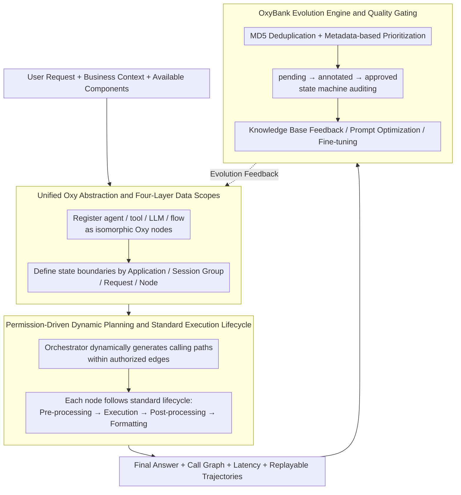

# OxyGent: Making Multi-Agent Systems Modular, Observable, and Evolvable via Oxy Abstraction

**Conference**: ACL2026  
**arXiv**: [2604.25602](https://arxiv.org/abs/2604.25602)  
**Code**: https://github.com/jd-opensource/OxyGent  
**Area**: Agent / Multi-Agent Systems  
**Keywords**: Multi-Agent Systems, Agent Framework, Observability, Dynamic Planning, Continuous Evolution

## TL;DR
OxyGent encapsulates agents, tools, LLMs, and reasoning processes into pluggable Oxy atomic components. By utilizing permission-driven dynamic planning and the OxyBank data feedback mechanism, it simplifies the construction, monitoring, and continuous evolution of industrial-grade multi-agent systems.

## Background & Motivation
**Background**: LLM agents are evolving from single chat assistants toward multi-agent systems (MAS). Typical applications include intelligent customer service, enterprise knowledge bases, office automation, file management, and complex information retrieval. Mainstream frameworks generally provide agent definitions, tool calling, messaging, workflow orchestration, and tracing capabilities, allowing developers to assemble specialized roles into a task-solving system.

**Limitations of Prior Work**: The paper points out that while many MAS frameworks perform well in research prototypes, they expose three issues in industrial deployment. First, abstraction layers are inconsistent; agents, tools, LLMs, and flows are often different types of objects, leading to high costs for reuse and hot-swapping. Second, fixed Directed Acyclic Graphs (DAGs) or hard-coded plan-and-execute workflows struggle with branches, uncertainty, and failure recovery in real environments. Third, there is a lack of a closed loop from execution trajectories to data annotation, evaluation, knowledge base updates, and model optimization after the system goes live, causing agent capabilities to stagnate at the moment of deployment.

**Key Challenge**: Multi-agent systems need to be sufficiently flexible to allow dynamic path composition at runtime based on tasks, yet sufficiently controllable to allow developers to see why each node was called, where time was spent, and how failures propagated. If only free collaboration is pursued, the system becomes a black box; if only fixed workflows are pursued, agent adaptability is sacrificed.

**Goal**: OxyGent aims to solve the engineering foundation issues for production-grade MAS rather than proposing a new reasoning model. The objective is split into three parts: reducing component combination costs via unified abstraction, improving observability through runtime visualization and lifecycle hooks, and transforming online trajectories into auditable/feedback-ready AI assets via OxyBank.

**Key Insight**: The authors observe that the complexity of MAS often stems not from the capabilities of a single agent, but from inconsistent interfaces, unclear permission boundaries, chaotic state sharing, and untraceable execution processes among different entities. Therefore, rather than continuing to stack new planners, it is better to first transform all "capability units" in the agent ecosystem into manageable atomic nodes.

**Core Idea**: A unified Oxy abstraction is used to turn agents, tools, LLMs, and flows into isomorphic nodes. Execution graphs are then generated at runtime based on permission relationships, and execution trajectories are fed back into OxyBank to form a continuous evolution loop.

## Method
The OxyGent approach can be understood as an operating system layer for MAS: it does not replace specific LLMs or restrict a fixed workflow but instead stipulates how capabilities are encapsulated, invoked, recorded, and feedback-driven. The technical mainline consists of three parts: unified Oxy abstraction, permission-driven dynamic planning, and the OxyBank evolution engine.

### Overall Architecture
The input consists of user requests, business context, and a set of available agent/tool/LLM/flow components. Developers first register these components as Oxy nodes and configure data access scopes, callable downstream nodes, and runtime permissions. Once a request is received, the orchestrator dynamically generates a calling path based on permission relationships, current state, and task requirements, rather than following a hard-coded DAG.

During execution, each Oxy node undergoes a standard lifecycle: pre-processing, input saving, core execution, post-processing, and output formatting. OxyGent injects logic for monitoring, security auditing, latency statistics, and visualization into these lifecycle joinpoints. Consequently, business code remains clean while cross-cutting concerns are managed centrally.

The output includes not only the final answer but also a complete call graph, inputs/outputs for each node, latency distribution, failure points, and replayable trajectories. These trajectories enter OxyBank, where they undergo deduplication, prioritization, annotation, auditing, and knowledge feedback to become materials for prompt optimization, knowledge base updates, or model fine-tuning.

In terms of system form, OxyGent is not merely an agent runner for single-round reasoning but a closed-loop framework covering "construction-inference-observation-annotation-evolution." Cases such as the file management assistant, GAIA task solver, and an e-commerce classification system with 2000+ agents demonstrate different instances of this framework.

### Key Designs

**1. Unified Oxy Abstraction and Four-Layer Data Scopes: Reducing agents, tools, LLMs, and flows to isomorphic atomic nodes while explicitly defining state boundaries via four scopes.**

In real MAS, errors often arise not from single agent abilities but from the high cost of swapping between four different types of objects (agent, tool, LLM, flow). Furthermore, unclear state boundaries—excessive global state leads to permission leaks, while excessive local state makes collaboration expensive. OxyGent encapsulates these units into Oxy nodes, exposing consistent interfaces and lifecycles. Data access is restricted to four scopes: *Application* (global context), *Session Group* (shared memory for related sessions), *Request* (temporary shared state for a single inference), and *Node* (local parameters). This explicitly defines data sharing boundaries, ensuring the system is reproducible and auditable.

**2. Permission-Driven Dynamic Planning and Standard Execution Lifecycle: Framing "available paths" via authorized relationships while delegating the "actual path" to runtime, ensuring every step is observable.**

Fixed DAGs are too fragile for real-world uncertainty, while fully free agent chat is difficult to audit. OxyGent requires developers to declare callable relationships and permission boundaries for each Oxy node. At runtime, the orchestrator selects the next step only within these permitted edges. Every node executes through a standard lifecycle (`_pre_process` → `_pre_save_data` → `_execute` → `_post_process` → `_format_output`), where logging, monitoring, and security checks are injected via Aspect-Oriented Programming (AOP). This balances adaptability with control while ensuring call graphs and latencies are automatically visible.

**3. OxyBank Evolution Engine and Quality Gating: Turning online trajectories into auditable AI assets that are fed back into the system only after deduplication, prioritization, and auditing.**

The primary risk of self-evolving agents is feeding low-quality or hallucinated trajectories back into the system, amplifying errors. OxyBank implements an auditable asset pipeline: it captures execution chains, deduplicates them using MD5 to avoid frequency bias, and prioritizes them based on metadata (e.g., end-to-end user interactions). Data must pass through a `pending -> annotated -> approved` state machine before entering the knowledge base or training pipeline. An AI-driven "Optimize Prompt" module then extracts experiences from verified trajectories to rewrite agent prompts, replacing manual engineering with a controllable feedback channel.

## Key Experimental Results

### Main Results
Experiments involve public benchmarks and industrial cases. The GAIA benchmark validates management of long-chain, multi-tool, and multimodal complex tasks. The e-commerce customer service classification system validates accuracy, scaling, and cost trade-offs in a large-scale agent topology.

| Scenario | Baseline / Comparison | OxyGent Results | Gain or Rank | Description |
|------|-------------|--------------|------------|------|
| GAIA overall | Single agent 36.21% | 59.14% | +22.93 percentage points | Improved complex task solving via multi-agent, dynamic planning, and memory. |
| GAIA open-source leaderboard | OWL++ 60.80% | 59.14% | 2nd among open-source methods | Result as of 2025-07-22, slightly behind OWL++. |
| E-commerce Classification | RAG + DeepSeek-R1-Distill-Qwen-32B 61.3% | 85.6% | +24.3 percentage points | Large-scale few-shot scenario with 2000+ agents and 2400+ labels. |
| Category Self-Evolution | Manual discovery | Avg. 5.4 new categories/week | Automatic discovery & validation | Shows benefit of dynamic topology and data feedback for business taxonomy. |

For GAIA, the 59.14% result was achieved through stepwise improvements from single agent to memory-enabled versions. While not surpassing every system, it demonstrates OxyGent's ability to support complex collaboration as a framework. In the e-commerce case, the hierarchical multi-agent topology handled 2400+ labels where RAG struggled, though at the cost of $2.3 \times$ the average latency of the baseline.

### Ablation Study
The GAIA ablation shows incremental gains from adding orchestration, planning, and memory to the base Oxy abstraction.

| Configuration | Avg | Level 1 | Level 2 | Level 3 | Description |
|------|-----|---------|---------|---------|------|
| Single agent | 36.21 | 61.29 | 29.56 | 10.20 | Baseline; struggles with complex and high-level problems. |
| + Multi-agent | 42.19 | 62.37 | 35.85 | 24.49 | Level 3 improves significantly, showing the need for specialized collaboration. |
| + Planning | 52.16 | 62.37 | 54.09 | 26.53 | Planning primarily improves Level 2 (task decomposition and path selection). |
| + Memory | 59.14 | 77.42 | 56.60 | 32.65 | Memory feedback improves Level 1 and overall average by reducing repetitive errors. |

### Key Findings
- **Dynamic planning** is a major structural gain in GAIA, improving the overall score from 42.19% to 52.16%. It is crucial for tasks requiring multi-step retrieval or tool calling.
- **Memory mechanism** further boosted the overall score to 59.14%, particularly in Level 1. This suggests that historical trajectories help reduce formatting biases and repetitive mistakes in simpler tasks.
- **The industrial case** demonstrates a clear trade-off: hierarchical MAS increased accuracy to 85.6% but increased latency to $2.3 \times$. This is acceptable for offline or high-precision tasks but less so for real-time scenarios.
- **Failure cases** often involve highly ambiguous queries leading to repetitive ReAct loops or hallucinations. Observability via trace replay helps diagnosis but does not automatically eliminate reasoning failures.

## Highlights & Insights
- OxyGent treats MAS as a specific "system engineering problem," focusing on unified node interfaces, data scopes, and lifecycle hooks rather than just abstract modularity.
- Permission-driven dynamic planning offers a practical compromise: it is more flexible than fixed DAGs but more controllable than open-ended agent chats, making it suitable for enterprise deployment.
- OxyBank elevates logs into AI assets. While many frameworks offer tracing, OxyGent connects tracing to annotation, auditing, and prompt optimization, creating a genuine feedback loop.
- The 2000+ agent e-commerce case shows that MAS can be used for hierarchical decision-making in large taxonomies (e.g., medical coding, financial risk attribution), not just open-ended reasoning.

## Limitations & Future Work
- The experiments lack a systematic horizontal benchmark against frameworks like LangGraph or AutoGen using the same models and tools.
- OxyBank's self-evolution still requires manual resource allocation and auditing. Full automation of the agent deployment/optimization lifecycle is not yet achieved.
- Higher latency ($2.3 \times$) is a bottleneck for real-time applications. Future work should focus on routing strategies that allow simple requests to bypass the full MAS.
- Future directions include automatic resource scheduling, standardized MAS observability benchmarks, and formal auditing of permission graphs.

## Related Work & Insights
- **vs LangGraph**: While LangGraph focuses on low-level graph orchestration and stateful runtimes, OxyGent emphasizes isomorphic node abstraction and permission-driven runtime path generation with better visualization.
- **vs CrewAI / MetaGPT**: OxyGent shifts from fixed, role-based SOPs to dynamic paths constrained by permissions, using lifecycle hooks for unified monitoring.
- **vs AutoGen**: OxyGent adds an industrial focus on data scopes, permission boundaries, and asset management (OxyBank) beyond simple asynchronous messaging.
- **vs OWL / EvoAgent**: OxyGent provides the foundational asset management layer (OxyBank) necessary for reliably turning logs into training signals for agent evolution.

## Rating
- Novelty: ⭐⭐⭐⭐ (Solid integration of system engineering principles for MAS).
- Experimental Thoroughness: ⭐⭐⭐⭐ (Strong business cases and ablation, though lacks some framework-to-framework comparisons).
- Writing Quality: ⭐⭐⭐⭐ (Clear structure and methodology).
- Value: ⭐⭐⭐⭐⭐ (Highly relevant for building production-grade agent systems).

<!-- RELATED:START -->

## Related Papers

- [\[ACL 2026\] Social Dynamics as Critical Vulnerabilities that Undermine Objective Decision-Making in LLM Collectives](social_dynamics_as_critical_vulnerabilities_that_undermine_objective_decision-ma.md)
- [\[ACL 2025\] Voting or Consensus? Decision-Making in Multi-Agent Debate](../../ACL2025/multi_agent/voting_or_consensus_decision-making_in_multi-agent_debate.md)
- [\[ACL 2026\] Seeing the Whole Elephant: A Benchmark for Failure Attribution in LLM-based Multi-Agent Systems](seeing_the_whole_elephant_a_benchmark_for_failure_attribution_in_llm-based_multi.md)
- [\[ACL 2026\] Diversity Collapse in Multi-Agent LLM Systems: Structural Coupling and Collective Failure in Open-Ended Idea Generation](diversity_collapse_in_multi-agent_llm_systems_structural_coupling_and_collective.md)
- [\[ICLR 2026\] Stochastic Self-Organization in Multi-Agent Systems](../../ICLR2026/multi_agent/stochastic_self-organization_in_multi-agent_systems.md)

<!-- RELATED:END -->
