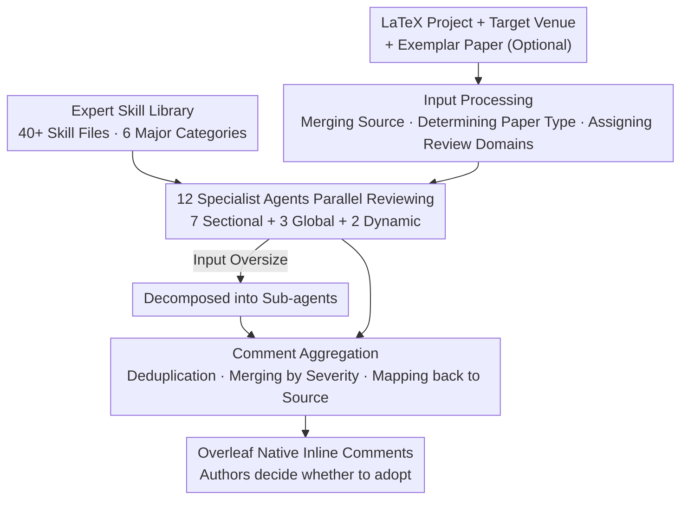

# PaperMentor: A Human-Centered Multi-Agent Writing Tutor for AI Research Papers on Overleaf

**Conference**: ACL 2026  
**arXiv**: [2606.08857](https://arxiv.org/abs/2606.08857)  
**Code**: https://github.com/jiarui-liu/overleaf （AGPL-3.0; Demo: https://overleafmentor.ai.toronto.edu/）  
**Area**: Multi-Agent / LLM Agent / Scientific Writing Assistance  
**Keywords**: Multi-Agent, Writing Tutoring, Expert Skill Library, Overleaf, Inline Comments

## TL;DR
PaperMentor codifies the writing experience of senior researchers into an "Expert Skill Library" and employs 12 agents with distinct divisions of labor to review LaTeX papers in parallel. It provides **actionable revision suggestions** via Overleaf's native inline annotations without ghostwriting for the user. In user studies, 90.6% of comments were judged as "actionable," with both validity and actionability significantly exceeding the GPT-5.2 baseline without the skill library.

## Background & Motivation
**Background**: In top-tier conferences like ACL and NeurIPS, reviewers evaluate technical contributions alongside clarity, narrative, organization, and adherence to writing conventions. However, many junior AI researchers learn scientific writing through "trial and error" rather than systematic guidance. In the absence of experienced mentors, poor presentation can obscure good ideas and directly impact acceptance.

**Limitations of Prior Work**: Current AI writing tools fail to fill this "mentor gap." Grammar assistants like Grammarly and Writefull only handle sentence-level corrections. Meanwhile, research on AI reviewer tools (which simulate peer reviews and provide overall scores) indicates they focus heavily on surface-level summaries, address few deep methodological issues, and have low correlation with human scoring. Neither system type provides **drafting-stage, text-anchored** feedback regarding narrative, organization, or technical presentation—exactly what student authors need most before submission.

**Key Challenge**: Automated review provides "judgmental" conclusions (whether a method is solid or novel, reasons for acceptance/rejection), whereas authors in the drafting phase require "revisional" guidance (why a sentence is poor and how specifically to fix it). The former does not assist someone actively revising. Simultaneously, "rewriting" assistants (where AI directly rewrites text) strip authors of their authorial agency, making the manuscript no longer their own.

**Goal**: To build a writing tutoring system usable during the drafting stage that provides **text-anchored, actionable** suggestions while leaving full control of revisions to human authors.

**Key Insight**: The authors observe two points: first, research papers are highly structured (Abstract/Introduction/Methods/Experiments...), so writing advice can naturally be decomposed across different agents by section. Second, "commenting rather than rewriting" better preserves authorial agency (citing HCI collaborative writing research). Thus, the process of "how a senior researcher reviews a manuscript" is decomposed into reusable skill modules.

**Core Idea**: Equip a set of **specialized multi-agents** with a manually curated **Expert Skill Library**, enabling them to leave inline comments on Overleaf like senior mentors, while the actual writing remains the responsibility of the author.

## Method

### Overall Architecture
PaperMentor is a plugin built on the open-source Overleaf Community Edition, following a **three-stage pipeline**: after the user uploads a LaTeX project, (optionally) specifies a target conference and an "exemplar paper," and clicks "Run Full Review," the system first performs **Input Processing** (merging projects, extracting structure, determining paper type, and assigning sections to review domains). Then, **12 specialist agents perform parallel reviews** of their respective parts. Finally, **Comment Aggregation** is conducted (deduplication, merging by severity, and mapping back to source files), injecting results into Overleaf's review panel as native annotations. Each comment contains four fields: source file, character range of highlighted text, comment body, and severity label (critical / warning / suggestion). The "fuel" for the entire pipeline is the **Expert Skill Library**, which dictates the standards each agent uses to identify issues.

### Key Designs

**1. Expert Skill Library: Codifying Senior Researchers' Writing Experience into Reusable Modules**

This is the core contribution and distinguishes the system from simply "prompting a large model." The authors curated materials from two sources: internal feedback from AI/ML/NLP professors and public writing guides from senior researchers, supplemented by 32 high-quality published exemplars and 350 real reviews from 2025 conferences (NeurIPS, ICLR, COLM). Claude Opus 4.5 was then used to restructure and standardize these materials into a unified skill markup format, which was **manually verified** to ensure consistency, correctness, clarity, and conciseness. The final library contains 40+ skill files exceeding 16,000 words of expert knowledge, organized into six top-level categories: setup, venues, paper types, sections, figures and tables, and writing style. Each category is further split into markdown files for decoupled sub-skills assigned to corresponding agents. This allows for "living resources"—the community can update conference requirements, paper types, or disciplinary norms through plain text editing.

**2. Input Processing: Identifying Paper Type + Assigning Sections to Review Domains**

To ensure reviewers provide "targeted remedies," the system must understand the paper's nature and the standards for each part. In Phase 1, the system parses and merges nested `.tex` files into a single source, extracting the abstract and all section/subsection titles. It then performs two classifications: first, **Paper Type Identification**—different types follow different conventions (e.g., dataset papers must detail collection, annotation, and evaluation; method papers must clarify motivation and formal definitions). The system uses category descriptions from the skill library to let the LLM determine the most fitting type among analysis / dataset / method / engineering / interdisciplinary / position. Second, **Review Domain Assignment**—it defines a set of section-level domains (abstract, introduction, related work, methods, results, conclusion, appendix) and maps each low-level section title to one or more domains. There are also **Global Review Domains** (writing style, math typesetting, figures/captions) not bound to specific sections.

**3. 12 Specialist Agents Parallel Reviewing + Sub-agent Decomposition**

Because the skill library is modular and papers are highly structured, review tasks are split across multiple specialized agents. PaperMentor runs 12 agents **concurrently**: 7 **Section Agents** (each responsible for one domain), 3 **Global Agents** (reviewing style, LaTeX/math, and figures), and 2 **Dynamic Agents** instantiated based on the identified paper type and target venue. Inputs for each agent are "tailor-made": relevant LaTeX source, domain-specific skill files, paper type guides, venue-specific expectations, and the user-provided exemplar. Section agents receive only the text of their assigned section (with abstract and intro as context), keeping the focus tight. Global agents receive the full merged source. If inputs exceed length thresholds, tasks are **further decomposed into smaller sub-tasks for lower-level sub-agents**.

**4. Comment Aggregation: Deduplication, Merging by Severity, and Mapping to Overleaf Native Comments**

Parallel agents inevitably produce overlapping feedback. The aggregation phase first **deduplicates** by removing comments with substantially overlapping highlight ranges and similar text. When merging two comments, the **one with higher severity is retained**, and conflicts between section and global agents are resolved by **prioritizing the section agent**. Using character ranges produced by agents, each comment is mapped to its position in the source file. The system injects AI comments through Overleaf's native ShareJS operational transformation protocol, making them **look identical to human reviewer comments** in the review panel (preventing labeling bias in user studies). The frontend is a React/TypeScript sidebar, while the backend utilizes Express.js and a review orchestration engine.

## Key Experimental Results

### Main Results
The authors conducted a **user study** to verify the utility of the skill library. The control group used the **same LLM (GPT-5.2) without the skill library**, with all other prompt components being identical. The dataset comprised 80 compilable LaTeX papers (10 internal student manuscripts + 70 sampled from ICLR 2026 submissions). 14 AI researchers (undergraduate to PhD) each annotated 4 papers, evaluating 60 comments per paper (30 from PaperMentor, 30 from baseline) in a blind mix. They judged Validity (factually correct & relevant), Actionability, and Conciseness using binary (Yes/No) metrics.

| System | Validity | Actionability | Conciseness |
|------|------|------|------|
| Ours (PaperMentor) | **0.675 ± 0.023** | **0.906 ± 0.014** | 0.900 ± 0.015 |
| Baseline (GPT-5.2 w/o Library) | 0.610 ± 0.023 | 0.865 ± 0.016 | **0.973 ± 0.008** |
| Gain (Δ) | +0.065* | +0.041* | −0.073* |

> *p<0.001 (Mann–Whitney U test), ± denotes 95% confidence interval.

PaperMentor significantly outperformed the baseline in Validity and Actionability (+6.5 and +4.1 percentage points, respectively), with 90.6% of comments judged actionable. This came at the cost of lower conciseness (−7.3 percentage points), as adhering to structured writing guides leads to longer comments.

### Key Findings
- **Skill Library drives Validity/Actionability Gains**: Since the only variable was the skill library, the +6.5/+4.1pp improvement is directly attributable to expert knowledge injection.
- **Appropriate Attention Allocation**: Approximately 40% of comments focused on Methods and Results. When normalized by section length, the system allocated relatively more attention to high-impact sections like the Abstract and Methods.
- **Stable Quality Across Sections**: Score distributions across major sections were consistent, indicating stable comment quality throughout the paper.
- **Positive Qualitative Feedback**: Annotators generally perceived the AI feedback as having a "professor-like tone," being easy to understand, useful for revisions, and providing appropriate levels of critique—especially effective for clarity, depth of analysis, and grammar.

## Highlights & Insights
- **The "Comment vs. Rewrite" positioning is disciplined and effective**: It situates the AI as a mentor rather than a ghostwriter. Text-anchored inline comments combined with preserving the author's right to revise provide specific guidance without stripping agency—a better fit for real writing needs than "overall scores" or "automated rewriting."
- **Skill Library as a Maintainable Knowledge Layer**: Abstracting senior researchers' review processes into plain-text skill files allows the system to be expanded by the community (e.g., adding sub-field expertise). This paradigm of "curated knowledge → standardized markup → human verification → agent assignment" is transferable to code review or educational tutoring.
- **Robust Engineering Implementation**: Directly utilizing Overleaf, where researchers already work, and using ShareJS OT to manifest AI comments as native reviews ensures zero workflow disruption—a critical detail for actual adoption.
- **Clean Blind Evaluation**: The identical setup between experimental and control groups ensured that the conclusion of "library utility" was not contaminated by other variables.

## Limitations & Future Work
- **LaTeX Source Dependency**: The system misses issues that require rendering (e.g., visual quality of images, cross-checking values against external data).
- **Limited Evaluation Scale**: While 80 papers and 14 annotators proved significance, they do not cover the full diversity of writing styles, venues, and researcher backgrounds.
- **Dependency Factors**: Success depends on the coverage of the skill library and the reliability of the underlying LLM; feedback should be viewed as "drafting assistance" rather than authoritative review.
- **Identified Gap**: A Validity score of 0.675 means roughly one-third of comments are still inaccurate. Furthermore, the study measured comment quality but did not measure end-to-end effects like improved acceptance rates.

## Related Work & Insights
- **vs. AI Peer Review (Liang et al. 2024, etc.)**: Those focus on review-level judgments (solidness, novelty, reason for acceptance); PaperMentor focuses on writing-level, text-anchored revision suggestions for authors.
- **vs. Grammar/Writing Assistants (Grammarly, Writefull, Prism)**: Those handle sentence-level language; PaperMentor focuses on structural and organizational feedback via venue-aware guidance.
- **vs. Multi-agent Review Decomposition (D'Arcy et al. 2024, etc.)**: PaperMentor's decomposition is anchored specifically to an expert skill library and paper structure, producing actionable annotations rather than scores.

## Rating
- Novelty: ⭐⭐⭐⭐ The combination of "Expert Skill Library + Multi-agent + Overleaf Native Comments" is novel, though individual components (multi-agents, prompt libraries) are known.
- Experimental Thoroughness: ⭐⭐⭐ The blind study was well-designed and statistically significant, but the scale was small and lacked end-to-end validation of final paper quality.
- Writing Quality: ⭐⭐⭐⭐ The three-stage pipeline and motivation were clearly articulated.
- Value: ⭐⭐⭐⭐ Open sourcing and native Overleaf integration provide strong practical value for junior researchers.

<!-- RELATED:START -->

## Related Papers

- [\[ICML 2026\] Searching for Synergy in Shared Workspace Human-AI Collaboration](../../ICML2026/multi_agent/searching_for_synergy_in_shared_workspace_human-ai_collaboration.md)
- [\[ICML 2025\] ResearchTown: Simulator of Human Research Community](../../ICML2025/multi_agent/researchtown_simulator_of_human_research_community.md)
- [\[ACL 2026\] LLM-Based Human-Agent Collaboration and Interaction Systems: A Survey](llm-based_human-agent_collaboration_and_interaction_systems_a_survey.md)
- [\[ACL 2026\] AutoReproduce: Automatic AI Experiment Reproduction with Paper Lineage](autoreproduce_automatic_ai_experiment_reproduction_with_paper_lineage.md)
- [\[ACL 2026\] RoadMapper: A Multi-Agent System for Roadmap Generation of Solving Complex Research Problems](roadmapper_a_multi-agent_system_for_roadmap_generation_of_solving_complex_resear.md)

<!-- RELATED:END -->
