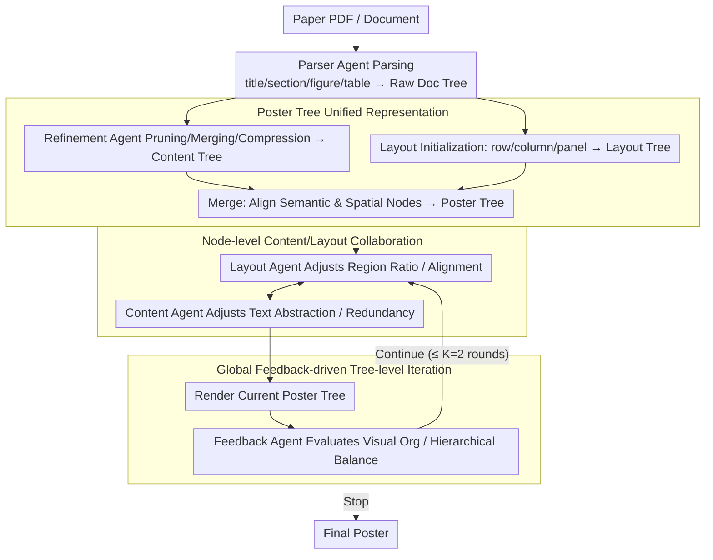

# PosterForest: Hierarchical Multi-Agent Collaboration for Scientific Poster Generation

**Conference**: ACL2026  
**arXiv**: [2508.21720](https://arxiv.org/abs/2508.21720)  
**Code**: https://github.com/kaist-cvml/poster-forest  
**Area**: Text Generation  
**Keywords**: Scientific Poster Generation, Hierarchical Document Understanding, Multi-Agent Collaboration, Layout Planning, Poster Tree

## TL;DR
PosterForest utilizes a Poster Tree, which simultaneously encodes the hierarchical semantics of a paper and the spatial layout of a poster, as an intermediate representation. It employs recursive collaborative optimization between Content, Layout, and Feedback agents to generate scientific posters in a training-free manner. In human evaluations, it achieved a 59.2% overall preference, significantly outperforming P2P and Paper2Poster.

## Background & Motivation
**Background**: Scientific papers are becoming increasingly longer and more structurally complex, making posters a vital medium for the rapid dissemination of technical content. Early automated poster generation methods relied heavily on rule-based extraction and heuristic typesetting. Recent approaches like P2P and Paper2Poster introduced LLM/MLLM multi-agent pipelines to handle parsing, summarization, layout, and rendering.

**Limitations of Prior Work**: Existing SPG methods often treat papers as linear text or fixed section-to-panel mappings, lacking hierarchical modeling of the reference relationships between sections, subsections, paragraphs, and figures/tables. Furthermore, content and layout are often optimized separately—panels are determined first, and then text and images are stuffed in—leading to issues such as tables placed in wrong sections, excessively long paragraphs, improper image scaling, or fractured logical flow.

**Key Challenge**: Scientific poster generation must compress information without destroying document logic while achieving visual balance without losing critical experimental charts. A single agent or a sequential pipeline struggles to simultaneously address the competing goals of content fidelity, layout efficiency, and visual coherence.

**Goal**: The authors aim to construct a framework that requires no additional training, preserves the hierarchical structure of the paper, and jointly optimizes content and layout, ensuring that generated posters are both informationally complete and visually organized.

**Key Insight**: The paper proposes the Poster Tree as a unified intermediate representation. Each node possesses both semantic and spatial attributes. The tree structure is inherited from the paper's hierarchy and then mapped to the poster canvas via a layout tree. This allows agents to see parent constraints, child content, and global feedback when modifying a node.

**Core Idea**: Transform scientific poster generation from "sequential summarization then typesetting" into "recursive collaborative optimization on a hierarchical semantic-spatial tree."

## Method
The core of PosterForest is first building the tree and then refining it. Instead of having the LLM output HTML or images in one go, the paper is first parsed into a Raw Doc Tree, then pruned, merged, and asset-matched into a Content Tree. A Layout Tree is initialized based on the content hierarchy, and the two are merged into a Poster Tree. Finally, multiple agents perform both local and global refinement on the tree for up to $K=2$ iterations before rendering the final poster.

### Overall Architecture
The input is a paper PDF or document. A Parser Agent extracts nodes such as titles, sections, subsections, paragraphs, figures, and tables to form a Raw Doc Tree. An MLLM acts as a Refinement Agent to prune the tree, merge redundant nodes, and compress long text while preserving references to charts, resulting in the Content Tree. Layout initialization partitions the canvas into a row/column/panel hierarchy to create the Layout Tree. A Merge operation aligns semantic nodes with spatial nodes to form the Poster Tree. The system then performs refined rendering based on tree-level iterations.

### Key Designs

**1. Poster Tree Unified Representation: Encoding "What to show" and "Where to put it" in a single hierarchical tree**

Poster errors often stem from the decoupling of content and spatial structures. PosterForest merges these into one tree. The Raw Doc Tree records the original hierarchy; the Content Tree maintains refined semantic nodes $c=(t,s)$, where $t$ is the type (paragraph/figure/table) and $s$ is the summary text or asset; the Layout Tree records spatial nodes $l=(r,x)$, where $r$ is the type (row/column/panel) and $x$ denotes attributes like position and scale. The Merge operation ensures each poster node carries both content and layout data, preventing misplacement or truncation.

**2. Node-level Content/Layout Collaboration: Allowing two specialized agents to jointly tune text density and spatial proportions**

PosterForest lets the Content Agent and Layout Agent traverse the Poster Tree from root to leaves. The Layout Agent optimizes region ratios and spatial distribution, while the Content Agent adjusts text abstraction and redundancy based on spatial constraints. Updates are formulated as:

$$l_i^{t+1}=A_\text{layout}(l_i^t,\, P(l_i^t),\, D(l_i^t)),\qquad c_i^{t+1}=A_\text{content}(c_i^t,\, P(c_i^t),\, D(P(c_i^t)))$$

Since they operate on the same tree, text compression and spatial allocation are linked, avoiding previous issues where summarization and layout targets were misaligned.

**3. Global Feedback-driven Tree-level Iteration: Providing a global aesthetic check for local modifications**

Every time a node-level traversal is completed, the system renders the current Poster Tree. An MLLM Feedback Agent evaluates it based on visual organization and hierarchical balance, outputting structured feedback and a binary signal to determine if iterations should continue (up to $K=2$).

### Mechanism
Given a CVPR paper PDF, the Parser Agent extracts all elements into a Raw Doc Tree. The Refinement Agent prunes redundant work and compresses descriptions to create the Content Tree. After layout initialization and merging into a Poster Tree, the first traversal begins: the Layout Agent might find the Experiments section overcrowded and adjust region ratios, while the Content Agent simultaneously abstracts the text further. After rendering, the Feedback Agent might note that the methodology figure is too small and request another iteration to balance the layout. The second iteration refines these specific points before outputting the final poster.

### Loss & Training
PosterForest is a training-free framework. It relies on Docling/MLLM/APIs for parsing, summarization, and evaluation. Optimization is driven by prompt-based iterative modifications. Experiments used GPT-4o to ensure consistency; colors and fonts were standardized to avoid evaluation bias.

## Key Experimental Results

### Main Results
Quantitative evaluation used 100 paper-poster pairs from the Paper2Poster benchmark. MLLM-as-a-Judge scored 1-5 across six dimensions.

| Method | Training-free | Aesthetic Avg.↑ | Information Avg.↑ | Overall↑ | Key Observation |
|------|---------------|-----------------|-------------------|----------|----------|
| Original Paper | - | 3.58 | 4.22 | 3.90 | Most complete content but not a poster |
| GT Poster | - | 3.56 | 3.98 | 3.77 | Upper bound for manual poster quality |
| 4o-HTML | Yes | 3.36 | 3.68 | 3.52 | E2E HTML is usable but lacks structure |
| P2P-4o | No | 3.91 | 3.94 | 3.72 | Strong aesthetics, limited info flow |
| PosterForest-4o | Yes | 3.65 | 3.87 | 3.76 | Best training-free method, close to GT |

Human preference was significantly stronger for PosterForest.

| Method | Content preference↑ | Aesthetics preference↑ | Structure preference↑ | Overall preference↑ |
|------|---------------------|-----------------------|------------------------|---------------------|
| P2P | 9.2% | 21.2% | 13.2% | 12.0% |
| Paper2Poster | 32.8% | 24.0% | 24.8% | 27.2% |
| PosterForest | 56.0% | 53.2% | 59.6% | 59.2% |

### Ablation Study

| Configuration | Key Phenomenon |
|------|----------|
| w/o Hierarchical Content Tree | Sections/subsections prone to disorder; weak text-image alignment. |
| w/ Hierarchical Content Tree | Superior logical order and spatial coherence; clear reader path. |
| Both Agents | Simultaneous improvement in redundancy, density, and layout balance. |

### Key Findings
- PosterForest's primary advantage is its structural clarity and informational integrity, which are highly valued by human readers.
- MLLM judges showed smaller gaps between methods compared to human preferences, suggesting automated metrics still struggle to capture the full reading experience.
- The hierarchical structure is critical for scientific documents to prevent misaligning figures and tables with unrelated panels.

## Highlights & Insights
- The Poster Tree is a natural and effective intermediate representation for information compression and 2D mapping.
- Role decomposition (Editor, Designer, Reviewer) matches the actual design process, making multi-agent collaboration more effective than generic "agent discussion."
- Training-free approaches are highly valuable for scientific posters due to the rapid evolution of academic domains and styles, reducing maintenance costs.

## Limitations & Future Work
- Content density is not yet optimal; some areas may suffer from under-utilization or insufficient local information.
- Evaluation still relies on MLLM judges, which do not perfectly mirror human preferences.
- Performance is bottlenecked by the accuracy of the initial parser and asset matcher.
- Visual diversity remains limited by standardized fonts and color schemes.

## Related Work & Insights
- **vs P2P**: P2P uses instruction tuning for pipeline collaboration; PosterForest uses a training-free Poster Tree to inject hierarchical info.
- **vs Paper2Poster**: Paper2Poster is more sequential; PosterForest emphasizes joint modification of content and layout on a unified tree.
- **Insights**: For any structured document generation (slides, reports, cards), constructing a "Semantic Tree + Layout Tree" intermediate representation is a promising path for controllable generation.

## Rating
- Novelty: ⭐⭐⭐⭐☆ The combination of Poster Tree and hierarchical multi-agent collaboration is highly suited for the task.
- Experimental Thoroughness: ⭐⭐⭐⭐☆ Comprehensive human and automated evaluations, though more quantitative ablation numbers could be added.
- Writing Quality: ⭐⭐⭐⭐☆ Clear diagrams and logical flow.
- Value: ⭐⭐⭐⭐☆ Highly practical for scientific communication and automated typesetting tools.

<!-- RELATED:START -->

## Related Papers

- [\[ACL 2026\] EvoSci: A Bio-Inspired Multi-Agent Framework for the Evolution of Scientific Discovery](evosci_a_bio-inspired_multi-agent_framework_for_the_evolution_of_scientific_disc.md)
- [\[ICLR 2026\] HAMLET: A Hierarchical and Adaptive Multi-Agent Framework for Live Embodied Theatre](../../ICLR2026/multi_agent/hamlet_a_hierarchical_and_adaptive_multi-agent_framework_for_live_embodied_theat.md)
- [\[ACL 2026\] A Multi-Agent Framework for Feature-Constrained Difficulty Control in Reading Comprehension Item Generation](a_multi-agent_framework_for_feature-constrained_difficulty_control_in_reading_co.md)
- [\[ACL 2026\] ConSensus: Multi-Agent Collaboration for Multimodal Sensing](consensus_multi-agent_collaboration_for_multimodal_sensing.md)
- [\[AAAI 2026\] Hierarchical Pedagogical Oversight: A Multi-Agent Adversarial Framework for Reliable AI Tutoring](../../AAAI2026/multi_agent/hierarchical_pedagogical_oversight_a_multi-agent_adversarial_framework_for_relia.md)

<!-- RELATED:END -->
