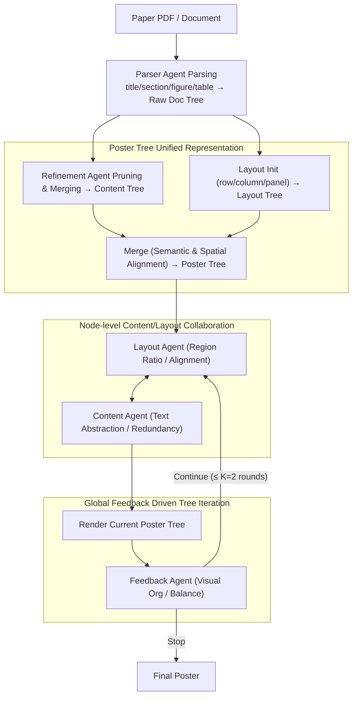

# PosterForest: Hierarchical Multi-Agent Collaboration for Scientific Poster Generation

**Conference**: ACL2026  
**arXiv**: [2508.21720](https://arxiv.org/abs/2508.21720)  
**Code**: https://github.com/kaist-cvml/poster-forest  
**Area**: Text Generation  
**Keywords**: Scientific Poster Generation, Hierarchical Document Understanding, Multi-Agent Collaboration, Layout Planning, Poster Tree

## TL;DR
PosterForest utilizes a Poster Tree as an intermediate representation that simultaneously encodes the hierarchical semantics of the paper and the spatial layout of the poster. Through recursive collaborative optimization by Content, Layout, and Feedback Agents, it generates scientific posters in a training-free manner, achieving a 59.2% overall preference in human evaluations—significantly outperforming P2P and Paper2Poster.

## Background & Motivation
**Background**: As scientific papers grow longer and more complex in structure, posters serve as a vital medium for the rapid dissemination of technical content. Early automated poster generation methods relied heavily on rule-based extraction and heuristic typesetting. Recent approaches like P2P and Paper2Poster have introduced LLM/MLLM multi-agent pipelines for parsing, summarization, layout, and rendering.

**Limitations of Prior Work**: Existing scientific poster generation (SPG) methods often treat papers as linear text or fixed section-to-panel mappings, lacking hierarchical modeling of the relationships between sections, subsections, paragraphs, and figure/table citations. Furthermore, content and layout are frequently optimized separately: panels are determined first, and then text and images are stuffed in. This lead to tables being placed in incorrect sections, excessively long paragraphs, inappropriate image sizes, or fractured logical flows.

**Key Challenge**: Scientific poster generation must compress information without destroying the paper's logic, and achieve visual balance without losing key experimental figures. A single agent or a sequential pipeline struggles to simultaneously handle the competing goals of content fidelity, layout efficiency, and visual coherence.

**Goal**: The authors aim to build a framework that requires no additional training, preserves the hierarchical structure of the paper, and jointly optimizes content and layout, ensuring that generated posters are both information-complete and visually organized.

**Key Insight**: The paper proposes the Poster Tree as a unified intermediate representation: each node possesses both semantic and spatial attributes. The tree structure is inherited from the paper's hierarchy and mapped to the poster canvas via a layout tree. In this way, when an agent modifies a node, it is aware of parent constraints, child content, and global feedback.

**Core Idea**: Transforming scientific poster generation from "linear summarization followed by typesetting" to "recursive collaborative optimization on a hierarchical semantic-spatial tree."

## Method
The core of PosterForest is to create a tree and then refine it. Instead of having the LLM output HTML or images in one go, the system first parses the paper into a Raw Doc Tree, which is then processed via pruning, merging, and asset matching to obtain a Content Tree. Subsequently, a Layout Tree is initialized based on the content hierarchy, and the two are merged into a Poster Tree. Finally, multiple agents perform local and global refinement on the tree until the final poster is obtained.

### Overall Architecture
The input is a paper PDF or document. The Parser Agent first extracts nodes such as title, section, subsection, paragraph, figure, and table to form a Raw Doc Tree. An MLLM acting as a Refinement Agent prunes the tree, merges redundant nodes, compresses long text, and preserves citations to figures and tables to obtain the Content Tree. Layout initialization partitions the canvas into row/column/panel layers based on content statistics to produce the Layout Tree. A Merge operation aligns semantic nodes with spatial nodes to form the Poster Tree. The system then performs refined rendering using a maximum of `K=2` rounds of tree-level iterations.

### Key Designs

**1. Poster Tree Unified Representation: Encoding "what to display" and "where to put it" into a single hierarchical tree**

Poster errors often stem from the disconnection between content structure and spatial structure—fixing panels before inserting text results in tables in wrong sections or text overflow. PosterForest merges both structures into one tree. The Raw Doc Tree records the original hierarchy; the Content Tree retains refined semantic nodes $c=(t,s)$, where $t$ is the type (paragraph/figure/table) and $s$ is the summary text or asset; the Layout Tree records spatial nodes $l=(r,x)$, where $r$ is the type (row/column/panel) and $x$ denotes attributes like position and ratio. Merging aligns these to ensure every poster node carries both content and layout.

This allows the system to know both that "this table belongs to the Experiments subtree" and its current panel occupancy, preventing misplacement and truncation—parent constraints and spatial positions are visible to agents during node modification.

**2. Node-level Content/Layout Collaboration: Enabling specialized agents to jointly adjust text density and spatial ratios**

Changing only content causes layout imbalance, while changing only layout causes text overflow. PosterForest allows the Content Agent and Layout Agent to traverse the Poster Tree from root to leaves, managing their respective tasks while sharing context. The Layout Agent optimizes the region ratio and alignment of layout nodes based on parent and descendant info; the Content Agent adjusts text abstraction based on layout constraints. The updates can be formulated as:

$$l_i^{t+1}=A_\text{layout}(l_i^t,\, P(l_i^t),\, D(l_i^t)),\qquad c_i^{t+1}=A_\text{content}(c_i^t,\, P(c_i^t),\, D(P(c_i^t)))$$

Since they operate on the same tree, text compression and spatial allocation are linked, avoiding the imbalances typical of "summarize then typeset" pipelines.

**3. Global Feedback Driven Tree Iteration: Providing a holistic aesthetic check for local modifications**

Node-by-node optimization may lack global perspective—individually reasonable nodes might result in a crowded or fragmented poster. After each node-level traversal, the system renders the Poster Tree for the MLLM Feedback Agent to evaluate visual organization and balance. It outputs structured feedback and a binary signal to continue or stop. The process iterates for a maximum of $K=2$ rounds.

### Key Designs Walkthrough: From Paper to Poster

Given a CVPR paper PDF, the Parser Agent extracts nodes to build a Raw Doc Tree. The Refinement Agent prunes redundant work and compresses method descriptions while maintaining table-section links to form the Content Tree. After layout initialization and merging into a Poster Tree, the first traversal begins: the Layout Agent finds the Experiments column too crowded and adjusts ratios; the Content Agent simultaneously abstracts the text further. After rendering, the Feedback Agent notes the method figure is too small and the layout is unbalanced, triggering a second round. The method figure is then enlarged, and the visual quality is finalized.

### Loss & Training
PosterForest is a training-free framework without gradient-based targets. It relies on Docling, MLLM APIs for parsing, summarization, and evaluation. "Optimization" is driven by prompt-based iterative modifications. Experiments use GPT-4o for consistency; colors and fonts are unified across methods to avoid evaluation bias. The maximum tree iteration is set to `K=2`.

## Key Experimental Results

### Main Results
Quantitative evaluation was conducted on 100 paper-poster pairs from the Paper2Poster benchmark; qualitative studies used 15 additional pairs from AI conferences (NeurIPS, CVPR, ACL). MLLM-as-a-Judge scored 1-5 across six dimensions.

| Method | Training-free | Aesthetic Avg.↑ | Information Avg.↑ | Overall↑ | Key Observation |
|------|---------------|-----------------|-------------------|----------|----------|
| Original Paper | - | 3.58 | 4.22 | 3.90 | Most complete but not a poster |
| GT Poster | - | 3.56 | 3.98 | 3.77 | Upper bound for manual quality |
| 4o-HTML | Yes | 3.36 | 3.68 | 3.52 | Functional but weak structure |
| P2P-4o | No | 3.91 | 3.94 | 3.72 | Strong aesthetics, limited flow |
| PosterAgent-4o | No | 3.58 | 3.86 | 3.72 | Stable specialized agent baseline |
| PosterForest-Qwen | Yes | 3.62 | 3.82 | 3.72 | Close to strong baselines with OS model |
| PosterForest-4o | Yes | 3.65 | 3.87 | 3.76 | Best training-free method, near GT |

Human evaluations (25 AI graduate students) showed a stronger preference for PosterForest.

| Method | Content preference↑ | Aesthetics preference↑ | Structure preference↑ | Overall preference↑ |
|------|---------------------|-----------------------|------------------------|---------------------|
| 4o-HTML | 2.0% | 1.6% | 2.4% | 1.6% |
| P2P | 9.2% | 21.2% | 13.2% | 12.0% |
| Paper2Poster | 32.8% | 24.0% | 24.8% | 27.2% |
| PosterForest | 56.0% | 53.2% | 59.6% | 59.2% |

### Ablation Study
Ablations focused on the hierarchical Content Tree and the simultaneous use of Content/Layout Agents.

| Configuration | Key Phenomenon | Explanation |
|------|----------|------|
| w/o Hierarchical Content Tree | Disorganized section/subsections | Tables misplaced in Introduction |
| w/ Hierarchical Content Tree | Better logical/spatial coherence | Related content grouped together |
| Only Content Agent | Reduced redundancy | Layout imbalance remains |
| Only Layout Agent | Organized spatial structure | Text overflow and scaling issues |
| Both Agents | Improvement in density and layout | Harmonious information density |

### Key Findings
- PosterForest's primary advantage is the significant human preference, indicating that structural clarity and completeness matter more to readers than single metric scores.
- The gap in MLLM judged scores is small, but human preference is large, suggesting automated metrics still struggle to capture the full reading experience.
- Hierarchical structure is critical for scientific documents to prevent misaligning figures and tables.
- The training-free nature is a practical highlight, allowing deployment across new paper types without model retraining.

## Highlights & Insights
- The Poster Tree is a natural and effective intermediate representation that aligns the tree-like information of a paper with 2D layout.
- Multi-agent collaboration reflects real design roles: editor, layout designer, and reviewer.
- Training-free practicality reduces maintenance costs for rapidly changing styles and domains.
- Jointly optimizing visual harmony and content fidelity in a single loop is superior to sequential "summarize then typeset" approaches.

## Limitations & Future Work
- Content density is not yet optimal; some areas may have insufficient information or wasted space.
- Qualitative evaluation still relies on GPT-4o, highlighting the need for more robust, specialized metrics.
- Reliance on the accuracy of parsers and asset matching; failures in PDF parsing propagate through the tree.
- Fixed fonts and colors limit stylistic diversity and conference-specific branding.
- The Feedback Agent does not yet model fine-grained human preferences like reading paths or audience-specific emphasis.

## Related Work & Insights
- **vs P2P**: P2P relies on instruction tuning; PosterForest remains training-free by injecting hierarchy via tree structures.
- **vs Paper2Poster**: Paper2Poster uses sequential modules; PosterForest emphasizes joint modification on a unified tree.
- **vs GPT-4o-HTML**: End-to-end HTML often ignores scientific document structures which PosterForest restores through explicit representation.
- **Insights**: For any document generation (slides, knowledge cards), building a "semantic-spatial tree" intermediate representation for node-level editing is a promising direction.

## Rating
- Novelty: ⭐⭐⭐⭐☆ Effective combination of Poster Tree and hierarchical multi-agent collaboration.
- Experimental Thoroughness: ⭐⭐⭐⭐☆ Solid human and automated evaluations; quantitative ablation could be more granular.
- Writing Quality: ⭐⭐⭐⭐☆ Clear diagrams and logical flow.
- Value: ⭐⭐⭐⭐☆ Highly practical for scientific communication and training-free deployment scenarios.

<!-- RELATED:START -->

## Related Papers

- [\[ACL 2026\] EvoSci: A Bio-Inspired Multi-Agent Framework for the Evolution of Scientific Discovery](evosci_a_bio-inspired_multi-agent_framework_for_the_evolution_of_scientific_disc.md)
- [\[CVPR 2026\] SciEducator: Scientific Video Understanding and Educating via Deming-Cycle Multi-Agent System](../../CVPR2026/multi_agent/scieducator_scientific_video_understanding_and_educating_via_deming-cycle_multi-.md)
- [\[ICLR 2026\] HAMLET: A Hierarchical and Adaptive Multi-Agent Framework for Live Embodied Theatre](../../ICLR2026/multi_agent/hamlet_a_hierarchical_and_adaptive_multi-agent_framework_for_live_embodied_theat.md)
- [\[ACL 2026\] ConSensus: Multi-Agent Collaboration for Multimodal Sensing](consensus_multi-agent_collaboration_for_multimodal_sensing.md)
- [\[AAAI 2026\] Hierarchical Pedagogical Oversight: A Multi-Agent Adversarial Framework for Reliable AI Tutoring](../../AAAI2026/multi_agent/hierarchical_pedagogical_oversight_a_multi-agent_adversarial_framework_for_relia.md)

<!-- RELATED:END -->
