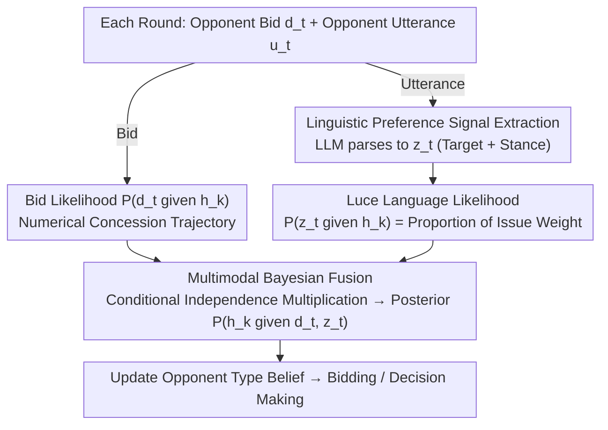

# Preference Estimation via Opponent Modeling in Multi-Agent Negotiation

**Conference**: ACL 2026 Findings  
**arXiv**: [2604.15687](https://arxiv.org/abs/2604.15687)  
**Code**: None  
**Area**: Video Understanding  
**Keywords**: Opponent Modeling, Bayesian Inference, Preference Estimation, Multi-party Negotiation, LLM Linguistic Signals  

## TL;DR

This paper proposes a preference estimation method that combines natural language preference signals extracted by LLMs with a Bayesian opponent modeling framework. By fusing qualitative linguistic clues through a language likelihood function with quantitative bidding information in multi-party multi-issue negotiations, the method improves the Full Agreement Rate (FAR) from 37% to 62%.

## Background & Motivation

**Background**: Automated negotiation in multi-party multi-issue scenarios relies heavily on accurate opponent modeling. Traditional methods based on the BOA architecture estimate opponent utility functions from numerical bidding history using Bayesian learning.

**Limitations of Prior Work**: (1) Purely numerical methods fail to capture qualitative preference information in natural language dialogues, resulting in incomplete information; (2) Although LLMs can understand semantics, direct preference reasoning using LLMs lacks strategic consistency and is unstable in long-term negotiations; (3) The complexity of LLM reasoning grows exponentially as the volume of information increases.

**Key Challenge**: Rich qualitative information in language (e.g., "Issue A is more important to me") cannot be utilized by traditional numerical models, while LLMs lack a structured belief update mechanism.

**Goal**: To design a preference estimation method that integrates linguistic signals into a structured Bayesian framework, achieving both semantic understanding and probabilistic reasoning.

**Key Insight**: Utilize LLMs to extract structured preference signals (Target Issue/Option + Stance) from utterances, then convert these into probabilistic likelihood functions via Luce's Choice Axiom to be fused with bidding likelihood for Bayesian updates.

**Core Idea**: Language Likelihood × Bidding Likelihood → Bayesian Posterior Update, unifying qualitative and quantitative information within a probabilistic framework.

## Method

### Overall Architecture

Traditional BOA architectures focus solely on the opponent's numerical bidding history to infer utility functions, wasting qualitative statements like "Issue A is more important to me." The proposed approach enables the Bayesian framework to ingest two streams of evidence: in each negotiation round, the agent receives both the opponent's bid $d_t$ and their utterance $u_t$. Bids are processed using numerical likelihood as usual, while utterances are first parsed by an LLM into a structured preference signal $z_t$, then converted into a language likelihood. Both likelihoods are multiplied across the same hypothesis space $\{h_k\}$ to update the posterior $P(h_k \mid d_t, z_t)$. The LLM is only responsible for "semantic understanding and structuring," while the actual belief updates are handled by the probabilistic framework, thus gaining rich linguistic information without being compromised by the instability of LLM reasoning.

### Key Designs

**1. Language Preference Signal Extraction: Translating sentences into computable structured signals instead of letting LLMs report numerical values directly**

Directly requiring LLMs to output numerical estimates of opponent utilities often leads to drift and a lack of strategic consistency in long negotiations. Therefore, this paper narrows the LLM's responsibility to a task it excels at: parsing the utterance $u_t$ into a signal $z_t$ containing two attributes—Target (pointing to an issue/option or a comparison between two) and Stance (attitudes like preference or opposition). In this way, the LLM outputs discrete, enumerable semantic labels rather than continuous values that require "calculation," and all subsequent probabilistic operations are built upon this clean, structured input.

**2. Luce Choice Axiom-based Language Likelihood: Converting preference labels into probabilities over the hypothesis space using classic choice models**

Given the signal $z_t$, the model must determine the probability of an opponent making such a statement if they were of type $h_k$. This paper utilizes Luce's Choice Axiom from choice theory: for signals like "prefer issue $i_x$," the likelihood is the ratio of that issue's weight under $h_k$ to the total weight:

$$P(z_t \mid h_k) = \frac{w_x^{(k)}}{\sum_m w_m^{(k)}},$$

Comparative signals ($i_x$ is more important than $i_y$) and opposition signals are constructed using similar relative weight logic. The advantage of Luce's Axiom is that it serves as a standard model for mapping a set of evaluation values to choice probabilities. The higher the weight of an issue, the higher the probability it is "selected for expression," providing theoretical support for converting linguistic clues into likelihood functions.

**3. Multimodal Bayesian Fusion: Assuming conditional independence between bids and language to allow complementary evidence to multiply in the posterior**

Bids reveal quantitative concession trajectories, while language reveals qualitative priorities; the two carry distinct types of information. This paper bridges them using a Naive Bayes assumption—treating the bid $d_t$ and the language signal $z_t$ as conditionally independent given the hypothesis. Thus, the posterior is proportional to the product of both likelihoods and the prior:

$$P(h_k \mid d_t, z_t) \propto P(d_t \mid h_k)\cdot P(z_t \mid h_k)\cdot P(h_k).$$

While conditional independence is a simplification, it makes fusion computationally feasible. Bids and language provide complementary information, each filling dimensions the other might miss. The reduction of MSE from 189 (bids only) to 159 in experiments demonstrates this complementarity.

### Loss & Training

This is a model-free approach. GPT-4.1 is used as the utterance parser, and Bayesian updates are performed entirely online.

## Key Experimental Results

### Main Results

6-party 5-issue sports facility construction negotiation scenario (average of 500 experiments):

| Method | FAR (Full Agreement Rate) | PAR (Partial Agreement Rate) | LAR (Potential Agreement Rate) |
|------|-----------------|-----------------|-----------------|
| Base-LLM | 0.37 | 0.76 | 0.97 |
| Base-OM (all) | 0.56 | 0.92 | 0.99 |
| LLM-PE (all) | 0.32 | 0.69 | 0.93 |
| **Proposed (all)** | **0.62** | **0.89** | **0.98** |

### Ablation Study

| Method | Preference Estimation MSE (Avg) | Description |
|------|-------------------|------|
| Proposed | **159** | Language + Numerical Fusion |
| Base-OM | 189 | Numerical Bids Only |
| LLM-PE | 163 | Direct LLM Reasoning |

### Key Findings

- Mutual modeling (all) shows significant improvement over single-party modeling (p1) (FAR 0.46→0.62), indicating strong multi-party synergistic effects.
- Direct reasoning via LLM-PE actually performs worse than pure numerical methods (FAR 0.32 < 0.56), verifying the necessity of a structured framework.
- The fusion of linguistic signals reduces MSE from 189 to 159, leading to more accurate and balanced estimation distributions.

## Highlights & Insights

- The **hybrid paradigm of "LLM Extraction + Bayesian Inference"** is highly inspiring—leveraging the semantic capabilities of LLMs without relying on their reasoning consistency, and using a mathematical framework to ensure structured updates.
- **Clever application of Luce's Choice Axiom**—naturally mapping preference weights to choice probabilities, providing a theoretical foundation for the transformation of linguistic signals into likelihood functions.

## Limitations & Future Work

- Assumes the opponent's utterances are sincere and does not account for deception or bluffing.
- Validated only in a single scenario; generalization across diverse scenarios remains to be tested.
- The hypothesis space grows factorially with the number of issues, requiring approximation algorithms.

## Related Work & Insights

- **vs Base-LLM**: Pure LLM negotiation lacks structured preference tracking, leading to inconsistent strategies in long-duration negotiations.
- **vs LLM-PE**: Direct numerical preference reasoning by LLMs is unreliable (FAR only 0.32) and requires constraints from a probabilistic framework.

## Rating

- Novelty: ⭐⭐⭐⭐ The integration of linguistic signals with a Bayesian framework is a novel approach.
- Experimental Thoroughness: ⭐⭐⭐ Only 500 experiments in a single scenario; lacks scenario diversity.
- Writing Quality: ⭐⭐⭐⭐ Clear formalization and intuitive diagrams.
- Value: ⭐⭐⭐⭐ Provides a valuable paradigm for the application of LLMs in structured decision-making.

<!-- RELATED:START -->

## Related Papers

- [\[NeurIPS 2025\] MetaMind: Modeling Human Social Thoughts with Metacognitive Multi-Agent Systems](../../NeurIPS2025/multi_agent/metamind_modeling_human_social_thoughts_with_metacognitive_multi-agent_systems.md)
- [\[ACL 2026\] Towards Self-Improving Error Diagnosis in Multi-Agent Systems](towards_self-improving_error_diagnosis_in_multi-agent_systems.md)
- [\[ACL 2026\] MATA: Multi-Agent Framework for Reliable and Flexible Table Question Answering](mata_multi-agent_framework_for_reliable_and_flexible_table_question_answering.md)
- [\[ACL 2026\] MAGEO: From Experience to Skill — Multi-Agent Generative Engine Optimization via Reusable Strategy Learning](from_experience_to_skill_multi-agent_generative_engine_optimization_via_reusable.md)
- [\[ACL 2026\] Collaborative Multi-Agent Scripts Generation for Enhancing Imperfect-Information Reasoning in Murder Mystery Games](collaborative_multi-agent_scripts_generation_for_enhancing_imperfect-information.md)

<!-- RELATED:END -->
